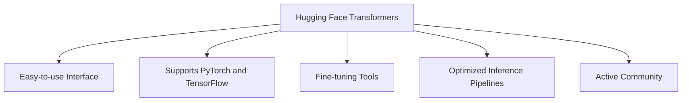
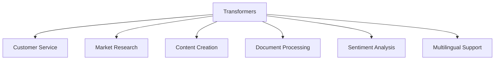
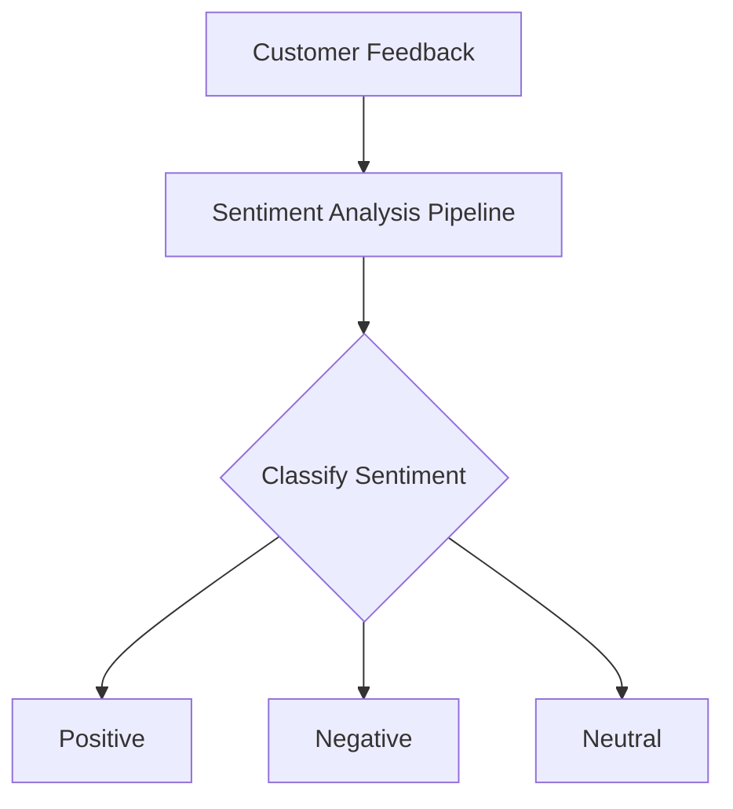
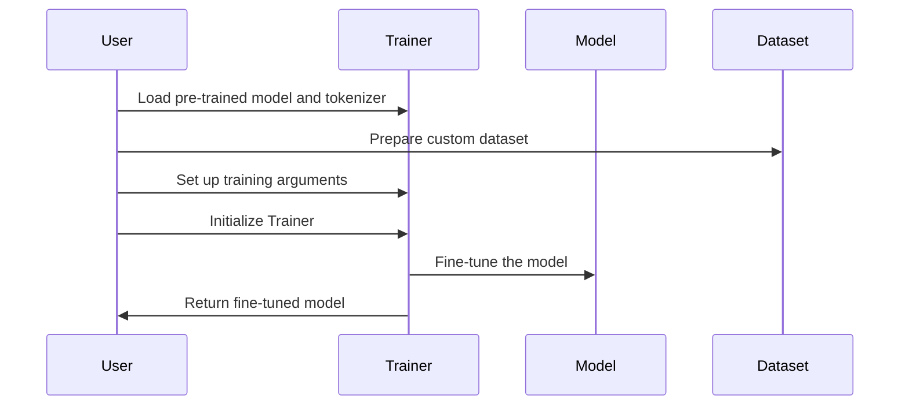

# Harnessing the Power of Hugging Face Transformers

Your Guide to Integrating Pre-Trained NLP Models for Business Applications


## Introduction

### Overview

Welcome! Today, we're diving into the world of natural language processing (NLP) with the amazing [Hugging Face Transformers](https://huggingface.co/transformers/). This open-source library has truly transformed the field of NLP by providing easy access to state-of-the-art [pre-trained models](https://huggingface.co/models). Whether you're looking to classify text, translate languages, summarize content, or answer questions, Hugging Face has a model for you.

Why is Hugging Face so powerful? Well, it allows you to implement advanced AI capabilities with minimal coding. This means that even if you're not a hardcore programmer, you can still leverage cutting-edge NLP technology to enhance your business applications. And don't worry, the user-friendly interface and extensive [documentation](https://huggingface.co/docs/transformers) will guide you every step of the way.

For those of you who are new to Hugging Face, I've compiled some helpful links to get you started:

- [Hugging Face GitHub Repository](https://github.com/huggingface/transformers): This is where you can explore the source code, contribute to the project, and stay updated with the latest developments.
- [Hugging Face Documentation](https://huggingface.co/docs/transformers): These comprehensive guides and tutorials will help you understand and implement Hugging Face Transformers.
- [Getting Started with Hugging Face](https://huggingface.co/docs/transformers/quicktour): This beginner-friendly guide will kickstart your journey with Hugging Face.
- [Hugging Face Examples](https://github.com/huggingface/transformers/tree/main/examples): Here, you can explore practical examples to see how Hugging Face Transformers can be used in various applications.
- [Hugging Face Community](https://huggingface.co/join/discord): Join the community on Discord to ask questions, share your projects, and collaborate with other Hugging Face users.
- [Hugging Face Blog](https://huggingface.co/blog): Stay updated with the latest news, insights, and tutorials from the Hugging Face team.

### Learning Objectives

By the end of this tutorial, you will:

1. **Understand Hugging Face Transformers**: You'll learn what this powerful library is and why it's essential for modern businesses.
2. **Set Up Transformers**: I'll show you how to install and configure Transformers in your development environment.
3. **Explore Practical Examples**: We'll look at how to use Transformers for common NLP tasks with hands-on examples.
4. **Integrate Transformers into Workflows**: You'll gain insights on how to seamlessly integrate these models into your business workflows.
5. **Solve Real-World Problems**: Finally, you'll be able to implement Transformers models to tackle real-world business challenges.

Let's get started and see how Hugging Face Transformers can revolutionize your business applications!

## Why Hugging Face Transformers Matters

### Descriptive Overview

Alright, let's talk about why Hugging Face Transformers is such a game-changer in the world of natural language processing (NLP). Hugging Face Transformers is a Python library that opens the door to over 20,000 pre-trained models. These models can handle a wide array of tasks, from text classification and named entity recognition to question answering, text generation, summarization, and much more. 

### Key Features

Let’s break down some of the key features that make Hugging Face Transformers an essential tool for your NLP projects:



1. **Easy-to-use Interface**: Imagine being able to download and use some of the most advanced NLP models with just a few lines of code. That’s exactly what Hugging Face offers. The API is designed to be straightforward, which means you can start experimenting with these powerful models without needing deep machine learning expertise. This ease of use accelerates your workflow, letting you focus on what really matters – solving your business problems.

2. **Support for Popular Deep Learning Frameworks**: Whether you’re a fan of PyTorch or TensorFlow, Hugging Face has you covered. This dual compatibility means you can choose the framework that best suits your project’s needs, whether it’s for research or deployment. Flexibility is key here, allowing you to integrate seamlessly with your existing workflows.

3. **Tools for Fine-tuning Models**: One of the standout features is the ability to fine-tune pre-trained models on your own custom datasets. This means you can take a state-of-the-art model and tweak it to perform even better on your specific tasks. It’s like having a tailor-made solution that’s perfectly suited to your needs.

4. **Optimized Inference Pipelines**: Efficiency is crucial when running models in production. Hugging Face includes optimized pipelines for tasks like text classification, named entity recognition, and text generation. These pipelines ensure that your models not only run efficiently but also scale well, making it easier to deploy and maintain them in real-world applications.

5. **Active Community and Frequent Updates**: Finally, one of the most powerful aspects of Hugging Face Transformers is its vibrant community. With so many contributors and frequent updates, you’re always at the cutting edge of NLP technology. The community support ensures that you can find help and resources whenever you need them, keeping your projects innovative and up-to-date.

These features collectively make Hugging Face Transformers a powerhouse for any business looking to leverage advanced NLP capabilities. Whether you’re developing a new product, optimizing customer service, or analyzing large datasets, Hugging Face provides the tools you need to do it efficiently and effectively. 

Now that you understand why Hugging Face Transformers is such a valuable asset, let’s dive into how you can start using it in your projects!

### Business Use Cases

Let's explore how Hugging Face Transformers can revolutionize various aspects of your business, enhancing efficiency and effectiveness across multiple domains. Here are some practical applications where these powerful models can make a significant impact:



1. **Customer Service**: Imagine being able to handle customer inquiries swiftly and accurately with chatbots and automated response systems. By implementing Hugging Face Transformers, you can significantly reduce response times and improve customer satisfaction. These models can understand and respond to customer queries in a human-like manner, providing a seamless customer service experience.

2. **Market Research**: Ever wondered what your customers really think about your products? With Hugging Face Transformers, you can analyze customer feedback, reviews, and social media posts to gain valuable insights into brand perception and product performance. This real-time data analysis helps you make informed decisions and tailor your strategies to meet customer needs.

3. **Content Creation**: Need to generate product descriptions, marketing copy, or personalized emails at scale? Transformers can help you create consistent and high-quality content quickly, saving time and resources. This is particularly useful for marketing teams looking to maintain a strong and engaging brand presence without the manual workload.

4. **Document Processing**: Handling contracts, invoices, and other business documents can be tedious and error-prone. By using Hugging Face Transformers, you can automatically extract key information from these documents, reducing manual effort and ensuring accuracy. This streamlines your document management processes and frees up time for more strategic tasks.

5. **Sentiment Analysis**: Keeping track of what people are saying about your brand across social media and review platforms is crucial. Transformers enable you to monitor brand sentiment in real-time, allowing you to stay on top of public opinion and respond promptly to any issues. This proactive approach helps you manage your brand reputation effectively.

6. **Multilingual Support**: Expanding your business globally? Hugging Face Transformers can translate content and provide customer support in multiple languages, helping you cater to a diverse customer base. This capability not only enhances your global reach but also ensures that you can offer a personalized and inclusive experience to all your customers.

By integrating Hugging Face Transformers into these business scenarios, you can leverage advanced NLP capabilities to drive efficiency, improve customer satisfaction, and stay ahead in the competitive landscape. Now, let's look at how you can get started with these models and bring these benefits to your business.

## Getting Started with Hugging Face Transformers

### Installation and Setup

Let's walk through the process of getting Hugging Face Transformers up and running on your system. We'll cover everything from installing the necessary software to verifying that everything is set up correctly.


1. **Ensure you have Python 3.6+ installed**: First things first, make sure your system has Python 3.6 or higher installed. If you’re not sure, you can check your Python version by running:
    ```bash
    python --version
    ```

2. **Install Transformers using pip**: Next, we need to install the Hugging Face Transformers library. Open your terminal and run:
    ```bash
    pip install transformers
    ```
    This command will download and install the Transformers library and its dependencies.

3. **Install a backend library - PyTorch or TensorFlow**: Hugging Face Transformers can work with both PyTorch and TensorFlow. Choose one based on your preference or project requirements. To install PyTorch, run:
    ```bash
    pip install torch
    ```
    Alternatively, if you prefer TensorFlow, run:
    ```bash
    pip install tensorflow
    ```

### Initial Configuration

Great! Now that we have everything installed, let’s configure and verify our setup.

1. **Import the necessary modules**: Open your Python environment (like Jupyter Notebook or a Python script) and start by importing the necessary modules from the Transformers library:
    ```python
    from transformers import pipeline
    ```

2. **Download a pre-trained model for your task**: For this example, let’s set up a sentiment analysis classifier. The following code will download a pre-trained model and initialize it:
    ```python
    classifier = pipeline("sentiment-analysis")
    ```

3. **Verify the installation**: To make sure everything is working correctly, let’s test the classifier with a sample text:
    ```python
    result = classifier("I love using Hugging Face Transformers!")
    print(result)
    ```

If everything is set up correctly, you should see an output indicating the sentiment of the input text. Congratulations, you’ve successfully installed and configured Hugging Face Transformers!

With these steps, you’re ready to start leveraging powerful NLP models in your projects. Up next, we’ll dive into some practical examples to show how you can use these models for various NLP tasks.

## Practical Examples

### Example 1: Sentiment Analysis

Let's dive into a practical example where we'll analyze customer feedback using a pre-trained sentiment analysis model. This example will help us understand whether the feedback is positive, negative, or neutral, providing valuable insights into customer opinions.



#### Code Explanation

Let's walk through the code step-by-step:

```python
from transformers import pipeline  # Import the pipeline function from the transformers library

# Initialize sentiment analysis pipeline
classifier = pipeline("sentiment-analysis")  # Create a sentiment analysis pipeline using a pre-trained model

# Sample customer feedback
feedback = [
    "I love this product! It's exactly what I needed.",  # Positive feedback
    "The quality is poor and it broke after a week.",    # Negative feedback
    "Shipping was fast but the packaging could be improved."  # Neutral feedback
]

# Analyze sentiment
results = classifier(feedback)  # Use the sentiment analysis pipeline to classify the feedback

# Print results
for text, result in zip(feedback, results):  # Loop through the feedback and their corresponding results
    print(f"Text: {text}")  # Print the original feedback text
    print(f"Sentiment: {result['label']}, Score: {result['score']:.4f}\n")  # Print the sentiment label and score
```

Here's what each part of the code does:

1. **Pipeline Initialization**: First, we import the `pipeline` function from the `transformers` library. This function helps us set up a pre-trained model for sentiment analysis with minimal effort.
    ```python
    from transformers import pipeline
    ```

2. **Creating the Sentiment Analysis Pipeline**: We initialize the sentiment analysis pipeline by specifying the task. In this case, we want to perform sentiment analysis.
    ```python
    classifier = pipeline("sentiment-analysis")
    ```

3. **Sample Feedback**: We create a list of sample customer feedback texts that we want to analyze. Each text represents a different sentiment (positive, negative, or neutral).
    ```python
    feedback = [
        "I love this product! It's exactly what I needed.",
        "The quality is poor and it broke after a week.",
        "Shipping was fast but the packaging could be improved."
    ]
    ```

4. **Analyzing Sentiment**: We use the `classifier` to process each feedback text. The classifier outputs the sentiment (positive, negative, or neutral) and a confidence score for each text.
    ```python
    results = classifier(feedback)
    ```

5. **Printing Results**: Finally, we print the original feedback text along with the predicted sentiment and confidence score. This helps us understand how the model has classified each piece of feedback.
    ```python
    for text, result in zip(feedback, results):
        print(f"Text: {text}")
        print(f"Sentiment: {result['label']}, Score: {result['score']:.4f}\n")
    ```

Running this code will give you a clear picture of the sentiment behind each piece of customer feedback, enabling you to respond more effectively to your customers' needs and concerns.

With this example, you've learned how to set up and use a sentiment analysis model with Hugging Face Transformers. Next, we'll explore more complex applications and how you can integrate these models into your business workflows.

### Example 2: Multilingual Translation

In this example, we'll learn how to implement a multilingual translation system using a pre-trained model. We'll translate text from English to French, showcasing how Hugging Face Transformers can help you break language barriers and enhance global communication.

#### Code Explanation

Let's break down the code step-by-step:

```python
from transformers import pipeline  # Import the pipeline function from the transformers library

# Initialize translation pipeline
translator = pipeline("translation", model="Helsinki-NLP/opus-mt-en-fr")  # Create a translation pipeline for English to French

# Sample English text
english_text = "Welcome to our online store. We offer high-quality products at competitive prices."

# Translate to French
french_translation = translator(english_text, max_length=100)[0]['translation_text']  # Translate the text and get the translation

print(f"English: {english_text}")  # Print the original English text
print(f"French: {french_translation}")  # Print the translated French text
```

Here's what each part of the code does:

1. **Pipeline Initialization**: First, we import the `pipeline` function from the `transformers` library. This function will help us set up a translation model.
    ```python
    from transformers import pipeline
    ```

2. **Creating the Translation Pipeline**: We initialize the translation pipeline by specifying the task and the pre-trained model to use. In this case, we're using the "Helsinki-NLP/opus-mt-en-fr" model for translating English to French.
    ```python
    translator = pipeline("translation", model="Helsinki-NLP/opus-mt-en-fr")
    ```

3. **Sample Text**: We define a sample English text that we want to translate into French.
    ```python
    english_text = "Welcome to our online store. We offer high-quality products at competitive prices."
    ```

4. **Translating the Text**: We use the `translator` to process the English text. The translator outputs the translated text in French. We also set a `max_length` parameter to ensure the translation doesn't exceed 100 characters.
    ```python
    french_translation = translator(english_text, max_length=100)[0]['translation_text']
    ```

5. **Printing Results**: Finally, we print the original English text along with its French translation. This helps us verify the translation and understand the output.
    ```python
    print(f"English: {english_text}")
    print(f"French: {french_translation}")
    ```

Running this code will give you the translated text, demonstrating how easy it is to implement a multilingual translation system with Hugging Face Transformers. This capability can be incredibly useful for businesses looking to communicate with a global audience.

By using these practical examples, you can see how Hugging Face Transformers can perform sentiment analysis to understand customer feedback and utilize translation to break language barriers. These tools enhance your ability to communicate effectively and provide better service to your customers worldwide.

## In-Depth Guide

### Detailed Features

In this section, we'll dive deeper into some advanced features of Hugging Face Transformers. You'll learn how to fine-tune pre-trained models and create custom pipelines tailored to your business needs. Let's get started!



### Fine-tuning

Fine-tuning allows you to adapt pre-trained models to your specific domain or task. This is a powerful way to leverage state-of-the-art models and tailor them to your unique needs.

#### Code Explanation

Let's go through the process step-by-step:

```python
from transformers import AutoModelForSequenceClassification, AutoTokenizer, Trainer, TrainingArguments

# Load pre-trained model and tokenizer
model = AutoModelForSequenceClassification.from_pretrained("distilbert-base-uncased")
tokenizer = AutoTokenizer.from_pretrained("distilbert-base-uncased")

# Prepare your dataset
train_dataset = ...  # Your custom dataset

# Set up training arguments
training_args = TrainingArguments(
    output_dir="./results",  # Directory to save the model checkpoints
    num_train_epochs=3,  # Number of training epochs
    per_device_train_batch_size=16,  # Batch size per device during training
    save_steps=10_000,  # Save the model every 10,000 steps
    save_total_limit=2,  # Limit the total number of saved checkpoints
)

# Initialize Trainer
trainer = Trainer(
    model=model,  # The pre-trained model to fine-tune
    args=training_args,  # Training arguments
    train_dataset=train_dataset,  # The training dataset
    tokenizer=tokenizer,  # The tokenizer for preparing the data
)

# Fine-tune the model
trainer.train()  # Start the training process
```

1. **Loading the Pre-trained Model and Tokenizer**: 
    ```python
    model = AutoModelForSequenceClassification.from_pretrained("distilbert-base-uncased")
    tokenizer = AutoTokenizer.from_pretrained("distilbert-base-uncased")
    ```
    Here, we're loading a pre-trained model and tokenizer. This example uses `distilbert-base-uncased`, a smaller, faster version of BERT.

2. **Preparing the Dataset**:
    ```python
    train_dataset = ...  # Your custom dataset
    ```
    You need to prepare your dataset. This dataset should be formatted according to the requirements of your specific task (e.g., classification).

3. **Setting Up Training Arguments**:
    ```python
    training_args = TrainingArguments(
        output_dir="./results",
        num_train_epochs=3,
        per_device_train_batch_size=16,
        save_steps=10_000,
        save_total_limit=2,
    )
    ```
    These arguments configure the training process, including the output directory for saving the model, the number of training epochs, batch size, and checkpoint settings.

4. **Initializing the Trainer**:
    ```python
    trainer = Trainer(
        model=model,
        args=training_args,
        train_dataset=train_dataset,
        tokenizer=tokenizer,
    )
    ```
    The `Trainer` class from Hugging Face makes it easy to train models. We pass in the model, training arguments, dataset, and tokenizer.

5. **Fine-tuning the Model**:
    ```python
    trainer.train()
    ```
    Finally, we start the training process. This will fine-tune the pre-trained model on your custom dataset.

### Custom Pipelines

Creating custom pipelines allows you to build specialized solutions for your business needs. Here's an example of setting up a custom question-answering pipeline.

#### Code Explanation

Let's walk through the custom pipeline code:

```python
from transformers import pipeline

def custom_qa_pipeline(question, context):
    qa_pipeline = pipeline("question-answering")  # Initialize a question-answering pipeline
    result = qa_pipeline(question=question, context=context)  # Use the pipeline to get the answer
    return result['answer']  # Return the extracted answer

# Usage
context = "Acme Corp was founded in 1990 and specializes in AI solutions."
question = "What does Acme Corp specialize in?"
answer = custom_qa_pipeline(question, context)
print(f"Q: {question}\nA: {answer}")
```

1. **Initializing the Pipeline**:
    ```python
    from transformers import pipeline

    def custom_qa_pipeline(question, context):
        qa_pipeline = pipeline("question-answering")
    ```
    Here, we import the `pipeline` function and define a custom function for question-answering. We initialize a question-answering pipeline using a pre-trained model.

2. **Processing the Input**:
    ```python
    result = qa_pipeline(question=question, context=context)
    return result['answer']
    ```
    The pipeline processes the input question and context, and we extract the answer from the result.

3. **Using the Custom Pipeline**:
    ```python
    context = "Acme Corp was founded in 1990 and specializes in AI solutions."
    question = "What does Acme Corp specialize in?"
    answer = custom_qa_pipeline(question, context)
    print(f"Q: {question}\nA: {answer}")
    ```
    We define a context and a question, then use our custom pipeline to get the answer and print it out.

By leveraging these detailed features, you can fine-tune models for specific tasks and create custom pipelines that address your unique business challenges. This allows you to harness the full power of Hugging Face Transformers in a way that is tailored to your needs.

### Integration Tips

Let's explore some practical tips to integrate Hugging Face Transformers into your existing systems and workflows efficiently.

1. **API Integration**: 
   One of the best ways to deploy your Transformers models is by exposing them as REST APIs. Using frameworks like Flask or FastAPI, you can create endpoints that allow other applications to interact with your models effortlessly. This makes deployment seamless and enables easy integration with existing systems.

    **Example with Flask**:
    ```python
    from flask import Flask, request, jsonify
    from transformers import pipeline

    app = Flask(__name__)
    classifier = pipeline("sentiment-analysis")

    @app.route('/predict', methods=['POST'])
    def predict():
        data = request.json
        text = data['text']
        result = classifier(text)[0]
        return jsonify(result)

    if __name__ == '__main__':
        app.run(debug=True)
    ```

2. **Batch Processing**:
    For large-scale text analysis tasks, implementing batch processing can significantly improve efficiency. By processing data in batches, you reduce computational overhead and can handle larger datasets more effectively. This is particularly useful for businesses dealing with high volumes of text data.

    **Example**:
    ```python
    def batch_process(texts, batch_size=32):
        results = []
        for i in range(0, len(texts), batch_size):
            batch = texts[i:i+batch_size]
            batch_results = classifier(batch)
            results.extend(batch_results)
        return results

    texts = ["Sample text 1", "Sample text 2", "Sample text 3", ...]
    batch_results = batch_process(texts)
    ```

3. **Monitoring and Logging**:
    Setting up proper monitoring and logging is crucial to track your model's performance and detect issues in production environments. This ensures that any problems can be quickly identified and resolved, maintaining the reliability of your NLP applications.

    **Example with Logging**:
    ```python
    import logging

    logging.basicConfig(level=logging.INFO)
    logger = logging.getLogger(__name__)

    def log_results(results):
        for result in results:
            logger.info(f"Text: {result['text']}, Sentiment: {result['label']}, Score: {result['score']:.4f}")

    texts = ["I love this product!", "This is terrible."]
    results = classifier(texts)
    log_results(results)
    ```

4. **Version Control**:
    Using version control for both your code and models is essential for reproducibility and easy rollbacks if needed. This practice helps maintain a clear history of changes and facilitates collaboration among team members.

    **Example with Git**:
    ```bash
    git init
    git add .
    git commit -m "Initial commit"
    git tag -a v1.0 -m "Version 1.0"
    ```

    You can also version control your models using tools like DVC (Data Version Control) or storing model versions in cloud storage with proper tagging.

## Actionable Takeaways

1. **Start with Pre-trained Models**: Kickstart your NLP projects with pre-trained models to achieve quick wins and rapidly prototype solutions.
2. **Fine-tune for Specific Domains**: Enhance the performance of your models by fine-tuning them on domain-specific data.
3. **Integrate into Pipelines**: Implement Transformers models in your data processing pipelines to automate insights and decision-making.
4. **Expand with Multilingual Capabilities**: Leverage the multilingual features of Transformers to reach and serve a global audience effectively.
5. **Monitor and Update**: Continuously monitor your models' performance and update them to ensure they remain effective and accurate over time.

By following these integration tips and actionable takeaways, you can harness the full potential of Hugging Face Transformers to drive innovation and efficiency in your NLP projects.

## Challenge: Real-World NLP Solutions with Hugging Face Transformers

### Task Description

Welcome to the challenge! Your goal is to identify a real-world problem in your business or personal projects where natural language processing (NLP) can add significant value. Using Hugging Face Transformers, you'll create a solution to address this problem. This exercise will help you apply what you've learned and see the tangible benefits of NLP in action.

### Potential Areas

Here are some potential areas where NLP can make a big impact:

- **Customer Service Automation**: Build a chatbot that can handle customer inquiries and provide quick responses.
- **Sentiment Analysis**: Analyze social media posts, reviews, or any other customer feedback to gauge sentiment and make informed decisions.
- **Content Generation**: Automate the creation of marketing copy, product descriptions, or other types of content.
- **Language Translation**: Develop a system for translating text into multiple languages to support a global audience.
- **Document Processing**: Extract and summarize key information from contracts, invoices, or other important documents.
- **Market Research**: Analyze large datasets of text to uncover insights about market trends and customer preferences.

### Steps

Follow these steps to complete the challenge:

1. **Identify the Problem**: Start by choosing a relevant challenge that NLP can solve. Think about areas in your business or projects where text analysis or automation could add value.
2. **Select a Model**: Browse the Hugging Face model repository and pick a pre-trained model that suits your task. Whether it's for sentiment analysis, translation, or something else, there's likely a model ready to use.
3. **Fine-tune**: If needed, fine-tune the model on your specific dataset to improve its performance for your particular use case.
4. **Develop the Solution**: Implement your solution using Hugging Face Transformers. This involves setting up the model, processing the input data, and generating the desired output.
5. **Test and Validate**: Ensure your solution works as expected by testing it thoroughly. Validate its accuracy and effectiveness using real-world data.
6. **Deploy and Monitor**: Deploy your solution in a real-world setting. Set up monitoring to track its performance and make adjustments as needed.

### Example Projects

Here are some example projects to inspire you:

- **Customer Support Chatbot**: Use a transformer model to categorize and respond to customer inquiries automatically.
- **Social Media Sentiment Analysis**: Monitor sentiment in real-time across social media platforms to stay on top of public opinion.
- **Automated Content Generator**: Create a system that generates product descriptions or email content, saving time and ensuring consistency.
- **Multilingual Customer Assistant**: Develop a tool that translates customer interactions in real-time to support a diverse, global customer base.

### Tips

- **Use Pre-trained Models**: Leverage existing models to get started quickly and achieve initial results.
- **Iterate and Improve**: Refine your solution based on feedback and performance metrics to continually enhance its effectiveness.
- **Engage with the Community**: Join the Hugging Face community to seek advice, share your progress, and learn from others.

### Expected Outcome

By the end of this challenge, you'll have created a functional NLP solution tailored to a specific problem. This will demonstrate the power and potential of Hugging Face Transformers in addressing real-world challenges and delivering tangible benefits.

### Conclusion

This challenge is designed to help you apply Hugging Face Transformers in a practical and impactful way. By tackling a problem that matters to you, you'll gain hands-on experience with advanced NLP techniques and create a solution that makes a real difference.

### Continue Learning

1. Explore the [Hugging Face documentation](https://huggingface.co/docs) for in-depth guides and tutorials.
2. Join the [Hugging Face community](https://discuss.huggingface.co/) to stay updated on the latest developments.
3. Experiment with different models and tasks to discover new applications for your business.

Remember, the key to success with Transformers is continuous experimentation and adaptation to your specific business needs. Start small, measure the impact, and scale your NLP solutions as you see tangible benefits.

### Additional Resources

Dive deeper into NLP with these resources to expand your knowledge and skills:

[1] [Hugging Face Documentation](https://huggingface.co/docs/hub/en/transformers)
[2] [NLP Course](https://huggingface.co/learn/nlp-course/en/chapter1/4)
[3] [Transformers Index](https://huggingface.co/docs/transformers/en/index)
[4] [NLP Course](https://huggingface.co/learn/nlp-course/en/chapter1/3?fw=pt)
[5] [Private Company Data](https://discuss.huggingface.co/t/using-hugging-face-models-with-private-company-data/56403)
[6] [Case Studies](https://huggingface.co/case-studies/aws/kustomer)
[7] [Installation Guide](https://huggingface.co/docs/transformers/en/installation)
[8] [Examples](https://huggingface.co/docs/transformers/v4.15.0/en/examples)
[9] [Notebooks](https://huggingface.co/docs/transformers/en/notebooks)
[10] [Azure Guide](https://learn.microsoft.com/en-us/azure/databricks/machine-learning/train-model/huggingface/)
[11] [Towards Data Science Guide](https://towardsdatascience.com/4-real-life-problems-solved-using-transformers-and-hugging-face-a-complete-guide-e45fe698cc4d?gi=9a17657240b3)
[12] [DataCamp Tutorial](https://www.datacamp.com/tutorial/an-introduction-to-using-transformers-and-hugging-face)

Good luck, and enjoy the process of building innovative NLP solutions with Hugging Face Transformers!