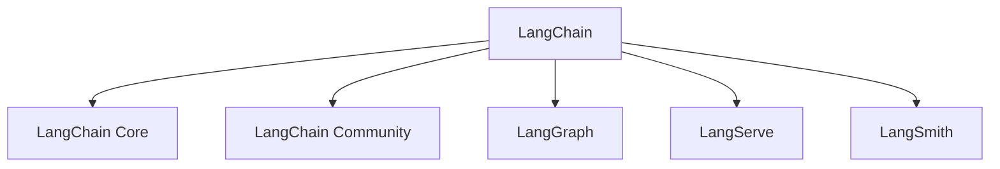
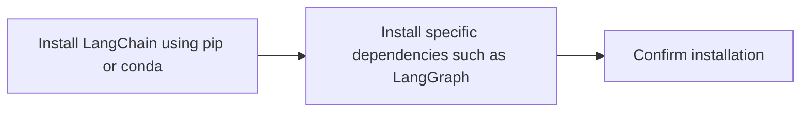
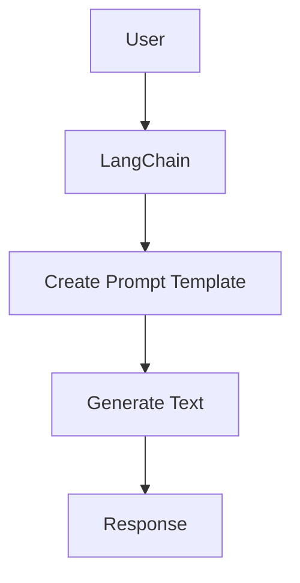
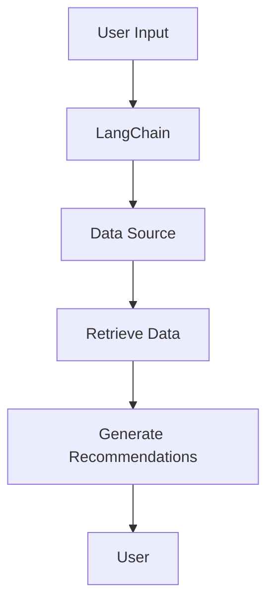
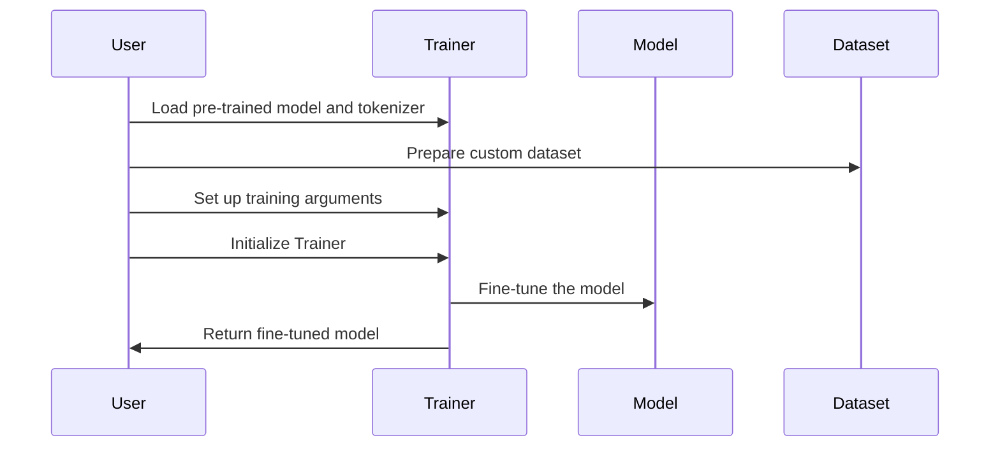

# Building Intelligent Applications with LangChain

Streamline Language Model Integration with User-Friendly Interfaces


## Introduction

### Overview

Welcome! Today, we're going to explore how [LangChain](https://www.langchain.com/) can transform the way you develop applications powered by large language models (LLMs). Whether you're a developer looking to enhance your apps with AI or a business professional eager to integrate advanced language capabilities, LangChain has the tools you need.

Imagine being able to create applications that understand context and provide intelligent responses. That's what LangChain is all about. It bridges the gap between complex language models and practical business applications, making it easier to integrate AI capabilities into your projects. With its comprehensive suite of tools and components, LangChain simplifies the development of context-aware applications, bringing advanced AI technology within your reach.

Let's make this journey smooth and enjoyable. Here are some resources to help you get started with LangChain:

- [LangChain GitHub Repository](https://github.com/hwchase17/langchain): Explore the source code, contribute, and stay updated with the latest developments.
- [LangChain Documentation](https://langchain.readthedocs.io/): Dive into comprehensive guides and tutorials to master LangChain.
- [Getting Started with LangChain](https://python.langchain.com/v0.1/docs/get_started/quickstart/): A beginner-friendly guide to kickstart your LangChain journey.
- [LangChain Examples](https://github.com/langchain-ai/langchain/tree/master/cookbook): Check out practical examples to see LangChain in action.
- [LangChain Blog](https://blog.langchain.dev/): Stay informed with the latest news, insights, and tutorials from the LangChain team.

### Learning Objectives

By the end of this tutorial, you will:

1. **Understand Core Functionalities**: Learn the core functionalities and unique features of LangChain.
2. **Install and Set Up**: Master the installation and initial setup of LangChain.
3. **First-Time Configuration**: Learn how to configure LangChain for first-time use.
4. **Practical Applications**: Explore practical examples of using LangChain for both basic and advanced applications.
5. **Detailed Features and Integration Tips**: Delve into the detailed features of LangChain and get tips on integration.
6. **Actionable Steps for Implementation**: Discover actionable steps to implement LangChain in your business environment.

Let's get started and see how LangChain can streamline the integration of language models into your applications!

## Why LangChain Matters

### Descriptive Overview

LangChain is a comprehensive framework designed to simplify the lifecycle of applications powered by large language models (LLMs). It offers several key components that work together to streamline the development, deployment, and management of intelligent applications.



1. **LangChain Core**: 
    This is the foundation of LangChain. It provides the essential abstractions and the LangChain Expression Language (LCEL), allowing you to create and manipulate language model workflows using a flexible and powerful syntax. Think of it as the backbone that supports the construction of complex AI applications.

2. **LangChain Community**: 
    LangChain Community is all about third-party integrations. It enables developers to extend LangChain's capabilities by integrating various external tools and services. This flexibility allows you to enhance your applications with additional functionality and adapt them to meet specific business needs.

3. **LangGraph**: 
    LangGraph is designed for building stateful, multi-actor applications. This means you can create complex workflows that involve multiple agents interacting over time. It’s perfect for developing applications that require a high level of interaction and coordination between different components.

4. **LangServe**: 
    LangServe simplifies the process of deploying LangChain workflows as REST APIs. This makes it easy to expose your AI workflows to other applications and systems, facilitating seamless integration and interaction with existing business processes.

5. **LangSmith**: 
    LangSmith offers a suite of tools for debugging, testing, evaluating, and monitoring LLM applications. Ensuring high standards of quality, reliability, and performance is crucial for AI-driven solutions, and LangSmith provides the resources you need to maintain these standards.

### Business Use Cases

LangChain can revolutionize various aspects of your business, enhancing performance and efficiency across different domains. Let’s look at some practical applications:

1. **Customer Support**: 
    Imagine developing intelligent chatbots that can handle customer inquiries, provide support, and improve customer satisfaction. These chatbots can understand and respond to common questions, offer troubleshooting assistance, and escalate issues to human agents when necessary. This not only speeds up response times but also ensures a consistent and high-quality customer service experience.

2. **Data Analysis**: 
    LangChain can help you create tools that analyze large datasets, extract insights, and generate reports. Automating data processing tasks allows you to identify trends and patterns quickly, presenting findings in a clear and actionable manner. This empowers your business to make data-driven decisions efficiently and accurately.

3. **Content Generation**: 
    Automating the creation of marketing content, product descriptions, and other written materials becomes a breeze with LangChain. Whether it's generating blog posts, social media content, or email newsletters, LangChain ensures consistency in messaging while saving time for content creators. This automation enhances productivity and maintains a high standard of content quality.

4. **Healthcare**: 
    In the healthcare sector, LangChain can be used to implement virtual assistants that handle patient inquiries, schedule appointments, and provide medical information. These assistants can offer personalized responses based on patient history, manage appointment calendars, and deliver accurate health information. This improves patient engagement, operational efficiency, and the overall quality of care.

By integrating LangChain into these business scenarios, you can leverage advanced language model capabilities to drive efficiency, enhance customer satisfaction, and stay ahead in the competitive landscape. Now, let's dive into how you can get started with LangChain and bring these benefits to your business.

## Getting Started with LangChain

### Installation and Setup

Let's get LangChain up and running on your system. We'll cover the installation process using both Pip and Conda, ensuring you're ready to dive into building intelligent applications.



**Step 1: Install LangChain**

You can install LangChain using either Pip or Conda. Here are the commands you'll need:

Using Pip:
```bash
pip install langchain
```

Using Conda:
```bash
conda install langchain -c conda-forge
```

**Step 2: Install Specific Dependencies**

Depending on your project requirements, you may need to install additional dependencies. For example, if you want to use LangGraph, you can install it separately:

```bash
pip install langgraph
```

### Initial Configuration

Now that LangChain is installed, let's set up a basic environment to get you started. We'll use Jupyter Notebook for this example, but you can adapt it to other environments as needed.

```python
from langchain import LangChain

# Initialize LangChain instance
lc = LangChain()

# Set up a basic chain
chain = lc.create_chain()
```

**Explanation:**

1. **Initialize LangChain Instance**:
    ```python
    lc = LangChain()
    ```
    This command initializes an instance of LangChain, setting up the framework you'll use for generating text and interacting with data. Think of this as preparing your workspace to start building intelligent applications.

2. **Set Up a Basic Chain**:
    ```python
    chain = lc.create_chain()
    ```
    This line creates a basic chain, which is a sequence of steps that LangChain will follow to process input and generate output. Chains can be simple or complex, depending on the application's needs. This basic setup is your starting point, and you can expand it with more intricate chains and data sources as you build out your application.

With these steps, you're ready to start exploring the capabilities of LangChain. Next, we'll dive into some practical examples to see how you can leverage LangChain's features in real-world scenarios. Let's get started!

## Practical Examples

### Example 1: Basic Use Case

Let's create a simple application that uses LangChain to generate text based on a prompt. This example will help you understand the basic workflow of using LangChain to create and manipulate text.



Here's how we can do this step-by-step:

1. **Initialize LangChain**: We'll start by setting up a LangChain instance.
2. **Create a Prompt Template**: Next, we'll create a prompt template that specifies what we want LangChain to generate.
3. **Generate Text**: We'll use LangChain to generate text based on our prompt.
4. **Print the Response**: Finally, we'll print the generated text.

Let's see the code in action:

```python
from langchain import LangChain

# Initialize LangChain instance
lc = LangChain()

# Create a prompt template for generating text
prompt = "Write a short story about a brave knight."

# Generate text based on the prompt
response = lc.generate(prompt)

# Print the generated text response
print(response)
```

**Explanation:**

1. **Initialize LangChain Instance**:
    ```python
    lc = LangChain()
    ```
    This command initializes the LangChain object, setting up the framework you'll use for generating text.

2. **Create a Prompt Template**:
    ```python
    prompt = "Write a short story about a brave knight."
    ```
    Here, we define a prompt that instructs LangChain to generate a short story about a brave knight. This prompt serves as the input for the text generation process.

3. **Generate Text Based on the Prompt**:
    ```python
    response = lc.generate(prompt)
    ```
    LangChain processes the prompt and generates text based on it. The `generate` method takes the prompt as an input and returns the generated text.

4. **Print the Generated Text Response**:
    ```python
    print(response)
    ```
    Finally, we print the generated text to the console. This allows us to see the output of the text generation process.

By following these steps, you can quickly and easily generate text using LangChain. This basic example serves as a foundation for more complex applications, where you can build on these concepts to create sophisticated language model workflows.

Next, we'll explore more advanced examples to demonstrate the full capabilities of LangChain in various business scenarios. Let's dive deeper!

### Example 2: Advanced Application

In this advanced example, we will create an application that integrates external data sources and uses LangChain to provide personalized recommendations. This example demonstrates how you can leverage LangChain's capabilities to build more complex and dynamic applications.



Here's a step-by-step guide on how to implement this:

1. **Initialize LangChain Instance**: We'll start by setting up a LangChain instance.
2. **Create a Data Source**: We'll define a data source that points to the location of your data.
3. **Create a Chain with Data Retrieval**: We'll integrate the data source into a LangChain to enable data retrieval.
4. **Generate Recommendations Based on User Input**: We'll use the chain to generate personalized recommendations based on the user's input.
5. **Print the Generated Recommendations**: Finally, we'll print the personalized recommendations.

Let's see the code:

```python
from langchain import LangChain
from langchain.data_sources import DataSource

# Initialize LangChain instance
lc = LangChain()

# Create a data source, specifying the path to your data
data_source = DataSource("path/to/data")

# Create a chain that integrates data retrieval from the data source
chain = lc.create_chain(data_source=data_source)

# Example user input for generating personalized recommendations
user_input = "I like science fiction books."

# Generate recommendations based on the user input
recommendations = chain.generate(user_input)

# Print the generated recommendations
print(recommendations)
```

**Explanation:**

1. **Initialize LangChain Instance**:
    ```python
    lc = LangChain()
    ```
    This command sets up the LangChain object, initializing the framework you'll use for generating text and interacting with data.

2. **Create a Data Source**:
    ```python
    data_source = DataSource("path/to/data")
    ```
    Here, we define a data source by specifying the path to your data. This data source is essential for retrieving the information needed to generate personalized recommendations.

3. **Create a Chain with Data Retrieval**:
    ```python
    chain = lc.create_chain(data_source=data_source)
    ```
    This line integrates the data source into a LangChain, enabling the retrieval of data. The chain now has the capability to access and use the data stored at the specified location.

4. **Generate Recommendations Based on User Input**:
    ```python
    user_input = "I like science fiction books."
    recommendations = chain.generate(user_input)
    ```
    In this step, we provide an example of user input. The chain processes this input and uses the data source to generate personalized recommendations. The `generate` method takes the user input and produces a list of recommendations.

5. **Print the Generated Recommendations**:
    ```python
    print(recommendations)
    ```
    Finally, we print the personalized recommendations to the console. This allows us to see the output and verify that the recommendations are tailored to the user's input.

By following these steps, you can create a more sophisticated application that integrates external data sources and provides personalized recommendations using LangChain. This example showcases how you can build complex workflows that deliver valuable insights and enhance user experience.

Next, we'll explore additional features and integration tips to help you make the most of LangChain in your projects. Let's continue to expand our understanding and capabilities!

## In-Depth Guide

### Detailed Features

LangChain is packed with features that enhance the development and deployment of intelligent applications. Let's take a closer look at some of its key functionalities:



1. **Model Interaction**:
    - **Description**: LangChain allows you to manage inputs and extract information from outputs effectively. This feature ensures that you can communicate seamlessly with language models, feeding them the right data and parsing their responses to suit your application's needs.
    - **Example**: If you're building a customer support chatbot, you can input customer queries into the model and extract relevant information from the model's responses to provide accurate and helpful answers.

2. **Data Connection and Retrieval**:
    - **Description**: Integrate LangChain with various data sources such as databases, APIs, and other repositories. This makes data retrieval and integration into your workflows seamless.
    - **Example**: For a recommendation system, you can connect LangChain to your product database and retrieve product details to personalize recommendations based on user preferences.

3. **Chains and Agents**:
    - **Description**: Create complex workflows by chaining multiple components together. This feature allows you to build sophisticated applications by linking various tasks and processes, ensuring they work together smoothly and efficiently.
    - **Example**: In an e-commerce application, you can chain components for user authentication, product recommendation, and payment processing to create a streamlined user experience.

4. **Memory Management**:
    - **Description**: Store and manage data for use by LLMs. LangChain provides tools for maintaining and retrieving contextual information, which helps improve the accuracy and performance of your applications by utilizing past interactions and data.
    - **Example**: In a virtual assistant application, you can store previous conversations and use them to provide context-aware responses, making the interaction more natural and coherent.

### Integration Tips

Integrating LangChain with other systems can enhance its capabilities and ensure a smooth workflow. Here are some tips to help you get started:

1. **APIs**:
    - **Description**: Use LangServe to deploy your LangChain models and chains as RESTful APIs. This makes it easy to provide access to your models over HTTP.
    - **Tips**:
        - Ensure your API endpoints are well-documented to facilitate easy usage by other developers.
        - Implement security measures such as authentication and authorization to protect your API endpoints.
        - Use load balancing and scalability strategies to handle high traffic and ensure reliable performance.

2. **Data Sources**:
    - **Description**: Leverage LangChain’s connectors to integrate seamlessly with various databases and external APIs.
    - **Tips**:
        - Efficient data retrieval can be achieved with proper indexing and query optimization.
        - Implement data preprocessing steps to ensure clean, normalized, and transformed data for consumption by your models.
        - Consider caching frequently accessed data to reduce latency and improve performance.

3. **Monitoring and Debugging**:
    - **Description**: Use LangSmith to trace, debug, and monitor your LangChain applications. This helps you maintain high reliability and performance.
    - **Tips**:
        - Regularly monitor the performance of your models and chains to identify any bottlenecks or issues.
        - Use detailed insights and analytics provided by LangSmith to troubleshoot and optimize your applications.
        - Set up alerts and notifications to be informed of any anomalies or performance degradation in real-time.

By leveraging these features and integration tips, you can harness the full potential of LangChain to build robust and efficient intelligent applications. Now, let's see how you can apply these features in a real-world context with LangChain.


## Actionable Takeaways

### Key Points

- **LangChain Simplifies Development**: LangChain makes it easier to develop applications powered by large language models (LLMs), streamlining the entire process from creation to deployment.
- **Modular and Flexible Design**: The framework's modular design allows for flexibility and scalability, making it suitable for a wide range of applications and use cases.
- **Integration Capabilities**: LangChain can seamlessly integrate with various data sources and external systems, enhancing the functionality and efficiency of your applications.

### Implementation Steps

Let's break down the steps you need to follow to get started with LangChain and make the most out of its powerful features.

1. **Install LangChain**:
    - Start by installing LangChain using Pip or Conda.
    ```bash
    pip install langchain
    # or
    conda install langchain -c conda-forge
    ```

2. **Set Up Environment**:
    - Initialize LangChain and configure your environment to get it ready for developing LLM-powered applications.
    ```python
    from langchain import LangChain

    # Initialize LangChain instance
    lc = LangChain()
    ```

3. **Create Chains**:
    - Develop chains and agents to handle specific tasks. Chains allow you to link multiple components together to perform complex workflows.
    ```python
    # Example of creating a basic chain
    chain = lc.create_chain()
    ```

4. **Integrate Data Sources**:
    - Connect LangChain to your data sources to enhance functionality. This allows you to retrieve and utilize data from various databases, APIs, or other repositories.
    ```python
    from langchain.data_sources import DataSource

    # Create a data source
    data_source = DataSource("path/to/data")

    # Integrate the data source into a chain
    chain = lc.create_chain(data_source=data_source)
    ```

5. **Deploy and Monitor**:
    - Use LangServe to deploy your LangChain models and chains as RESTful APIs, making them accessible over HTTP.
    - Monitor and debug your applications using LangSmith to ensure high performance and reliability.
    ```python
    # Example deployment and monitoring (conceptual)
    lc.deploy(chain, endpoint="http://your-api-endpoint")
    lc.monitor(chain)
    ```

By following these steps, you can effectively implement LangChain in your projects, leveraging its full potential to build sophisticated and efficient LLM-powered applications. Remember, the key to success is to start with a solid foundation, integrate relevant data sources, and continuously monitor and optimize your applications for the best performance.

## Challenge: Real-World NLP Solutions with LangChain

### Task Description

Let's dive into a hands-on challenge! Your task is to identify a real-world problem or opportunity in your business or personal projects where integrating language model capabilities can add significant value. Using LangChain, you'll create an application to effectively address this need.

### Potential Areas

Here are some areas where LangChain can make a significant impact:

- **Customer Support Automation**: Develop a virtual assistant to handle customer inquiries, provide recommendations, and offer support.
- **Data Analysis and Reporting**: Create tools that analyze datasets, extract insights, and generate detailed reports.
- **Content Generation**: Automate the creation of marketing materials, product descriptions, blog posts, and other written content.
- **Healthcare Assistance**: Implement a virtual assistant to handle patient inquiries, manage appointment scheduling, and provide medical information.
- **Educational Tools**: Develop personalized learning plans and study recommendations to enhance educational experiences.

### Steps

Follow these steps to complete your project:

1. **Identify the Problem**: Choose a relevant challenge or opportunity where language models can add value.
2. **Select a Model**: Pick an appropriate pre-trained model from the LangChain library that suits your needs.
3. **Fine-tune**: If necessary, fine-tune the model on your specific dataset to enhance its performance for your particular application.
4. **Develop the Solution**: Implement your solution using LangChain, integrating the selected model and creating the necessary workflows.
5. **Test and Validate**: Ensure that your application works correctly by testing it thoroughly and validating its accuracy and effectiveness.
6. **Deploy and Monitor**: Deploy your solution in a real-world setting and monitor its performance, making adjustments as needed.

### Example Projects

To inspire you, here are some example projects you can undertake:

- **Customer Support Chatbot**: Build a chatbot that handles customer inquiries, provides answers, and escalates complex queries to human agents.
- **Data Analysis Tool**: Create a tool that automates the analysis of large datasets and generates insightful reports.
- **Content Generator**: Develop an application that automatically creates product descriptions, blog posts, and other marketing materials.
- **Healthcare Assistant**: Implement a virtual assistant that manages patient inquiries, schedules appointments, and offers medical advice.
- **Educational Tool**: Create a personalized learning platform that recommends study materials and learning plans based on individual needs.

### Tips

- **Use Pre-trained Models**: Start with available pre-trained models to achieve quick wins and accelerate development.
- **Iterate and Improve**: Continuously refine your solution based on feedback and performance metrics.
- **Engage with the Community**: Join the LangChain community to seek advice, share your progress, and collaborate with others.

### Expected Outcome

By the end of this challenge, you will have created a functional NLP solution tailored to a specific problem, demonstrating LangChain's potential to solve real-world challenges. This project will give you practical experience with advanced NLP techniques and show how LangChain can deliver tangible benefits.

### Conclusion

This challenge is designed to help you apply LangChain in a practical and impactful way. By tackling a real-world problem that matters to you, you will gain hands-on experience with LangChain and create a solution that can make a real difference.

### Continue Learning

1. Explore the [LangChain documentation](https://python.langchain.com/v0.2/docs/introduction/) for in-depth guides and tutorials.
2. Experiment with different models and tasks to discover new applications for your business.

Remember, the key to success with LangChain is continuous experimentation and adaptation to your specific business needs. Start small, measure the impact, and scale your NLP solutions as you see tangible benefits. Happy building!

### Additional Resources

1. [Winning in AI Means Mastering the New Stack](https://blog.langchain.dev/winning-in-ai-means-mastering-the-new-stack/)
2. [LangChain Guide by CommandBar](https://www.commandbar.com/blog/langchain-guide/)
3. [LangChain Introduction Documentation](https://python.langchain.com/v0.2/docs/introduction/)
4. [LangChain Tutorial by Elastic](https://www.elastic.co/blog/langchain-tutorial)
5. [LangChain Use Cases by Google Cloud](https://cloud.google.com/use-cases/langchain)
6. [LangChain Use Cases Documentation](https://js.langchain.com/v0.1/docs/use_cases/)
7. [LangChain Blog by The Blue AI](https://theblue.ai/blog/langchain/)
8. [LangChain on LabLab](https://lablab.ai/apps/tech/langchain/langchain)
9. [LangChain Installation Guide](https://python.langchain.com/v0.1/docs/get_started/installation/)
10. [LangChain Quickstart Guide](https://python.langchain.com/v0.1/docs/get_started/quickstart/)