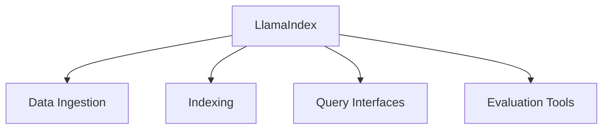
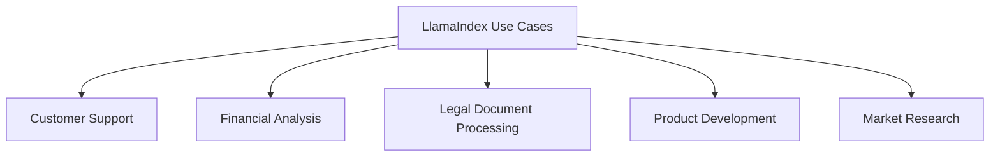
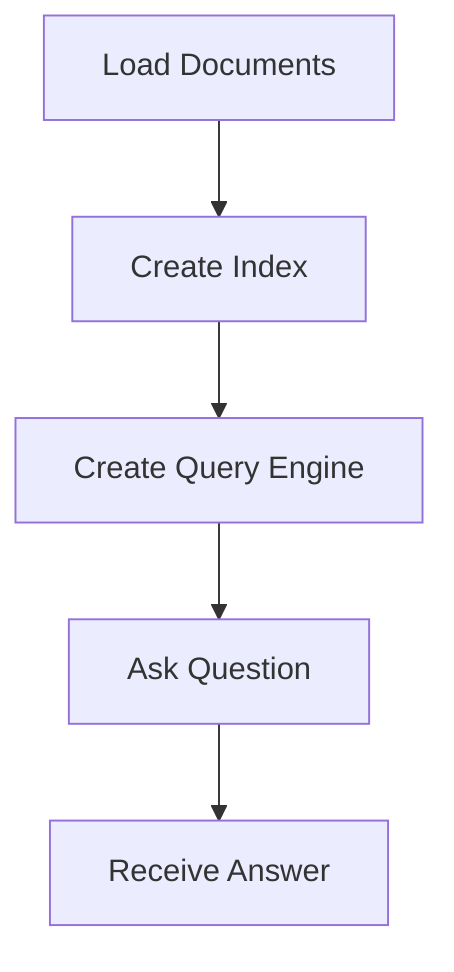
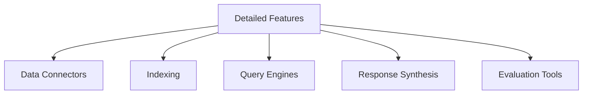

# LlamaIndex: Revolutionizing Enterprise Applications

Leverage Specialized Large Language Models for Enhanced Business Solutions


## Introduction

### Overview

Welcome! Today, we're going to explore an exciting tool called [LlamaIndex](https://llamaindex.ai/). This powerful data framework is designed to bridge the gap between custom data sources and large language models (LLMs), making it easier to create context-aware and data-driven AI applications.

Think of LlamaIndex as a connector that integrates various data sources with LLMs, enhancing their capabilities with minimal coding effort. Whether you're a developer, data scientist, or business professional, LlamaIndex provides the tools you need to make sophisticated AI technology accessible and useful for your projects.

Before we dive in, here are some resources to get you started:

- [LlamaIndex GitHub Repository](https://github.com/run-llama/llama_index): Check out the source code, contribute, and stay updated with the latest developments.
- [LlamaIndex Documentation](https://docs.llamaindex.ai/): Explore comprehensive guides and tutorials to understand and implement LlamaIndex.
- [Getting Started with LlamaIndex](https://docs.llamaindex.ai/en/stable/#getting-started): A beginner-friendly guide to kickstart your journey with LlamaIndex.
- [LlamaIndex Examples](https://docs.llamaindex.ai/en/stable/examples/): Discover practical examples of how LlamaIndex can be used in various applications.
- [LlamaIndex Community](https://www.llamaindex.ai/community): Join the community on Discord to ask questions, share your projects, and collaborate with other LlamaIndex users.
- [LlamaIndex Blog](https://llamaindex.ai/blog): Stay updated with the latest news, insights, and tutorials from the LlamaIndex team.

## Learning Objectives

By the end of this tutorial, you will:

- **Understand LlamaIndex**: You'll learn what LlamaIndex is and why it's important for modern businesses.
- **Install and Set Up**: We'll guide you through installing and setting up LlamaIndex.
- **Explore Practical Examples**: We'll look at how LlamaIndex can be used in real business scenarios with hands-on examples.
- **Deep Dive into Features**: You'll gain in-depth knowledge of LlamaIndex's key features and integration capabilities.
- **Implement in Your Projects**: Finally, you'll be equipped to implement LlamaIndex in your own projects.

Ready to get started? Let's dive into the world of LlamaIndex and see how it can revolutionize your business applications.

## Why LlamaIndex Matters

### Descriptive Overview

Let's delve into why LlamaIndex is a game-changer for connecting large language models (LLMs) with diverse data sources. Understanding these core functionalities will highlight how LlamaIndex can streamline and enhance your data-driven applications.



1. **Data Ingestion**:
    - **What It Does**: LlamaIndex allows seamless data ingestion from various sources such as APIs, PDFs, and databases.
    - **Why It Matters**: This capability simplifies the integration process, making it easy to gather all the necessary data without jumping through hoops.

2. **Efficient Indexing**:
    - **What It Does**: Provides robust indexing and structuring capabilities.
    - **Why It Matters**: Efficient indexing ensures that data retrieval is quick and reliable, saving time and resources.

3. **Query Interfaces**:
    - **What It Does**: Offers intuitive query interfaces for knowledge-augmented generation.
    - **Why It Matters**: Enhances the capabilities of large language models by making it easier to interact with and retrieve relevant data.

4. **Evaluation and Observability**:
    - **What It Does**: Includes tools for evaluating and monitoring LLM applications.
    - **Why It Matters**: Ensures high performance and reliability of your AI applications, helping you maintain quality standards.

### Unique Features of LlamaIndex

Now, let's explore some of the unique features that make LlamaIndex stand out:

1. **Modular Architecture**:
    - **Description**: LlamaIndex's modular design allows you to customize each component.
    - **Benefit**: This flexibility lets you tailor solutions to meet your specific data integration and retrieval needs.

2. **Index Type Support**:
    - **Description**: Supports various index types like vector, list, tree, and keyword table.
    - **Benefit**: Offers flexibility in organizing and accessing data for different use cases, ensuring optimal performance.

3. **Integration**:
    - **Description**: Integrates seamlessly with popular large language models (LLMs) and vector databases.
    - **Benefit**: Facilitates enhanced compatibility and functionality across various platforms, making it easier to expand and scale your applications.

4. **Advanced Retrieval**:
    - **Description**: Provides advanced retrieval and query capabilities.
    - **Benefit**: Ensures that data access is efficient and delivers relevant, accurate results, which is crucial for making informed decisions.

By leveraging these features, LlamaIndex not only simplifies the integration of LLMs with external data sources but also enhances the overall efficiency and effectiveness of your AI-driven solutions. This makes it an invaluable tool for businesses looking to harness the power of advanced AI technology. Ready to see how it all works? Let’s move on to setting up LlamaIndex and putting it into action.

### Business Use Cases

Let's explore how LlamaIndex can transform various business scenarios by enhancing performance and providing intelligent solutions:



1. **Customer Support**:
    - **Application**: Use LlamaIndex to build intelligent chatbots that tap into your company's knowledge bases.
    - **Benefit**: These chatbots can provide accurate, context-aware responses, significantly enhancing customer satisfaction and efficiency. Imagine a customer asking about a product return policy and the chatbot instantly providing the precise answer from your database.

2. **Financial Analysis**:
    - **Application**: Develop systems with LlamaIndex that can ingest and analyze large volumes of financial reports and market data.
    - **Benefit**: Generate valuable insights that inform investment strategies and business decisions. Think about a financial analyst who needs to quickly analyze quarterly reports from multiple companies and identify key trends—LlamaIndex can streamline this process.

3. **Legal Document Processing**:
    - **Application**: Create tools with LlamaIndex to rapidly search and summarize legal documents, contracts, and case law.
    - **Benefit**: Streamline legal research and improve accuracy, making it easier for legal professionals to find relevant information quickly. Imagine a lawyer preparing for a case, able to quickly pull up pertinent case law and summarize lengthy contracts in minutes.

4. **Product Development**:
    - **Application**: Implement systems using LlamaIndex to analyze customer feedback, feature requests, and bug reports.
    - **Benefit**: Help shape and prioritize product roadmaps based on real user data, ensuring that development efforts are aligned with customer needs and pain points. Picture a product manager receiving real-time insights on the most requested features and common issues from users.

5. **Market Research**:
    - **Application**: Build applications with LlamaIndex that process and synthesize information from diverse sources.
    - **Benefit**: Identify market trends and opportunities, providing a comprehensive view of the competitive landscape. Imagine a marketing team using these insights to craft strategies that target emerging trends and capitalize on new opportunities.

By leveraging LlamaIndex in these ways, businesses can enhance their operations, improve decision-making, and stay ahead of the competition. Ready to implement LlamaIndex in your business? Let's get started!

## Getting Started with LlamaIndex

### Installation and Setup

Let's walk through the process of getting LlamaIndex up and running on your system. This involves installing the necessary software and setting up your environment.


1. **Ensure you have Python 3.8+ installed**:
    - First, make sure your system has Python 3.8 or higher installed. You can check your Python version by running:
      ```bash
      python --version
      ```

2. **Install LlamaIndex**:
    - Open your terminal or command prompt and run the following command to install LlamaIndex:
      ```bash
      pip install llama-index
      ```

3. **Set up API Key for OpenAI**:
    - If you're using OpenAI's models (which is the default setup), you'll need to set up your API key. You can do this by running:
      ```bash
      export OPENAI_API_KEY="your-api-key-here"
      ```
      Make sure to replace `"your-api-key-here"` with your actual OpenAI API key.

4. **Install Additional Packages for Other LLMs**:
    - If you plan to use other large language models, such as those from Hugging Face, you'll need to install additional packages. Here are the commands:
      ```bash
      pip install llama-index-llms-openai
      pip install llama-index-llms-huggingface
      ```

### Initial Configuration

Once you've installed LlamaIndex and set up your environment, it's time to create a basic configuration to get started.

1. **Create a New Python File**:
    - Open your favorite code editor and create a new Python file, for example, `llamaindex_demo.py`.

2. **Import Necessary Modules**:
    - At the top of your new Python file, import the necessary modules from LlamaIndex:
      ```python
      from llama_index.core import VectorStoreIndex, SimpleDirectoryReader
      from llama_index.llms.openai import OpenAI
      ```

3. **Set Up a Basic Configuration**:
    - Now, let's set up a basic configuration using the OpenAI model. Add the following code to your Python file:
      ```python
      llm = OpenAI(model="gpt-3.5-turbo")
      ```

That's it! You now have LlamaIndex installed and a basic configuration set up. You're ready to start exploring how LlamaIndex can integrate with your data sources and enhance your applications with powerful AI capabilities.

In the next steps, we'll dive into practical examples and see how you can use LlamaIndex to build intelligent applications. Stay tuned!

## Practical Examples

### Example 1: Building a Simple Question-Answering System

Let's walk through creating a basic question-answering system using LlamaIndex. This system will load a set of documents, index them, and allow you to ask questions based on the content of those documents.



Here’s how we can do it step-by-step:

1. **Load Documents**: First, we need to load the documents from a specified directory.
2. **Create an Index**: Next, we'll create an index from these documents to facilitate efficient querying.
3. **Create a Query Engine**: We'll set up a query engine that will use the index to answer questions.
4. **Ask a Question**: Finally, we'll query the system with a question and get an answer.

```python
from llama_index.core import VectorStoreIndex, SimpleDirectoryReader
from llama_index.llms.openai import OpenAI

# Step 1: Load documents from a directory
documents = SimpleDirectoryReader('data').load_data()

# Step 2: Create an index from the documents
index = VectorStoreIndex.from_documents(documents)

# Step 3: Create a query engine
query_engine = index.as_query_engine()

# Step 4: Ask a question
response = query_engine.query("What are the key features of our product?")
print(response)
```

**Explanation**:

1. **Load Documents**:
    ```python
    documents = SimpleDirectoryReader('data').load_data()
    ```
    - This command loads all documents from the 'data' directory. The `SimpleDirectoryReader` reads and processes the documents, making them ready for indexing.

2. **Create an Index**:
    ```python
    index = VectorStoreIndex.from_documents(documents)
    ```
    - We create an index from the loaded documents. This index is crucial for efficiently retrieving relevant information when a query is made.

3. **Create a Query Engine**:
    ```python
    query_engine = index.as_query_engine()
    ```
    - The query engine is created from the index. This engine will handle the queries and use the index to find the best possible answers.

4. **Ask a Question**:
    ```python
    response = query_engine.query("What are the key features of our product?")
    print(response)
    ```
    - Here, we ask the system a question about the key features of our product. The query engine processes this question, searches the index, and returns the most relevant answer.

This simple example demonstrates the power of LlamaIndex to quickly ingest documents and provide accurate answers to queries based on the indexed content. Ready to take it a step further? Let's dive into more advanced applications in the next example!

### Example 2: Creating a Multi-Source Knowledge Base

In this advanced example, we're going to combine data from multiple sources to create a comprehensive knowledge base. This approach will allow us to leverage information from local documents and web pages to answer complex queries effectively.

Here's the step-by-step process:

1. **Load Local Documents**: We'll start by loading documents from a local directory.
2. **Load Web Pages**: Next, we'll fetch data from specific web pages.
3. **Combine All Documents**: We'll merge the local documents and web pages into a single dataset.
4. **Parse Documents into Nodes**: This step involves parsing the documents into nodes, which are more manageable units of information.
5. **Create a Vector Store**: We'll use a FAISS vector store to efficiently handle high-dimensional data.
6. **Create an Index with Combined Data**: The index will be created using the combined dataset.
7. **Create a Query Engine**: We'll set up a query engine that uses the index to answer questions.
8. **Ask a Complex Question**: Finally, we'll query the system with a complex question and retrieve the answer.

```python
from llama_index.core import VectorStoreIndex, SimpleDirectoryReader
from llama_index.readers.web import SimpleWebPageReader
from llama_index.core.node_parser import SimpleNodeParser
from llama_index.core.storage.storage_context import StorageContext
from llama_index.vector_stores.faiss import FaissVectorStore

# Step 1: Load local documents
local_docs = SimpleDirectoryReader('company_reports').load_data()

# Step 2: Load web pages
web_pages = SimpleWebPageReader(html_to_text=True).load_data(
    ['https://www.company.com/about', 'https://www.company.com/products']
)

# Step 3: Combine all documents
all_docs = local_docs + web_pages

# Step 4: Parse documents into nodes
parser = SimpleNodeParser()
nodes = parser.get_nodes_from_documents(all_docs)

# Step 5: Create a FAISS vector store
vector_store = FaissVectorStore(dim=1536)  # Dimension depends on your embedding model
storage_context = StorageContext.from_defaults(vector_store=vector_store)

# Step 6: Create an index with the combined data
index = VectorStoreIndex(nodes, storage_context=storage_context)

# Step 7: Create a query engine
query_engine = index.as_query_engine()

# Step 8: Ask a complex question
response = query_engine.query("Compare our product features with our main competitors")
print(response)
```

**Explanation:**

1. **Load Local Documents**:
    ```python
    local_docs = SimpleDirectoryReader('company_reports').load_data()
    ```
    - This command loads documents from the 'company_reports' directory, preparing them for indexing.

2. **Load Web Pages**:
    ```python
    web_pages = SimpleWebPageReader(html_to_text=True).load_data(
        ['https://www.company.com/about', 'https://www.company.com/products']
    )
    ```
    - We load content from specified web pages, converting HTML to text for easier processing.

3. **Combine All Documents**:
    ```python
    all_docs = local_docs + web_pages
    ```
    - Here, we merge the local documents and web page data into a single dataset.

4. **Parse Documents into Nodes**:
    ```python
    parser = SimpleNodeParser()
    nodes = parser.get_nodes_from_documents(all_docs)
    ```
    - We parse the combined dataset into nodes, which are smaller, more manageable units of information.

5. **Create a FAISS Vector Store**:
    ```python
    vector_store = FaissVectorStore(dim=1536)  # Dimension depends on your embedding model
    storage_context = StorageContext.from_defaults(vector_store=vector_store)
    ```
    - We create a FAISS vector store for efficient handling of high-dimensional data. The dimension should match your embedding model's output.

6. **Create an Index with Combined Data**:
    ```python
    index = VectorStoreIndex(nodes, storage_context=storage_context)
    ```
    - Using the parsed nodes and storage context, we create an index that will allow efficient data retrieval.

7. **Create a Query Engine**:
    ```python
    query_engine = index.as_query_engine()
    ```
    - The query engine is set up from the index, enabling us to perform queries on the indexed data.

8. **Ask a Complex Question**:
    ```python
    response = query_engine.query("Compare our product features with our main competitors")
    print(response)
    ```
    - We query the system with a complex question, and the query engine processes this to provide a comprehensive answer based on the combined data sources.

This example showcases how LlamaIndex can integrate multiple data sources, use advanced indexing techniques, and provide detailed responses to complex queries, making it a powerful tool for creating comprehensive knowledge bases.

## In-Depth Guide

### Detailed Features



Let's explore the key features of LlamaIndex in detail, focusing on how each component can enhance your AI applications.

1. **Data Connectors**:
    - **Overview**: LlamaIndex supports various data sources through its connectors, making it easy to integrate diverse data into your AI workflows.
    - **Example**:
        - `SimpleDirectoryReader`: For accessing local files.
        - `SimpleWebPageReader`: For fetching data from web pages.
        - **Usage**:
          ```python
          from llama_index.readers.web import SimpleWebPageReader
          web_pages = SimpleWebPageReader(html_to_text=True).load_data(
              ['https://www.company.com/about', 'https://www.company.com/products']
          )
          ```

2. **Indexing**:
    - **Overview**: LlamaIndex offers multiple index types to cater to different data structures and retrieval needs.
    - **Types**:
        - **VectorStoreIndex**: Ideal for similarity search applications.
        - **ListIndex**: Suitable for managing small datasets.
        - **TreeIndex**: Designed for hierarchical data structures.
        - **KeywordTableIndex**: Optimized for keyword-based retrieval.
    - **Usage**:
      ```python
      from llama_index.core import VectorStoreIndex
      index = VectorStoreIndex.from_documents(documents)
      ```

3. **Query Engines**:
    - **Overview**: LlamaIndex provides various query engines tailored for specific use cases, ensuring efficient and relevant results.
    - **Types**:
        - `VectorIndexRetriever`: Optimized for similarity search.
        - `TreeSelectLeafRetriever`: Perfect for hierarchical data retrieval.
    - **Usage**:
      ```python
      query_engine = index.as_query_engine()
      response = query_engine.query("What are the key features of our product?")
      ```

4. **Response Synthesis**:
    - **Overview**: LlamaIndex leverages large language models (LLMs) to generate coherent responses based on retrieved data.
    - **Modes**:
        - **Refine**: Provides detailed responses by iterating on initial answers.
        - **Compact**: Produces concise responses.
        - **Tree Summarize**: Summarizes information from hierarchical data.
    - **Usage**:
      ```python
      response = query_engine.query("Describe our new product in detail", mode="refine")
      ```

5. **Evaluation Tools**:
    - **Overview**: LlamaIndex includes tools for evaluating the quality of responses and retrieval performance.
    - **Types**:
        - `ResponseEvaluator`: Assesses the accuracy and relevance of generated answers.
        - `RetrieverEvaluator`: Measures the effectiveness of data retrieval processes.
    - **Usage**:
      ```python
      evaluator = ResponseEvaluator()
      evaluation = evaluator.evaluate(response)
      ```

### Integration Tips

Enhancing your AI applications with custom Language Models (LLMs), embeddings, and vector databases can significantly improve functionality. Here’s how to integrate these components with LlamaIndex:

1. **Integrating with Custom LLMs**:

    To integrate a custom language model from HuggingFace, follow these steps:

    ```python
    from llama_index.llms.huggingface import HuggingFaceLLM

    # Initialize the HuggingFace language model
    llm = HuggingFaceLLM(
        context_window=4096,  # Set the context window size
        max_new_tokens=256,   # Maximum number of new tokens to generate
        generate_kwargs={"temperature": 0.7, "do_sample": False},  # Generation settings
        model_name="meta-llama/Llama-2-13b-chat-hf",  # Specify the model to use
        device_map="auto",    # Automatically choose the device for computation
        tokenizer_name="meta-llama/Llama-2-13b-chat-hf"  # Specify the tokenizer to use
    )
    ```

    **Explanation**:
    - **HuggingFaceLLM**: Initializes the HuggingFace language model.
    - **context_window**: Defines the size of the context window.
    - **max_new_tokens**: Sets the maximum number of new tokens to generate.
    - **generate_kwargs**: Additional generation settings such as temperature and sampling.
    - **model_name**: Specifies the model to use from HuggingFace.
    - **device_map**: Automatically selects the appropriate device for computation.
    - **tokenizer_name**: Defines the tokenizer to use with the model.

2. **Using Custom Embeddings**:

    To use a custom embedding model from HuggingFace:

    ```python
    from llama_index.embeddings.huggingface import HuggingFaceEmbedding

    # Initialize the HuggingFace embedding model
    embed_model = HuggingFaceEmbedding(model_name="BAAI/bge-small-en-v1.5")
    ```

    **Explanation**:
    - **HuggingFaceEmbedding**: Initializes the HuggingFace embedding model.
    - **model_name**: Specifies the embedding model to use from HuggingFace.

3. **Integrating with Vector Databases**:

    To integrate with a vector database using Pinecone:

    ```python
    from llama_index.vector_stores.pinecone import PineconeVectorStore
    import pinecone

    # Initialize Pinecone with your API key and environment
    pinecone.init(api_key="your-api-key", environment="your-environment")

    # Set up the Pinecone vector store
    vector_store = PineconeVectorStore(index_name="your-index-name")
    ```

    **Explanation**:
    - **PineconeVectorStore**: Initializes the vector store for Pinecone.
    - **pinecone.init**: Initializes Pinecone with your API key and environment settings.
    - **index_name**: Specifies the index name to use in Pinecone.

These integration tips enable you to enhance the capabilities of LlamaIndex by connecting it with advanced models and storage solutions, creating more sophisticated and efficient AI applications.

## Actionable Takeaways

### Key Points

1. **LlamaIndex Simplifies Integration**: Connecting large language models (LLMs) with custom data sources is streamlined and efficient with LlamaIndex.
2. **Flexible Indexing Options**: The framework provides various indexing types tailored to different data structures and query requirements.
3. **Integration with Advanced Models**: LlamaIndex can seamlessly integrate with a variety of LLMs, embedding models, and vector databases, enhancing functionality and versatility.
4. **Evaluation and Optimization Tools**: Built-in tools help evaluate and optimize the performance of your AI applications, ensuring high-quality results.

### Implementation Steps

1. **Identify Your Data Sources**:
    - Determine the data sources you need to integrate (e.g., local files, web pages, databases).
    - Choose the appropriate data connectors from LlamaIndex’s offerings.
    - **Example**:
      ```python
      from llama_index.readers.web import SimpleWebPageReader
      web_pages = SimpleWebPageReader(html_to_text=True).load_data(
          ['https://www.company.com/about', 'https://www.company.com/products']
      )
      ```

2. **Select the Suitable Index Type**:
    - Assess your data structure and query needs to choose the most appropriate index type (e.g., VectorStoreIndex, ListIndex, TreeIndex, KeywordTableIndex).
    - **Example**:
      ```python
      from llama_index.core import VectorStoreIndex
      index = VectorStoreIndex.from_documents(documents)
      ```

3. **Configure Your LLM and Embedding Model**:
    - Set up the language model and embedding model that best suit your application.
    - **Example**:
      ```python
      from llama_index.llms.huggingface import HuggingFaceLLM
      from llama_index.embeddings.huggingface import HuggingFaceEmbedding

      llm = HuggingFaceLLM(
          model_name="meta-llama/Llama-2-13b-chat-hf",
          context_window=4096,
          max_new_tokens=256,
          generate_kwargs={"temperature": 0.7, "do_sample": False}
      )

      embed_model = HuggingFaceEmbedding(model_name="BAAI/bge-small-en-v1.5")
      ```

4. **Implement a Query Engine**:
    - Develop a query engine tailored to your specific use case, ensuring efficient and relevant data retrieval.
    - **Example**:
      ```python
      query_engine = index.as_query_engine()
      response = query_engine.query("What are the key features of our product?")
      print(response)
      ```

5. **Use Evaluation Tools**:
    - Leverage LlamaIndex’s evaluation tools to assess the accuracy and performance of your system.
    - Make necessary adjustments to optimize the system’s effectiveness.
    - **Example**:
      ```python
      from llama_index.evaluation import ResponseEvaluator

      evaluator = ResponseEvaluator()
      evaluation = evaluator.evaluate(response)
      print(evaluation)
      ```

By following these steps, you can effectively implement and optimize LlamaIndex in your AI projects, leveraging its powerful features to build sophisticated and efficient AI-driven solutions.

## Challenge: Real-World AI Solutions with LlamaIndex

### Task Description

Let's dive into an exciting challenge! Your goal is to identify a real-world problem in your business or personal projects where integrating large language models (LLMs) with custom data sources can add significant value. Using LlamaIndex, you’ll create a system to effectively address this need.

### Potential Areas

Consider the following areas where LlamaIndex can make a significant impact:

- **Customer Support Automation**: Utilize your company’s knowledge bases to provide accurate and efficient responses to customer inquiries.
- **Financial Analysis**: Analyze large volumes of financial reports and market data to extract valuable insights and inform decision-making.
- **Legal Document Processing**: Rapidly search, summarize, and extract relevant information from legal documents and contracts.
- **Product Development**: Analyze customer feedback and feature requests to help prioritize and shape your product roadmaps.
- **Market Research**: Process information from diverse sources to identify market trends and uncover competitive opportunities.

### Steps

Let’s break down the process into manageable steps:

1. **Identify the Problem**: Choose a relevant and impactful challenge you want to solve.
2. **Select Data Sources**: Gather relevant data sources such as PDFs, APIs, databases, and more.
3. **Set Up LlamaIndex**: Install and configure LlamaIndex to prepare for data ingestion and indexing.
4. **Ingest and Index Data**: Use LlamaIndex to ingest and organize your data sources efficiently.
5. **Develop the Solution**: Implement your system using LlamaIndex’s features and capabilities.
6. **Test and Validate**: Thoroughly test your solution to ensure its accuracy and effectiveness.
7. **Deploy and Monitor**: Deploy your solution in a real-world setting and monitor its performance to ensure it meets your needs.

### Example Projects

To inspire you, here are some example projects you could undertake:

- **Customer Support Knowledge Base**: Ingest company documentation to create a knowledge base that provides accurate and timely responses to customer queries.
- **Financial Analysis Tool**: Automate the analysis of financial reports and market data to generate actionable insights.
- **Legal Research Assistant**: Quickly search and summarize legal documents, making legal research more efficient and accurate.
- **Product Feedback Analyzer**: Process customer feedback to identify common issues, areas for improvement, and new feature requests.
- **Market Trend Identifier**: Synthesize data from various sources to identify emerging market trends and competitive opportunities.

### Tips

Here are some tips to help you succeed:

- **Use Comprehensive Data**: Leverage multiple data sources to create a well-rounded solution that provides robust and reliable insights.
- **Optimize Indexing**: Experiment with different index types to find the best performance and retrieval efficiency for your specific use case.
- **Iterate and Improve**: Continuously refine and improve your solution based on feedback and performance metrics.
- **Engage with the Community**: Share your progress, ask questions, and seek advice from the LlamaIndex community to enhance your learning and development.

### Expected Outcome

By the end of this challenge, you’ll have created a functional AI-driven solution tailored to a specific problem. This will not only demonstrate LlamaIndex's potential but also showcase your ability to leverage advanced AI techniques to solve real-world challenges effectively.

### Conclusion

This challenge is designed to be both practical and impactful, helping you apply LlamaIndex to a real-world problem that matters to you. By taking on this challenge, you'll gain hands-on experience with advanced AI techniques, and create a solution that delivers tangible benefits.

Good luck, and enjoy the process of building innovative AI solutions with LlamaIndex!

### Continue Learning

1. Explore the [LlamaIndex documentation](https://docs.llamaindex.ai/en/stable/) for in-depth guides and tutorials.
2. Join the [LlamaIndex Community](https://www.llamaindex.ai/community) to stay updated on the latest developments.
3. Experiment with different models and tasks to discover new applications for your business.

Remember, the key to success with LlamaIndex is continuous experimentation and adaptation to your specific business needs. Start small, measure impact, and scale your AI solutions as you see tangible benefits.

### Additional Resources

1. [LlamaIndex Overview](https://www.leewayhertz.com/llamaindex/)
2. [LlamaIndex Official Site](https://www.llamaindex.ai)
3. [LlamaIndex: A Detailed Guide](https://www.debutinfotech.com/blog/llamaindex-a-detailed-guide)
4. [LlamaIndex Documentation](https://docs.llamaindex.ai/en/stable/)
5. [Top 5 Features of LlamaIndex](https://www.valprovia.com/en/blog/llamaindex-top-5-features)
6. [Differences Between LlamaIndex and LangChain](https://stackoverflow.com/questions/77941814/how-do-llamaindex-and-langchain-differ-in-terms-of-data-preprocessing-for-llm-ap)
7. [LlamaIndex Use Cases](https://docs.llamaindex.ai/en/stable/use_cases/)
8. [How LlamaIndex Augments LLM Performance](https://www.heliossolutions.co/blog/how-does-llamaindex-augment-the-performance-and-efficiency-of-an-llm/)
9. [Getting Started with LlamaIndex](https://docs.llamaindex.ai/en/stable/getting_started/installation/)
10. [LlamaIndex Installation Guide](https://docs.llamaindex.ai/en/v0.9.48/getting_started/installation.html)
11. [LlamaIndex on PyPI](https://pypi.org/project/llama-index/)
12. [LlamaIndex and LangChain Comparison](https://superwise.ai/blog/lets-talk-about-llamaindex-and-langchain/)