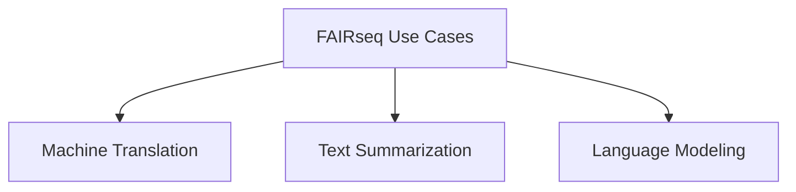
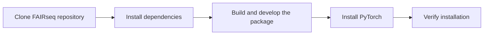
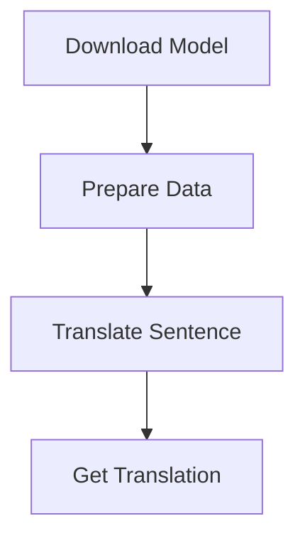
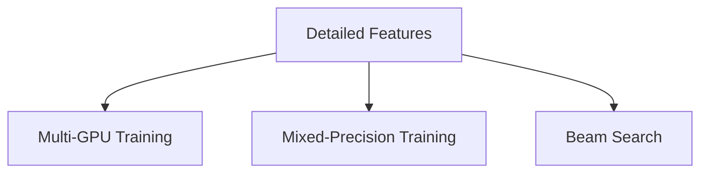

# Getting Started with FAIRseq

Implement Facebook's Sequence-to-Sequence Toolkit for Advanced NLP Tasks


## Introduction

### Overview

Welcome to the exciting world of [Fairseq](https://github.com/facebookresearch/fairseq)! Developed by Facebook AI Research, Fairseq is an open-source sequence-to-sequence toolkit written in Python. Whether you're working on tasks like translation, summarization, or language modeling, Fairseq has got you covered.

So, why Fairseq? It leverages the power of PyTorch and supports distributed training across multiple GPUs and machines. This makes it a robust tool for modern AI and data-driven business applications. Plus, it’s designed to implement advanced AI capabilities with minimal coding effort, making cutting-edge sequence-to-sequence models accessible to businesses of all sizes.

Fairseq’s user-friendly interface and extensive documentation ensure that whether you're a developer, data scientist, or researcher, you can efficiently integrate these models into your projects.

To get you started, here are some helpful links:

- [Fairseq GitHub Repository](https://github.com/facebookresearch/fairseq): Dive into the source code, contribute, and stay updated with the latest developments.
- [Fairseq Documentation](https://fairseq.readthedocs.io/en/latest/): Explore comprehensive guides and tutorials to help you understand and implement Fairseq.
- [Getting Started with Fairseq](https://fairseq.readthedocs.io/en/latest/getting_started.html): A beginner-friendly guide to kickstart your journey with Fairseq.
- [Fairseq Examples](https://github.com/facebookresearch/fairseq/tree/main/examples): Discover practical examples of how Fairseq can be used in various applications.
- [Fairseq Community](https://discuss.pytorch.org/c/fairseq/14): Join the community to ask questions, share your projects, and collaborate with other Fairseq users.
- [Fairseq Blog](https://ai.facebook.com/blog/): Stay updated with the latest news, insights, and tutorials from the Facebook AI Research team.

### Learning Objectives

By the end of this tutorial, you will:

- Understand the core functionalities and features of FAIRseq.
- Learn how to install and set up FAIRseq.
- Configure and use FAIRseq for both basic and advanced use cases.
- Explore practical business applications of FAIRseq.
- Integrate FAIRseq with other systems and workflows.

Ready to dive in? Let's get started with Fairseq and unlock the potential of advanced NLP tasks for your projects!

## Why FAIRseq Matters

### Descriptive Overview

Let's talk about why FAIRseq is a game-changer in the world of sequence-to-sequence models. FAIRseq is more than just a toolkit; it’s a versatile and efficient powerhouse that supports both LSTM and CNN models. Here’s why you should be excited about using FAIRseq:

- **Versatile Toolkit**: FAIRseq isn’t limited to one type of model. It supports a wide range of sequence-to-sequence models, including Long Short-Term Memory (LSTM) networks and convolutional neural networks (CNNs). This versatility means you can adapt FAIRseq to various text generation tasks, whether you're working on translation, summarization, or any other NLP task.

- **Optimized for Speed and Efficiency**: One of the standout features of FAIRseq is its ability to optimize speed and efficiency. It leverages multi-GPU training and mixed-precision training to ensure that your model training is fast and efficient. This means you can reduce the time and computational resources required, allowing you to focus more on refining your models and less on waiting for them to train.

- **High-Performance Capabilities**: When it comes to performance, FAIRseq doesn’t disappoint. Its fast beam search generation significantly enhances the performance of machine translation, summarization, and other text generation tasks. This ensures that you get accurate and rapid outputs, which is crucial for real-time applications.

- **Suitable for Various Applications**: The capabilities of FAIRseq make it ideal for a variety of high-performance tasks. Whether you're working on machine translation, summarization, or other advanced text generation tasks, FAIRseq supports a wide array of business and research applications. This flexibility allows you to apply FAIRseq to whatever project you're working on, ensuring top-notch results.

In summary, FAIRseq’s versatility, speed, efficiency, and high performance make it an invaluable tool for anyone looking to leverage advanced AI for text generation tasks. Whether you're a developer, data scientist, or researcher, FAIRseq has the tools and capabilities to elevate your projects to the next level.

### Business Use Cases

FAIRseq can significantly enhance business operations in several impactful ways:



Let's explore some of these use cases in more detail:

- **Machine Translation**: Imagine being able to automate the translation of documents, customer support interactions, and marketing materials. This allows your business to reach a global audience more effectively, breaking down language barriers and enhancing communication. With FAIRseq, you can seamlessly translate content, which can be a game-changer for expanding your market reach and improving customer satisfaction.

- **Text Summarization**: In today’s fast-paced business environment, the ability to quickly digest information is crucial. FAIRseq can generate concise summaries of lengthy reports, articles, or customer feedback. This capability facilitates quick decision-making and ensures that you and your team can consume large volumes of information efficiently. Whether you're summarizing internal reports or extracting key points from customer reviews, FAIRseq makes it easy.

- **Language Modeling**: Developing chatbots and virtual assistants that understand and generate human-like text can significantly improve customer engagement and support. FAIRseq's advanced language modeling capabilities enable the creation of intelligent virtual assistants that provide more natural and effective interactions. This leads to a better user experience, as your customers can receive prompt and accurate responses, enhancing their overall satisfaction with your services.

By leveraging these powerful applications, FAIRseq helps businesses streamline operations, improve communication, and enhance customer experiences, making it a valuable tool for any forward-thinking organization.

## Getting Started with FAIRseq

### Installation and Setup

Let's walk through how to get FAIRseq up and running on your system. Follow these steps, and you'll be ready to implement advanced NLP tasks in no time!



1. **Clone the FAIRseq repository**:
   First, you'll need to clone the FAIRseq repository from GitHub. Open your terminal and run:
   ```bash
   git clone https://github.com/pytorch/fairseq.git
   cd fairseq
   ```
   This command downloads the FAIRseq code to your local machine and navigates into the FAIRseq directory.

2. **Install the required dependencies**:
   Next, you'll need to install the necessary dependencies. FAIRseq has a `requirements.txt` file that lists all the Python packages you need. Install them by running:
   ```bash
   pip install -r requirements.txt
   ```
   This ensures that all the required libraries are installed and ready to use.

3. **Build and develop the package**:
   Now, you need to build and set up the FAIRseq package. Execute the following command:
   ```bash
   python setup.py build develop
   ```
   This compiles the FAIRseq code and makes it available as a package that you can import and use in your Python projects.

### Initial Configuration

1. **Install PyTorch** if you haven’t already:
   FAIRseq relies on PyTorch, so you need to have it installed on your system. If you don't have it yet, install PyTorch by running:
   ```bash
   pip install torch
   ```
   Make sure you install the version of PyTorch that is compatible with your system and CUDA version, if applicable.

2. **Verify the installation**:
   Finally, let's verify that everything is set up correctly. Run the following command:
   ```bash
   python -c "import fairseq; print(fairseq.__version__)"
   ```
   If the installation was successful, this command will print the version of FAIRseq installed on your system.

By following these steps, you should now have FAIRseq installed and ready for use. You can start exploring its powerful features and integrating it into your NLP projects. Ready to dive deeper? Let's move on to practical examples and see FAIRseq in action!

## Practical Examples

### Example 1: Basic Machine Translation

Let’s start with a simple example of translating a sentence from English to German using a pre-trained model. We'll go through the steps to download the model, prepare the data, translate a sentence, and get the translation.



1. **Download a pre-trained model**:

   First, we need to download a pre-trained machine translation model from English to German. Open your terminal and run the following commands to download and extract the model:

   ```bash
   wget https://dl.fbaipublicfiles.com/fairseq/models/wmt19.en-de.joined-dict.single_model.tar.gz
   tar -xzvf wmt19.en-de.joined-dict.single_model.tar.gz
   ```

   This will download the model file and extract it, making it ready for use.

2. **Translate a sentence**:

   Next, we'll use the downloaded model to translate a sentence from English to German. The `fairseq-interactive` command allows for interactive translation. Run the following command:

   ```bash
   echo "Hello, how are you?" | fairseq-interactive data-bin/wmt19.en-de.joined-dict.single_model --path model.pt --beam 5 --source-lang en --target-lang de
   ```

   **Explanation**:
   - `echo "Hello, how are you?"`: This part sends the sentence to be translated.
   - `fairseq-interactive`: This command runs the translation interactively.
   - `data-bin/wmt19.en-de.joined-dict.single_model`: Specifies the path to the model data.
   - `--path model.pt`: Points to the pre-trained model file.
   - `--beam 5`: Sets the beam search width to 5, which helps improve translation quality by considering multiple possible translations.
   - `--source-lang en --target-lang de`: Defines the source and target languages, English and German, respectively.

Running this command will output the translation of "Hello, how are you?" into German. This simple example shows how easy it is to use FAIRseq for machine translation tasks with minimal setup. Ready to try more advanced tasks? Let's move on to the next example!

### Example 2: Advanced Summarization

Now, let's dive into a more advanced example where we summarize a piece of text using FAIRseq. This process involves preparing your dataset, training a new summarization model, and generating summaries.

1. **Prepare the dataset**:

   First, we need to preprocess our data to create the necessary files for training. This command will convert your raw data into a format that FAIRseq can use:

   ```bash
   fairseq-preprocess --source-lang src --target-lang tgt --trainpref train --validpref valid --testpref test --destdir data-bin
   ```

   **Explanation**:
   - `--source-lang src --target-lang tgt`: Specifies the source and target languages. For summarization, these could be the same.
   - `--trainpref train --validpref valid --testpref test`: Indicates the prefixes for the training, validation, and test datasets.
   - `--destdir data-bin`: Specifies the destination directory for the processed data.

2. **Train a new summarization model**:

   Next, we'll train a summarization model using the preprocessed data. This command configures and starts the training process:

   ```bash
   fairseq-train data-bin --arch transformer --task translation --criterion label_smoothed_cross_entropy --optimizer adam --lr 0.0005 --max-tokens 4096 --update-freq 16 --save-dir checkpoints
   ```

   **Explanation**:
   - `data-bin`: Specifies the directory containing the preprocessed data.
   - `--arch transformer`: Uses the transformer architecture for the model.
   - `--task translation`: Sets the task to translation, which is suitable for summarization tasks.
   - `--criterion label_smoothed_cross_entropy`: Uses label-smoothed cross-entropy as the loss function, which helps improve the quality of the generated summaries.
   - `--optimizer adam`: Chooses the Adam optimizer for training.
   - `--lr 0.0005`: Sets the learning rate for the optimizer.
   - `--max-tokens 4096`: Defines the maximum number of tokens in a batch.
   - `--update-freq 16`: Updates the model every 16 batches to stabilize training.
   - `--save-dir checkpoints`: Specifies the directory where model checkpoints will be saved.

3. **Generate summaries**:

   Finally, we use the trained model to generate summaries from the test data. This command will produce summaries for the given input text:

   ```bash
   fairseq-generate data-bin --path checkpoints/checkpoint_best.pt --beam 5 --batch-size 128 --remove-bpe
   ```

   **Explanation**:
   - `data-bin`: Specifies the directory containing the preprocessed data.
   - `--path checkpoints/checkpoint_best.pt`: Points to the best checkpoint of the trained model.
   - `--beam 5`: Sets the beam search width to 5, which helps in generating high-quality summaries.
   - `--batch-size 128`: Processes 128 sentences at a time for efficient generation.
   - `--remove-bpe`: Removes Byte Pair Encoding (BPE) to produce readable text.

By following these steps, you can effectively use FAIRseq to perform advanced text summarization tasks, showcasing its power and versatility in handling complex sequence-to-sequence applications. Ready to try this out? Let's get started and see the amazing summaries FAIRseq can generate for your text data!

## In-Depth Guide

### Detailed Features

FAIRseq offers a range of powerful features designed to optimize your sequence-to-sequence tasks. Let’s break down some of these key features and understand how they can enhance your AI models:



1. **Multi-GPU Training**:
   - **What it is**: This feature allows you to use multiple GPUs to parallelize the model training process.
   - **Why it’s useful**: By distributing the computational workload across several GPUs, you can drastically reduce training time and increase efficiency. This means you can train larger models faster and handle bigger datasets without a hitch.

2. **Mixed-Precision Training**:
   - **What it is**: Mixed-precision training uses lower precision (e.g., FP16) for calculations where high precision is not necessary, while maintaining high precision (e.g., FP32) where it matters most.
   - **Why it’s useful**: This technique accelerates the training process and reduces memory usage, resulting in faster computations and optimized resource utilization without sacrificing accuracy. It’s particularly beneficial when working with large models and datasets.

3. **Beam Search**:
   - **What it is**: Beam search is an advanced search algorithm used for generating sequences. It keeps track of multiple possible outputs at each step and selects the most likely ones.
   - **Why it’s useful**: By exploring multiple paths simultaneously, beam search can produce more accurate and high-quality text generation. This is essential for tasks like translation and summarization where the quality of the output is critical.

### Integration Tips

To maximize the potential of FAIRseq, consider integrating it into your workflows using the following methods:

1. **Docker**:
   - **What it is**: Docker allows you to containerize applications, including all dependencies and configurations, ensuring they run consistently across different environments.
   - **How to use it**: Create a Dockerfile for your FAIRseq application to encapsulate the environment, making deployment easier and more reliable. This is especially useful for collaborative projects and production deployments.

2. **APIs**:
   - **What it is**: RESTful APIs enable applications to communicate with each other over the internet, providing real-time services.
   - **How to use it**: Integrate FAIRseq with RESTful APIs to offer real-time translation, summarization, or other sequence-to-sequence services in your applications. This facilitates seamless interaction and data exchange between different systems.

3. **Data Pipelines**:
   - **What it is**: Data pipelines automate the process of data extraction, transformation, and loading (ETL), ensuring data flows efficiently through different stages.
   - **How to use it**: Incorporate FAIRseq into your data processing pipelines using tools like Apache Airflow or Kubeflow. This allows for scalable, automated workflows, making it easier to handle large volumes of data and deploy models efficiently.

## Actionable Takeaways

### Key Points

1. **FAIRseq is a powerful toolkit**: It’s designed for sequence-to-sequence tasks, leveraging PyTorch to deliver high performance.
2. **Supports various models**: FAIRseq works with different models, including LSTM and CNN, and provides advanced features like multi-GPU and mixed-precision training.
3. **Practical applications**: FAIRseq is highly versatile and can be applied in various business contexts, such as translation, summarization, and language modeling.

### Implementation Steps

1. **Install and set up FAIRseq**:
   - Begin by installing FAIRseq in your development environment and configuring it according to your project requirements.

2. **Experiment with pre-trained models**:
   - Use pre-trained models available in FAIRseq for quick results and to understand how the toolkit works before diving into custom training.

3. **Train custom models**:
   - Develop and train models tailored to your specific business needs, leveraging FAIRseq’s features to optimize performance and efficiency.

4. **Integrate FAIRseq**:
   - Incorporate FAIRseq into your existing systems and workflows to create automated, scalable solutions that enhance your business operations.

By following these steps, you can harness the full potential of FAIRseq, creating sophisticated AI-driven applications that are both efficient and scalable. Ready to get started? Let’s dive in and explore how FAIRseq can transform your projects!

## Challenge: Real-World NLP Solutions with FAIRseq

### Task Description

Alright, let’s dive into a hands-on challenge! Your mission is to identify a real-world problem in your business or personal projects where sequence-to-sequence models can make a significant impact. Using FAIRseq, you’ll create a solution to tackle this issue effectively.

### Potential Areas

Think about areas where automated text processing can bring substantial value:

- **Custom Machine Translation**: Develop a translation model tailored for specific language pairs or industry-specific jargon.
- **Text Summarization**: Generate concise summaries of lengthy business reports, meeting notes, or legal documents.
- **Automated Customer Support**: Create a chatbot that provides accurate, context-aware responses.
- **Content Generation**: Automatically generate marketing content, product descriptions, or technical documentation.
- **Data Analysis**: Extract insights and trends from large volumes of text data.

### Steps

Here’s a step-by-step guide to help you get started:

1. **Identify the Problem**: Choose a relevant challenge that will benefit from sequence-to-sequence modeling.
2. **Select a Dataset**: Gather relevant datasets for training. For example, parallel texts for translation or lengthy documents for summarization.
3. **Set Up FAIRseq**: Install and configure FAIRseq on your system.
4. **Prepare Data**: Preprocess your data to get it ready for FAIRseq training.
5. **Train the Model**: Train a custom model, tweaking hyperparameters to optimize performance.
6. **Evaluate and Fine-tune**: Assess the model’s performance and make necessary adjustments to improve accuracy.
7. **Develop the Solution**: Implement the trained model in a user-friendly application.
8. **Test and Validate**: Ensure the solution meets your objectives and provides accurate results.
9. **Deploy and Monitor**: Deploy your solution and continuously monitor its performance to ensure it remains effective.

### Example Projects

Here are some inspiring project ideas to get your creativity flowing:

- **Industry-Specific Translation Tool**: Create a translation model that understands and accurately translates industry-specific terminology.
- **Business Report Summarizer**: Develop a tool that generates concise summaries of lengthy business reports.
- **Customer Support Chatbot**: Build a chatbot capable of handling customer inquiries and escalating complex issues when needed.
- **Automated Content Generator**: Create a system that generates content based on input keywords and topics.
- **Data Insight Extractor**: Analyze large text datasets to identify trends and generate actionable insights.

### Tips

To maximize your success, consider these tips:

- **Use Comprehensive Data**: Leverage multiple data sources to create a robust and comprehensive solution.
- **Optimize Training**: Experiment with different hyperparameters to find the best configuration for your model.
- **Iterate and Improve**: Continuously refine your solution based on feedback and performance metrics.
- **Engage with the Community**: Share your progress and seek advice from the FAIRseq community to enhance your learning and development.

### Expected Outcome

By the end of this challenge, you’ll have created a functional sequence-to-sequence model tailored to a specific problem. This will not only demonstrate the potential of FAIRseq but also showcase your ability to solve real-world challenges with advanced NLP techniques.

### Conclusion

This challenge is designed to be both practical and impactful. By tackling a real-world problem that matters to you, you’ll gain hands-on experience with advanced NLP techniques and create a solution that delivers tangible benefits.

### Continue Learning

1. Explore the [FAIRseq documentation](https://fairseq.readthedocs.io/en/latest/) for in-depth guides and tutorials.
2. Join the [FAIRseq community](https://github.com/pytorch/fairseq) to stay updated on the latest developments.
3. Experiment with different models and tasks to discover new applications for your business.

Remember, the key to success with FAIRseq is continuous experimentation and adaptation to your specific business needs. Start small, measure impact, and scale your NLP solutions as you see tangible benefits.

### Additional Resources

1. [GitHub Actions for FAIRseq](https://github.com/facebookresearch/fairseq/actions)
2. [FAIRseq on Meta AI](https://ai.meta.com/tools/fairseq/)
3. [FAIRseq: A Fast, Extensible Toolkit for Sequence Modeling](https://ai.meta.com/research/publications/fairseq-a-fast-extensible-toolkit-for-sequence-modeling/)
4. [FAIRseq Documentation Overview](https://fairseq.readthedocs.io/en/latest/overview.html)
5. [FAIRseq Model Documentation](https://fairseq.readthedocs.io/en/latest/models.html)
6. [FAIRseq GitHub Issues](https://github.com/pytorch/fairseq/issues/858)
7. [Running FAIRseq In-Memory and Pre-load Language Models](https://stackoverflow.com/questions/66525973/running-fairseq-in-memory-and-pre-load-language-models)
8. [FAIRseq on DagsHub](https://dagshub.com/marcelomata/fairseq)
9. [FAIRseq on PyPI](https://pypi.org/project/fairseq/)
10. [FAIRseq YouTube Tutorial](https://www.youtube.com/watch?v=Te40F_o3w0k)
11. [FAIRseq Research Paper](https://arxiv.org/abs/1904.01038)