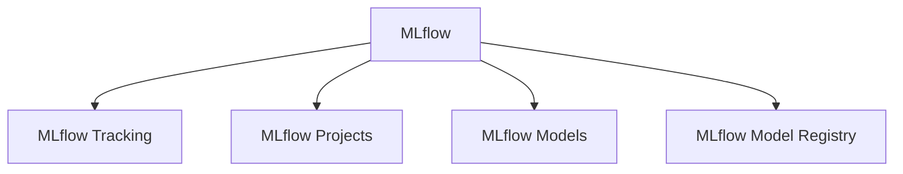
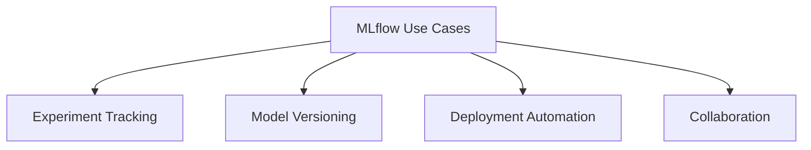
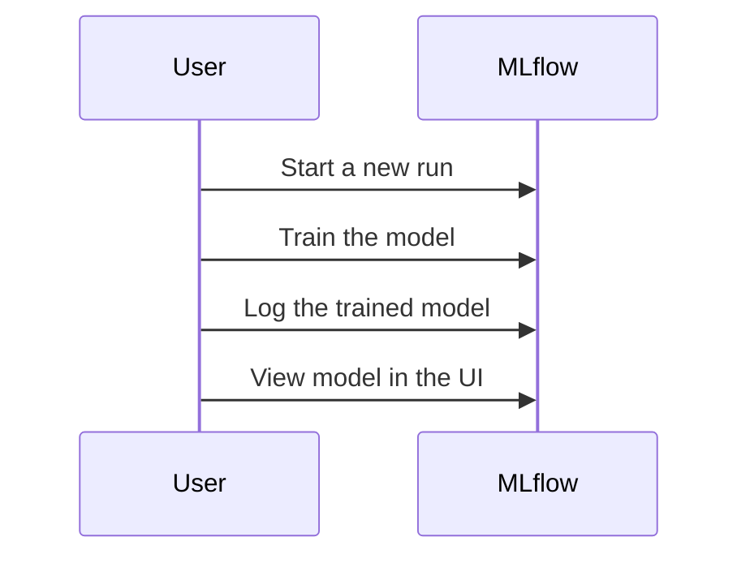
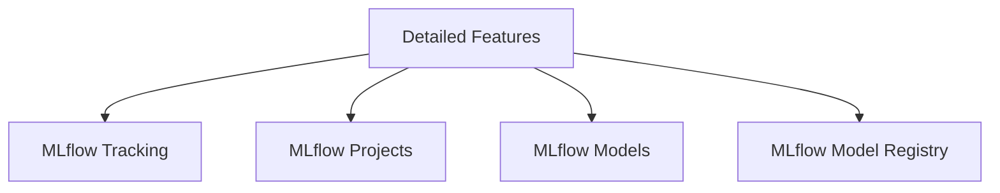

# MLflow: End-to-End Machine Learning Lifecycle Management

From Experimentation to Deployment: Mastering MLflow for Business Success


## Introduction

### Overview

Welcome to our deep dive into [MLflow](https://mlflow.org/)! Today, we’re going to explore this powerful open-source platform designed to manage the end-to-end machine learning lifecycle, from experimentation to deployment.

Imagine this: you're working on a machine learning project, and you need a way to streamline your workflows, keep track of experiments, ensure reproducibility, and manage deployments. MLflow is your go-to tool for all of these tasks. It’s become an essential platform in today’s data-driven business landscape, helping organizations like yours to efficiently manage and scale their machine learning projects.

MLflow covers the entire ML lifecycle. It helps you track experiments, package code into reproducible runs, and deploy models. Its user-friendly interface and extensive documentation make it easy for data scientists and engineers to get up and running quickly.

To get you started, here are some essential links:
- **[MLflow GitHub Repository](https://github.com/mlflow/mlflow)**: Dive into the source code, contribute, and stay updated with the latest developments.
- **[MLflow Documentation](https://www.mlflow.org/docs/latest/index.html)**: Explore comprehensive guides and tutorials to help you understand and implement MLflow.
- **[MLflow Examples](https://github.com/mlflow/mlflow/tree/master/examples)**: Discover practical examples showcasing how MLflow can be used in various applications.
- **[MLflow Community](https://community.databricks.com/)**: Join the community to ask questions, share your projects, and collaborate with other MLflow users.
- **[MLflow API Reference](https://www.mlflow.org/docs/latest/python_api/index.html)**: Detailed API documentation to help you utilize MLflow’s features effectively.
- **[MLflow Blog](https://mlflow.org/blog)**: Stay updated with the latest news, insights, and tutorials from the MLflow team.

### Learning Objectives

By the end of this tutorial, you will:
1. **Understand MLflow's core components and their business applications**: You'll gain a solid grasp of how MLflow can be used to enhance your machine learning workflows.
2. **Set up MLflow and configure it for your projects**: We'll walk through the steps to get MLflow up and running, ensuring you can start managing your ML projects effectively.
3. **Use MLflow for experiment tracking and model management**: Learn how to track your experiments, manage your models, and maintain reproducibility.
4. **Deploy models using MLflow**: Discover how to seamlessly move from development to production, deploying your models with ease.
5. **Integrate MLflow into your existing ML workflows**: Understand how to incorporate MLflow into your current processes to maximize efficiency and impact.

Ready to get started? Let’s dive into MLflow and transform the way you manage your machine learning lifecycle!

## Why MLflow Matters

### Descriptive Overview

Let’s delve into why MLflow is a game-changer for managing the machine learning lifecycle. MLflow is designed to tackle key challenges by providing a comprehensive platform with four main components:



1. **MLflow Tracking**: This component allows you to log and query experiments, capturing details like code, data, configurations, and results. Imagine being able to track and visualize the performance of all your models in one place. With MLflow Tracking, you can easily compare different experiments and see which models are performing best, making your workflow more efficient and your results more reliable.

2. **MLflow Projects**: Packaging your data science code in a reusable and reproducible format is crucial. MLflow Projects ensures that your experiments can be easily replicated and shared. Think of it as a way to bundle your work so that others (or even you in the future) can run the same experiments with the same configurations, leading to consistent and reproducible results.

3. **MLflow Models**: Deployment can often be a bottleneck in the ML lifecycle, but MLflow Models simplifies this process. It supports various serving environments, including REST API and batch inference. This means you can deploy your machine learning models quickly and flexibly, whether you need real-time predictions or batch processing.

4. **MLflow Model Registry**: Managing different versions of models can be challenging, but the MLflow Model Registry provides a centralized store for this purpose. It includes APIs and a UI for collaborative model lifecycle management, enabling versioning, staging, and annotations. This ensures that your models are well-organized and easy to manage, facilitating collaboration and continuous improvement.

### Business Use Cases



1. **Experiment Tracking**: Imagine your data science team logging parameters, metrics, and artifacts for each experiment with ease. MLflow enables you to compare different models effortlessly, ensuring that your models are robust and reliable. This leads to better decision-making and more effective models.

2. **Model Versioning**: Managing different versions of your models is crucial for A/B testing and rollbacks. With MLflow, you can maintain and track various model versions, facilitating continuous improvement and ensuring you can always revert to a previous version if needed. This is essential for maintaining the quality and reliability of your deployed models.

3. **Deployment Automation**: Speeding up the time-to-production for your ML models is a significant advantage. MLflow simplifies the deployment process across various platforms, allowing you to integrate machine learning into your business processes more rapidly. This means you can start reaping the benefits of your models sooner, leading to faster innovation and competitive advantage.

4. **Collaboration**: Sharing experiments and models within your team becomes seamless with MLflow. This fosters knowledge transfer and improves overall productivity. By making it easier to collaborate on machine learning projects, your team can work more effectively, leveraging each other's expertise and building better models together.

In summary, MLflow is a comprehensive platform that not only streamlines the machine learning lifecycle but also enhances collaboration, efficiency, and reliability in your ML workflows. Ready to see how MLflow can transform your projects? Let’s continue exploring its features and applications!

## Getting Started with MLflow

### Installation and Setup

Let's get you started with MLflow! Here’s a step-by-step guide to install and set it up.

1. **Install MLflow using pip**:
   First, we need to install MLflow. Open your terminal and run:
    ```bash
    pip install mlflow
    ```
    This command will download and install MLflow and its dependencies.

2. **Verify the installation**:
   To ensure that MLflow is installed correctly, you can check its version by running:
    ```bash
    mlflow --version
    ```
    If everything is set up correctly, this command will display the installed version of MLflow.

3. **Set up a tracking server**:
   Setting up a tracking server is optional but highly recommended, especially for team collaboration. The tracking server will store your experiment data and logs. Run the following command to start the server:
    ```bash
    mlflow server --backend-store-uri sqlite:///mlflow.db --default-artifact-root ./artifacts --host 0.0.0.0 --port 5000
    ```
    **Explanation**:
    - `--backend-store-uri sqlite:///mlflow.db`: Specifies the backend storage for experiment tracking, using an SQLite database in this case.
    - `--default-artifact-root ./artifacts`: Sets the directory where artifacts (like models and datasets) will be stored.
    - `--host 0.0.0.0`: Makes the server accessible from any IP address.
    - `--port 5000`: Runs the server on port 5000.

### Initial Configuration

Now that MLflow is installed, let's configure it for your projects.

1. **Set the tracking URI**:
   In your Python script or Jupyter notebook, you need to set the tracking URI to log and view your runs on the MLflow server. Add this code at the beginning of your script:
    ```python
    import mlflow
    
    # Set the tracking server URI to log and view runs
    mlflow.set_tracking_uri("http://localhost:5000")
    ```
    This connects your script to the MLflow server running at `http://localhost:5000`.

2. **Create an experiment**:
   Define an experiment to organize and manage your runs. Here’s how you can set up your first experiment:
    ```python
    # Define the experiment name
    experiment_name = "my_first_experiment"
    
    # Set the experiment to log runs under this name
    mlflow.set_experiment(experiment_name)
    ```
    **Explanation**:
    - `experiment_name = "my_first_experiment"`: This sets the name of your experiment.
    - `mlflow.set_experiment(experiment_name)`: This command tells MLflow to log all subsequent runs under the specified experiment.

By following these steps, you have installed MLflow, set up a tracking server, and configured your environment to start logging experiments. Ready to dive deeper? Let's move on to some practical examples to see MLflow in action!
## Practical Examples

### Example 1: Basic Use Case

Let's dive into a basic use case to understand how to track and log your machine learning experiments using MLflow.


Here's how to start a new run and log parameters and metrics in MLflow:

```python
import mlflow

# Start a new MLflow run
with mlflow.start_run():
    # Log a parameter (key-value pair)
    mlflow.log_param("param1", 5)
    
    # Log a metric (key-value pair)
    mlflow.log_metric("metric1", 0.85)
```

**Explanation**:
- `mlflow.start_run()`: This command starts a new run to track your experiment. It's a context manager, so everything inside the `with` block will be part of this run.
- `mlflow.log_param("param1", 5)`: This logs a parameter named `param1` with a value of `5`. Parameters are typically used to log hyperparameters or other configuration settings.
- `mlflow.log_metric("metric1", 0.85)`: This logs a metric named `metric1` with a value of `0.85`. Metrics are used to log performance metrics like accuracy, loss, or any other evaluation metric.

Now, to visualize the logged data, you need to start the MLflow UI:

```bash
# Launch the MLflow UI to visualize logged data
mlflow ui
```

**Explanation**:
- `mlflow ui`: This command launches the MLflow user interface, where you can view the logged parameters and metrics. Open your browser and go to `http://localhost:5000` to see the UI.

By following these steps, you can track your experiments, log important information, and visualize your results, making it easier to analyze and compare different runs. Ready to try it out? Start logging your experiments and see the power of MLflow in action!

### Example 2: Advanced Application

Let's move on to a more advanced example where we'll train a model and log it using MLflow. This will give you a hands-on understanding of how to manage your machine learning models efficiently.

#### Step 1: Train a Model and Log It Using MLflow

Here's a step-by-step guide to train a model and log it:



1. **Train and Log the Model**:
   ```python
   import mlflow
   import mlflow.sklearn
   from sklearn.ensemble import RandomForestRegressor

   # Example data
   X_train, y_train = [[0, 1], [1, 1]], [0, 1]

   # Start a new MLflow run
   with mlflow.start_run():
       # Initialize and train the model
       model = RandomForestRegressor()
       model.fit(X_train, y_train)
       
       # Log the trained model
       mlflow.sklearn.log_model(model, "model")
   ```

   **Explanation**:
   - `mlflow.start_run()`: Starts a new run to track your experiment.
   - `RandomForestRegressor()`: Initializes a RandomForestRegressor model.
   - `model.fit(X_train, y_train)`: Trains the model on the provided training data.
   - `mlflow.sklearn.log_model(model, "model")`: Logs the trained model under the name "model".

#### Step 2: Register and Deploy the Model

Once your model is logged, the next step is to register and deploy it. Here's how:

1. **Register and Deploy the Model**:
   ```python
   from mlflow import MlflowClient

   # Initialize the MLflow client
   client = MlflowClient()

   # Register the model under a specific name
   client.create_registered_model("RandomForestModel")

   # Create a new model version
   client.create_model_version(
       name="RandomForestModel", 
       source="path/to/model", 
       run_id="your_run_id"
   )
   ```

   **Explanation**:
   - `MlflowClient()`: Initializes an MLflow client to interact with the MLflow server.
   - `client.create_registered_model("RandomForestModel")`: Registers the model with the name "RandomForestModel".
   - `client.create_model_version("RandomForestModel", "path/to/model", run_id="your_run_id")`: Creates a new version of the model, linking it to a specific run.

By following these steps, you can effectively manage your machine learning models, from training and logging to registering and deploying. This approach ensures that your models are reproducible, versioned, and ready for deployment, making it easier to integrate machine learning into your business processes.

Ready to give it a try? Start training and logging your models with MLflow, and experience the benefits of a streamlined ML lifecycle management process!

## In-Depth Guide

Let's dive deeper into the detailed features of MLflow and how you can make the most of them in your machine learning projects.

### Detailed Features



1. **MLflow Tracking**:
   - **Purpose**: Track and log parameters, metrics, and artifacts from your machine learning experiments.
   - **Benefit**: The tracking UI provides a comprehensive way to visualize and compare different runs, making it easier to monitor and optimize your experiments.

   **Example**:
   ```python
   import mlflow

   with mlflow.start_run():
       mlflow.log_param("param1", 5)
       mlflow.log_metric("metric1", 0.85)
       mlflow.log_artifact("path/to/artifact")
   ```

2. **MLflow Projects**:
   - **Purpose**: Package your code in a standardized format to ensure reproducibility.
   - **Benefit**: Makes it easier to share and replicate experiments, fostering better collaboration and consistency across teams.

   **Example**:
   Create an `MLproject` file:
   ```yaml
   name: My Project

   entry_points:
     main:
       parameters:
         alpha: {type: float, default: 0.5}
         l1_ratio: {type: float, default: 0.1}
       command: "python train.py --alpha {alpha} --l1_ratio {l1_ratio}"
   ```

3. **MLflow Models**:
   - **Purpose**: Deploy machine learning models in various formats, such as REST API or batch inference.
   - **Benefit**: Offers flexible deployment options to meet different application requirements.

   **Example**:
   ```python
   import mlflow.sklearn
   from sklearn.ensemble import RandomForestRegressor

   model = RandomForestRegressor()
   mlflow.sklearn.log_model(model, "model")
   ```

4. **MLflow Model Registry**:
   - **Purpose**: Manage the lifecycle stages of your models, including versioning and annotations.
   - **Benefit**: Ensures models are properly versioned and deployed in the correct state, streamlining the model management process.

   **Example**:
   ```python
   from mlflow import MlflowClient

   client = MlflowClient()
   client.create_registered_model("MyModel")
   client.create_model_version("MyModel", "path/to/model", run_id="your_run_id")
   ```

### Integration Tips

1. **Integrate with CI/CD**:
   - **Tip**: Use MLflow in your continuous integration/continuous deployment (CI/CD) pipelines to automate model training and deployment. This ensures consistent and reliable updates to your models.

   **Example**:
   ```yaml
   # Example CI/CD pipeline configuration
   stages:
     - train
     - deploy

   train:
     script:
       - pip install -r requirements.txt
       - mlflow run .

   deploy:
     script:
       - mlflow models serve -m runs:/<run_id>/model
   ```

2. **Use with Cloud Storage**:
   - **Tip**: Configure MLflow to log data to cloud storage (e.g., AWS S3, Google Cloud Storage) for better scalability and collaboration. This is particularly useful for managing large datasets and distributed teams.

   **Example**:
   ```bash
   export MLFLOW_TRACKING_URI=http://localhost:5000
   export MLFLOW_S3_ENDPOINT_URL=https://s3.amazonaws.com
   ```

3. **Combine with Other Tools**:
   - **Tip**: Integrate MLflow with tools like Apache Spark, TensorFlow, and Kubernetes to enhance your capabilities. This allows for more powerful data processing, model training, and deployment workflows.

   **Example**:
   ```python
   # Integrating MLflow with Apache Spark
   from pyspark.sql import SparkSession
   import mlflow

   spark = SparkSession.builder.appName("MLflowExample").getOrCreate()
   mlflow.spark.log_model(spark_model, "spark-model")
   ```

## Actionable Takeaways

### Key Points

- **Simplify Lifecycle Management**: MLflow simplifies the entire machine learning lifecycle, from tracking experiments to deploying models.
- **Support for Experiment Tracking and Model Deployment**: It supports logging experiments, packaging models, and deploying them in various environments.
- **Enhance Collaboration and Reproducibility**: MLflow fosters better collaboration and ensures reproducibility in data science projects.

### Implementation Steps

1. **Install and Set Up MLflow**:
   - Begin by installing MLflow in your development environment.
   ```bash
   pip install mlflow
   ```

2. **Log Experiments and Models**:
   - Use MLflow to log your experiments, including parameters, metrics, and models.
   ```python
   with mlflow.start_run():
       mlflow.log_param("param1", 5)
       mlflow.log_metric("metric1", 0.85)
       mlflow.sklearn.log_model(model, "model")
   ```

3. **Use the MLflow UI**:
   - Launch the MLflow UI to visualize and manage your logged runs.
   ```bash
   mlflow ui
   ```

4. **Deploy Models**:
   - Deploy your models using MLflow's deployment capabilities.
   ```python
   mlflow.models.serve(model_uri="models:/MyModel/1", host="0.0.0.0", port=5000)
   ```

5. **Integrate MLflow into Existing Workflows**:
   - Incorporate MLflow into your current machine learning workflows to streamline and automate model management.
   ```yaml
   # Example CI/CD pipeline configuration
   stages:
     - train
     - deploy

   train:
     script:
       - pip install -r requirements.txt
       - mlflow run .

   deploy:
     script:
       - mlflow models serve -m runs:/<run_id>/model
   ```

By following these steps, you can leverage MLflow to enhance your machine learning projects, ensuring efficient and scalable model management. Ready to get started? Let’s dive into the world of MLflow and transform your ML workflows!

## Challenge: Managing the Machine Learning Lifecycle with MLflow

### Task Description

Let's wrap up this tutorial with a practical challenge! Your mission is to identify a real-world problem in your business or personal projects where managing the machine learning lifecycle can add significant value. Using MLflow, you will create a solution that tracks experiments, manages models, and automates deployment.

### Potential Areas

Here are some potential areas where you can apply MLflow:

- **Customer Segmentation**: Segment customers based on behavior and demographics for targeted marketing.
- **Predictive Maintenance**: Forecast equipment failures to reduce downtime and costs.
- **Sales Forecasting**: Predict future sales to optimize inventory and marketing strategies.
- **Fraud Detection**: Detect fraudulent transactions in real-time to enhance security.
- **Churn Prediction**: Predict customer churn to retain customers proactively.

### Steps

1. **Identify the Problem**: Choose a relevant challenge that can benefit from MLflow.
2. **Select a Dataset**: Gather relevant datasets for training your models.
3. **Set Up MLflow**: Install and configure MLflow in your environment.
4. **Log Experiments**: Track your experiments by logging parameters, metrics, and artifacts.
5. **Train and Register Models**: Train your models and register them with the MLflow Model Registry.
6. **Deploy the Model**: Deploy the model in a suitable environment, such as a REST API or batch inference system.
7. **Monitor and Optimize**: Monitor the model’s performance and make necessary adjustments to improve accuracy and efficiency.

### Example Projects

Here are some example projects to inspire you:

- **Customer Segmentation Tool**: Use MLflow to segment customers based on behavior and demographics, and deploy the tool for your marketing team.
- **Predictive Maintenance System**: Develop a system to forecast equipment failures and deploy it for real-time monitoring and maintenance.
- **Sales Forecasting Application**: Build a model to predict future sales and integrate it into your business processes for better inventory management.
- **Fraud Detection Model**: Create a model to identify fraudulent transactions and deploy it for real-time fraud detection.
- **Customer Churn Predictor**: Develop a model to predict which customers are at risk of leaving and deploy it to help your retention team take proactive measures.

### Tips

To maximize your success, consider these tips:

- **Use Comprehensive Data**: Leverage multiple data sources to create a robust and reliable solution.
- **Optimize Training**: Experiment with different hyperparameters and model architectures to achieve the best performance.
- **Iterate and Improve**: Continuously refine your solution based on feedback and performance metrics.
- **Engage with the Community**: Share your progress and seek advice from the MLflow community to enhance your learning and development.

### Expected Outcome

By the end of this challenge, you should have a functional machine learning solution tailored to a specific problem. This will demonstrate MLflow's potential to manage the entire ML lifecycle, from experimentation to deployment.

### Continue Learning

1. Explore the [MLflow documentation](https://mlflow.org/docs/latest/getting-started/index.html) for in-depth guides and tutorials.
2. Join the [MLflow community](https://github.com/mlflow/mlflow) to stay updated on the latest developments.
3. Experiment with different models and tasks to discover new applications for your business.

Remember, the key to success with MLflow is continuous experimentation and adaptation to your specific business needs. Start small, measure the impact, and scale your MLOps solutions as you see tangible benefits.

### Additional Resources

Here are some additional resources to help you on your journey:

1. [MLflow Documentation](https://mlflow.org/docs/latest/getting-started/index.html)
2. [MLflow Tracking](https://mlflow.org/docs/latest/tracking.html)
3. [MLflow Models](https://mlflow.org/docs/latest/models.html)
4. [MLflow Tutorials and Examples](https://mlflow.org/docs/latest/tutorials-and-examples/index.html)
5. [Databricks MLflow Tracking](https://docs.databricks.com/en/mlflow/tracking.html)
6. [MLflow Model Registry](https://mlflow.org/docs/latest/model-registry.html)
7. [Run:AI MLflow Guide](https://www.run.ai/guides/machine-learning-operations/mlflow)
8. [MLflow Experiment Guide](https://mlflow.org/docs/latest/getting-started/logging-first-model/step3-create-experiment.html)
9. [MLflow Homepage](https://mlflow.org)
10. [Logging First Model](https://mlflow.org/docs/latest/getting-started/logging-first-model/index.html)
11. [MLflow Tracking API](https://mlflow.org/docs/latest/tracking/tracking-api.html)
12. [Databricks MLflow](https://docs.databricks.com/en/mlflow/index.html)
13. [YouTube Tutorial](https://www.youtube.com/watch?v=ksYIVDue8ak)
14. [Towards Data Science Guide](https://towardsdatascience.com/experiment-tracking-with-mlflow-in-10-minutes-f7c2128b8f2c?gi=966340146a43)

Good luck with your challenge, and enjoy exploring the powerful capabilities of MLflow!