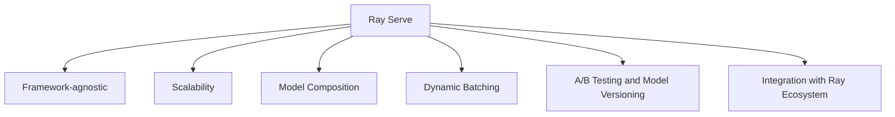
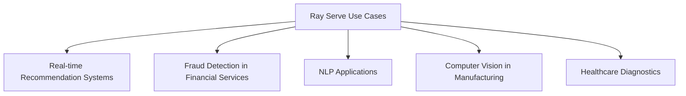
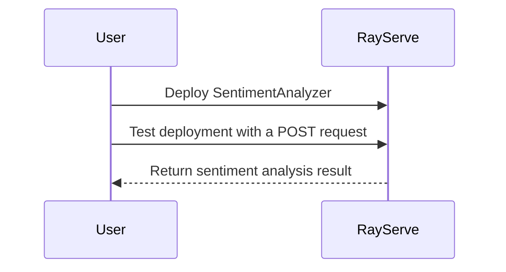
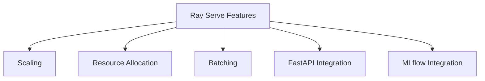

# Scaling Python Applications with Ray Serve

Efficiently Serve Your Machine Learning Models at Scale


## Introduction

### Overview

Welcome to the world of [Ray Serve](https://docs.ray.io/en/latest/serve/index.html)! Ray Serve is a dynamic, scalable model serving library built on top of [Ray](https://ray.io/). It's designed to streamline the deployment and scaling of machine learning models and Python applications. In our AI-driven era, being able to serve models efficiently at scale is essential for businesses aiming to maximize their machine learning investments.

Ray Serve integrates smoothly with your existing machine learning workflows, making it simple to deploy and scale models. Its user-friendly interface and thorough documentation make it accessible for both data scientists and engineers to manage and scale their model-serving processes effectively.

To get you started, here are some useful links:

- **[Ray Serve GitHub Repository](https://github.com/ray-project/ray/tree/master/python/ray/serve)**: Dive into the source code, contribute, and stay updated with the latest developments.
- **[Ray Serve Documentation](https://docs.ray.io/en/latest/serve/index.html)**: Detailed guides and tutorials to help you understand and implement Ray Serve.
- **[Getting Started with Ray Serve](https://docs.ray.io/en/latest/serve/getting_started.html)**: A beginner-friendly guide to kickstart your journey with Ray Serve.
- **[Ray Serve Examples](https://docs.ray.io/en/latest/serve/examples.html)**: Practical examples to see how Ray Serve can be used in various applications.
- **[Ray Community](https://discuss.ray.io/)**: Join the community to ask questions, share your projects, and collaborate with other Ray Serve users.
- **[Ray Serve Blog](https://www.anyscale.com/blog)**: Stay updated with the latest news, insights, and tutorials from the Ray Serve team.

### Learning Objectives

By the end of this tutorial, you will:
1. Understand the core concepts and benefits of Ray Serve.
2. Learn how to install and set up Ray Serve.
3. Gain practical experience in deploying and scaling machine learning models using Ray Serve.
4. Explore advanced features like model composition and batching.
5. Learn how to integrate Ray Serve into existing ML workflows and business processes.

## Why Ray Serve Matters

### Descriptive Overview

Alright, let's dive into why Ray Serve is such a valuable tool in the realm of machine learning model deployment. Think of Ray Serve as your powerful assistant that takes the hassle out of deploying machine learning models and Python code at scale. With Ray Serve, you can focus on writing your inference logic, while it seamlessly handles scaling, load balancing, and fault tolerance. Here’s a visual breakdown of its key features:



Let's explore these features in more detail:

1. **Framework-agnostic**:
    - **What this means**: Ray Serve works with any Python-based machine learning framework. Whether you're using PyTorch, TensorFlow, or scikit-learn, Ray Serve has you covered.
    - **Why it's great**: This flexibility means you’re not locked into one specific framework, allowing you to choose the best tool for your project and easily deploy your models.

2. **Scalability**:
    - **What this means**: Ray Serve can scale from running on a single machine to operating across large clusters.
    - **Why it's great**: It ensures that your models can handle varying loads efficiently, providing robust performance whether you’re dealing with a handful of requests or millions.

3. **Model Composition**:
    - **What this means**: You can build complex serving pipelines by combining multiple models and incorporating business logic.
    - **Why it's great**: This allows you to create sophisticated machine learning applications that can process inputs through a series of models and logic steps, making your deployments more powerful and flexible.

4. **Dynamic Batching**:
    - **What this means**: Ray Serve automatically batches incoming requests to optimize performance.
    - **Why it's great**: By batching requests, it uses resources more efficiently and enhances throughput, making your application faster and more responsive.

5. **A/B Testing and Model Versioning**:
    - **What this means**: It supports managing multiple model versions and conducting A/B tests.
    - **Why it's great**: This feature allows you to test different models or model versions against each other, making it easier to implement updates and ensure continuous improvement without disrupting service.

6. **Integration with Ray Ecosystem**:
    - **What this means**: Ray Serve integrates seamlessly with other Ray libraries.
    - **Why it's great**: This provides comprehensive support for end-to-end machine learning workflows, from data processing to training to deployment, all within a unified ecosystem.

By leveraging these features, Ray Serve simplifies and enhances the process of deploying machine learning models, enabling you to build scalable, efficient, and flexible AI-driven applications. Ready to see how it all works? Let’s move on to the next section!

### Business Use Cases

Alright, let's explore some practical scenarios where Ray Serve can be a game-changer for different industries. Imagine the diverse applications and the power of Ray Serve bringing efficiency and scalability to each one:



1. **Real-time Recommendation Systems**:
    - **Example**: Picture an e-commerce company looking to enhance its customer experience by providing personalized product recommendations. 
    - **How Ray Serve Helps**: Deploy and scale recommendation models that analyze user behavior and preferences in real-time, boosting sales and customer satisfaction. Imagine how each customer receives tailored suggestions that meet their unique needs.

2. **Fraud Detection in Financial Services**:
    - **Example**: Think about banks and fintech companies needing to monitor transactions for fraudulent activity continuously.
    - **How Ray Serve Helps**: Deploy complex fraud detection models that can analyze transactions in real-time, assess risk, and flag suspicious activities instantly, protecting both the institution and its customers from potential fraud.

3. **Natural Language Processing (NLP) Applications**:
    - **Example**: Consider media companies needing advanced language models for various tasks such as content analysis, sentiment analysis, or even automated content generation.
    - **How Ray Serve Helps**: Scale NLP models to handle large volumes of text data efficiently, providing timely and accurate insights or generating content that aligns with audience sentiment and preferences.

4. **Computer Vision in Manufacturing**:
    - **Example**: Imagine a manufacturing company aiming to ensure the highest quality standards on its production lines by identifying defects.
    - **How Ray Serve Helps**: Deploy image recognition models that can scan products in real-time, detecting defects or quality issues instantly. This ensures that only the best products reach the market, reducing waste and improving customer satisfaction.

5. **Healthcare Diagnostics**:
    - **Example**: Envision healthcare providers needing to analyze medical images for disease diagnosis and treatment planning.
    - **How Ray Serve Helps**: Deploy medical imaging models that can assist doctors by providing quick, accurate analyses of medical images, aiding in early diagnosis and effective treatment planning, ultimately improving patient outcomes.

By implementing Ray Serve in these scenarios, businesses can achieve real-time, scalable, and efficient model deployment that enhances their operations, improves customer experiences, and drives better decision-making processes. Ready to dive deeper into how Ray Serve can revolutionize your business? Let’s move on to setting it up and seeing it in action!

## Getting Started with Ray Serve

### Installation and Setup

Let's walk through the steps to get Ray Serve up and running. Follow along, and you'll have everything set up in no time!


1. **Install Ray and Ray Serve**:
    - **Explanation**: The first step is to install Ray and its Serve library using pip. This will ensure you have all the necessary components.
    - **Command**:
    ```bash
    pip install "ray[serve]"
    ```

2. **Verify the installation**:
    - **Explanation**: After installation, it's important to verify that both Ray and Ray Serve are installed correctly by checking their versions.
    - **Python Code**:
    ```python
    import ray
    from ray import serve
    print(ray.__version__)
    print(serve.__version__)
    ```

### Initial Configuration

Now, let's get Ray and Ray Serve up and running with some basic configuration.

1. **Start Ray**:
    - **Explanation**: First, we need to initialize Ray. This sets up the Ray runtime and prepares it for executing tasks.
    - **Python Code**:
    ```python
    import ray
    ray.init()
    ```

2. **Start Ray Serve**:
    - **Explanation**: Next, we initialize Ray Serve, which will allow us to deploy and manage our machine learning models and Python code as scalable microservices.
    - **Python Code**:
    ```python
    from ray import serve
    serve.start()
    ```

By following these steps, you've installed Ray Serve and set up the initial configuration. You're now ready to deploy your models and applications with ease. Let's dive deeper into practical examples and see Ray Serve in action!

## Practical Examples

### Example 1: Basic Model Deployment

Let's dive into deploying a simple sentiment analysis model using Ray Serve. We'll walk through the entire process step-by-step.



1. **Initialize Ray and Ray Serve**:
    - **Explanation**: We'll start by initializing Ray and Ray Serve to set up our environment.
    - **Python Code**:
    ```python
    import ray
    from ray import serve
    from transformers import pipeline

    # Initialize Ray
    ray.init()

    # Start Ray Serve
    serve.start()
    ```

2. **Create and deploy the SentimentAnalyzer class**:
    - **Explanation**: Next, we define our SentimentAnalyzer class, which loads a sentiment analysis model using the `transformers` library. We then deploy this class with Ray Serve.
    - **Python Code**:
    ```python
    @serve.deployment
    class SentimentAnalyzer:
        def __init__(self):
            # Load the sentiment analysis model
            self.model = pipeline("sentiment-analysis")
        
        async def __call__(self, request):
            # Get the text from the request
            text = await request.json()
            # Analyze the sentiment of the text
            result = self.model(text)[0]
            return {"sentiment": result["label"], "score": result["score"]}

    # Deploy the SentimentAnalyzer
    SentimentAnalyzer.deploy()
    ```

3. **Test the deployment**:
    - **Explanation**: Finally, we'll send a test request to our deployed SentimentAnalyzer to see if it works correctly.
    - **Python Code**:
    ```python
    import requests

    # Send a POST request to the deployed SentimentAnalyzer
    response = requests.post("http://localhost:8000/SentimentAnalyzer", 
                             json="I love using Ray Serve!")
    # Print the response
    print(response.json())
    ```

**Explanation Recap**:
- **Initialization**: We initialize Ray and start Ray Serve to prepare our environment for model deployment.
- **Deployment**: We create a `SentimentAnalyzer` class that uses a pre-trained sentiment analysis model. We then deploy this class using Ray Serve.
- **Testing**: We test our deployment by sending a POST request with some text and printing the sentiment analysis result.

And there you have it! You've successfully deployed a sentiment analysis model using Ray Serve and tested it to ensure it works. This process can be adapted to deploy other types of models and services, providing a powerful and scalable solution for serving machine learning models.

### Example 2: Model Composition

Now, let's create a more complex application that combines multiple models. We’ll build a system where we first translate a text and then summarize the translated text. 

1. **Define and deploy the Translator and Summarizer classes**:
    - **Explanation**: We’ll start by creating two classes, `Translator` and `Summarizer`. Each class will handle a specific task: translating text from English to French and summarizing text, respectively.
    - **Python Code**:
    ```python
    @serve.deployment
    class Translator:
        def __init__(self):
            # Load the translation model
            self.model = pipeline("translation_en_to_fr", model="t5-small")
        
        def translate(self, text):
            # Translate the text from English to French
            return self.model(text)[0]["translation_text"]

    @serve.deployment
    class Summarizer:
        def __init__(self):
            # Load the summarization model
            self.model = pipeline("summarization", model="t5-small")
        
        def summarize(self, text):
            # Summarize the text
            return self.model(text)[0]["summary_text"]
    ```

2. **Define the TextProcessor class that combines both models**:
    - **Explanation**: Next, we’ll create the `TextProcessor` class that uses both `Translator` and `Summarizer` to first summarize the text and then translate the summary.
    - **Python Code**:
    ```python
    @serve.deployment
    class TextProcessor:
        def __init__(self, translator, summarizer):
            # Initialize the Translator and Summarizer deployments
            self.translator = translator
            self.summarizer = summarizer
        
        async def __call__(self, request):
            # Get the text from the request
            text = await request.json()
            # Summarize the text using Summarizer
            summary = await self.summarizer.summarize.remote(text)
            # Translate the summary using Translator
            translation = await self.translator.translate.remote(summary)
            return {"summary": summary, "translation": translation}

    # Bind the Translator and Summarizer deployments to the TextProcessor
    translator = Translator.bind()
    summarizer = Summarizer.bind()
    text_processor = TextProcessor.bind(translator, summarizer)

    # Run the TextProcessor deployment
    serve.run(text_processor)
    ```

3. **Test the TextProcessor deployment**:
    - **Explanation**: Finally, we test our `TextProcessor` deployment by sending a POST request and printing the results.
    - **Python Code**:
    ```python
    import requests

    # Send a POST request to the deployed TextProcessor
    response = requests.post("http://localhost:8000/TextProcessor", 
                             json="Ray Serve is a scalable model serving library...")
    # Print the response
    print(response.json())
    ```

**Explanation Recap**:
- **Model Deployment**: We defined two separate deployments for translation and summarization models. The `Translator` class translates text from English to French, while the `Summarizer` class summarizes the text.
- **Model Composition**: The `TextProcessor` class combines these two models, summarizing the input text first and then translating the summary.
- **Testing**: We send a test request to the combined deployment and print the results to see the summarized and translated text.

By following these steps, you've learned how to deploy individual models and compose them into a more complex pipeline using Ray Serve. This approach allows you to build scalable and efficient model serving solutions that can handle intricate workflows.


## In-Depth Guide

### Detailed Features

Let's delve into the powerful features that make Ray Serve an exceptional tool for scalable model serving.



1. **Scaling**: Ray Serve allows you to easily scale your deployments by specifying the number of replicas. This ensures that your application can handle increased loads efficiently and remain reliable.

    ```python
    from ray import serve

    @serve.deployment(num_replicas=5)  # Deploy 5 replicas of this class
    class MyModel:
        def __call__(self, request):
            return "Hello, World!"

    # Deploy the MyModel class with specified number of replicas
    MyModel.deploy()
    ```

    **Explanation**:
    - `num_replicas=5`: This argument specifies that five replicas of `MyModel` should be deployed. This helps distribute the load across multiple instances, improving reliability and handling increased traffic.

2. **Resource Allocation**: You can specify CPU and GPU requirements for your deployments to ensure optimal resource utilization and performance for various machine learning workloads.

    ```python
    from ray import serve

    @serve.deployment(ray_actor_options={"num_cpus": 2, "num_gpus": 1})  # Allocate 2 CPUs and 1 GPU
    class GPUModel:
        def __call__(self, request):
            return "Running on GPU!"

    # Deploy the GPUModel class with specified resource allocation
    GPUModel.deploy()
    ```

    **Explanation**:
    - `ray_actor_options={"num_cpus": 2, "num_gpus": 1}`: This argument specifies that each instance of `GPUModel` should use two CPUs and one GPU. This ensures that the deployment has the necessary resources for performance-intensive tasks.

3. **Batching**: Ray Serve supports automatic batching of requests to enhance performance, enabling higher throughput and more efficient processing.

    ```python
    from ray import serve

    @serve.deployment
    class BatchedModel:
        @serve.batch(max_batch_size=32)  # Batch up to 32 requests at a time
        async def __call__(self, requests):
            # Process each request in the batch
            responses = [request.json() for request in requests]
            return responses

    # Deploy the BatchedModel class with batching support
    BatchedModel.deploy()
    ```

    **Explanation**:
    - `@serve.batch(max_batch_size=32)`: This decorator indicates that up to 32 requests can be batched together. This improves throughput by processing multiple requests simultaneously.

### Integration Tips

1. **FastAPI Integration**: Ray Serve integrates seamlessly with FastAPI for more complex HTTP handling, allowing for sophisticated API endpoints and enhanced request processing.

    ```python
    from fastapi import FastAPI
    from ray import serve

    # Create a FastAPI application
    app = FastAPI()

    @serve.deployment
    @serve.ingress(app)  # Integrate Ray Serve with FastAPI
    class MyFastAPIDeployment:
        @app.get("/")  # Define a GET endpoint
        def root(self):
            return {"message": "Hello from FastAPI + Ray Serve!"}

    # Deploy the FastAPI application using Ray Serve
    MyFastAPIDeployment.deploy()
    ```

    **Explanation**:
    - `@serve.ingress(app)`: This decorator integrates the Ray Serve deployment with the FastAPI application, allowing for more complex HTTP request handling.
    - `@app.get("/")`: Defines a GET endpoint in the FastAPI application that returns a welcome message.

2. **MLflow Integration**: Easily load models from MLflow into Ray Serve, facilitating the deployment of models trained and managed within the MLflow framework.

    ```python
    import mlflow
    from ray import serve

    @serve.deployment
    class MLflowModel:
        def __init__(self):
            # Load the model from the MLflow model registry
            self.model = mlflow.pyfunc.load_model("models:/my_model/Production")
        
        async def __call__(self, request):
            # Get the input data from the request
            data = await request.json()
            # Use the loaded model to make a prediction
            prediction = self.model.predict(data)
            return prediction

    # Deploy the MLflowModel class with Ray Serve
    MLflowModel.deploy()
    ```

    **Explanation**:
    - `mlflow.pyfunc.load_model("models:/my_model/Production")`: Loads a model from the MLflow model registry.
    - `async def __call__(self, request)`: Handles incoming requests asynchronously.
    - `await request.json()`: Extracts the JSON data from the request.
    - `self.model.predict(data)`: Uses the loaded model to make predictions based on the input data.

## Actionable Takeaways

1. **Start with simple deployments** and gradually add complexity.
2. **Leverage model composition** for building complex ML pipelines.
3. **Use batching and resource allocation** for optimizing performance.
4. **Integrate with FastAPI** for more control over HTTP handling.
5. **Utilize Ray Serve's scaling capabilities** to handle varying loads.

With these features and tips, you can efficiently manage and scale your machine learning models using Ray Serve, ensuring robust performance and seamless integration into your existing workflows.

## Challenge: Scalable Model Serving with Ray Serve

Alright, let’s dive into a hands-on challenge to put your new skills with Ray Serve to the test. The goal here is to identify a real-world problem where scalable model serving can make a significant impact. Using Ray Serve, you'll create a solution that deploys, scales, and manages machine learning models or Python applications efficiently.

### Task Description

Your mission is to identify a real-world problem in your business or personal projects where scalable model serving can add significant value. With Ray Serve, you’ll develop a solution that effectively deploys, scales, and manages these models.

### Potential Areas

Here are some areas where you can apply Ray Serve:

1. **Customer Sentiment Analysis**: Build a scalable sentiment analysis service for real-time customer feedback. Imagine a system that can analyze thousands of customer reviews in real time to provide valuable insights into customer satisfaction.
   
2. **Real-time Fraud Detection**: Monitor transactions in real-time to flag suspicious activities. This could be particularly valuable for financial institutions that need to detect and respond to fraud instantly.
   
3. **Personalized Recommendations**: Deliver personalized content or product suggestions based on user behavior. E-commerce platforms can use this to enhance customer experience and increase sales.
   
4. **Automated Translation Service**: Handle multiple languages and high volumes of translation requests. This is ideal for businesses that operate globally and need to communicate across language barriers.
   
5. **Healthcare Diagnostics**: Process patient data for diagnostic suggestions, assisting healthcare providers in making informed decisions.

### Steps

Here's a step-by-step guide to help you tackle this challenge:

1. **Identify the Problem**: Choose a relevant challenge that you or your organization faces. It should be a problem where scalable model serving can make a significant difference.
   
2. **Select a Dataset and Models**: Gather the relevant datasets and pre-trained models that you'll need for your solution.
   
3. **Set Up Ray Serve**: Install and configure Ray Serve on your system. Ensure everything is set up correctly before moving on.
   
4. **Deploy Models**: Use Ray Serve to deploy your models or applications. Start simple and gradually increase complexity.
   
5. **Scale the Deployment**: Optimize resource usage and performance based on demand. Use Ray Serve’s scaling features to handle varying loads efficiently.
   
6. **Integrate and Monitor**: Integrate your solution with existing systems and set up monitoring to ensure it runs smoothly and can handle real-world demands.

### Example Projects

Here are some example projects to get you started:

- **Customer Sentiment Analysis Service**: Develop a service that analyzes customer feedback in real-time, providing valuable insights for decision-makers.
- **Real-time Fraud Detection System**: Create a system that monitors transactions in real-time, flagging any suspicious activities for further investigation.
- **Personalized Recommendation Engine**: Build an engine that offers personalized content or product suggestions based on user behavior.
- **Automated Translation Service**: Set up a service that handles multiple languages and manages high volumes of translation requests efficiently.
- **Healthcare Diagnostic Tool**: Create a tool that processes patient data and provides diagnostic suggestions to healthcare providers.

### Tips

To ensure success, keep these tips in mind:

- **Use Comprehensive Data**: Leverage multiple data sources to create a robust and reliable solution.
- **Optimize Deployment**: Experiment with scaling and batching configurations to find the most efficient setup.
- **Iterate and Improve**: Continuously refine your solution based on feedback and performance metrics.
- **Engage with the Community**: Share your progress and seek advice from the Ray Serve community. They can provide valuable insights and help troubleshoot any issues you encounter.

### Expected Outcome

By the end of this challenge, you should have a functional and scalable solution tailored to a specific problem. This project will demonstrate Ray Serve’s potential to manage and scale deployments effectively, providing tangible benefits to your business or project.

### Conclusion

This challenge is designed to help you apply Ray Serve in a practical and impactful way. By addressing a real-world problem that matters to you, you'll gain hands-on experience with advanced model serving techniques and create a solution that delivers significant benefits.

### Continue Learning

1. **Explore the [Ray Serve documentation](https://docs.ray.io/en/latest/serve/index.html)** for in-depth guides and tutorials.
2. **Join the [Ray community](https://ray-distributed.slack.com/)** to stay updated on the latest developments and engage with other users.
3. **Experiment with different models and tasks** to discover new applications for your business. Continuous experimentation and adaptation are key to leveraging Ray Serve’s full potential.

### Additional Resources

1. [Ray Serve Documentation](https://docs.ray.io/en/latest/serve/index.html)
2. [Ray Homepage](https://www.ray.io)
3. [Ray Serve Getting Started](https://docs.ray.io/en/latest/serve/getting_started.html)
4. [YouTube Tutorial on Ray Serve](https://www.youtube.com/watch?v=QUYucglQzBw)
5. [LangChain Ray Serve Integration](https://python.langchain.com/v0.2/docs/integrations/providers/ray_serve/)
6. [Anyscale Academy Tutorial](https://github.com/anyscale/academy/blob/main/ray-serve/e2e/tutorial.ipynb)
7. [Ray Serve Examples](https://docs.ray.io/en/latest/serve/examples.html)
8. [Ray Actions Workflow](https://github.com/ray-project/ray/actions/runs/5593728090/workflow)
9. [Ray Data Tutorials](https://ray-project.github.io/q4-2021-docs-hackathon/0.2/ray-ml/ray-data/tutorials/)
10. [Ray Overview Use Cases](https://docs.ray.io/en/latest/ray-overview/use-cases.html)
11. [Anyscale Blog on Ray Serve and FastAPI](https://www.anyscale.com/blog/ray-serve-fastapi-the-best-of-both-worlds)
12. [YouTube Video on Ray Serve](https://www.youtube.com/watch?v=TdjJpAHLuxQ)
13. [Production Best Practices for Ray Serve](https://discuss.ray.io/t/production-best-practices-for-ray-serve/9156)
14. [Ray Getting Started Guide](https://docs.ray.io/en/latest/ray-overview/getting-started.html)
15. [Anyscale Blog on Serving AI in Production](https://www.anyscale.com/blog/tackling-the-cost-and-complexity-of-serving-ai-in-production-ray-serve)

By following these steps and leveraging these resources, you’ll be well on your way to mastering Ray Serve and creating powerful, scalable model serving solutions.