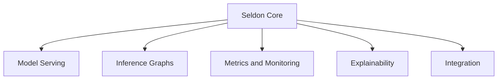
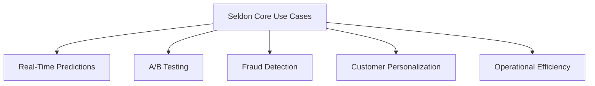
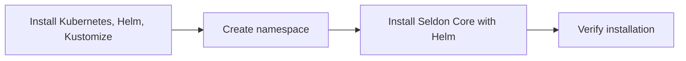
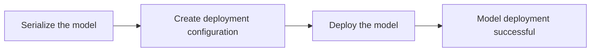
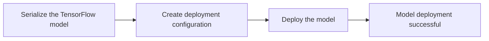
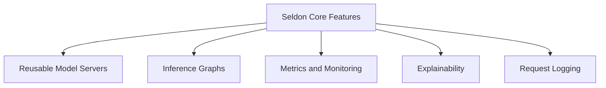

# Seldon Core: Deploy and Monitor ML Models on Kubernetes

Optimize Your Model Deployment Pipeline with Seldon Core


## Introduction

### Overview

Welcome to the world of [Seldon Core](https://www.seldon.io/tech/products/core/)! If you're looking to streamline the deployment, scaling, and monitoring of your machine learning models, you've come to the right place. Seldon Core is an open-source platform that transforms your ML models into production-ready REST/gRPC microservices on Kubernetes. This means you can manage your models efficiently, ensuring they are scalable and ready for real-world applications.

Seldon Core plays a crucial role in the AI and data landscape by simplifying the deployment process. It ensures your models are scalable and integrates seamlessly with various MLOps tools, making it highly relevant for modern business practices. Plus, its user-friendly interface and extensive documentation make it accessible for both data scientists and engineers.

For those of you new to Seldon Core, here are some helpful resources to get you started:

- **[Seldon Core GitHub Repository](https://github.com/SeldonIO/seldon-core)**: Dive into the source code, contribute, and stay updated with the latest developments.
- **[Seldon Core Documentation](https://docs.seldon.io/projects/seldon-core/en/latest/)**: Access comprehensive guides and tutorials to help you understand and implement Seldon Core.
- **[Getting Started with Seldon Core](https://docs.seldon.io/projects/seldon-core/en/latest/workflow/install.html)**: A beginner-friendly guide to kickstart your journey with Seldon Core.
- **[Seldon Core Examples](https://github.com/SeldonIO/seldon-core-examples)**: Explore practical examples to see how Seldon Core can be applied in various scenarios.
- **[Seldon Community](https://www.seldon.io/community/)**: Join the community to ask questions, share your projects, and collaborate with other Seldon Core users.
- **[Seldon Core API Reference](https://docs.seldon.io/projects/seldon-core/en/latest/reference/apis/)**: Detailed API documentation to help you make the most of Seldon Core’s features.
- **[Seldon Core Blog](https://www.seldon.io/resources/blog)**: Stay updated with the latest news, insights, and tutorials from the Seldon Core team.

### Learning Objectives

By the end of this tutorial, you will:

- Understand the core functionalities and unique features of Seldon Core.
- Learn how to install and set up Seldon Core on a Kubernetes cluster.
- Configure Seldon Core for first-time use.
- Explore practical examples of deploying machine learning models using Seldon Core.
- Gain detailed insights into Seldon Core's features and integration tips.
- Implement Seldon Core in your business environment.

Ready to get started? Let's dive into the world of Seldon Core and transform your ML deployment process!

## Why Seldon Core Matters

### Descriptive Overview

Let's explore why Seldon Core is a game-changer for deploying machine learning models. Essentially, Seldon Core turns your models into scalable microservices. This means your models are not only ready for production but also easy to manage and scale as your needs grow. Here’s a breakdown of its core functionalities:



1. **Model Serving**: Think of this as turning your models into robust services. With Seldon Core, you can deploy your machine learning models as REST/gRPC microservices. This transformation makes your models production-ready and simplifies management and scalability.

2. **Inference Graphs**: These are like flowcharts for your models. You can create complex inference graphs that integrate various components such as predictors, transformers, routers, and combiners. This allows for sophisticated and flexible model deployments.

3. **Metrics and Monitoring**: Keeping an eye on your models is crucial. Seldon Core integrates with Prometheus and Grafana to collect advanced metrics and monitor performance. This gives you insights into how well your models are performing and their operational health.

4. **Explainability**: Understanding why a model makes a certain prediction is vital, especially in fields like finance and healthcare. Seldon Core leverages tools like Alibi to provide explainability, helping you interpret and trust model predictions.

5. **Integration**: Flexibility and compatibility are key. Seldon Core integrates seamlessly with Kubernetes, Istio, Ambassador, and various machine learning frameworks like TensorFlow, PyTorch, and Scikit-learn. This makes it highly adaptable to different environments and use cases.

### Business Use Cases

Seldon Core isn’t just a technical tool; it has powerful applications across various business scenarios. Let’s look at how it can improve your operations:



1. **Real-Time Predictions**: Whether you're in finance, healthcare, or e-commerce, deploying models for real-time predictions can significantly enhance decision-making. Imagine being able to make instant, informed decisions based on live data.

2. **A/B Testing**: If you're looking to optimize marketing strategies or product features, Seldon Core allows you to implement A/B testing efficiently. This helps in making data-driven decisions to improve your offerings.

3. **Fraud Detection**: In banking and insurance, real-time fraud detection is crucial. Seldon Core enables the deployment of complex inference graphs for fraud detection, providing real-time monitoring and risk assessment to protect your business.

4. **Customer Personalization**: Personalized experiences are key to customer satisfaction. By deploying recommendation systems with Seldon Core, you can offer tailored suggestions to your customers, enhancing their engagement and loyalty.

5. **Operational Efficiency**: Keeping your models running smoothly is essential. With Seldon Core’s monitoring and optimization capabilities, you can ensure operational efficiency, reduce downtime, and maintain high service levels.

By understanding and utilizing these features and use cases, you can harness the full potential of Seldon Core to transform your machine learning operations and drive business success. Ready to see it in action? Let's dive into the installation and setup next.

## Getting Started with Seldon Core

### Installation and Setup

Let's get Seldon Core up and running. Follow these steps to install and set up Seldon Core:



1. **Prerequisites**:
   Before we start, make sure you have the following tools installed:
   - Kubernetes cluster (version >= 1.23)
   - Helm (version >= 3.0)
   - Kustomize (version >= 0.1.0)
   - Ingress controller (Istio >= 1.16 or Ambassador v1/v2)

2. **Create a Namespace**:
   We need to create a namespace for Seldon Core. Open your terminal and run:
   ```bash
   kubectl create namespace seldon-system
   ```
   This command creates a new namespace called `seldon-system` where Seldon Core components will be deployed.

3. **Install Seldon Core with Helm**:
   Next, we’ll use Helm to install Seldon Core. Run the following command:
   ```bash
   helm install seldon-core seldon-core-operator \
   --repo https://storage.googleapis.com/seldon-charts \
   --set usageMetrics.enabled=true \
   --set istio.enabled=true \
   --namespace seldon-system
   ```
   This command installs Seldon Core in the `seldon-system` namespace with usage metrics and Istio enabled.

### Initial Configuration

After installing Seldon Core, let’s configure it for first-time use:

1. **Verify Installation**:
   To ensure everything is set up correctly, check the status of the Seldon Core components by running:
   ```bash
   kubectl get pods -n seldon-system
   ```
   You should see a list of pods in the `seldon-system` namespace. Look for the `seldon-controller-manager` pod. If it’s running, your installation was successful.

2. **Set Up Ingress**:
   To handle incoming traffic, we need to set up an Istio gateway for Seldon Core. Apply the following configuration:
   ```bash
   kubectl apply -f - << END
   apiVersion: networking.istio.io/v1alpha3
   kind: Gateway
   metadata:
     name: seldon-gateway
     namespace: istio-system
   spec:
     selector:
       istio: ingressgateway
     servers:
     - port:
         number: 80
         name: http
         protocol: HTTP
       hosts:
       - "*"
   END
   ```
   Let’s break this down:
   - `kubectl apply -f -`: This command applies the configuration provided via standard input (stdin).
   - `apiVersion: networking.istio.io/v1alpha3`: Specifies the API version for Istio networking resources.
   - `kind: Gateway`: Defines a Gateway resource to manage inbound traffic.
   - `metadata`: Includes the `name` of the gateway and the `namespace` where it's deployed.
   - `spec`: The specification of the gateway:
     - `selector`: Selects the ingress gateway controller.
     - `servers`: Configures the server, specifying the port (80) and protocol (HTTP).
     - `hosts`: Specifies that the gateway should accept traffic for all hosts (`*`).

By following these steps, you'll have Seldon Core installed and configured with an ingress setup to handle incoming traffic for your deployed models. Now you’re ready to start deploying your machine learning models on Kubernetes using Seldon Core!

## Practical Examples

### Example 1: Basic Use Case

Let's walk through the steps to deploy a Scikit-learn model using Seldon Core. 



1. **Serialize the Model**:
   First, we'll train a model and save it to a file.

   ```python
   # Import necessary libraries
   from sklearn import datasets
   from sklearn.ensemble import RandomForestClassifier
   import joblib

   # Load the Iris dataset
   iris = datasets.load_iris()
   X, y = iris.data, iris.target

   # Initialize and train the RandomForestClassifier
   clf = RandomForestClassifier()
   clf.fit(X, y)

   # Save the trained model to a file named 'model.joblib'
   joblib.dump(clf, 'model.joblib')
   ```

   **Explanation**:
   - `from sklearn import datasets`: Import the dataset module from Scikit-learn.
   - `from sklearn.ensemble import RandomForestClassifier`: Import the RandomForestClassifier.
   - `iris = datasets.load_iris()`: Load the Iris dataset.
   - `clf.fit(X, y)`: Train the classifier with the dataset.
   - `joblib.dump(clf, 'model.joblib')`: Save the trained model to a file.

2. **Create Deployment Configuration**:
   Next, create a YAML configuration file to define the deployment of the serialized model. Save the following YAML configuration as `sklearn-deployment.yaml`:

   ```yaml
   apiVersion: machinelearning.seldon.io/v1  # API version for SeldonDeployment
   kind: SeldonDeployment                    # Type of Kubernetes resource
   metadata:
     name: sklearn-deployment                # Name of the SeldonDeployment
   spec:
     predictors:
     - graph:
         children: []                        # No child nodes
         implementation: SKLEARN_SERVER      # Use the SKLEARN_SERVER implementation
         modelUri: gs://your-bucket/model.joblib  # URI where the model is stored
         name: classifier                    # Name of the model
       name: default                         # Default predictor
       replicas: 1                           # Number of replicas
   ```

   **Explanation**:
   - `apiVersion: machinelearning.seldon.io/v1`: Specifies the API version.
   - `kind: SeldonDeployment`: Defines the type of resource.
   - `metadata`: Contains metadata such as the name of the deployment.
   - `spec`: Specifies the deployment configuration.
     - `predictors`: Defines the model predictors.
     - `graph`: Describes the model graph.
     - `implementation: SKLEARN_SERVER`: Specifies that we are using a Scikit-learn model server.
     - `modelUri`: The URI where the model is stored. Replace `gs://your-bucket/model.joblib` with your actual model URI.
     - `name: classifier`: The name of the model.
     - `replicas: 1`: Specifies the number of replicas.

3. **Deploy the Model**:
   Finally, apply the YAML configuration to deploy the model to the Kubernetes cluster.

   ```bash
   kubectl apply -f sklearn-deployment.yaml
   ```

   **Explanation**:
   - `kubectl apply -f sklearn-deployment.yaml`: This command applies the configuration file to deploy the model on Kubernetes.

By following these steps, you'll have successfully deployed a Scikit-learn model using Seldon Core, transforming your machine learning model into a production-ready microservice.

### Example 2: Advanced Application

In this example, we will deploy a TensorFlow model with custom preprocessing using Seldon Core. This will allow you to handle more complex deployment scenarios involving pre-trained models and custom data processing.



1. **Serialize the Model**:
   First, we will train a TensorFlow model and save it to a directory.

   ```python
   import tensorflow as tf

   # Define a simple Sequential model
   model = tf.keras.models.Sequential([
       tf.keras.layers.Dense(128, activation='relu'),  # Hidden layer with 128 units
       tf.keras.layers.Dense(10, activation='softmax')  # Output layer with 10 units
   ])

   # Compile the model with an optimizer and loss function
   model.compile(optimizer='adam', loss='sparse_categorical_crossentropy', metrics=['accuracy'])

   # Save the model to a directory named 'model'
   model.save('model')
   ```

   **Explanation**:
   - `tf.keras.models.Sequential`: Defines a Sequential model in TensorFlow.
   - `tf.keras.layers.Dense`: Adds layers to the model. The first layer has 128 units with ReLU activation, and the output layer has 10 units with softmax activation.
   - `model.compile`: Compiles the model with Adam optimizer and sparse categorical cross-entropy loss.
   - `model.save('model')`: Saves the model to a directory named 'model'.

2. **Create Deployment Configuration**:
   Next, create a YAML configuration file to define the deployment of the serialized TensorFlow model. Save the following YAML configuration as `tensorflow-deployment.yaml`:

   ```yaml
   apiVersion: machinelearning.seldon.io/v1  # API version for SeldonDeployment
   kind: SeldonDeployment                    # Type of Kubernetes resource
   metadata:
     name: tensorflow-deployment             # Name of the SeldonDeployment
   spec:
     predictors:
     - graph:
         children: []                        # No child nodes
         implementation: TENSORFLOW_SERVER   # Use the TENSORFLOW_SERVER implementation
         modelUri: gs://your-bucket/model    # URI where the model is stored
         name: classifier                    # Name of the model
       name: default                         # Default predictor
       replicas: 1                           # Number of replicas
   ```

   **Explanation**:
   - `apiVersion: machinelearning.seldon.io/v1`: Specifies the API version for SeldonDeployment.
   - `kind: SeldonDeployment`: Defines the resource type as SeldonDeployment.
   - `metadata`: Contains metadata like the name of the deployment.
   - `spec`: Specifies the deployment details.
     - `predictors`: Defines the model predictors.
     - `graph`: Describes the model graph.
     - `implementation: TENSORFLOW_SERVER`: Specifies the use of TensorFlow server for model deployment.
     - `modelUri: gs://your-bucket/model`: The URI where the TensorFlow model is stored. Replace `gs://your-bucket/model` with your actual model URI.
     - `name: classifier`: The name of the model.
     - `replicas: 1`: Number of replicas to deploy.

3. **Deploy the Model**:
   Finally, apply the YAML configuration to deploy the TensorFlow model to the Kubernetes cluster.

   ```bash
   kubectl apply -f tensorflow-deployment.yaml
   ```

   **Explanation**:
   - `kubectl apply -f tensorflow-deployment.yaml`: This command applies the configuration file to deploy the TensorFlow model on Kubernetes.

By following these steps, you will have successfully deployed a TensorFlow model using Seldon Core, making it accessible as a scalable microservice within your Kubernetes environment.

## In-Depth Guide

### Detailed Features

Let's dive into the key features that make Seldon Core an essential tool for deploying and managing machine learning models on Kubernetes.



1. **Reusable Model Servers**:
   Imagine building a model server once and being able to deploy it multiple times without additional configuration. This is exactly what Seldon Core allows you to do. By creating reusable model servers, you ensure consistency across deployments and significantly reduce the time needed for future deployments.

2. **Inference Graphs**:
   Seldon Core lets you create complex workflows by integrating multiple models and components into inference graphs. This means you can orchestrate advanced model processing pipelines, where different models can work together in a coordinated manner. For example, you could preprocess data with one model, pass it through a series of transformers, and finally get predictions from another model.

3. **Metrics and Monitoring**:
   Keeping track of your deployed models is crucial for maintaining performance and reliability. Seldon Core integrates seamlessly with Prometheus and Grafana, providing you with detailed metrics and visualizations. This helps you monitor the health and performance of your models, detect issues early, and make data-driven decisions to improve them.

4. **Explainability**:
   Understanding why a model makes certain predictions is vital for trust and transparency. Seldon Core uses Alibi for model explainability, offering insights into model behavior. This feature is particularly important in regulated industries like finance and healthcare, where decisions need to be interpretable and justifiable.

5. **Request Logging**:
   To analyze and understand how your models are being used, Seldon Core provides request logging with Elasticsearch. This allows you to track every request made to your models, analyze patterns, and optimize performance. Detailed logging helps in debugging, auditing, and improving the overall user experience.

### Integration Tips

1. **Kubernetes**:
   Ensure your Kubernetes cluster is compatible with Seldon Core to fully leverage its cloud-native capabilities. Kubernetes provides the scalable and robust infrastructure needed for deploying and managing your ML models efficiently.

2. **Istio/Ambassador**:
   Choose the right ingress controller, such as Istio or Ambassador, to manage and secure traffic to your deployed models. This helps in load balancing, routing, and securing API endpoints, ensuring reliable and secure access to your models.

3. **ML Frameworks**:
   Take advantage of Seldon Core’s pre-packaged servers for popular ML frameworks like TensorFlow, Scikit-learn, and XGBoost. This simplifies the deployment process and ensures that your models integrate smoothly with the deployment environment.

4. **CI/CD Pipelines**:
   Integrate Seldon Core with your CI/CD pipelines using tools like Jenkins or GitLab CI. This automation ensures that your models are continuously deployed and updated, streamlining the workflow and maintaining consistency across different stages of the ML lifecycle.

## Actionable Takeaways

### Key Points

- **Simplified Deployment**: Seldon Core transforms ML models into scalable microservices, making deployment straightforward and efficient.
- **Advanced Features**: Supports complex inference graphs and integrates with popular MLOps tools for comprehensive model management.
- **Robust Monitoring**: Provides detailed metrics, explainability, and logging features to maintain and optimize model performance.

### Implementation Steps

1. **Set Up a Kubernetes Cluster**:
   Ensure you have a Kubernetes cluster ready, as this is the foundation for deploying Seldon Core.

2. **Install Seldon Core Using Helm**:
   Use Helm to install Seldon Core on your Kubernetes cluster, following the installation guide to ensure all components are correctly set up.

3. **Deploy and Monitor Your Machine Learning Models**:
   Deploy your models as microservices using Seldon Core and set up monitoring to keep track of their performance and health.

4. **Integrate with CI/CD Pipelines**:
   Automate the deployment and management of your models by integrating Seldon Core with your CI/CD pipelines, ensuring continuous delivery and integration.

By following these steps, you can effectively deploy, manage, and scale your machine learning models with Seldon Core, enhancing your MLOps capabilities and driving business value through efficient model deployment and monitoring.

## Challenge: Scalable Model Serving and Monitoring with Seldon Core

### Task Description

Let's dive into an exciting challenge where we identify a meaningful problem in your business or personal projects that can benefit from scalable model serving and monitoring. Your task is to use Seldon Core to create a solution that effectively deploys, scales, and monitors machine learning models on Kubernetes.

### Potential Areas

Think about the following areas where Seldon Core can make a significant impact:

- **Real-Time Predictions**: Imagine deploying models that provide real-time predictions for tasks such as stock price forecasting, customer behavior analysis, or predictive maintenance.
- **Fraud Detection**: Monitor transactions in real-time to identify and flag suspicious activities, enhancing security and reducing fraud.
- **A/B Testing for Marketing**: Evaluate different marketing strategies and product features through A/B testing, helping optimize decision-making.
- **Personalized Recommendations**: Deliver personalized content or product suggestions based on user behavior, increasing user engagement and satisfaction.
- **Healthcare Diagnostics**: Process patient data to provide diagnostic suggestions that assist healthcare providers in making informed decisions.

### Steps

Here are the steps to tackle this challenge:

1. **Identify the Problem**: Choose a relevant challenge that will benefit from scalable model serving.
2. **Select a Dataset and Models**: Gather the necessary datasets and pre-trained models for your project.
3. **Set Up Kubernetes and Seldon Core**: Install and configure Kubernetes and Seldon Core to create a robust environment for deploying your models.
4. **Deploy Models**: Use Seldon Core to deploy your machine learning models efficiently.
5. **Implement Monitoring and Explainability**: Integrate tools like Prometheus, Grafana, and Alibi for monitoring model performance and providing explainability.
6. **Scale the Deployment**: Optimize resource usage and performance by scaling your deployment based on demand.
7. **Integrate and Monitor**: Ensure your deployment integrates with existing systems and set up comprehensive monitoring to track performance and health.

### Example Projects

Here are some example projects to inspire you:

- **Real-Time Predictions System**: Develop a system that analyzes data in real-time to make valuable predictions for your business.
- **Fraud Detection System**: Create a solution that monitors transactions and flags suspicious activities to enhance security.
- **A/B Testing Platform**: Build a platform that supports scalable A/B testing to evaluate different strategies and optimizations.
- **Personalized Recommendation Engine**: Develop an engine that provides personalized content or product suggestions based on user behavior.
- **Healthcare Diagnostic Tool**: Create a tool that processes patient data in real-time to provide diagnostic suggestions and assist healthcare providers.

### Tips

- **Use Comprehensive Data**: Leverage multiple data sources to build a robust and reliable solution.
- **Optimize Deployment**: Experiment with different scaling configurations and monitoring tools to find the best setup.
- **Iterate and Improve**: Continuously refine your solution based on feedback and performance metrics.
- **Engage with the Community**: Share your progress and seek advice from the Seldon Core community to learn from others and improve your solution.

### Expected Outcome

By completing this challenge, you will create a functional and scalable solution tailored to a specific problem. This will demonstrate Seldon Core's potential to manage and scale deployments effectively, providing significant value to your business or project.

### Conclusion

This challenge is designed to help you apply Seldon Core in a practical and impactful way. By tackling a real-world problem that matters to you, you will gain hands-on experience with advanced model serving and monitoring techniques. This will enable you to create a solution that delivers tangible benefits.

### Continue Learning

To further enhance your skills and knowledge, explore the following resources:

1. [Seldon Core documentation](https://docs.seldon.io/projects/seldon-core/en/latest/workflow/overview.html) for in-depth guides and tutorials.
2. Join the [Seldon community](https://seldon.io/community/) to stay updated on the latest developments and engage with other Seldon Core users.
3. Experiment with different models and tasks to discover new applications for your business.

Remember, the key to success with Seldon Core is continuous experimentation and adaptation to your specific business needs. Start small, measure impact, and scale your model serving solutions as you see tangible benefits.

### Additional Resources

1. [Seldon Core Documentation](https://docs.seldon.io/projects/seldon-core/en/latest/workflow/overview.html)
2. [Seldon Core Concepts](https://docs.seldon.io/projects/seldon-core/en/latest/reference/concepts.html)
3. [Seldon Tutorial](https://censius.ai/blogs/seldon-tutorial)
4. [Seldon Core Solutions](https://www.seldon.io/solutions/seldon-core)
5. [Seldon Core Plus Solutions](https://www.seldon.io/solutions/core-plus)
6. [Seldon Core Installation Guide](https://docs.seldon.io/projects/seldon-core/en/latest/workflow/install.html)
7. [Seldon Core Custom Install](https://github.com/SeldonIO/seldon-core-launcher/blob/master/seldon-core/custom-install.md)
8. [Seldon Core Documentation](https://docs.seldon.io/projects/seldon-core/en/latest/)
9. [KServe vs. Seldon Core](https://superwise.ai/blog/kserve-vs-seldon-core/)
10. [Seldon Core on Kind](https://docs.seldon.io/projects/seldon-core/en/latest/install/kind.html)