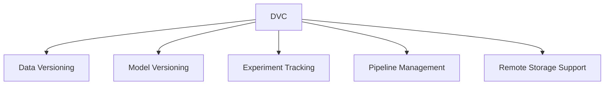
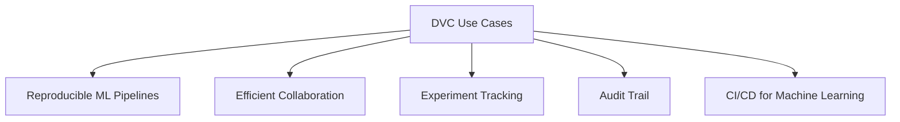
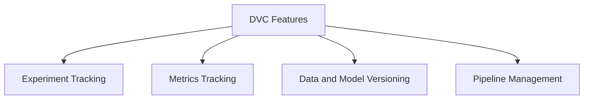

# Versioning with DVC

Track and Manage Your Machine Learning Models and Datasets


## Introduction

### Overview

Welcome to the world of [Data Version Control (DVC)](https://dvc.org/), an open-source tool designed to tackle the unique challenges of managing and versioning machine learning models and large datasets. In our data-driven business landscape, DVC has emerged as an essential tool for data scientists and machine learning engineers, enabling them to efficiently track, version, and share their work.

So, what makes DVC so crucial? It supports the entire lifecycle of machine learning projects, allowing for seamless integration with your existing workflows. With its user-friendly interface and extensive documentation, DVC ensures that professionals can efficiently manage their data and models without any hassle.

For those new to DVC, here are some helpful links to get you started:

- **[DVC GitHub Repository](https://github.com/iterative/dvc)**: Dive into the source code, contribute, and stay updated with the latest developments.
- **[DVC Documentation](https://dvc.org/doc)**: Access comprehensive guides and tutorials to help you understand and implement DVC.
- **[Getting Started with DVC](https://dvc.org/doc/start)**: A beginner-friendly guide to kickstart your journey with DVC.
- **[DVC Use Cases](https://dvc.org/doc/use-cases)**: Discover practical examples showcasing how DVC can be applied in various scenarios.
- **[DVC Community](https://dvc.org/community)**: Join the community to ask questions, share your projects, and collaborate with other DVC users.
- **[DVC API Reference](https://dvc.org/doc/api-reference)**: Detailed API documentation to help you utilize DVC’s features effectively.
- **[DVC Blog](https://dvc.org/blog)**: Stay updated with the latest news, insights, and tutorials from the DVC team.

### Learning Objectives

By the end of this tutorial, you will:
- Understand the core concepts and functionalities of DVC.
- Learn how to install and set up DVC in your project.
- Gain practical experience in versioning data and models.
- Explore advanced features for experiment tracking and pipeline management.
- Apply DVC in real-world business scenarios.

## Why DVC Matters

### Descriptive Overview

Let’s dive into why DVC is such a game-changer for managing your machine learning projects. DVC is built on top of Git, but it extends Git’s capabilities to handle the unique needs of data science, such as managing large files, datasets, and machine learning models. This allows data scientists to version their data and models alongside their code, ensuring that projects are reproducible and shareable.

Here’s a breakdown of what DVC offers:



Key features include:

1. **Data and Model Versioning**:
    - **What it is**: Just like you version your code with Git, DVC allows you to version your datasets and models.
    - **Why it matters**: This ensures that you can always reproduce your results and maintain consistency across different stages of your project.

2. **Experiment Tracking and Comparison**:
    - **What it is**: DVC keeps detailed records of various experiments, logging parameters, metrics, and artifacts.
    - **Why it matters**: This makes it easy to compare results from different experiments, facilitating optimization and continuous improvement.

3. **Pipeline Management for Reproducible Workflows**:
    - **What it is**: DVC automates and manages complex machine learning workflows.
    - **Why it matters**: This ensures that your experiments are reproducible and consistent, which is crucial for maintaining the integrity of your results.

4. **Remote Storage Support**:
    - **What it is**: DVC supports remote storage solutions like S3, Google Cloud Storage, and others.
    - **Why it matters**: This allows you to handle large datasets efficiently and collaborate seamlessly with your team, regardless of location.

5. **Integration with Popular ML Frameworks**:
    - **What it is**: DVC integrates with widely-used machine learning frameworks such as TensorFlow, PyTorch, and Scikit-learn.
    - **Why it matters**: This flexibility allows you to incorporate DVC into your existing workflows without significant changes.

### Business Use Cases

Let’s explore some practical ways DVC can enhance your business operations:



1. **Reproducible ML Pipelines**:
    - **Scenario**: You’re working on a long-term project and need to ensure that your experiments are fully reproducible.
    - **Benefit**: DVC allows you to replicate results even months later, which is critical for maintaining consistency and reliability in your work.

2. **Efficient Collaboration**:
    - **Scenario**: Your team needs to share large datasets and models without overloading Git repositories.
    - **Benefit**: DVC promotes smooth and efficient collaboration by enabling easy sharing and versioning of large files.

3. **Experiment Tracking**:
    - **Scenario**: You need to track multiple experiments and compare their results to improve your models.
    - **Benefit**: With DVC, you can easily log and compare experiments, helping you refine and enhance your machine learning models.

4. **Audit Trail**:
    - **Scenario**: Your project requires a clear history of data transformations and model iterations for regulatory compliance.
    - **Benefit**: DVC provides a transparent audit trail, ensuring accountability and compliance, which is crucial in industries like finance and healthcare.

5. **CI/CD for Machine Learning**:
    - **Scenario**: You want to integrate continuous integration and deployment pipelines for your ML models.
    - **Benefit**: DVC streamlines the process of deploying and updating models in production environments, making it easier to maintain and scale your machine learning solutions.

By leveraging these features and use cases, DVC can significantly improve the efficiency, reproducibility, and collaboration within your machine learning projects, making it a vital tool for any data-driven business.

## Getting Started with DVC

### Installation and Setup

Alright, let’s get you up and running with DVC. We’ll walk through the installation and initial setup step-by-step. Ready? Here we go!


1. **Install DVC using pip**:
    First, we need to install DVC. Open your terminal and run:
    ```bash
    pip install dvc
    ```
    This command will install DVC on your system, making it ready for use in your projects.

2. **Initialize DVC in your Git repository**:
    Next, let’s initialize DVC in your Git repository. If you haven’t initialized a Git repository yet, you can do so with:
    ```bash
    git init
    ```
    Once your Git repository is ready, initialize DVC with:
    ```bash
    dvc init
    ```
    This sets up the necessary DVC files and directories in your repository.

3. **Commit the initial DVC files**:
    Now, we need to commit these initial DVC files to Git:
    ```bash
    git add .
    git commit -m "Initialize DVC"
    ```
    This step ensures that your DVC setup is tracked in version control, providing a solid foundation for your project.

### Initial Configuration

1. **Set up remote storage (e.g., S3)**:
    To effectively manage large datasets, let’s configure remote storage. For example, if you’re using Amazon S3, you can add a remote storage location with:
    ```bash
    dvc remote add -d myremote s3://mybucket/path
    ```
    Here, `myremote` is the name of the remote storage, and `s3://mybucket/path` is the S3 bucket path where your data will be stored.

2. **Commit the configuration**:
    Finally, let’s commit this configuration to Git:
    ```bash
    git add .dvc/config
    git commit -m "Configure remote storage"
    ```
    This ensures your remote storage settings are saved and versioned alongside your code and DVC files.

And there you have it! You’ve successfully installed and configured DVC, setting the stage for efficient data and model management in your machine learning projects. Let’s dive into more advanced features and see how DVC can enhance your workflow.

## Practical Examples

Now, let’s dive into a hands-on example to see how DVC can help you version a large dataset. Ready? Let’s get started!

### Example 1: Versioning a Dataset

We’ll walk through the steps to add a dataset to DVC, commit the changes, and then push the data to remote storage.


1. **Add the dataset to DVC**:
    First, we need to tell DVC to track our dataset. Suppose you have a large dataset file located at `data/large_dataset.csv`. Run the following command:
    ```bash
    dvc add data/large_dataset.csv
    ```
    This command tracks the specified dataset file with DVC. It creates a `.dvc` file that records the metadata about the dataset.

2. **Commit the changes**:
    Next, we need to commit these changes to our Git repository. DVC automatically updates the `.gitignore` file to exclude the dataset from being tracked by Git, while it is tracked by DVC instead. Add the necessary changes and commit them:
    ```bash
    git add data/.gitignore data/large_dataset.csv.dvc
    git commit -m "Add large dataset"
    ```
    This ensures the dataset metadata is versioned in Git, but the large dataset itself is handled by DVC.

3. **Push the data to remote storage**:
    Finally, we push the dataset to the remote storage configured earlier. This command uploads the actual data to the remote storage:
    ```bash
    dvc push
    ```
    This step ensures that the large dataset is stored remotely, freeing up local space and making it accessible for team members or future use.

And that’s it! You’ve successfully versioned a large dataset with DVC, making it easy to manage and share within your machine learning projects. This workflow ensures that your data is efficiently tracked and stored, enabling reproducibility and collaboration. Now you’re ready to take on more advanced DVC features!

### Example 2: Creating a Machine Learning Pipeline

Now, let's take it up a notch and create a simple but effective machine learning pipeline using DVC. This will help you automate and manage the various stages of your ML workflow, from data preprocessing to model training. Ready to dive in? Let's go!


1. **Create a DVC pipeline stage for data preprocessing**:
   First, we'll create a stage in our pipeline for preprocessing the raw data. Suppose you have a script `preprocess.py` that processes your raw data stored in `data/raw.csv` and outputs the processed data to `data/processed.csv`. Here’s how you set it up with DVC:
    ```bash
    dvc run -n preprocess -d data/raw.csv -o data/processed.csv \
        python preprocess.py data/raw.csv data/processed.csv
    ```
    This command creates a pipeline stage named `preprocess`. The `-d` flag specifies the dependency (the raw data), and the `-o` flag specifies the output (the processed data). The command runs your preprocessing script with the appropriate input and output files.

2. **Create a stage for model training**:
   Next, we create another stage for training our machine learning model. Suppose you have a script `train.py` that takes the processed data from the previous stage (`data/processed.csv`) and trains a model, saving it as `model.pkl`. Here’s the command:
    ```bash
    dvc run -n train -d data/processed.csv -o model.pkl \
        python train.py data/processed.csv model.pkl
    ```
    This command sets up a pipeline stage named `train`. It specifies `data/processed.csv` as the dependency and `model.pkl` as the output. It runs your training script to generate the model.

3. **Run the entire pipeline**:
   Finally, to ensure that all stages of the pipeline are executed in the correct order, we run the entire pipeline:
    ```bash
    dvc repro
    ```
    The `dvc repro` command checks the pipeline stages and dependencies, ensuring that all necessary steps are executed from data preprocessing to model training. If any dependency has changed, DVC will automatically re-run the affected stages, keeping your workflow up-to-date and reproducible.

By following these steps, you've successfully created and managed a reproducible machine learning pipeline using DVC. This setup ensures that each stage of your ML workflow is versioned and tracked, allowing you to reproduce results, manage changes, and collaborate efficiently. Now you’re equipped to handle more complex workflows with ease!

## In-Depth Guide

### Detailed Features

Let's dive deeper into the powerful features that make DVC an essential tool for managing your machine learning projects.



1. **Experiment Tracking**: DVC makes managing and comparing experiments a breeze with its `dvc exp` commands. Imagine you're testing different learning rates for your model. You can run and track these experiments effortlessly.
    ```bash
    # Run an experiment with a specific learning rate
    dvc exp run -n experiment1 python train.py --lr 0.01

    # Run another experiment with a different learning rate
    dvc exp run -n experiment2 python train.py --lr 0.001

    # Display the results of all experiments to compare metrics
    dvc exp show
    ```
    **Explanation**:
    - `dvc exp run -n experiment1 python train.py --lr 0.01`: This command runs an experiment with a learning rate of 0.01 and names it `experiment1`.
    - `dvc exp show`: Use this command to display and compare the results of your experiments.

2. **Metrics Tracking**: Tracking and comparing your model's performance metrics is crucial. DVC makes it straightforward to monitor key performance indicators across different experiments.
    ```bash
    # Add metrics to be tracked
    dvc metrics add metrics.json

    # Show the tracked metrics
    dvc metrics show
    ```
    **Explanation**:
    - `dvc metrics add metrics.json`: This command tells DVC to track the metrics stored in `metrics.json`.
    - `dvc metrics show`: Displays the tracked metrics for easy comparison.

3. **Data and Model Versioning**: Switching between different versions of your datasets or models is seamless with DVC. This ensures that you can always revert to a previous state when needed.
    ```bash
    # Check out a specific commit in Git
    git checkout <commit-hash>

    # Use DVC to switch to the corresponding version of data/models
    dvc checkout
    ```
    **Explanation**:
    - `git checkout <commit-hash>`: Switches to a specific Git commit.
    - `dvc checkout`: Syncs your data and models to match the checked-out commit, ensuring consistency.

These features ensure that DVC supports you throughout the entire lifecycle of your machine learning projects, from versioning data and models to tracking experiments and metrics. This makes your workflow reproducible, transparent, and efficient.

### Integration Tips

1. **Integrate with MLflow**: Combining DVC with MLflow can enhance your experiment tracking and model management capabilities, providing a robust framework for managing your ML workflows.
    - MLflow tracks your experiment metadata, while DVC handles the versioning of data and models.

2. **Use with Git LFS**: For handling large binary files that DVC doesn't track, use Git LFS alongside DVC. This ensures efficient management of all project files.
    - Git LFS manages large files such as images, binaries, and other large datasets.

3. **Implement in CI/CD Pipelines**: Integrate DVC into your CI/CD pipelines using tools like Jenkins or GitLab CI. This automates the deployment and management of your machine learning models, enhancing efficiency and consistency.
    - Automate testing, training, and deployment of models, ensuring continuous integration and delivery of your ML solutions.

## Actionable Takeaways

1. **Start versioning your datasets and models**: Implement DVC in your next ML project to ensure all your data and models are versioned and easily manageable.
2. **Implement a DVC pipeline**: Create a reproducible ML workflow in your organization, ensuring consistency and reliability in your experiments.
3. **Use DVC's experiment tracking features**: Manage and compare different model iterations effectively, allowing for continuous improvement and optimization.
4. **Integrate DVC with your CI/CD processes**: Enhance your ML model deployment efficiency by incorporating DVC into your existing CI/CD pipelines.
5. **Educate your team on DVC best practices**: Establish guidelines and provide training for your team to ensure everyone is on the same page regarding DVC usage in your projects. 

By integrating these actionable steps into your workflow, you'll be well on your way to mastering DVC and enhancing your machine learning projects' efficiency and reproducibility. Happy versioning!

## Challenge: Efficient Data and Model Versioning with DVC

### Task Description

Here's a hands-on challenge for you: identify a meaningful problem or project within your business or personal endeavors that can benefit from efficient data and model versioning. Using DVC, create a reproducible and scalable machine learning pipeline. This pipeline should include data ingestion, preprocessing, model training, and evaluation. Track multiple experiments with different hyperparameters and compare the results to find the optimal solution.

### Potential Areas

Let's explore some areas where DVC can make a significant impact:

- **Reproducible ML Pipelines**: Ensure your machine learning experiments are fully reproducible, maintaining consistency and reliability.
- **Efficient Collaboration**: Share and version large datasets and models without overwhelming your Git repositories, promoting seamless teamwork.
- **Experiment Tracking**: Track, compare, and revert multiple experiments effortlessly.
- **Audit Trail**: Maintain a clear history of data transformations and model iterations, crucial for regulatory compliance.
- **CI/CD for Machine Learning**: Integrate DVC into CI/CD pipelines for streamlined deployment and updates of ML models.

### Steps

Here’s a step-by-step guide to tackle this challenge:

1. **Identify the Problem**: Choose a relevant challenge within your business or personal projects.
2. **Select a Dataset and Models**: Gather the necessary datasets and pre-trained models.
3. **Set Up DVC**: Install and configure DVC, setting up remote storage if needed.
4. **Create and Version Data**: Use DVC to add and version your data.
5. **Build a Reproducible Pipeline**: Create DVC pipeline stages for preprocessing, training, and evaluation.
6. **Track Experiments**: Run multiple experiments with different hyperparameters using `dvc exp`.
7. **Compare Results**: Use DVC’s metrics and plots to compare experiment results.
8. **Integrate and Automate**: Integrate DVC into your CI/CD pipeline for automated deployment.

### Example Projects

Here are some examples to get you started:

- **Reproducible ML Pipeline**: Develop a pipeline for data ingestion, preprocessing, training, and evaluation, managed by DVC.
- **Collaborative Data Science Project**: Set up a project where team members can share datasets and track experiments using DVC.
- **Experiment Tracking System**: Build a system to track and compare multiple experiments, identifying the best model with DVC.
- **Audit Trail for Regulatory Compliance**: Create an audit trail of data transformations and model iterations for compliance using DVC.
- **CI/CD Integration for ML**: Integrate DVC into your CI/CD pipeline to automate model deployment and management.

### Tips

- **Use Comprehensive Data**: Leverage multiple data sources for a robust solution.
- **Optimize Pipeline**: Experiment with different configurations for optimal performance.
- **Iterate and Improve**: Refine your solution based on feedback and results.
- **Engage with the Community**: Share your progress and seek advice from the DVC community.

### Expected Outcome

By the end of this challenge, you should have created a fully reproducible and scalable machine learning pipeline managed by DVC. This will demonstrate efficient data and model versioning, experiment tracking, and pipeline management.

### Conclusion

This challenge is designed to help you apply DVC in a practical and impactful way. By tackling a real-world problem that matters to you, you'll gain hands-on experience with advanced data and model versioning techniques and create a solution that delivers tangible benefits.

### Continue Learning

1. Explore the [DVC documentation](https://dvc.org) for in-depth guides and tutorials.
2. Join the [DVC community](https://dvc.org/community) to stay updated on the latest developments.
3. Experiment with different models and tasks to discover new applications for your business.

Remember, the key to success with DVC is continuous experimentation and adaptation to your specific business needs. Start small, measure impact, and scale your data and model versioning solutions as you see tangible benefits.

### Additional Resources

- [DVC Documentation](https://dvc.org)
- [DVC Use Cases](https://dvc.org/doc/use-cases/versioning-data-and-models)
- [DVC User Guide](https://dvc.org/doc/user-guide)
- [DVC Local Storage Use Case](https://discuss.dvc.org/t/dvc-local-storage-usecase/628)
- [DVC Installation](https://dvc.org/doc/install)
- [Getting Started with DVC](https://dagshub.com/blog/getting-started-with-dvc/)
- [DVC Project Structure](https://dvc.org/doc/user-guide/project-structure/configuration)
- [A Practical DVC Tutorial](https://www.ridgerun.ai/post/a-practical-dvc-tutorial)
- [DVC Use Cases](https://dvc.org/doc/use-cases)
- [ML Data Versioning with DVC](https://www.appsilon.com/post/ml-data-versioning-with-dvc)
- [Python Data Version Control](https://realpython.com/python-data-version-control/)