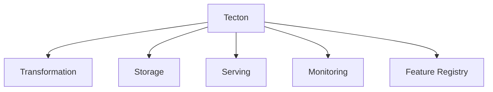
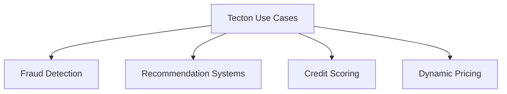
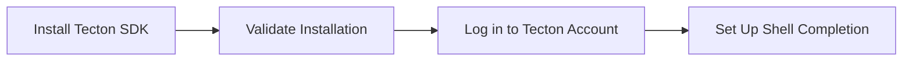
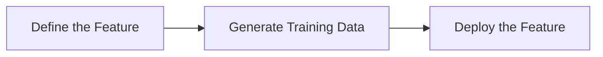
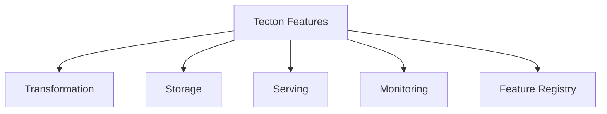

# Feature Management with Tecton

Streamline Your Machine Learning Features with an Open-Source Feature Store


## Introduction

### Overview

Welcome to the world of [Tecton](https://www.tecton.ai/), an open-source feature store that's designed to make your machine learning feature management a breeze. Whether you're a data scientist, an engineer, or someone diving into the AI/data landscape, Tecton provides a centralized platform that transforms raw data into production-ready features, stores them, and serves them efficiently for both training and real-time inference.

So, why is Tecton so crucial for modern business practices? It's all about streamlining your feature engineering process. With Tecton, you can reduce the time-to-market for your machine learning models while ensuring consistency and reliability in your feature data. And the best part? Tecton is user-friendly and comes with extensive documentation, making it easy for you to get started and manage your features effectively.

For those of you new to Tecton, here are some resources to help you hit the ground running:

- **[Tecton GitHub Repository](https://github.com/tecton-ai)**: Explore the source code, contribute, and stay updated with the latest developments.
- **[Tecton Documentation](https://docs.tecton.ai/)**: Dive into comprehensive guides and tutorials to get a solid understanding of Tecton.
- **[Getting Started with Tecton](https://docs.tecton.ai/docs/tutorials/tecton-quick-start)**: A beginner-friendly guide to kickstart your journey with Tecton.
- **[Tecton Community](https://community.tecton.ai/)**: Join the community to ask questions, share your projects, and collaborate with other Tecton users.
- **[Tecton API Reference](https://docs.tecton.ai/docs/introduction)**: Detailed API documentation to help you utilize Tecton’s features effectively.
- **[Tecton Blog](https://www.tecton.ai/blog/)**: Stay updated with the latest news, insights, and tutorials from the Tecton team.

### Learning Objectives

By the end of this tutorial, you will:

- Understand the core functionalities and unique features of Tecton.
- Learn how to install and set up Tecton.
- Explore practical examples of using Tecton for feature engineering.
- Gain detailed insights into Tecton's features and integration tips.
- Implement Tecton effectively in your business environment.

Let's dive into the exciting world of Tecton and see how it can revolutionize the way you manage your machine learning features!

## Why Tecton Matters

### Descriptive Overview

Tecton is a game-changer in the machine learning landscape, providing a comprehensive feature store that simplifies data engineering and allows data scientists to focus on what they do best: building and deploying ML models. Let's break down its core functionalities and understand how they can streamline your ML workflows:



1. **Transformation**:
   Tecton handles feature transformations from start to finish, supporting batch, streaming, and real-time data processing. This means you can generate high-quality, production-ready features directly from raw data, making your feature engineering process more efficient and streamlined.

2. **Storage**:
   Tecton offers both online (low-latency) and offline (historical) storage for your feature data. Online storage is crucial for real-time inference, while offline storage is used for training and historical analysis. This dual approach ensures efficient and scalable data management tailored to your needs.

3. **Serving**:
   With Tecton, you can serve feature data consistently for both training and inference. This ensures that the same feature definitions are used throughout the ML lifecycle, avoiding training-serving skew and guaranteeing that your models perform reliably in production.

4. **Monitoring**:
   Continuous monitoring of feature health, freshness, and data quality is another key aspect of Tecton. It tracks feature usage, detects anomalies, and ensures features remain accurate and up-to-date, which is crucial for maintaining model performance over time.

5. **Feature Registry**:
   Tecton maintains a centralized registry of all features, ensuring reusability and consistency across models and projects. This registry helps teams discover, share, and manage features efficiently, promoting collaboration and reducing redundant work.

### Business Use Cases

Tecton can significantly enhance business performance across various scenarios. Let's explore some of the key applications:



1. **Fraud Detection**:
   By leveraging real-time feature serving, Tecton enables the instant detection of fraudulent transactions. This ensures up-to-date data is always in play, improving security and reducing financial losses. Tecton's ability to handle streaming data makes it particularly well-suited for this critical use case.

2. **Recommendation Systems**:
   Enhance customer experience by serving real-time, personalized recommendations. With Tecton, your recommendation models will always have access to the latest user interactions and preferences, boosting user engagement and satisfaction significantly.

3. **Credit Scoring**:
   Improve your credit approval rates by making accurate and timely credit assessments using real-time data. Tecton ensures that your credit scoring models are based on the most current and relevant data, enhancing decision-making and operational efficiency.

4. **Dynamic Pricing**:
   Optimize your revenue and competitiveness by adjusting prices dynamically based on real-time market conditions. Tecton allows you to implement complex pricing strategies that respond to real-time data, maximizing profitability and maintaining a competitive edge.

Tecton truly empowers businesses to leverage their data more effectively, driving innovation and efficiency in their ML workflows. Let's dive deeper into how you can get started with Tecton and harness its full potential for your machine learning projects.

## Getting Started with Tecton

### Installation and Setup

Let's walk through the process of installing and setting up Tecton. Follow these steps to get started:



1. **Install the Tecton SDK**:
   First, you need to install the Tecton SDK. Open your terminal and run the following command:
   ```bash
   pip install tecton
   ```
   This command will install the Tecton SDK, which you will use to manage your feature store.

2. **Validate the Installation**:
   Once the installation is complete, you should validate it by checking the Tecton version. Run:
   ```bash
   tecton version
   ```
   This command will display the version of Tecton that you have installed, confirming that the installation was successful.

3. **Log in to Your Tecton Account**:
   Next, log in to your Tecton account using the command:
   ```bash
   tecton login
   ```
   You will be prompted to enter your login credentials. After logging in, you will have access to your Tecton workspace.

4. **Set Up Shell Completion (Optional)**:
   For enhanced productivity, you can set up shell completion. If you are using Zsh, run:
   ```bash
   tecton completion --zsh > ~/.tecton-complete.zsh
   echo '. ~/.tecton-complete.zsh' >> ~/.zshrc
   ```
   This setup will enable auto-completion for Tecton commands in your shell, making it easier to work with the SDK.

### Initial Configuration

Now that you have installed Tecton, let's configure it for first-time use. Here are the steps:

1. **Connect to a Data Platform**:
   - Choose your cloud provider (AWS or GCP) and region.
   - Connect to your compute platform (Databricks, EMR, or Snowflake). This step ensures that Tecton can access the necessary compute resources for processing your data.

2. **Connect Data**:
   - Configure access to your data storage options, such as S3, Redshift, or Snowflake. This involves setting up permissions and connections so that Tecton can read from and write to your data sources.

3. **Set Up and Configure Your Workspace**:
   - Create a workspace in Tecton where you will manage your features. This workspace acts as your central hub for feature development.
   - Manage access control to ensure that the right team members have the necessary permissions to work within the workspace.

4. **Select an Online Store**:
   - Choose between DynamoDB and Redis for real-time feature serving. This choice depends on your requirements for latency and scalability. DynamoDB is great for scalable, low-latency access, while Redis is ideal for extremely fast access times.

By following these steps, you will have Tecton installed and configured, ready to streamline your feature engineering process and make your machine learning projects more efficient and reliable.

## Practical Examples

### Example 1: Basic Use Case

**Objective**: Create and serve a simple feature for transaction aggregation.

Let's walk through the process of defining, generating, and deploying a feature in Tecton.



1. **Define the Feature**:
    First, we need to create a feature view in Tecton that aggregates transaction amounts over a 30-minute window. This involves writing a Python function decorated with `@stream_feature_view`.

    ```python
    from tecton import stream_feature_view, Aggregate, td

    # Define a stream feature view that processes transaction data
    @stream_feature_view(
        source=transactions,  # Source dataset
        entities=[user],  # Entity for which the features are being calculated
        online=True,  # Enable online storage for real-time use
        offline=True,  # Enable offline storage for historical data
        features=[Aggregate("amount", "mean", td(minutes=30))]  # Calculate the mean transaction amount over 30 minutes
    )
    def stream_features(transactions):
        # Return relevant columns
        return transactions[["user_id", "timestamp", "amount"]]
    ```

    **Explanation**:
    - `source=transactions`: Specifies the dataset containing transaction data.
    - `entities=[user]`: Defines the entity (e.g., user) for which the features are calculated.
    - `online=True`: Enables real-time storage of features.
    - `offline=True`: Enables historical storage of features.
    - `features=[Aggregate("amount", "mean", td(minutes=30))]`: Defines the feature to calculate the mean transaction amount over a 30-minute window.

2. **Generate Training Data**:
    Next, we generate the training data using the defined feature view.

    ```python
    # Generate training data for machine learning models
    training_data = stream_features.get_features_for_events(training_events)
    ```

    **Explanation**:
    - `stream_features.get_features_for_events(training_events)`: Generates training data based on the defined feature view and the provided training events.

3. **Deploy the Feature**:
    Finally, we deploy the feature to Tecton's feature store.

    ```bash
    # Deploy the feature to Tecton's feature store
    tecton apply
    ```

    **Explanation**:
    - `tecton apply`: Applies the configuration and deploys the defined features to the feature store.

By following these steps, you have successfully created, generated, and deployed a feature for transaction aggregation using Tecton. This feature can now be used in real-time and batch machine learning workflows, ensuring consistent and reliable data for your models.

### Example 2: Advanced Application

**Objective**: Implement a real-time fraud detection feature.

Let's dive into the process of creating and deploying a real-time feature to detect fraudulent transactions.

1. **Define the Real-Time Feature**:
    First, we'll create a feature view that sums transaction amounts over a 5-minute window, which can be useful for detecting unusual transaction patterns indicative of fraud.

    ```python
    from tecton import stream_feature_view, Aggregate, td

    # Define a stream feature view for real-time fraud detection
    @stream_feature_view(
        source=transactions,  # Source dataset
        entities=[user],  # Entity for which the features are being calculated
        online=True,  # Enable online storage for real-time use
        offline=True,  # Enable offline storage for historical data
        features=[Aggregate("amount", "sum", td(minutes=5))]  # Calculate the sum of transaction amounts over 5 minutes
    )
    def real_time_fraud_detection(transactions):
        # Return relevant columns
        return transactions[["user_id", "timestamp", "amount"]]
    ```

    **Explanation**:
    - `source=transactions`: Specifies the dataset containing transaction data.
    - `entities=[user]`: Defines the entity (e.g., user) for which the features are calculated.
    - `online=True`: Enables real-time storage of features.
    - `offline=True`: Enables historical storage of features.
    - `features=[Aggregate("amount", "sum", td(minutes=5))]`: Defines the feature to calculate the sum of transaction amounts over a 5-minute window.

2. **Deploy and Serve the Feature**:
    Next, we deploy this real-time fraud detection feature to Tecton's feature store.

    ```bash
    # Deploy the real-time fraud detection feature to Tecton's feature store
    tecton apply
    ```

    **Explanation**:
    - `tecton apply`: Applies the configuration and deploys the defined features to the feature store.

3. **Integrate with ML Model**:
    Finally, we integrate the deployed feature with a machine learning model to detect fraud. 

    ```python
    # Fetch real-time fraud detection features for fraud events
    fraud_features = real_time_fraud_detection.get_features_for_events(fraud_events)
    
    # Use the features to make predictions with the fraud detection model
    model.predict(fraud_features)
    ```

    **Explanation**:
    - `real_time_fraud_detection.get_features_for_events(fraud_events)`: Fetches the real-time features for the provided fraud events.
    - `model.predict(fraud_features)`: Uses the fetched features to make predictions with the fraud detection model.

By following these steps, you can effectively implement a real-time fraud detection feature using Tecton, seamlessly integrating it with your existing machine learning model to enhance your fraud detection capabilities. This setup ensures that your models are equipped with up-to-date and relevant features, enabling more accurate and timely predictions.

## In-Depth Guide

### Detailed Features

Let's explore the powerful features that make Tecton a valuable tool for managing your machine learning features.



1. **Transformation**:
    Tecton excels in handling various data transformation modes. Whether you need batch processing for historical data, streaming for real-time data, or immediate transformations, Tecton supports it all. This ensures that your features are timely, relevant, and ready for use when needed.

2. **Storage**:
    Tecton offers both online storage for low-latency access during inference and offline storage for managing historical data and training datasets. This dual approach ensures that your features are always accessible and efficiently managed, regardless of the stage of your ML workflow.

3. **Serving**:
    One of Tecton’s strengths is its ability to serve features consistently across both training and inference phases. By serving features from the same definitions and data sources used during model training, Tecton prevents discrepancies that could lead to model degradation, ensuring reliable model performance.

4. **Monitoring**:
    With Tecton, you get comprehensive tools to monitor the health of your features. This includes tracking metrics on feature freshness, usage, and data quality. Automated alerts and dashboards allow your team to proactively manage feature performance and address any issues promptly, keeping your ML models running smoothly.

5. **Feature Registry**:
    Tecton maintains a centralized, versioned registry of all your features. This promotes reuse and standardization, making it easy to access feature definitions, documentation, and metadata. By facilitating collaboration and reducing redundant feature engineering efforts, Tecton's feature registry helps streamline your workflow.

### Integration Tips

1. **CI/CD Integration**:
    Setting up continuous integration and deployment pipelines with Tecton is essential. This automation ensures that new features and updates are seamlessly integrated into production, maintaining the reliability and efficiency of your ML workflows.

2. **Data Platform Compatibility**:
    Ensure Tecton is compatible with your existing data platforms such as Databricks, Snowflake, or other data warehouses. This smooth integration allows for efficient data ingestion and processing, leveraging your current infrastructure for feature engineering.

3. **Security and Compliance**:
    Implement robust security measures within Tecton, including SAML 2.0 for single sign-on, role-based access control (RBAC) to manage user permissions, and data encryption both at rest and in transit. These measures protect sensitive data and ensure compliance with regulatory standards, safeguarding your feature store environment.

## Actionable Takeaways

### Key Points

- **Simplifies Feature Engineering**: Tecton streamlines the process of creating, managing, and deploying features.
- **Supports Various Data Transformations**: It handles batch, streaming, and real-time data transformations efficiently.
- **Ensures Consistent Feature Serving**: Tecton maintains consistency between training and inference phases, preventing model degradation.
- **Provides Robust Monitoring**: Comprehensive monitoring tools help maintain feature health and performance.
- **Centralized Feature Registry**: Promotes reuse, standardization, and collaboration.

### Implementation Steps

1. **Install and Set Up Tecton**:
    Begin by installing Tecton in your environment. Follow the setup guides to ensure it integrates seamlessly with your existing systems.

2. **Define and Deploy Features**:
    Use Tecton's Python framework to define your features. Deploy these features to Tecton’s feature store to make them available for training and inference.

3. **Integrate with Existing Platforms**:
    Ensure that Tecton is compatible with your current data and ML platforms. This integration allows for smooth data ingestion and processing.

4. **Monitor and Maintain Feature Health**:
    Utilize Tecton's monitoring tools to keep an eye on feature health and performance. Set up automated alerts and dashboards to proactively manage any issues.

By following these steps, you can leverage Tecton to enhance your machine learning workflows, ensuring efficient, reliable, and scalable feature management.

## Challenge: Real-Time Recommendation Feature with Tecton

### Task Description

Alright, let's dive into creating a real-time recommendation feature using Tecton. This task will involve defining the feature, deploying it, and integrating it with a recommendation model to provide personalized recommendations based on user interactions.

### Potential Areas

Think about areas where real-time recommendations can significantly enhance user experience:

- **User Interaction Tracking**: Capture and aggregate real-time user interactions like clicks, views, and purchases.
- **Personalized Recommendations**: Use features to create personalized recommendations.
- **Low-Latency Serving**: Ensure low latency for real-time recommendation systems.
- **Feature Consistency**: Maintain consistent feature definitions for both training and inference stages.

### Steps

Here's a step-by-step guide to help you get started:

1. **Define the Real-Time Feature**:
    - Use Tecton’s Python SDK to create a feature that aggregates user interactions in real-time.
    ```python
    from tecton import stream_feature_view, Aggregate, td

    @stream_feature_view(
        source=user_interactions,  # Source dataset
        entities=[user],  # Entity for which the features are being calculated
        online=True,  # Enable online storage for real-time use
        offline=True,  # Enable offline storage for historical data
        features=[Aggregate("interaction_count", "sum", td(minutes=5))]  # Calculate the sum of interactions over 5 minutes
    )
    def real_time_recommendation_features(user_interactions):
        return user_interactions[["user_id", "timestamp", "interaction_count"]]
    ```

2. **Deploy the Feature**:
    - Deploy the feature to Tecton’s feature store for online and offline use.
    ```bash
    tecton apply
    ```

3. **Integrate with a Recommendation Model**:
    - Use the feature in a recommendation model to serve personalized recommendations.
    ```python
    # Fetch real-time recommendation features for recommendation events
    recommendation_features = real_time_recommendation_features.get_features_for_events(recommendation_events)

    # Use the features to make predictions with the recommendation model
    recommendations = model.predict(recommendation_features)
    ```

4. **Monitor Feature Performance**:
    - Set up monitoring to track feature health, freshness, and usage.
    ```python
    # Example of monitoring setup
    monitoring_dashboard = setup_monitoring_dashboard(feature_name="real_time_recommendation_features")
    monitoring_dashboard.track_health()
    ```

5. **Test and Validate**:
    - Validate the recommendations to ensure they meet business requirements and improve user experience.
    ```python
    # Validate recommendations
    validate_recommendations(recommendations)
    ```

### Expected Outcome

By the end of this challenge, you should have:
- A deployed real-time recommendation feature aggregating user interactions.
- Integration of the feature with a recommendation model for personalized recommendations.
- Monitoring setup to ensure feature health and performance.

### Example Projects

Here are some inspiring project ideas to get you started:

- **E-commerce Product Recommendations**: Track user interactions with products and generate real-time recommendations based on browsing and purchase history.
- **Streaming Service Content Suggestions**: Aggregate user views and interactions to provide personalized movie or show suggestions.
- **News Article Recommendations**: Track user clicks and reading habits to recommend relevant news articles in real-time.

### Tips

- **Use Comprehensive Data**: Leverage multiple data sources for a robust recommendation system.
- **Optimize Pipeline**: Experiment with different configurations for the best performance.
- **Iterate and Improve**: Refine your solution based on feedback.
- **Engage with the Community**: Share progress and seek advice from the Tecton community.

## Conclusion

This challenge is designed to help you apply Tecton in a way that is both practical and impactful. By tackling a real-world problem that matters to you, you will gain hands-on experience with advanced feature management techniques and create a solution that delivers tangible benefits.

### Continue Learning

1. Explore the [Tecton documentation](https://docs.tecton.ai) for in-depth guides and tutorials.
2. Experiment with different models and tasks to discover new applications for your business.

Remember, the key to success with Tecton is continuous experimentation and adaptation to your specific business needs. Start small, measure impact, and scale your feature management solutions as you see tangible benefits.

### Additional Resources

Here are some resources to help you on your journey:

[1] [What is a Feature Store?](https://www.tecton.ai/blog/what-is-a-feature-store/)  
[2] [Tecton Homepage](https://www.tecton.ai)  
[3] [Evolving Culture and Values](https://www.tecton.ai/blog/evolving-culture-and-values/)  
[4] [Tecton Customers](https://www.tecton.ai/customers/)  
[5] [Installing the Tecton CLI](https://docs.tecton.ai/docs/setting-up-tecton/development-setup/installing-the-tecton-cli)  
[6] [Tecton CLI Installation Guide](https://docs.tecton.ai/docs/0.7/setting-up-tecton/development-setup/installing-the-tecton-cli)  
[7] [Tecton Feature Store Overview](https://www.tecton.ai/resources/tecton-feature-store-overview/)  
[8] [Tecton Feature Store](https://www.tecton.ai/feature-store/)  
[9] [What is a Feature Platform?](https://www.tecton.ai/blog/what-is-a-feature-platform/)  
[10] [Benefits of Implementing a Feature Platform](https://www.tecton.ai/blog/top-3-benefits-of-implementing-a-feature-platform/)  
[11] [Setting Up Tecton](https://docs.tecton.ai/docs/0.7/setting-up-tecton)  