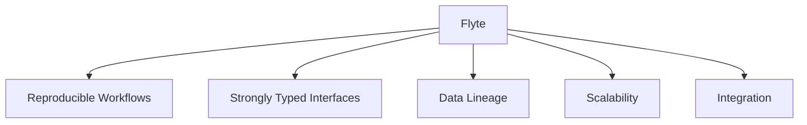
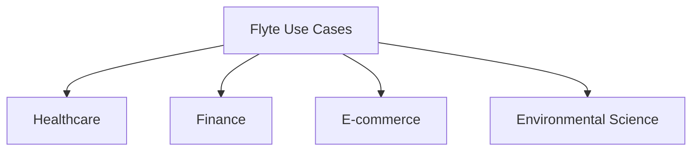
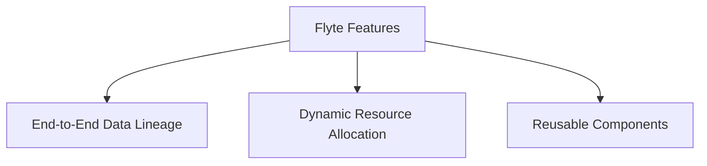

# Flyte: Reproducible Workflows for ML and Data Processing

Build and Manage Reproducible ML Workflows


## Introduction

### Overview

Welcome to the world of [Flyte](https://flyte.org/), an open-source platform specifically designed to help you create reproducible workflows for machine learning (ML) and data processing. Imagine having a unified system that integrates your data engineering, ML, and data analytics stacks seamlessly, allowing you to build robust and reliable applications. Flyte, built on Kubernetes, offers the scalability and flexibility needed to handle even the most complex workflows.

In today’s fast-paced business environment, consistency and reliability are paramount. Flyte ensures these qualities in your data workflows, making your life easier by providing a user-friendly interface and comprehensive documentation. Whether you're a data scientist or an engineer, Flyte is here to help you build, deploy, and maintain efficient workflows.

For those just getting started with Flyte, here are some invaluable resources:

- [Flyte GitHub Repository](https://github.com/flyteorg/flyte): Dive into the source code, contribute, and stay updated with the latest developments.
- [Flyte Documentation](https://docs.flyte.org/): Access detailed guides and tutorials to master Flyte.
- [Getting Started with Flyte](https://docs.flyte.org/en/latest/getting_started.html): A beginner-friendly guide to kickstart your journey with Flyte.
- [Flyte Use Cases](https://flyte.org/case-studies/): Discover practical examples of how Flyte is used in various applications.
- [Flyte Community](https://flyte.org/community/): Join a vibrant community to ask questions, share projects, and collaborate.
- [Flyte Blog](https://blog.flyte.org/): Stay updated with the latest news, insights, and tutorials from the Flyte team.

### Learning Objectives

By the end of this tutorial, you will:

- Understand the core functionalities and unique features of Flyte.
- Learn how to install and set up Flyte.
- Configure Flyte for first-time use.
- Explore practical examples of using Flyte for basic and advanced workflows.
- Gain detailed insights into Flyte’s features and integration tips.
- Discover actionable steps to implement Flyte in your business environment.

Let’s get started with Flyte and transform how you manage ML and data workflows!

## Why Flyte Matters

### Descriptive Overview

Flyte is an exceptional workflow orchestration platform designed to simplify the creation and management of data and machine learning workflows. Let's explore its core functionalities:



1. **Reproducible Workflows**: Imagine being able to repeat your workflows with the exact same results every time. Flyte captures and versions all components of your workflow, including code, configuration, and data dependencies, ensuring consistency. This is crucial for debugging, collaboration, and meeting regulatory requirements.

2. **Strongly Typed Interfaces**: Flyte enforces structured datasets and column-level type checking. This means it catches errors early in the development process by ensuring that data passed between tasks conforms to expected formats. This enhances data integrity and reduces runtime errors.

3. **Data Lineage**: Flyte tracks the movement and transformation of data throughout the workflow. This provides a detailed history of how data is processed, which is invaluable for debugging, understanding the data lifecycle, and complying with data governance regulations.

4. **Scalability**: Built on Kubernetes, Flyte can efficiently handle increasing workloads and resource needs. It automatically scales resources based on the demands of the workflow, ensuring optimal performance and cost-effectiveness for large-scale data and ML applications.

5. **Integration**: Flyte integrates seamlessly with popular ML and data platforms like TensorFlow, PyTorch, and Apache Spark. This flexibility allows teams to leverage their existing infrastructure and tools, enhancing workflow capabilities and reducing the learning curve.

### Business Use Cases

Flyte can significantly enhance performance in various business scenarios. Here’s how:



1. **Healthcare**: Imagine a company like Freenome using Flyte for cancer detection research. Flyte manages complex workflows involving large datasets and sophisticated ML models, ensuring reproducibility and scalability. This leads to consistent and reliable research results, accelerating discoveries and improving patient outcomes.

2. **Finance**: Think about Spotify automating its financial forecasting with Flyte. By uniting disparate teams and workflows into a cohesive system, Flyte enhances the accuracy and timeliness of financial predictions, leading to better financial planning and decision-making.

3. **E-commerce**: Picture Porch, which migrated from Airflow to Flyte to consolidate its data and ML operations. This migration improved operational efficiency by reducing the complexity of managing multiple workflows and enabling seamless integration with their existing data infrastructure.

4. **Environmental Science**: Consider Pachama using Flyte to calculate and sell carbon credits by scaling biomass metrics. Flyte’s ability to handle large-scale data processing and provide reproducible workflows ensures accurate and consistent biomass calculations, supporting environmental sustainability efforts.

Flyte's robust features and wide applicability make it a powerful tool for managing and optimizing workflows in any industry. By leveraging Flyte, businesses can achieve greater efficiency, reliability, and scalability in their data and ML processes.

## Getting Started with Flyte

### Installation and Setup

Let's get Flyte up and running on your system. Follow these steps to install and set up Flyte:


1. **Install Python**: First, ensure you have Python 3.8 or higher installed on your system. You can download it from the official [Python website](https://www.python.org/).

2. **Install Conda (Optional but recommended): Conda is a powerful package manager and environment management system. It's optional but highly recommended for managing dependencies and environments.
    ```bash
    # Create a new Conda environment with Python 3.10
    conda create -n flyte-example python=3.10 -y
    # Activate the new environment
    conda activate flyte-example
    ```

3. **Install Flytekit**: Flytekit is the Python SDK for Flyte. You'll use it to write, manage, and execute your workflows.
    ```bash
    pip install -U flytekit
    ```

### Initial Configuration

Now, let's set up your first Flyte project and configure it.

1. **Set up a Flyte project**:
    ```bash
    # Initialize a new Flyte project
    flytekit init my_flyte_project
    # Navigate into the project directory
    cd my_flyte_project
    ```

2. **Configure Flyte**: To run your workflows, you'll need to set up some configurations.
    - Create a `flytekit.config` file with the necessary configurations for your project. This file should include details like the Flyte backend endpoint, authentication settings, and more. Here's a basic example:

      ```ini
      [flyte]
      project: my_flyte_project
      domain: development
      endpoint: localhost:30081
      ```

    - **Set up Docker**: Flyte uses Docker for containerization, which allows your workflows to run in isolated environments. Ensure Docker is installed and running on your system. You can download Docker from the [official Docker website](https://www.docker.com/).

By following these steps, you should have Flyte installed and configured on your system. You're now ready to start creating and running reproducible workflows with Flyte.

## Practical Examples

### Example 1: Basic Workflow

Let's dive into a simple example to get you started with Flyte. We'll create a workflow that greets the user.


1. **Define the Workflow**:
    First, we'll create a task that returns a greeting message and then use this task in a workflow.

    ```python
    from flytekit import task, workflow

    # Define a task that returns a greeting message
    @task
    def say_hello(name: str) -> str:
        return f"Hello, {name}!"

    # Define a workflow that calls the say_hello task
    @workflow
    def my_wf(name: str) -> str:
        return say_hello(name=name)

    # Execute the workflow if this script is run directly
    if __name__ == "__main__":
        print(my_wf(name="Flyte"))
    ```

    **Explanation**:
    - `@task`: This decorator defines a Flyte task. Here, `say_hello` takes a string input `name` and returns a greeting message.
    - `@workflow`: This decorator defines a Flyte workflow. The workflow `my_wf` calls the `say_hello` task, passing the input `name` to it.
    - The `if __name__ == "__main__":` block allows you to run this script directly to test the workflow. When executed, it prints the greeting returned by the workflow.

2. **Execute the Workflow**:
    - Run the script to see the workflow in action. You should see the greeting message printed to the console.

    ```bash
    python my_flyte_project.py
    ```

    When you run the script, you should see the output:
    ```
    Hello, Flyte!
    ```

By following this example, you have defined and executed a basic workflow in Flyte. This foundational knowledge will help you build more complex workflows as you become more familiar with Flyte's capabilities.

### Example 2: Advanced Workflow

Let's take things up a notch and create a more complex workflow that involves loading and processing data. This example will demonstrate how Flyte can handle multiple tasks within a single workflow.

1. **Define the Workflow with Multiple Tasks**:
   - We'll create tasks for loading data from a CSV file and processing this data. Then, we'll define a workflow to orchestrate these tasks.

    ```python
    from flytekit import task, workflow
    import pandas as pd

    # Define a task to load data from a CSV file
    @task
    def load_data() -> pd.DataFrame:
        # Load the data from a CSV file and return it as a DataFrame
        return pd.read_csv('data.csv')

    # Define a task to process the loaded data
    @task
    def process_data(df: pd.DataFrame) -> pd.DataFrame:
        # Filter the DataFrame to only include rows where the 'value' column is greater than 10
        return df[df['value'] > 10]

    # Define a workflow that chains the load_data and process_data tasks
    @workflow
    def data_pipeline() -> pd.DataFrame:
        # Load the data
        df = load_data()
        # Process the loaded data
        processed_df = process_data(df=df)
        return processed_df

    # Execute the workflow if this script is run directly
    if __name__ == "__main__":
        print(data_pipeline())
    ```

**Explanation and Comments**:
1. **Import Libraries**:
    ```python
    from flytekit import task, workflow
    import pandas as pd
    ```
    - `flytekit` is the Flyte SDK for defining tasks and workflows.
    - `pandas` is used for data manipulation and analysis.

2. **Define `load_data` Task**:
    - This task loads data from a CSV file and returns it as a Pandas DataFrame.
    ```python
    @task
    def load_data() -> pd.DataFrame:
        # Load the data from a CSV file and return it as a DataFrame
        return pd.read_csv('data.csv')
    ```
    - `@task` decorator marks this function as a Flyte task.
    - The task reads a CSV file named `data.csv` and returns its content as a DataFrame.

3. **Define `process_data` Task**:
    - This task processes the DataFrame by filtering rows where the 'value' column is greater than 10.
    ```python
    @task
    def process_data(df: pd.DataFrame) -> pd.DataFrame:
        # Filter the DataFrame to only include rows where the 'value' column is greater than 10
        return df[df['value'] > 10]
    ```
    - `@task` decorator is used again to mark this function as a Flyte task.
    - The task takes a DataFrame as input and filters it, returning only the rows where the 'value' column exceeds 10.

4. **Define `data_pipeline` Workflow**:
    - This workflow chains the `load_data` and `process_data` tasks, returning the processed DataFrame.
    ```python
    @workflow
    def data_pipeline() -> pd.DataFrame:
        # Load the data
        df = load_data()
        # Process the loaded data
        processed_df = process_data(df=df)
        return processed_df
    ```
    - `@workflow` decorator marks this function as a Flyte workflow.
    - The workflow first calls the `load_data` task, then passes its output to the `process_data` task, and finally returns the processed DataFrame.

5. **Execute the Workflow**:
    - This code runs the workflow if the script is executed directly.
    ```python
    if __name__ == "__main__":
        print(data_pipeline())
    ```
    - When executed, the script runs the `data_pipeline` workflow and prints the resulting DataFrame.

By following this example, you have created a more advanced workflow in Flyte that handles multiple tasks, demonstrating Flyte's capability to manage and orchestrate complex data and ML workflows. This workflow loads data from a CSV file, processes it, and returns the filtered results, showcasing a typical data processing pipeline.

## In-Depth Guide

Let's dive deeper into the powerful features Flyte offers and how you can integrate it effectively into your workflows.



### Detailed Features

1. **End-to-End Data Lineage**:
   - Flyte provides comprehensive visibility into your data's journey through the workflow. By tracking data transformations and movements at every stage, Flyte ensures that you can easily debug issues, audit processes, and comply with data governance policies. This transparency is essential for maintaining data integrity and trust.

2. **Dynamic Resource Allocation**:
   - One of Flyte's standout features is its ability to dynamically adjust resources based on the needs of each task within the workflow. This ensures that your workflows run efficiently, optimizing resource utilization and reducing costs. Whether your workflow encounters light or heavy loads, Flyte scales resources accordingly, ensuring smooth execution.

3. **Reusable Components**:
   - Flyte promotes code reuse by allowing tasks and workflows to be shared across different projects. This modular approach reduces duplication, speeds up development, and enhances maintainability. By integrating common components into new workflows, you can build robust solutions faster and more efficiently.

### Integration Tips

1. **Kubernetes Integration**:
   - Flyte leverages Kubernetes for managing and orchestrating large-scale workflows. Kubernetes' robust scheduling, resource management, and fault tolerance capabilities ensure that your Flyte workflows can scale seamlessly with increased demand. By running Flyte on Kubernetes, you gain the scalability and reliability needed for complex data and ML tasks.

2. **Cloud Storage**:
   - Integrating Flyte with cloud storage solutions like Amazon S3, Google Cloud Storage, or Azure Blob Storage provides scalable, durable, and easily accessible data management. This allows Flyte to handle large datasets and supports distributed data processing, making it ideal for data-intensive workflows.

3. **Monitoring Tools**:
   - Use monitoring tools such as Prometheus and Grafana to enhance observability within Flyte. These tools allow you to track workflow performance, monitor resource usage, and receive alerts for any anomalies. Real-time monitoring helps maintain the health of your workflows and enables quick resolution of issues.

## Actionable Takeaways

### Key Points

- Flyte simplifies the orchestration of complex machine learning and data workflows.
- It provides scalability, reproducibility, and robust integration capabilities.
- Flyte is suitable for a variety of industries, including healthcare, finance, and e-commerce.

### Implementation Steps

1. **Install and Configure Flyte**:
   - Set up Flyte on your local machine or cloud environment to start building and managing your workflows.

2. **Create and Register Workflows**:
   - Use Flytekit to create your workflows. Register these workflows with Flyte to manage them efficiently.

3. **Integrate with Existing Tools**:
   - Integrate Flyte with your existing data and machine learning tools to enhance your workflow capabilities. This integration will help you leverage Flyte's full potential in your data and ML projects.

By following these steps, you'll be well on your way to harnessing the power of Flyte to streamline your data and ML workflows, ensuring they are reproducible, scalable, and efficient.

## Challenge: Creating a Flyte Workflow for a Simple ML Task

### Task Description

We're going to create a Flyte workflow that processes a dataset, performs a simple machine learning task (like linear regression), and outputs the results. This challenge will help you understand how to define tasks, orchestrate them into a workflow, and ensure reproducibility and scalability.

### Potential Areas

- **Data Ingestion and Preprocessing**: Loading and cleaning a dataset to prepare it for model training.
- **Model Training**: Implementing a simple linear regression model to fit the data.
- **Model Evaluation**: Evaluating the model’s performance using appropriate metrics.
- **Results Output**: Storing and outputting the results of the model evaluation.

### Steps

1. **Define Data Ingestion Task**:
   - Create a task to load and preprocess the dataset.
   - Example:
     ```python
     @task
     def load_and_preprocess_data() -> pd.DataFrame:
         df = pd.read_csv('data.csv')
         df = df.dropna()
         return df
     ```

2. **Define Model Training Task**:
   - Create a task to train a linear regression model on the processed data.
   - Example:
     ```python
     @task
     def train_model(df: pd.DataFrame) -> LinearRegression:
         X = df[['feature1', 'feature2']]
         y = df['target']
         model = LinearRegression().fit(X, y)
         return model
     ```

3. **Define Model Evaluation Task**:
   - Create a task to evaluate the trained model and output the results.
   - Example:
     ```python
     @task
     def evaluate_model(model: LinearRegression, df: pd.DataFrame) -> float:
         X = df[['feature1', 'feature2']]
         y = df['target']
         predictions = model.predict(X)
         mse = mean_squared_error(y, predictions)
         return mse
     ```

4. **Orchestrate the Workflow**:
   - Combine the tasks into a cohesive workflow using Flyte’s workflow capabilities.
   - Example:
     ```python
     @workflow
     def ml_workflow() -> float:
         df = load_and_preprocess_data()
         model = train_model(df=df)
         mse = evaluate_model(model=model, df=df)
         return mse
     ```

5. **Deploy and Run the Workflow**:
   - Deploy the workflow to Flyte and execute it, ensuring reproducibility and scalability.
   - Example:
     ```python
     if __name__ == "__main__":
         print(f"Mean Squared Error: {ml_workflow()}")
     ```

6. **Monitor and Validate**:
   - Use Flyte’s monitoring tools to track the workflow execution and validate the results.

### Expected Outcome

- A Flyte workflow that processes a dataset, trains a linear regression model, evaluates its performance, and outputs the results.
- Hands-on experience with Flyte’s task and workflow orchestration features.
- Understanding of how to implement and manage reproducible and scalable ML workflows using Flyte.

### Example Projects

- **House Price Prediction**: Load a housing dataset, preprocess the data, train a linear regression model to predict house prices, and evaluate the model’s performance.
- **Sales Forecasting**: Load a sales dataset, preprocess the data, train a linear regression model to forecast future sales, and evaluate the model’s accuracy.
- **Customer Churn Analysis**: Load a customer dataset, preprocess the data, train a linear regression model to predict customer churn, and evaluate the model’s performance.

### Tips

- **Use Comprehensive Data**: Ensure your dataset is clean and well-prepared for model training.
- **Optimize the Pipeline**: Experiment with different preprocessing and training configurations to improve model performance.
- **Monitor Execution**: Utilize Flyte’s monitoring tools to track workflow execution and identify any issues.
- **Iterate and Improve**: Continuously refine your workflow based on testing and feedback.
- **Engage with the Community**: Share your progress and seek advice from the Flyte community.

### Conclusion

This challenge helps you apply Flyte in a practical way, gaining hands-on experience with advanced workflow orchestration techniques to create impactful solutions.

### Continue Learning

1. Explore the [Flyte documentation](https://docs.flyte.org) for in-depth guides and tutorials.
2. Join the [Flyte community](https://flyte.org/community/) to stay updated on the latest developments.
3. Experiment with different models and tasks to discover new applications for your business.

Remember, the key to success with Flyte is continuous experimentation and adaptation to your specific business needs. Start small, measure impact, and scale your workflow solutions as you see tangible benefits.

### Additional Resources

[1] [Flyte Documentation](https://flyte.org)  
[2] [Introduction to Flyte](https://docs.flyte.org/en/latest/introduction.html)  
[3] [Flyte Blog](https://flyte.org/blog/from-incubation-to-graduation-and-beyond)  
[4] [Flyte Case Studies](https://flyte.org/case-studies)  
[5] [Union.ai Case Studies](https://www.union.ai/case-studies)  
[6] [Business Applications of Flyte](https://flyte.cloud/business-applications/)  
[7] [Flyte Cookbook](https://docs.flyte.org/projects/cookbook/en/latest/index.html)  
[8] [Getting Started with Flyte](https://docs.flyte.org/en/latest/getting_started_with_workflow_development/installing_development_tools.html)  
[9] [Core Use Cases](https://docs.flyte.org/en/latest/core_use_cases/index.html)  
[10] [Flyte Discussion Forum](https://discuss.flyte.org/t/13226818/hi-i-am-starting-to-do-some-poc-of-flyte-and-get-a-basic-que)  
[11] [Flyte on The New Stack](https://thenewstack.io/flyte-an-open-source-orchestrator-for-ml-ai-workflows/)  
[12] [Flyte on MLOps Community](https://mlops.community/flyte-mlops-simplified/)  