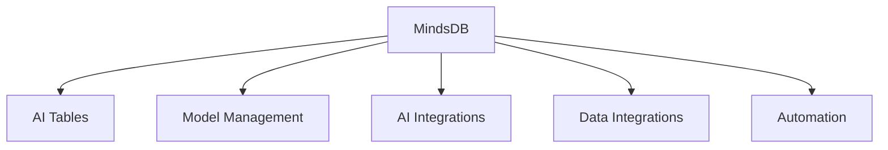
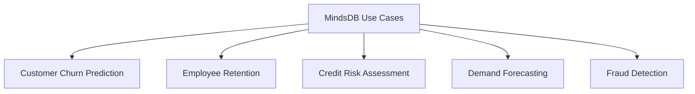
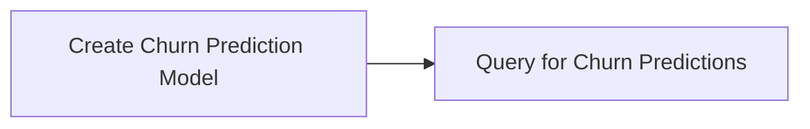
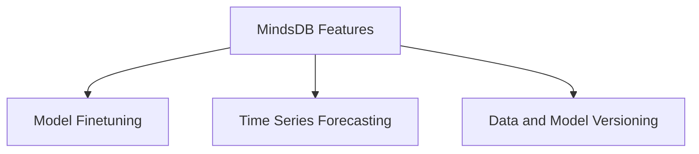

# Integrate AI with SQL Using MindsDB

An Open-Source AI Layer for Seamless ML Integration in Databases


## Introduction

### Overview

Welcome to the world of [MindsDB](https://mindsdb.com/), an open-source AI layer designed to integrate machine learning capabilities directly into your existing databases using SQL. MindsDB is transforming how businesses interact with their data by making AI accessible through familiar SQL interfaces. Imagine training and deploying machine learning models as easily as writing a SQL query. It's that simple!

MindsDB is perfect for organizations looking to leverage their current data infrastructure for predictive analytics and machine learning tasks without the need for extensive AI expertise. Its user-friendly interface and comprehensive documentation make it a breeze for data scientists and engineers to bring AI into their workflows.

Let's dive into some key resources to get you started:
- [MindsDB GitHub Repository](https://github.com/mindsdb/mindsdb): Dive into the source code, contribute, and stay updated with the latest developments.
- [MindsDB Documentation](https://docs.mindsdb.com/): Access detailed guides and tutorials to understand and implement MindsDB.
- [Getting Started with MindsDB](https://docs.mindsdb.com/Installation/): A beginner-friendly guide to kickstart your journey with MindsDB.
- [MindsDB Use Cases](https://mindsdb.com/case-studies/): Explore practical examples to see how MindsDB can be applied in various scenarios.
- [MindsDB Community](https://mindsdb.com/community/): Join the community to ask questions, share projects, and collaborate with other users.
- [MindsDB API Reference](https://docs.mindsdb.com/supported_databases/): Detailed API documentation to help you utilize MindsDB’s features effectively.
- [MindsDB Blog](https://mindsdb.com/blog/): Stay updated with the latest news, insights, and tutorials from the MindsDB team.

### Learning Objectives

By the end of this tutorial, you will:
- Understand the core functionalities and unique features of MindsDB.
- Learn how to install and set up MindsDB.
- Create and deploy AI models using SQL.
- Explore practical examples of MindsDB in business use cases.
- Discover advanced features and integration tips for MindsDB.
- Learn how to implement MindsDB in your business environment.


## Why MindsDB Matters

### Descriptive Overview

MindsDB is a powerful platform that brings AI capabilities directly into databases. Let's explore its core functionalities:



1. **AI Tables**: Imagine being able to interact with AI models as if they were just another table in your database. MindsDB abstracts AI models as virtual tables that you can query using standard SQL commands. This means you can easily integrate AI into your existing workflows without needing specialized ML knowledge.
2. **Model Management**: MindsDB lets you manage every aspect of your AI models directly from your database. You can create new models, fine-tune existing ones, and retrain models with new data—all using simple SQL commands. This streamlined process simplifies the lifecycle of machine learning projects.
3. **AI Integrations**: MindsDB supports a wide range of AI and ML frameworks, allowing you to leverage the best tools for your specific needs. Whether you're using TensorFlow, PyTorch, or scikit-learn, MindsDB integrates seamlessly with these popular frameworks within your enterprise data environment.
4. **Data Integrations**: You can connect MindsDB to various data sources, including traditional databases, vector stores, and applications. This flexibility ensures that you can easily access and utilize data from multiple sources for your machine learning models.
5. **Automation**: With MindsDB, you can schedule tasks and create triggers for automated AI workflows. Set up regular model retraining sessions, deploy models into production automatically, and trigger specific actions based on model predictions. This helps maintain up-to-date models and responsive AI systems.

### Business Use Cases

MindsDB can significantly enhance various business scenarios to improve performance:



1. **Customer Churn Prediction**: Predict which customers are likely to churn, enabling proactive retention strategies. By identifying at-risk customers early, businesses can take steps to improve customer satisfaction and reduce churn rates.
2. **Employee Retention**: Analyze employee behavior and sentiment to increase job satisfaction and retention rates. Predictive models can identify factors that contribute to employee turnover, allowing HR teams to address issues before they lead to resignations.
3. **Credit Risk Assessment**: Determine customers' creditworthiness for financial institutions. By assessing the likelihood of default, banks and financial institutions can make better lending decisions, reduce risk, and improve profitability.
4. **Demand Forecasting**: Predict product demand to optimize inventory and production. Accurate demand forecasting helps businesses manage their supply chain more effectively, reducing stockouts and excess inventory, and ultimately increasing operational efficiency.
5. **Fraud Detection**: Score transactions to automatically flag and reject potentially fraudulent activities. Implementing real-time fraud detection models helps financial institutions and e-commerce platforms reduce fraud losses and protect their customers.

## Getting Started with MindsDB

### Installation and Setup

Let's dive into getting MindsDB up and running. Follow these steps to install MindsDB:

1. **Install Docker**: If you don't already have Docker installed on your system, you'll need to do that first. Docker is essential for creating a containerized environment for MindsDB.

2. **Create a Docker Container for MindsDB**:
   Run the following command in your terminal:
   ```bash
   docker run --name mindsdb_container -p 47334:47334 -p 47335:47335 mindsdb/mindsdb
   ```
   This command will create a container named `mindsdb_container` and expose two ports:
   - **Port 47334**: For the GUI and HTTP API.
   - **Port 47335**: For the MySQL API.

### Initial Configuration

Once you've got MindsDB installed, it's time to set it up and connect it to a data source.

1. **Access the MindsDB Editor**:
   Open your web browser and navigate to `127.0.0.1:47334`. This will bring up the MindsDB editor where you'll perform your configurations and manage your data sources.

2. **Connect a Data Source**:
   You'll need to connect MindsDB to a data source using the `CREATE DATABASE` SQL statement. Here's an example of how to connect to a MySQL database:
   ```sql
   CREATE DATABASE mysql_demo_db
   WITH ENGINE = 'mysql',
   PARAMETERS = {
       "user": "user",
       "password": "MindsDBUser123!",
       "host": "samples.mindsdb.com",
       "port": "3306",
       "database": "public"
   };
   ```
   This command will set up a connection to a MySQL database named `mysql_demo_db`.

3. **Verify the Connection**:
   To make sure everything is set up correctly, run a simple query to fetch some data from your newly connected database:
   ```sql
   SELECT * FROM mysql_demo_db.questions LIMIT 3;
   ```
   If your connection is configured correctly, you should see a few rows of data returned from the `questions` table.

By following these steps, you'll have MindsDB installed, set up, and connected to a data source, ready to start integrating AI into your SQL workflows.

## Practical Examples

### Example 1: Basic Question Answering Model

Let's create a simple question-answering model using MindsDB. Follow these steps:


1. **Configure an AI Engine**:
    - Set up the AI engine using your OpenAI API key.
    ```sql
    CREATE ML_ENGINE openai_engine  -- Create a new AI engine named 'openai_engine'
    FROM openai  -- Specify the engine type as OpenAI
    USING
      api_key = 'your_openai_api_key';  -- Provide the OpenAI API key
    ```

2. **Create and Deploy an AI Model**:
    - Define the question-answering model using the AI engine and a prompt template.
    ```sql
    CREATE MODEL question_answering_model  -- Create a new model named 'question_answering_model'
    PREDICT answer  -- The model will predict the 'answer' field
    USING
      engine = 'openai_engine',  -- Use the 'openai_engine' configured earlier
      prompt_template = 'Answer the following question: {{question}}. Use the following context: {{article_title}}',  -- Define the prompt template
      model_name = 'gpt-3.5-turbo';  -- Specify the underlying model to use
    ```

3. **Query for Predictions**:
    - Query the model to get answers to questions.
    ```sql
    SELECT input.question, output.answer  -- Select the question and the corresponding predicted answer
    FROM mysql_demo_db.questions AS input  -- Source table containing questions
    JOIN question_answering_model AS output  -- Join with the model output to get predictions
    LIMIT 3;  -- Limit the results to 3
    ```

This example demonstrates how to configure an AI engine, create a question-answering model, and query for predictions using MindsDB.

### Example 2: Customer Churn Prediction

Let's create a more advanced model for predicting customer churn. Follow these steps:



1. **Assume We Have a `customer_data` Table**:
    - This table is in our connected database and contains data relevant for predicting churn.

2. **Create the Churn Prediction Model**:
    - Use the `CREATE MODEL` statement to create a model for predicting churn.
    ```sql
    CREATE MODEL churn_predictor  -- Create a new model named 'churn_predictor'
    FROM mysql_demo_db  -- Specify the source database
      (SELECT * FROM customer_data)  -- Select all data from the 'customer_data' table
    PREDICT churn  -- The model will predict the 'churn' field
    USING
      engine = 'lightwood';  -- Use the 'lightwood' machine learning engine
    ```

3. **Query the Model for Predictions**:
    - Retrieve predictions from the `churn_predictor` model.
    ```sql
    SELECT 
      t.customer_id,  -- Select customer ID
      t.name,  -- Select customer name
      m.churn AS churn_prediction,  -- Get the predicted churn value
      m.churn_confidence  -- Get the confidence of the churn prediction
    FROM mysql_demo_db.customer_data AS t  -- Source table
    JOIN churn_predictor AS m  -- Join with the model predictions
    WHERE t.customer_id > 1000  -- Filter condition
    LIMIT 10;  -- Limit the results to 10
    ```

**Explanation**:

1. **Assume We Have a `customer_data` Table**:
    - Ensure your `customer_data` table is available in your connected database.

2. **Create the Churn Prediction Model**:
    - The `CREATE MODEL` statement defines a new model named `churn_predictor` using the `lightwood` ML engine.
    - The model uses data from the `customer_data` table to predict the `churn` field.

3. **Query the Model for Predictions**:
    - The `SELECT` statement retrieves predictions by joining the `customer_data` table with the `churn_predictor` model.
    - The query selects the customer ID, name, churn prediction, and prediction confidence, filtering for customer IDs greater than 1000 and limiting the results to 10.

By following these steps, you will have created a customer churn prediction model and retrieved predictions using MindsDB.


## In-Depth Guide

### Detailed Features



1. **Model Finetuning**: MindsDB allows you to finetune existing models to improve their performance.

    ```sql
    FINETUNE MODEL question_answering_model  -- Finetune the existing 'question_answering_model'
    FROM mysql_demo_db  -- Use data from the 'mysql_demo_db' database
      (SELECT * FROM additional_training_data)  -- Specify the additional training data for finetuning
    USING
      learning_rate = 0.001,  -- Set the learning rate for the finetuning process
      epochs = 3;  -- Set the number of epochs for the finetuning process
    ```

2. **Time Series Forecasting**: MindsDB supports advanced time series predictions, perfect for forecasting future trends.

    ```sql
    CREATE MODEL sales_forecast  -- Create a new model named 'sales_forecast'
    FROM mysql_demo_db  -- Use data from the 'mysql_demo_db' database
      (SELECT date, sales FROM historical_sales)  -- Select date and sales columns from the 'historical_sales' table
    PREDICT sales  -- The model will predict the 'sales' field
    ORDER BY date  -- Order the data by date
    GROUP BY store_id  -- Group the data by store ID
    WINDOW 30  -- Set the window size to 30 days
    HORIZON 7  -- Set the prediction horizon to 7 days
    USING engine = 'lightwood';  -- Use the 'lightwood' machine learning engine
    ```

### Integration Tips

1. **Database Integration**: MindsDB integrates seamlessly with various databases. Here’s how you can connect to a PostgreSQL database:

    ```sql
    CREATE DATABASE pg_datasource  -- Create a new database connection named 'pg_datasource'
    WITH ENGINE = 'postgres',  -- Specify the database engine as PostgreSQL
    PARAMETERS = {
        "user": "your_username",  -- Your PostgreSQL username
        "password": "your_password",  -- Your PostgreSQL password
        "host": "your_host",  -- The host address of your PostgreSQL server
        "port": "5432",  -- The port number for your PostgreSQL server
        "database": "your_database"  -- The name of your PostgreSQL database
    };
    ```

2. **API Integration**: MindsDB’s REST API allows for integration with other applications. Here’s a Python example:

    ```python
    import requests  # Import the requests library for making HTTP requests

    url = "http://127.0.0.1:47334/api/sql/query"  # URL for the MindsDB SQL query API
    query = "SELECT * FROM churn_predictor WHERE customer_id = 1001;"  # SQL query to retrieve predictions for a specific customer
    response = requests.post(url, json={"query": query})  # Send a POST request with the SQL query
    print(response.json())  # Print the response in JSON format
    ```

## Actionable Takeaways

### Key Points

- MindsDB brings AI capabilities directly into your databases using SQL, making AI accessible to non-specialists.
- It supports various AI models, including question answering, classification, and time series forecasting.
- MindsDB integrates with multiple data sources and AI engines, offering flexibility and scalability.
- Automation features enable scheduled tasks and triggered workflows, ensuring your models stay current and responsive.

### Implementation Steps

1. **Install MindsDB**: Use Docker to install MindsDB on your system.
2. **Connect Your Database**: Integrate MindsDB with your existing database.
3. **Create an AI Model**: Use SQL commands to create and configure your AI model.
4. **Query for Predictions**: Retrieve predictions using SQL queries.
5. **Integrate Predictions**: Incorporate MindsDB predictions into your existing business processes.
6. **Explore Advanced Features**: Utilize model finetuning, time series forecasting, and automation to enhance your AI capabilities.

By following these steps, you'll be well-equipped to integrate AI seamlessly into your database operations, leveraging MindsDB’s powerful features to enhance your business intelligence and predictive analytics.

## Challenge: Sentiment Analysis Model for Customer Reviews with MindsDB

### Task Description

We're going to create a sentiment analysis model for customer reviews using MindsDB. The goal is to use a dataset of product reviews to train the model and then analyze new reviews in real-time. This will involve setting up your environment, training the model, and integrating it into a workflow to process new data as it arrives.

### Implementation Steps

1. **Set Up MindsDB Environment**:
   - First, you need to install and configure MindsDB. Make sure it's connected to your data source.

    ```bash
    docker run --name mindsdb_container -p 47334:47334 -p 47335:47335 mindsdb/mindsdb
    ```

2. **Prepare the Dataset**:
   - Ensure your dataset of customer reviews is correctly formatted and accessible to MindsDB. Typically, this data would be in a table within your connected database.

    ```sql
    CREATE DATABASE reviews_db
    WITH ENGINE = 'mysql',
    PARAMETERS = {
        "user": "user",
        "password": "password",
        "host": "your_host",
        "port": "3306",
        "database": "reviews"
    };
    ```

3. **Create and Train the Model**:
   - Define the sentiment analysis model using MindsDB’s SQL interface and train it on the historical customer reviews dataset.

    ```sql
    CREATE MODEL sentiment_model
    FROM reviews_db
      (SELECT review_text, sentiment FROM customer_reviews)
    PREDICT sentiment
    USING
      engine = 'lightwood';
    ```

4. **Deploy the Model**:
   - Deploy the model and ensure it’s ready to make predictions on new data.

    ```sql
    SELECT PREDICT sentiment FROM sentiment_model
    WHERE review_text = 'I love this product!';
    ```

5. **Integrate Real-Time Data Processing**:
   - Set up a trigger to analyze new customer reviews as they are added to the database. Automate the workflow to periodically retrain the model with new data.

    ```sql
    CREATE TRIGGER new_review_analysis
    AFTER INSERT ON customer_reviews
    FOR EACH ROW
    BEGIN
      INSERT INTO sentiment_analysis_results (review_id, sentiment, confidence)
      SELECT NEW.review_id, sentiment_model.sentiment, sentiment_model.confidence
      FROM sentiment_model
      WHERE review_text = NEW.review_text;
    END;
    ```

6. **Test the Workflow**:
   - Validate the model’s predictions on a set of new reviews and ensure the integration is functioning correctly.

    ```sql
    SELECT * FROM sentiment_analysis_results
    ORDER BY created_at DESC
    LIMIT 10;
    ```

### Expected Outcome

- A sentiment analysis model trained on a dataset of customer reviews.
- Real-time analysis of new reviews, providing sentiment predictions as new data is added.
- A mechanism to periodically retrain the model with new data, ensuring it remains accurate and up-to-date.

### Example Projects

- **E-commerce Review Analysis**: Train a model on product reviews to provide real-time sentiment analysis for new reviews.
- **Restaurant Feedback Analysis**: Use customer reviews to train a sentiment model for analyzing new feedback in real-time.
- **App Store Review Monitoring**: Analyze app store reviews to track customer sentiment and identify potential issues.

### Tips for Completion

- **Use a Pre-Trained Model**: Start with a pre-trained sentiment analysis model and fine-tune it with your dataset for better performance.
- **Data Quality**: Ensure the data used for training is clean and well-labeled to improve model accuracy.
- **Testing**: Validate the model’s predictions with a set of known reviews to assess its accuracy and reliability.
- **Documentation**: Document each step and your workflow for future reference and reproducibility.

### Conclusion

This challenge helps you gain hands-on experience with MindsDB, demonstrating how to integrate AI capabilities directly into databases for real-time data processing and analysis. By completing this challenge, you will learn to set up and use MindsDB, create and deploy machine learning models, and automate AI workflows effectively.

### Continue Learning

1. **Explore MindsDB Documentation**: Delve deeper into the advanced features and capabilities of MindsDB.
2. **Join the MindsDB Community**: Engage with other users and contributors to exchange knowledge and get support.
3. **Experiment with Different Models**: Try creating different types of models and integrating them into various business scenarios.
4. **Scale Up**: Consider deploying MindsDB in a production environment to handle larger datasets and more complex workflows.

By leveraging MindsDB, you can enhance your data processing capabilities, integrate AI seamlessly into your workflows, and make data-driven decisions with greater efficiency and accuracy.

### Additional Resources

[1] [What is MindsDB](https://docs.mindsdb.com/what-is-mindsdb)  
[2] [Introduction to LangChain](https://mindsdb.com/blog/introduction-to-langchain-communicate-efficiently-with-your-database)  
[3] [MindsDB Model Types](https://docs.mindsdb.com/model-types)  
[4] [Machine Learning Use Cases](https://mindsdb.com/machine-learning-use-cases)  
[5] [MindsDB Case Studies](https://mindsdb.com/case-studies)  
[6] [Installing MindsDB](https://docs.mindsdb.com/contribute/install)  
[7] [Self-Hosted Setup with Docker](https://docs.mindsdb.com/setup/self-hosted/docker)  
[8] [Improving Business E-commerce Support with AI](https://mindsdb.com/blog/improving-your-business-e-commerce-support-with-ai-using-mindsdb-monkeylearn)  
[9] [Quickstart Tutorial](https://docs.mindsdb.com/quickstart-tutorial)