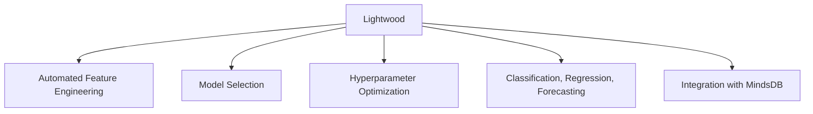
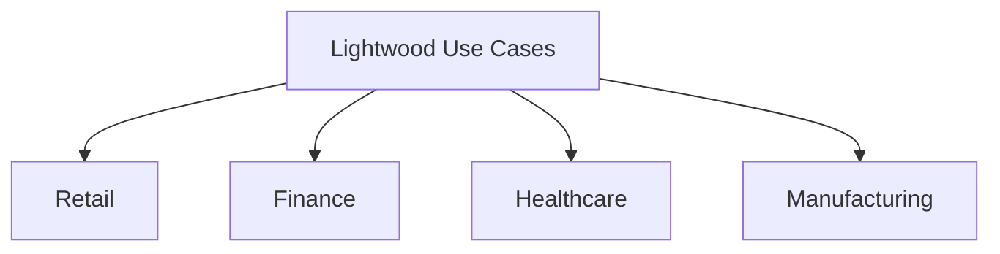
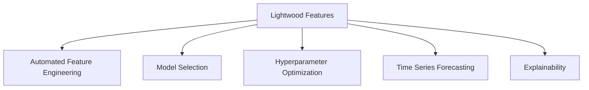

# Automate ML Workflows with Lightwood

An Open-Source AutoML Framework for Easy Model Building and Deployment


## Introduction

### Overview

Welcome to the world of [Lightwood](https://github.com/mindsdb/lightwood), an innovative open-source AutoML framework that makes building and deploying machine learning models a breeze. In today’s data-driven landscape, Lightwood is a game-changer for businesses eager to harness the power of AI without needing deep data science expertise.

Lightwood automates many steps in the machine learning workflow, making AI accessible to businesses of all sizes. Its user-friendly interface and comprehensive documentation are designed to help you get up and running quickly. Whether you’re a developer or an engineer, you’ll find Lightwood invaluable for creating and deploying models efficiently.

For those new to Lightwood, here are some essential resources to get you started:

- [Lightwood GitHub Repository](https://github.com/mindsdb/lightwood): Dive into the source code, contribute, and stay updated with the latest features.
- [Lightwood Documentation](https://docs.mindsdb.com/lightwood/): Find detailed guides and tutorials to help you understand and implement Lightwood.
- [Getting Started with Lightwood](https://docs.mindsdb.com/lightwood/getting_started/): A beginner-friendly guide to kickstart your journey.
- [Lightwood Use Cases](https://mindsdb.com/case-studies/): See practical examples of how Lightwood is used in various industries.
- [MindsDB Community](https://mindsdb.com/community/): Join the community to ask questions, share projects, and collaborate with others.
- [Lightwood API Reference](https://docs.mindsdb.com/lightwood/api_reference/): Detailed API documentation to make the most of Lightwood’s features.
- [MindsDB Blog](https://mindsdb.com/blog/): Stay updated with the latest news, insights, and tutorials from the MindsDB team.

### Learning Objectives

By the end of this tutorial, you will:

- Understand Lightwood's core functionalities and how they apply to business applications.
- Learn how to install, set up, and configure Lightwood.
- Gain hands-on experience with practical examples.
- Explore advanced features and integration possibilities.
- Apply Lightwood to solve real-world business problems.

Let's dive in and see how Lightwood can transform your approach to machine learning!

## Why Lightwood Matters

### Descriptive Overview

Lightwood is an AutoML framework designed to automate the entire machine learning pipeline, from data preprocessing to model selection and hyperparameter tuning. It supports a variety of data types, including numerical, categorical, datetime, and text, making it versatile for a wide range of business applications.

Let’s explore some of the standout features of Lightwood:



1. **Automated Feature Engineering**: 
   Lightwood takes care of the entire feature engineering process for you. It automatically encodes categorical variables, scales numerical features, and selects the most relevant features for your models. This not only saves you a lot of time and effort but also ensures that your data is prepared optimally for machine learning, letting you focus on strategic decisions rather than the nitty-gritty details of data prep.

2. **Model Selection**: 
   Choosing the right model can be a daunting task, but Lightwood simplifies this by automatically selecting the best-performing model from its extensive library. It evaluates the characteristics of your problem and data, ensuring you get the most suitable model without the need for extensive manual experimentation.

3. **Hyperparameter Optimization**: 
   To get the best performance from a model, hyperparameters often need to be fine-tuned. Lightwood automates this process, adjusting hyperparameters to optimize model performance. This means you get a finely tuned model that achieves the highest possible accuracy and efficiency without having to manually tweak and test each setting.

4. **Support for Classification, Regression, and Time Series Forecasting**: 
   Lightwood isn’t just versatile in its data handling capabilities; it also supports a wide range of machine learning tasks. Whether you need classification, regression, or time series forecasting, Lightwood has you covered, making it applicable to various business problems across different industries.

5. **Integration with MindsDB for Database-Native Machine Learning**: 
   Lightwood integrates seamlessly with MindsDB, enabling you to run machine learning models directly within your existing databases. This integration simplifies the deployment process and makes it easier to incorporate AI capabilities into your business workflows, leveraging the power of machine learning where your data already resides.

### Business Use Cases

Lightwood can be applied across numerous industries and business functions, making it a valuable tool for various applications:



1. **Retail**: 
   - **Predict Customer Churn**: Analyze customer behavior data to identify which customers are likely to leave, allowing you to implement retention strategies proactively.
   - **Optimize Pricing Strategies**: Use sales and market trends to optimize pricing strategies, ensuring competitive pricing while maximizing profits.
   - **Demand Forecasting**: Forecast demand to improve inventory management, reducing stockouts and excess inventory.

2. **Finance**: 
   - **Fraud Detection**: Detect fraudulent transactions by analyzing transaction patterns, helping to protect against financial losses.
   - **Credit Risk Assessment**: Predict the likelihood of loan defaults, assisting in better credit risk management and lending decisions.
   - **Stock Market Prediction**: Analyze stock market trends to guide investment decisions, maximizing returns and minimizing risks.

3. **Healthcare**: 
   - **Predict Patient Readmissions**: Use medical records and patient histories to predict which patients are likely to be readmitted, allowing for better patient care management.
   - **Medical Imaging Analysis**: Analyze medical imaging data to aid in diagnostics, improving accuracy and speed in detecting health issues.
   - **Resource Allocation**: Optimize resource allocation in hospitals and clinics, ensuring that resources are used efficiently to improve patient care.

4. **Manufacturing**: 
   - **Predict Equipment Failures**: Monitor machine data to predict when equipment is likely to fail, reducing downtime and maintenance costs.
   - **Optimize Supply Chain Operations**: Forecast demand and supply to optimize supply chain operations, improving efficiency and reducing costs.
   - **Quality Control**: Identify defects in products to improve quality control processes, ensuring higher quality products and reducing waste.

By leveraging Lightwood, you can streamline your machine learning workflows, making advanced analytics accessible and actionable for your business. This enables you to make data-driven decisions, optimize operations, and ultimately drive better outcomes across various sectors.

## Getting Started with Lightwood

### Installation and Setup


Let's walk through the process of getting Lightwood up and running on your system. It's straightforward and quick!

1. **Ensure You Have Python 3.8 or Higher Installed**:
    - Before installing Lightwood, make sure your Python environment is set up and running on version 3.8 or higher. You can check your Python version by running the following command in your terminal or command prompt:
    ```bash
    python --version
    ```
    - If you need to install or upgrade Python, you can download it from the [official Python website](https://www.python.org/).

2. **Open Your Terminal or Command Prompt**:
    - Navigate to your terminal (on macOS/Linux) or command prompt (on Windows).

3. **Run the Installation Command**:
    - To install Lightwood, use pip, the Python package installer. Execute the following command:
    ```bash
    pip install lightwood
    ```
    - This command downloads and installs Lightwood along with its dependencies.

### Initial Configuration

Now that Lightwood is installed, let's set it up in your Python script:

1. **Import Lightwood**:
    - Open your favorite code editor and create a new Python script.
    - Start by importing Lightwood and its high-level API functions:
    ```python
    import lightwood
    from lightwood.api.high_level import (
        ProblemDefinition,
        json_ai_from_problem,
        code_from_json_ai,
        predictor_from_code
    )
    ```
    - These imports include the main components you'll need to define problems, generate AI models, and create predictors.

By following these simple steps, you'll have Lightwood installed and ready to use. Now you're set to dive into creating and deploying machine learning models with ease, leveraging the power of Lightwood's AutoML capabilities.

## Practical Examples

### Example 1: Predicting House Prices


Let's dive into a practical example of using Lightwood to predict house prices. Follow these steps:

1. **Load Dataset**:
    - First, we'll load a dataset containing information about house rentals.
    - We'll use Pandas to read the dataset from a CSV file.

2. **Define Prediction Task**:
    - We'll define the problem by specifying which column we want to predict (the target variable).
    - We'll also set a time aim for training the model to optimize the process.

3. **Generate and Train Model**:
    - Lightwood will generate the necessary JSON-AI code based on the problem definition and dataset.
    - We'll convert this JSON-AI into Python code and use it to create and train the predictor.

4. **Make Predictions**:
    - Finally, we'll use the trained predictor to make predictions on a subset of the data.

Here's the complete code to achieve this:

```python
import pandas as pd
from lightwood.api.high_level import ProblemDefinition, json_ai_from_problem, code_from_json_ai, predictor_from_code

# Load dataset
df = pd.read_csv("https://raw.githubusercontent.com/mindsdb/benchmarks/main/benchmarks/datasets/home_rentals/data.csv")

# Define the prediction task
pdef = ProblemDefinition.from_dict({
    "target": "rental_price",  # Specify the target variable
    "time_aim": 20  # Set the time aim for model training
})

# Generate JSON-AI code based on the problem definition and dataset
json_ai = json_ai_from_problem(df, problem_definition=pdef)

# Convert JSON-AI to Python code
code = code_from_json_ai(json_ai)

# Create and train the predictor
predictor = predictor_from_code(code)
predictor.learn(df)

# Make predictions on a subset of the data
predictions = predictor.predict(df.iloc[:10])
print(predictions)  # Print the predictions
```

**Explanation**:
- **Loading the Dataset**: We use `pd.read_csv` to load the dataset into a Pandas DataFrame.
- **Defining the Prediction Task**: `ProblemDefinition.from_dict` helps us set the target variable and time aim for the model training.
- **Generating and Training the Model**: Lightwood's high-level API functions (`json_ai_from_problem`, `code_from_json_ai`, `predictor_from_code`) streamline the process of generating JSON-AI code, converting it to Python, and creating a predictor.
- **Making Predictions**: After training, the predictor can be used to make predictions on new data. Here, we predict rental prices for the first 10 rows of the dataset and print the results.

This example showcases how Lightwood simplifies the machine learning workflow, enabling you to quickly move from data ingestion to making predictions with minimal effort.

### Example 2: Customer Churn Prediction

Now let's take a more advanced example and use Lightwood to predict customer churn. This will help businesses identify customers who are likely to leave, enabling proactive measures to retain them. Follow these steps:

1. **Load Customer Data**:
    - We will load a dataset that contains customer information, including whether they have churned or not.

2. **Define Prediction Task**:
    - We'll define the target variable for churn prediction and set a training time aim.

3. **Generate and Train Model**:
    - Lightwood will generate JSON-AI code based on our problem definition and dataset.
    - We'll convert this JSON-AI into Python code and use it to create and train the predictor.

4. **Make Predictions on New Data**:
    - After training, we'll use the predictor to make churn predictions on new customer data.

Here's the complete code to achieve this:

```python
import pandas as pd
from lightwood.api.high_level import ProblemDefinition, json_ai_from_problem, code_from_json_ai, predictor_from_code

# Load customer data
df = pd.read_csv("customer_data.csv")

# Define the prediction task
pdef = ProblemDefinition.from_dict({
    "target": "churn",  # Specify the target variable for churn prediction
    "time_aim": 30  # Set the time aim for model training
})

# Generate JSON-AI code based on the problem definition and dataset
json_ai = json_ai_from_problem(df, problem_definition=pdef)

# Convert JSON-AI to Python code
code = code_from_json_ai(json_ai)

# Create and train the predictor
predictor = predictor_from_code(code)
predictor.learn(df)

# Make predictions on new customer data
new_customers = pd.read_csv("new_customers.csv")
churn_predictions = predictor.predict(new_customers)
print(churn_predictions)  # Print the churn predictions
```

**Explanation**:
- **Loading the Customer Data**: We use `pd.read_csv` to load both the historical customer data and the new customer data into Pandas DataFrames.
- **Defining the Prediction Task**: We specify "churn" as the target variable in the problem definition and set a time aim of 30 seconds for model training.
- **Generating and Training the Model**: Lightwood’s high-level API functions (`json_ai_from_problem`, `code_from_json_ai`, `predictor_from_code`) streamline the creation of the JSON-AI code, conversion to Python code, and training of the predictor.
- **Making Predictions on New Data**: After training, the predictor is used to make churn predictions on the new customer data, which are then printed out.

This example demonstrates how Lightwood can be applied to a crucial business problem like customer churn prediction, helping companies take proactive steps to retain their customers. By following these steps, you can leverage Lightwood to quickly build and deploy machine learning models tailored to your specific business needs.

## In-Depth Guide

### Detailed Features

Lightwood offers a range of powerful features that simplify and enhance the machine learning process:



1. **Automated Feature Engineering**:
    - **Handling Categorical Variables**: Lightwood automatically encodes categorical variables, converting them into numerical formats suitable for machine learning algorithms. 
    - **Scaling Numerical Features**: It scales numerical features to ensure they are on a comparable scale, improving the model’s ability to learn from the data.
    - **Feature Selection**: Lightwood selects the most relevant features to include in the model, enhancing model accuracy and performance.

2. **Model Selection**:
    - **Diverse Algorithms**: The framework evaluates a variety of machine learning algorithms, including decision trees, random forests, gradient boosting machines, and neural networks.
    - **Optimal Performance**: It selects the best-performing model based on the specific problem and data characteristics, ensuring optimal results.

3. **Hyperparameter Optimization**:
    - **Techniques Used**: Lightwood employs techniques like grid search and random search to explore different hyperparameter combinations.
    - **Improving Accuracy and Efficiency**: This process helps find the best settings for each model, improving both accuracy and efficiency.

4. **Time Series Forecasting**:
    - **Analyzing Time-Dependent Data**: Lightwood supports forecasting tasks by analyzing time-dependent data.
    - **Applications**: It can predict future values based on historical data, making it useful for sales forecasting, demand planning, and financial predictions.

5. **Explainability**:
    - **Understanding Models**: Lightwood provides insights into the importance of different features and the decision-making process of the model.
    - **Increasing Trust and Transparency**: This explainability helps users understand how the model works and why it makes certain predictions, increasing trust and transparency.

### Integration Tips

1. **Database Integration**:
    - **In-Database Machine Learning**: Integrate Lightwood with MindsDB to enable machine learning directly within your existing databases.
    - **Simplified Deployment**: This integration simplifies the deployment process and makes it easier to incorporate AI capabilities into business workflows.

2. **API Development**:
    - **Prediction APIs**: Use frameworks like Flask or FastAPI to create prediction APIs with Lightwood models.
    - **Web Services**: Deploy your models as web services that can be accessed by other applications and systems, facilitating broader use and integration.

3. **Batch Processing**:
    - **Data Pipelines**: Integrate Lightwood into data pipelines for batch predictions on large datasets.
    - **Periodic Reporting**: This is useful for applications like periodic reporting, where predictions need to be made regularly.

4. **Real-time Predictions**:
    - **Streaming Platforms**: Integrate Lightwood models with streaming platforms like Kafka for real-time predictions.
    - **Immediate Decisions**: This allows businesses to make immediate decisions based on the latest data, improving responsiveness and agility.

## Actionable Takeaways

1. **Start with a Simple Prediction Task**:
    - Choose a basic prediction task in your business domain to familiarize yourself with Lightwood.

2. **Experiment with Different Data Types and Problem Definitions**:
    - Try various data types and problem definitions to understand how Lightwood handles different scenarios.

3. **Analyze Feature Importance**:
    - Use Lightwood’s explainability features to gain insights into your data and understand the significance of different features.

4. **Compare Lightwood’s Performance with Traditional ML Approaches**:
    - Benchmark Lightwood against traditional machine learning methods to evaluate its performance and benefits.

5. **Integrate Lightwood Predictions into Your Existing Business Processes**:
    - Apply the predictions generated by Lightwood models to enhance your current workflows and improve decision-making.

By following these steps and leveraging Lightwood’s capabilities, you can streamline your machine learning processes and make data-driven decisions more effectively.

## Challenge: Develop a Predictive Model with Lightwood

### Task Description

Let's take on a challenge to develop a predictive model using Lightwood that addresses a real-world problem in your workplace or personal projects. This could be anything from predicting customer churn, sales forecasting, inventory management, to even forecasting website traffic.

### Expected Outcome

A functional predictive model that:
1. Provides accurate predictions for your chosen business problem.
2. Identifies key factors influencing these predictions.
3. Offers actionable insights that can guide decision-making.

### Implementation Steps

1. **Identify the Problem**: Choose a relevant challenge in your workplace or personal projects. It could be predicting customer behavior, forecasting demand, or any other issue that requires data-driven insights.
2. **Data Ingestion and Preprocessing**: Load and preprocess your dataset. Ensure it includes relevant features and handle any missing values or formatting issues.
3. **Define Prediction Task**: Set up the prediction task in Lightwood, specifying the target variable and relevant features.
4. **Generate and Train Model**: Use Lightwood to generate and train the best-performing model for your data.
5. **Evaluate Model Performance**: Assess the model’s accuracy using appropriate metrics and validate its predictions.
6. **Deploy Model**: Deploy the model for real-time predictions or batch processing as needed.
7. **Analyze Predictions**: Use the model’s predictions to gain insights into trends and influencing factors relevant to your business problem.

### Example Projects

- **Customer Churn Prediction**: Predict which customers are likely to churn based on their usage patterns and engagement metrics.
- **Inventory Management**: Forecast inventory needs based on historical sales data and seasonal trends.
- **Website Traffic Forecasting**: Predict future website traffic using historical visitor data and external factors such as marketing campaigns or holidays.
- **Loan Default Prediction**: Assess the likelihood of loan defaults using borrower data and financial metrics.

### Tips for Completion

- **Use Comprehensive Data**: Ensure your dataset is complete and includes all relevant features.
- **Optimize the Pipeline**: Experiment with different configurations and hyperparameters to improve model performance.
- **Monitor Execution**: Continuously track model performance and update it with new data as needed.
- **Engage with the Community**: Share your progress and seek advice from the Lightwood community for additional support and insights.

## Conclusion

Lightwood offers a robust and user-friendly approach to AutoML, making machine learning accessible to businesses of all sizes. By automating complex tasks like feature engineering and model selection, Lightwood allows you to focus on deriving actionable insights and making informed decisions.

### Continue Learning

1. **Explore Lightwood's Documentation**: Dive into the advanced features and capabilities of Lightwood: [Lightwood Documentation](https://docs.mindsdb.com/integrations/ai-engines/lightwood)
2. **Join the MindsDB Community**: Engage with other users, share experiences, and get support: [MindsDB Community](https://mindsdb.com/community)
3. **Experiment with Different Business Problems**: Try applying Lightwood to various datasets and business challenges to fully leverage its capabilities.

By mastering Lightwood, you'll equip yourself and your business with a powerful tool for predictive analytics and data-driven decision-making. Start small, iterate, and gradually integrate Lightwood into your core business processes for maximum impact.

### Additional Resources

[1] [Lightwood Overview](https://docs.mindsdb.com/integrations/ai-engines/lightwood)  
[2] [Lightwood on GitHub](https://github.com/mindsdb/lightwood)  
[3] [Introduction to AutoML](https://blog.devgenius.io/introduction-e2f933c40f4c)  
[4] [Lightwood Explainability](https://docs.mindsdb.com/sql/feature-importance)  

Start your journey with Lightwood today and unlock the full potential of your data!