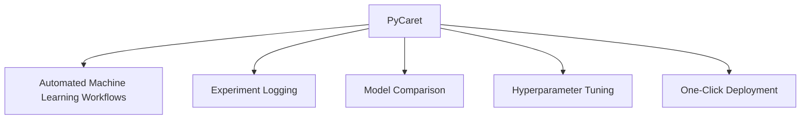
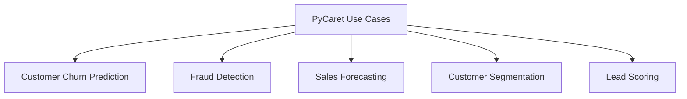
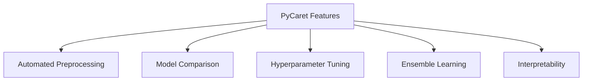

# PyCaret: Simplify Machine Learning with Low-Code

Automate and Streamline ML Workflows for Faster Deployment


## Introduction

### Overview

Welcome to PyCaret! Today, we're diving into this amazing open-source, low-code machine learning library in Python that automates machine learning workflows. Imagine being able to experiment with different models and deploy them efficiently without needing to write extensive code. That's what PyCaret is all about.

PyCaret makes the end-to-end machine learning process straightforward. It allows you to build, evaluate, and deploy models with minimal coding. With its user-friendly interface and comprehensive documentation, PyCaret ensures that you can quickly iterate through models and streamline your workflows.

For those new to PyCaret, let me share some helpful resources to get you started:

- [PyCaret GitHub Repository](https://github.com/pycaret/pycaret): Here, you can explore the source code, contribute, and stay updated with the latest developments.
- [PyCaret Documentation](https://pycaret.readthedocs.io/): This is your go-to for comprehensive guides and tutorials to help you understand and implement PyCaret.
- [Getting Started with PyCaret](https://pycaret.readthedocs.io/en/latest/tutorials.html): A perfect beginner-friendly guide to kickstart your journey with PyCaret.
- [PyCaret Community](https://github.com/pycaret/pycaret/discussions): Join the community to ask questions, share your projects, and collaborate with other PyCaret users.
- [PyCaret Blog](https://pycaret.gitbook.io/docs/learn-pycaret/official-blog): Stay updated with the latest news, insights, and tutorials from the PyCaret team.

### Learning Objectives

By the end of this tutorial, you will:
- Understand what PyCaret is and its significance in the AI/data landscape.
- Learn how to install and set up PyCaret.
- Explore PyCaret's core functionalities through practical examples.
- Discover how to apply PyCaret to solve real-world business problems.
- Gain hands-on experience with PyCaret through a challenge.

Now, let's get started on this exciting journey to simplify machine learning with PyCaret!

## Why PyCaret Matters

### Descriptive Overview

PyCaret is like your all-in-one toolkit for machine learning. It's a wrapper around some of the most powerful machine learning libraries and frameworks like scikit-learn, XGBoost, LightGBM, and CatBoost. What it does is provide a unified interface to train, evaluate, and deploy machine learning models with just a few lines of code. Imagine being able to handle complex ML workflows without getting bogged down in the details—that’s what PyCaret offers.

Let's break down some of the key features:



1. **Automated Machine Learning Workflows**: PyCaret takes care of the entire machine learning pipeline, from data preprocessing to model deployment. This includes tasks like feature engineering, model training, and evaluation, drastically reducing the time and effort needed to build machine learning models.
2. **Built-in Experiment Logging**: One of the standout features of PyCaret is that it automatically logs all your experiments. This includes model parameters, metrics, and results, making it super easy to track what you’ve tried and ensure reproducibility.
3. **Easy Model Comparison and Selection**: With functions like `compare_models()`, you can evaluate multiple models at once. PyCaret makes it simple to select the best-performing model based on various metrics without writing complex code.
4. **Automated Hyperparameter Tuning**: Finding the best hyperparameters for your model can be a tedious process. PyCaret includes tools for hyperparameter optimization, allowing you to fine-tune models efficiently for better performance.
5. **One-Click Deployment Capabilities**: Deploying models can often be a hassle, but PyCaret simplifies this with functions like `deploy_model()`. This lets you deploy models to cloud platforms such as AWS or Azure with just a single command.

### Business Use Cases

Now, let's explore how PyCaret can be applied to various business scenarios:



1. **Customer Churn Prediction**: PyCaret helps you identify which customers are likely to leave, allowing you to take proactive measures to retain them. By analyzing customer behavior data, you can build predictive models to foresee churn and act accordingly.
2. **Fraud Detection**: Implementing anomaly detection models to identify fraudulent transactions in real-time becomes straightforward with PyCaret. You can build and deploy models that monitor transactions and flag suspicious activities, helping to reduce fraud.
3. **Sales Forecasting**: Developing regression models to predict future sales and optimize inventory management is another powerful use case. PyCaret handles time series data effectively, providing accurate sales forecasts to help businesses plan better.
4. **Customer Segmentation**: By using clustering algorithms, PyCaret can group customers based on their behavior and characteristics. This enables businesses to tailor their marketing strategies and improve customer targeting.
5. **Lead Scoring**: Building classification models to prioritize leads and improve conversion rates is made easy. PyCaret analyzes historical data to identify factors that indicate high conversion potential, helping sales teams focus on the most promising leads.

PyCaret is like having a Swiss Army knife for machine learning—versatile, powerful, and incredibly user-friendly. Whether you're looking to predict customer churn, detect fraud, forecast sales, segment customers, or score leads, PyCaret can help you do it faster and more efficiently.

## Getting Started with PyCaret

### Installation and Setup

Let's dive into getting PyCaret up and running. It's really straightforward.

First, you need to install PyCaret. Open your terminal or command prompt and run:

```bash
pip install pycaret
```

If you want the full version with all dependencies, you can install it like this:

```bash
pip install pycaret[full]
```

### Initial Configuration

Once you have PyCaret installed, the next step is to set it up for use in your machine learning tasks. Here's how you do it:

1. **Import the Necessary Module**:
   Depending on whether you are working on a classification or regression task, you'll import the corresponding module. For classification tasks, you import from `pycaret.classification`, and for regression tasks, you import from `pycaret.regression`.

   ```python
   from pycaret.classification import *
   # For regression tasks, use: from pycaret.regression import *
   ```

2. **Load Your Dataset**:
   Load your dataset into a pandas DataFrame. Let's assume you have a CSV file containing your data.

   ```python
   import pandas as pd
   data = pd.read_csv('your_dataset.csv')
   ```

3. **Initialize the Setup**:
   Now, you initialize the PyCaret setup. This step prepares your data for modeling. You need to specify the dataset and the target column (the column you want to predict).

   ```python
   setup(data=data, target='target_column_name')
   ```

Let's break down what happens during the setup:

- **Data Preprocessing**: PyCaret automatically handles missing values, encodes categorical features, scales numerical features, and splits the data into training and testing sets.
- **Feature Engineering**: PyCaret can generate new features from existing ones, like extracting date parts from datetime columns.
- **Logging and Tracking**: PyCaret logs all the steps and parameters, making it easy to reproduce the results.

And that’s it! With just a few lines of code, you’ve prepared your data for machine learning with PyCaret. This streamlined process allows you to focus on building and tuning models rather than spending time on repetitive preprocessing tasks.

So go ahead and try it out with your dataset. It’s a powerful way to quickly get insights and build models that can drive your business decisions.

## Practical Examples

### Example 1: Customer Churn Prediction

Let's walk through a basic customer churn prediction model using PyCaret. This will give you a hands-on experience with how to use PyCaret for a typical machine learning task.


Here’s how you can do it step-by-step:

1. **Load the Dataset**:
   First, you need to load your customer data into a pandas DataFrame.

   ```python
   from pycaret.classification import *  # Import PyCaret's classification module
   import pandas as pd

   # Load the data
   data = pd.read_csv('customer_data.csv')  # Load the customer data from a CSV file
   ```

2. **Initialize the Setup**:
   Set up the PyCaret environment with your dataset and specify the target variable, which is 'Churn' in this case.

   ```python
   # Initialize setup
   setup(data=data, target='Churn', session_id=123)  # Set up the environment with the dataset and target variable
   ```

3. **Compare Models**:
   Use PyCaret’s `compare_models()` function to evaluate multiple models and find the best-performing one.

   ```python
   # Compare models
   best_model = compare_models()  # Compare different models to find the best one
   ```

4. **Create a Model**:
   Once you've identified the best model type, create it. Here, we use a Random Forest model as an example.

   ```python
   # Create a model
   model = create_model('rf')  # Create a Random Forest model
   ```

5. **Tune the Model**:
   Optimize the model's hyperparameters to improve its performance.

   ```python
   # Tune the model
   tuned_model = tune_model(model)  # Tune the model to optimize its performance
   ```

6. **Finalize the Model**:
   Prepare the model for deployment by finalizing it. This includes retraining the model on the entire dataset.

   ```python
   # Finalize the model
   final_model = finalize_model(tuned_model)  # Finalize the model for deployment
   ```

7. **Save the Model**:
   Save the finalized model to a file so you can use it later for making predictions.

   ```python
   # Save the model
   save_model(final_model, 'churn_model')  # Save the final model to a file
   ```

This example demonstrates how PyCaret simplifies the entire process of machine learning, from data ingestion and preprocessing to model selection, tuning, and finalization. With PyCaret, you can efficiently build robust machine learning models with minimal code, allowing you to focus more on interpreting the results and less on the technical details of model training.

By following these steps, you’ll have a powerful tool to predict customer churn, which can help your business take proactive measures to retain customers and reduce churn rates. Give it a try with your dataset and see how PyCaret can streamline your machine learning workflow!

### Example 2: Sales Forecasting

Now, let's dive into a more advanced example: sales forecasting. This will demonstrate how PyCaret can be used for regression tasks to predict future sales based on historical data.

Here's how you can do it step-by-step:

1. **Load the Dataset**:
   First, you need to load your sales data into a pandas DataFrame.

   ```python
   from pycaret.regression import *  # Import PyCaret's regression module
   import pandas as pd

   # Load the data
   data = pd.read_csv('sales_data.csv')  # Load the sales data from a CSV file
   ```

2. **Initialize the Setup**:
   Set up the PyCaret environment with your dataset and specify the target variable, which is 'Sales' in this case. You can also apply transformations to the target variable if needed.

   ```python
   # Initialize setup
   setup(data=data, target='Sales', transform_target=True, session_id=123)  # Set up the environment with the dataset and target variable
   ```

3. **Compare Models**:
   Use PyCaret’s `compare_models()` function to evaluate multiple models and find the best-performing one for your data.

   ```python
   # Compare models
   best_model = compare_models()  # Compare different models to find the best one
   ```

4. **Create a Model**:
   Once you've identified the best model type, create it. Here, we use a LightGBM model as an example.

   ```python
   # Create a model
   model = create_model('lightgbm')  # Create a LightGBM model
   ```

5. **Tune the Model**:
   Optimize the model's hyperparameters to improve its performance. You can specify the metric to optimize, such as Mean Absolute Error (MAE).

   ```python
   # Tune the model
   tuned_model = tune_model(model, optimize='MAE')  # Tune the model to optimize its performance based on Mean Absolute Error
   ```

6. **Plot Feature Importance**:
   Visualize the importance of different features in your model to understand which variables have the most impact on the predictions.

   ```python
   # Plot feature importance
   plot_model(tuned_model, plot='feature')  # Plot the importance of features
   ```

7. **Make Predictions**:
   Load new data and use the trained model to make predictions on this data. This can help you forecast future sales.

   ```python
   # Make predictions
   new_data = pd.read_csv('new_sales_data.csv')  # Load new sales data for predictions
   predictions = predict_model(tuned_model, data=new_data)  # Make predictions on the new data
   print(predictions)  # Print the predictions
   ```

This example showcases how PyCaret simplifies the process of building and deploying a regression model for sales forecasting. By following these steps, you can efficiently create a robust model that predicts future sales, analyzes feature importance, and provides actionable insights for business decisions. 

Give it a try with your dataset and see how PyCaret can enhance your sales forecasting capabilities!

## In-Depth Guide

### Detailed Features

Let's break down the powerful features that make PyCaret an essential tool for automating machine learning workflows:



1. **Automated Preprocessing**: PyCaret takes care of all the heavy lifting when it comes to preparing your data. This includes handling missing values, encoding categorical variables, and scaling features. By automating these tasks, PyCaret significantly reduces the time and effort required to get your data ready for modeling.

2. **Model Comparison**: With the `compare_models()` function, you can easily evaluate and compare multiple machine learning models based on various performance metrics. This feature is incredibly useful for identifying the best model for your specific task without having to manually test each one.

3. **Hyperparameter Tuning**: Optimizing model parameters can be a tedious and time-consuming process. PyCaret simplifies this with the `tune_model()` function, which uses techniques like grid search and random search to find the optimal hyperparameter settings for your model, ensuring you get the best possible performance.

4. **Ensemble Learning**: To further enhance model performance, PyCaret supports ensemble learning techniques. Functions like `blend_models()` and `stack_models()` allow you to combine multiple models, leveraging their strengths to achieve better predictive accuracy.

5. **Interpretability**: Understanding why a model makes certain predictions is crucial. PyCaret provides various tools and plots, such as SHAP values and feature importance plots, to help you interpret your model’s decisions. These insights ensure transparency and build trust in your model's predictions.

### Integration Tips

Here are some tips on how to integrate PyCaret with other tools and platforms to enhance your machine learning workflows:

1. **MLflow Integration**: PyCaret can be seamlessly integrated with MLflow for experiment tracking and model versioning. This integration helps you manage the entire lifecycle of your machine learning models, from experimentation to deployment, ensuring reproducibility and collaboration.

2. **Deployment**: PyCaret makes it easy to move your models from development to production. Use the `deploy_model()` function to deploy your models to cloud platforms like AWS or Azure with just a single command. This simplifies the deployment process and allows you to start making predictions in production environments quickly.

3. **Power BI Integration**: For those using Power BI for business intelligence, PyCaret can be integrated to provide advanced analytics within your dashboards and reports. This allows you to leverage machine learning models directly within Power BI, enhancing your data-driven decision-making capabilities.

4. **Batch Processing**: PyCaret can be incorporated into data pipelines for batch predictions on large datasets. This is particularly useful for applications like periodic reporting, where predictions need to be made regularly. By automating these predictions, you can ensure consistency and efficiency in your reporting processes.

5. **Real-time Predictions**: For applications requiring real-time decision-making, integrate PyCaret models with streaming platforms like Kafka. This setup enables your business to make immediate predictions based on the latest data, improving responsiveness and agility in dynamic environments.

## Actionable Takeaways

1. **Start with `setup()`**: Begin by preparing your data and environment using the `setup()` function. This step ensures that all necessary preprocessing is handled automatically.
2. **Use `compare_models()`**: Quickly identify the most promising models for your task by evaluating multiple models simultaneously with the `compare_models()` function.
3. **Leverage `tune_model()`**: Optimize your models’ hyperparameters using the `tune_model()` function to achieve better performance.
4. **Utilize Plotting Functions**: Take advantage of PyCaret's plotting functions to interpret your models and understand the importance of different features.
5. **Explore Ensemble Methods**: Improve your model performance by using ensemble methods like `blend_models()` and `stack_models()`.
6. **Integrate with MLflow**: For better experiment tracking and model management, consider integrating PyCaret with MLflow.

By mastering these features and tips, you'll be well-equipped to streamline your machine learning workflows and drive impactful data-driven decisions in your organization.

## Challenge: Customer Segmentation Model Using PyCaret

### Task Description

In this challenge, we're going to develop a customer segmentation model using PyCaret's clustering module. This task will help you gain hands-on experience with clustering algorithms and understand how to derive meaningful business insights from customer data. Whether you have a dataset of your own or use a publicly available customer dataset, the steps are designed to guide you through the process of setting up PyCaret, applying clustering algorithms, and interpreting the results.

### Implementation Steps

1. **Set Up PyCaret Environment**: First, we'll install and configure PyCaret.
2. **Load and Preprocess the Data**: We'll use PyCaret’s setup function to prepare our dataset for clustering.
3. **Compare Clustering Algorithms**: We'll utilize PyCaret to compare different clustering algorithms and select the best-performing model.
4. **Optimize the Model**: We'll fine-tune the chosen clustering model to improve its performance.
5. **Visualize the Clusters**: PyCaret’s plotting functions will help us visualize the clusters.
6. **Interpret the Results**: Finally, we'll analyze the formed clusters to provide business insights based on the segmentation.

### Example Workflow

Let's walk through the workflow step-by-step:

1. **Initialize the Environment**:
    - Set up the PyCaret environment and load your dataset.
    - Preprocess the data to handle missing values, encode categorical variables, and scale numerical features.

    ```python
    from pycaret.clustering import *  # Import PyCaret's clustering module
    import pandas as pd

    # Load your dataset
    data = pd.read_csv('customer_data.csv')  # Replace with your actual dataset path

    # Initialize setup
    setup(data=data, normalize=True, session_id=123)
    ```

2. **Compare Clustering Models**:
    - Use the `compare_models()` function to evaluate different clustering algorithms (e.g., K-Means, DBSCAN, Agglomerative Clustering).

    ```python
    best_model = compare_models()
    ```

3. **Select and Optimize the Model**:
    - Choose the best-performing model based on evaluation metrics.
    - Fine-tune the model’s parameters using PyCaret’s `tune_model()` function.

    ```python
    model = create_model('kmeans')  # Example with K-Means
    tuned_model = tune_model(model)
    ```

4. **Visualize the Results**:
    - Create visualizations to understand the distribution and characteristics of the clusters.
    - Use scatter plots, cluster centroids, and other relevant visual aids.

    ```python
    plot_model(tuned_model, plot='cluster')
    ```

5. **Provide Business Insights**:
    - Analyze the clusters to identify common characteristics and behaviors within each group.
    - Provide actionable insights for targeted marketing, personalized customer experiences, and other business strategies.

    ```python
    # Assign clusters to the original data
    clustered_data = assign_model(tuned_model)
    print(clustered_data.head())
    ```

### Expected Outcome

- **Model Creation and Evaluation**: You'll have a clustering model that effectively segments customers based on their data.
- **Visualization and Insights**: You'll produce clear visual representations of the clusters and derive comprehensive business insights from the analysis.

### Tips for Completion

- **Data Quality**: Ensure the data used for clustering is clean and well-labeled to improve model accuracy.
- **Optimize the Pipeline**: Experiment with different preprocessing and clustering configurations to enhance performance.
- **Monitor Execution**: Track model performance over time and update it with new data as needed.
- **Engage with the Community**: Share your progress and seek advice from the PyCaret community.

### Conclusion

This challenge is designed to help you apply PyCaret in a practical way, gaining hands-on experience with advanced clustering techniques to create impactful customer segmentation solutions. By completing this challenge, you'll learn to set up and use PyCaret, create and evaluate clustering models, and derive actionable business insights.

### Continue Learning

1. **Explore PyCaret Documentation**: Delve deeper into the advanced features and capabilities of PyCaret.
2. **Join the PyCaret Community**: Engage with other users and contributors to exchange knowledge and get support.
3. **Experiment with Different Models**: Try creating different types of models and integrating them into various business scenarios.
4. **Scale Up**: Consider deploying PyCaret in a production environment to handle larger datasets and more complex workflows.

By leveraging PyCaret, you can enhance your data processing capabilities, integrate AI seamlessly into your workflows, and make data-driven decisions with greater efficiency and accuracy.

### Additional Resources

[1] [PyCaret Official Website](https://pycaret.org)  
[2] [Machine Learning Mastery: PyCaret](https://machinelearningmastery.com/pycaret-for-machine-learning/)  
[3] [Towards Data Science: PyCaret Review](https://towardsdatascience.com/pycaret-review-65cbe2f663bb?gi=9d55d56d9f48)  
[4] [PyCaret Gitbook: Machine Learning in Power BI](https://pycaret.gitbook.io/docs/learn-pycaret/official-blog/machine-learning-in-power-bi-using-pycaret)  
[5] [PyCaret Gitbook: Predict Lead Score](https://pycaret.gitbook.io/docs/learn-pycaret/official-blog/predict-lead-score-the-right-way-using-pycaret)  
[6] [PyCaret Installation](https://pycaret.gitbook.io/docs/get-started/installation)  
[7] [DataCamp: Automating ML Workflows with PyCaret](https://www.datacamp.com/tutorial/guide-for-automating-ml-workflows-using-pycaret)  
[8] [PyCaret GitHub Examples](https://github.com/pycaret/examples)  
[9] [Towards Data Science: Predict Customer Churn with PyCaret](https://towardsdatascience.com/predict-customer-churn-the-right-way-using-pycaret-8ba6541608ac?gi=ca936b9a10fd)  
[10] [PyCaret Gitbook: Installation](https://pycaret.gitbook.io/docs/get-started/installation)  