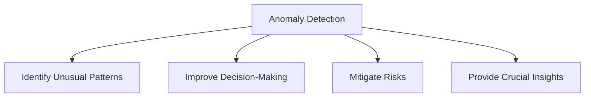
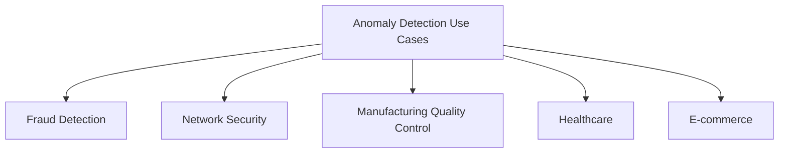
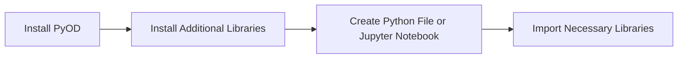
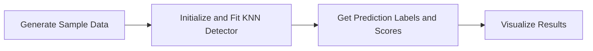
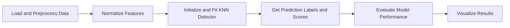
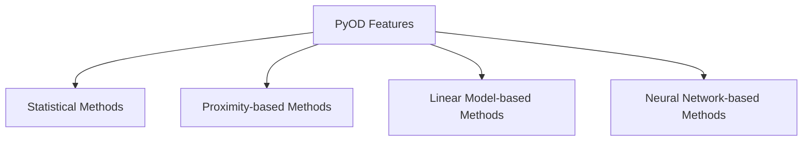

# Detect Anomalies with Advanced Tools and Frameworks

Identify Unusual Patterns in Your Datasets with Ease

## Introduction

### Overview

Anomaly detection is a critical component in the modern data science and AI landscape. It refers to the process of identifying rare items, events, or observations that deviate significantly from the majority of the data and raise suspicions. In today's data-driven business environment, the ability to detect anomalies can provide crucial insights, improve decision-making, and mitigate risks across various domains.

Anomaly detection techniques help businesses uncover unusual patterns that could indicate fraud, operational issues, or other significant events. These insights are essential for maintaining the integrity and security of business operations. The field encompasses a variety of methods and tools designed to analyze data and identify outliers effectively.

For those new to anomaly detection, here are some helpful links to get you started:

- [Anomaly Detection Algorithms](https://builtin.com/machine-learning/anomaly-detection-algorithms): Explore the fundamental algorithms used in anomaly detection, such as Isolation Forest, LOF, and more.
- [Anomaly Detection in Python](https://cnvrg.io/anomaly-detection-python/): A comprehensive guide to implementing anomaly detection techniques using Python.
- [Anomaly Detection Use Cases](https://www.datrics.ai/articles/anomaly-detection-definition-best-practices-and-use-cases): Discover practical applications of anomaly detection across various industries.
- [Scikit-learn Anomaly Detection](https://scikit-learn.org/0.20/auto_examples/plot_anomaly_comparison.html): Utilize popular machine learning libraries like scikit-learn to implement outlier detection in your projects.
- [Anomaly Detection in Time Series](https://neptune.ai/blog/anomaly-detection-in-time-series): Learn about specialized techniques for detecting anomalies in time-series data.
- [Anomaly Detection Research Papers](https://github.com/yzhao062/anomaly-detection-resources): Dive into academic research to understand the latest advancements and methodologies in anomaly detection.
- [Anomaly Detection Tools](https://www.predictiveanalyticstoday.com/top-anomaly-detection-software/): Explore various tools and platforms that facilitate anomaly detection in different data environments.

These resources provide a solid foundation for understanding and implementing anomaly detection in your business or research projects.

### Learning Objectives

By the end of this tutorial, you will:
- Understand the concept of anomaly detection and its importance in business.
- Learn about popular anomaly detection tools and frameworks.
- Gain hands-on experience in setting up and using an anomaly detection tool.
- Apply anomaly detection techniques to real-world business scenarios.
- Develop skills to integrate anomaly detection into existing data workflows.

## Why Anomaly Detection Matters

### Descriptive Overview

Anomaly detection tools and frameworks are designed to automatically identify patterns in data that do not conform to expected behavior. These tools employ various statistical and machine learning techniques to model normal behavior and flag deviations.



Key features often include:

1. **Unsupervised Learning**: Anomaly detection can work without labeled data, making it adaptable to various datasets where labeling is impractical. This is especially valuable in situations where manually labeling data is challenging or expensive.
2. **Real-time Detection**: These tools can identify anomalies as they happen, enabling immediate action to address critical issues, which reduces potential damage. This capability is crucial in applications like fraud detection or network security, where timely responses are essential.
3. **Scalability**: Anomaly detection tools are built to handle large datasets efficiently, ensuring robust performance even as data volumes grow. This scalability is vital for enterprise-level applications, allowing businesses to manage increasing data loads without compromising performance.
4. **Visualization**: These tools often include features for visualizing anomalies, making it easier to interpret and communicate findings. Visualization aids in quickly identifying and understanding the nature of anomalies, which is helpful for stakeholders.
5. **Integration**: Anomaly detection systems can seamlessly integrate into data pipelines and alerting systems, promoting smooth workflow integration and operational efficiency. This ensures that anomaly detection is part of regular data processing and monitoring routines, with alerts triggering appropriate responses.

### Business Use Cases

Anomaly detection has wide-ranging applications across industries:



1. **Fraud Detection**: By identifying unusual transactions, businesses can detect fraudulent activities in financial services. This helps financial institutions protect their customers and minimize financial losses.
2. **Network Security**: Anomaly detection can spot potential cyberattacks or network intrusions by recognizing abnormal patterns in network traffic. This enhances security by enabling quick responses to threats.
3. **Manufacturing Quality Control**: Detecting anomalies in production line data can help identify faulty products or equipment malfunctions, ensuring product quality and operational efficiency.
4. **Healthcare**: In healthcare, anomaly detection can aid in early diagnosis by identifying unusual patterns in patient data, leading to timely intervention and improved patient outcomes.
5. **E-commerce**: By detecting anomalies in user behavior, businesses can identify potential issues with website functionality or user experience, which leads to improved customer satisfaction and retention.

## Getting Started with Anomaly Detection

Alright, let's dive into the exciting world of anomaly detection using Python. We'll be working with a fantastic library called PyOD (Python Outlier Detection) to help us identify unusual patterns in our data. Let's get you all set up and running!

### Installation and Setup

First, we need to make sure we have everything we need. Here's what you'll do:



1. **Check Python Installation**:
    Make sure Python is installed on your system. If you don't have it yet, head over to [python.org](https://www.python.org/downloads/) and get the latest version.

2. **Install PyOD**:
    Open your terminal or command prompt and type:

    ```bash
    pip install pyod
    ```

    This command installs PyOD, the library we'll use for anomaly detection.

3. **Install Additional Libraries**:
    We'll also need a few more libraries to help with data manipulation and visualization. Install them by running:

    ```bash
    pip install numpy pandas matplotlib scikit-learn
    ```

    These libraries will support data handling, preprocessing, and plotting.

### Initial Configuration

Great! Now that we have everything installed, let's set up our project. You can choose to create a new Python file or a Jupyter notebook. Personally, I find Jupyter notebooks great for interactive work. Once you're ready, import the necessary libraries:

```python
import numpy as np
import pandas as pd
from pyod.models.knn import KNN
from pyod.utils.data import generate_data
import matplotlib.pyplot as plt
from sklearn.preprocessing import StandardScaler
```

Here’s what each library does:

- `numpy`: A fundamental package for scientific computing with Python.
- `pandas`: A powerful data manipulation and analysis library.
- `pyod.models.knn`: The K-Nearest Neighbors model from PyOD for anomaly detection.
- `pyod.utils.data`: Utilities from PyOD to generate sample data.
- `matplotlib.pyplot`: A plotting library for creating static, animated, and interactive visualizations.
- `sklearn.preprocessing.StandardScaler`: A tool for scaling features to have zero mean and unit variance, which helps in normalizing our data.

With these libraries, we're all set to start detecting anomalies in our data. Ready to get started? Let's move on to generating some data and exploring how to identify those outliers!

## Practical Examples

### Example 1: Basic Anomaly Detection with KNN

Let's kick things off with a straightforward example using the K-Nearest Neighbors (KNN) algorithm to detect anomalies. This example will walk you through generating sample data, fitting a KNN model, making predictions, and visualizing the results.

Here's the plan:



1. **Generate Sample Data**: We'll start by generating synthetic data with some known anomalies. This helps us understand how our model works in a controlled environment.

2. **Initialize and Fit KNN Detector**: We'll create a KNN detector and fit it to our data.

3. **Get Prediction Labels and Scores**: After fitting the model, we'll get the prediction labels and outlier scores.

4. **Visualize Results**: Finally, we'll plot the results to visualize which points are detected as anomalies.

Let's dive into the code:

```python
import numpy as np
import pandas as pd
from pyod.models.knn import KNN
from pyod.utils.data import generate_data
import matplotlib.pyplot as plt

# Step 1: Generate sample data
X_train, y_train = generate_data(n_train=200, n_features=2, contamination=0.1, random_state=42)

# Step 2: Initialize and fit the KNN detector
clf = KNN()
clf.fit(X_train)

# Step 3: Get the prediction labels and outlier scores
y_train_pred = clf.labels_  # binary labels (0: inliers, 1: outliers)
y_train_scores = clf.decision_scores_  # raw outlier scores

# Step 4: Visualize the results
plt.figure(figsize=(8, 6))
plt.scatter(X_train[y_train == 0, 0], X_train[y_train == 0, 1], label='Normal', alpha=0.7)
plt.scatter(X_train[y_train == 1, 0], X_train[y_train == 1, 1], color='r', label='Anomaly', alpha=0.7)
plt.title("KNN Anomaly Detection")
plt.xlabel("Feature 1")
plt.ylabel("Feature 2")
plt.legend()
plt.show()
```

Here's a breakdown of what we're doing in the code:

- **Step 1**: We generate synthetic data with 200 samples and 2 features. We introduce some contamination (10%) to create anomalies in our dataset.
- **Step 2**: We initialize the KNN detector from PyOD and fit it to our training data.
- **Step 3**: We obtain prediction labels (`0` for inliers and `1` for outliers) and outlier scores from the fitted model.
- **Step 4**: We visualize the results using a scatter plot. Normal data points are shown in one color, and anomalies are highlighted in red.

This example gives you a solid foundation in using KNN for anomaly detection. Next, you can try experimenting with different datasets and tweaking the model parameters to see how they affect the results. Happy detecting!

### Example 2: Real-world Scenario - Credit Card Fraud Detection

Now, let's dive into a practical application of anomaly detection: identifying fraudulent credit card transactions. We'll use a real-world dataset to illustrate how to load, preprocess, and apply anomaly detection techniques to detect potential fraud.

Here's the step-by-step plan:



1. **Load and Preprocess Data**: We'll start by loading the credit card transactions dataset and preparing it for analysis.
2. **Normalize Features**: To improve the performance of the anomaly detection algorithm, we'll normalize the features.
3. **Initialize and Fit KNN Detector**: We'll use the KNN algorithm to fit our data.
4. **Get Prediction Labels and Scores**: After fitting the model, we'll obtain the prediction labels and outlier scores.
5. **Evaluate Model Performance**: We'll evaluate how well the model performs in detecting fraudulent transactions using classification metrics.
6. **Visualize Results**: Finally, we'll use t-SNE to visualize the high-dimensional data in two dimensions.

Let's get started with the code:

```python
import numpy as np
import pandas as pd
from pyod.models.knn import KNN
from sklearn.preprocessing import StandardScaler
import matplotlib.pyplot as plt
from sklearn.metrics import classification_report
from sklearn.manifold import TSNE

# Step 1: Load the dataset
df = pd.read_csv('creditcard.csv')

# Step 2: Prepare the data by dropping non-relevant columns and setting up features and labels
X = df.drop(['Time', 'Class'], axis=1)
y = df['Class']

# Step 3: Normalize the features for better performance of the anomaly detection algorithm
scaler = StandardScaler()
X_normalized = scaler.fit_transform(X)

# Step 4: Initialize and fit the KNN detector
clf = KNN()
clf.fit(X_normalized)

# Step 5: Get the prediction labels and outlier scores
y_pred = clf.labels_
y_scores = clf.decision_scores_

# Evaluate the results using classification metrics
print(classification_report(y, y_pred))

# Step 6: Visualize the results using t-SNE for dimensionality reduction
X_tsne = TSNE(n_components=2, random_state=42).fit_transform(X_normalized)

plt.figure(figsize=(10, 8))
scatter = plt.scatter(X_tsne[:, 0], X_tsne[:, 1], c=y_pred, cmap='viridis')
plt.colorbar(scatter)
plt.title("Credit Card Transactions - Anomaly Detection")
plt.show()
```

Here's a breakdown of what we're doing:

- **Step 1**: We load the credit card transactions dataset. This dataset includes features of transactions and a 'Class' column indicating whether a transaction is fraudulent.
- **Step 2**: We prepare our dataset by dropping irrelevant columns ('Time') and separating the features (X) from the labels (y).
- **Step 3**: We normalize the features using `StandardScaler` to ensure the algorithm performs optimally.
- **Step 4**: We initialize the KNN detector and fit it to our normalized data.
- **Step 5**: We obtain prediction labels (`0` for normal transactions and `1` for anomalies) and outlier scores from the model. We then evaluate the model's performance using `classification_report` from scikit-learn.
- **Step 6**: We use t-SNE to reduce the dimensionality of our dataset to two dimensions for visualization. This helps us see how the model distinguishes between normal transactions and anomalies.

By following these steps, you can effectively use anomaly detection to identify fraudulent credit card transactions, gaining valuable insights and improving security measures. Now, it's your turn to apply these techniques to your own datasets and see the power of anomaly detection in action!

## In-Depth Guide

### Detailed Features of PyOD

PyOD offers a variety of algorithms to detect anomalies, catering to different types of data and anomaly detection needs. Let’s explore some of the key types of methods PyOD provides:



1. **Statistical Methods**:
   - **Gaussian Mixture Models (GMM): These algorithms identify outliers by modeling the data distribution and identifying points that deviate significantly from the expected statistical properties. They are particularly effective when the dataset follows a known distribution.

2. **Proximity-based Methods**:
   - **K-Nearest Neighbors (KNN): This method detects anomalies by evaluating the distance between data points. Points that are far from their neighbors are considered anomalies.
   - **Local Outlier Factor (LOF): This technique identifies anomalies based on the density of data points. It compares the local density of a point with that of its neighbors, flagging points that are in low-density regions as anomalies.

3. **Linear Model-based Methods**:
   - **Principal Component Analysis (PCA): PCA transforms data into a new space where anomalies are identified by their deviation from the principal components.
   - **Minimum Covariance Determinant (MCD): MCD fits a robust covariance estimator to the data, identifying points that lie far from the robust mean as anomalies.

4. **Neural Network-based Methods**:
   - **AutoEncoder**: This neural network-based approach reconstructs input data and identifies anomalies by comparing the original data with its reconstruction. Significant deviations indicate anomalies.

Each of these algorithms has its strengths and is suited to different types of data and anomaly detection tasks. Experimenting with various methods will help you determine which one works best for your specific needs.

### Integration Tips

To effectively integrate anomaly detection into your business workflows, consider the following tips:

1. **Data Pipeline Integration**:
   - Use tools like **Apache Airflow** or **Luigi** to build robust data pipelines that include anomaly detection steps. This ensures that data processing and analysis are seamless and efficient.

2. **Real-time Detection**:
   - Implement real-time anomaly detection using streaming platforms like **Apache Kafka** combined with PyOD. This setup allows for continuous monitoring and immediate detection of anomalies in real-time data streams.

3. **Visualization**:
   - Integrate anomaly detection results with dashboarding tools like **Grafana** or **Tableau**. Visual insights make it easier to interpret anomalies and communicate findings to stakeholders.

4. **Alerting**:
   - Set up alerting systems such as **PagerDuty** or **Slack** to notify relevant teams instantly when anomalies are detected. Prompt alerts ensure quick responses and mitigation of potential issues.

## Actionable Takeaways

### Key Points

- Anomaly detection is essential for identifying unusual patterns in data.
- PyOD offers a comprehensive set of tools for anomaly detection in Python.
- Choose the appropriate algorithm based on your data and specific use case.
- Preprocessing and normalization are crucial steps in anomaly detection.
- Visualization helps in understanding and communicating anomalies effectively.

### Implementation Steps

1. **Identify Potential Use Cases**:
   - Determine areas in your organization where anomaly detection can add value, such as fraud detection, network security, or quality control.

2. **Collect and Preprocess Data**:
   - Gather relevant data and preprocess it by handling missing values, encoding categorical variables, and normalizing features.

3. **Experiment with Different Algorithms**:
   - Use PyOD to try various anomaly detection algorithms to find the most suitable one for your data and use case.

4. **Evaluate and Fine-tune Models**:
   - Assess the performance of your models using appropriate metrics and fine-tune them to improve accuracy.

5. **Integrate into Data Workflows**:
   - Incorporate anomaly detection models into your existing data workflows to ensure continuous monitoring and analysis.

6. **Set Up Visualization and Alerting Systems**:
   - Use visualization tools to create dashboards and set up alerting systems to notify teams of detected anomalies for prompt action. 

By following these steps and tips, you can effectively integrate anomaly detection into your business processes, gaining valuable insights and enhancing decision-making capabilities.

## Challenge: Implement an Anomaly Detection System

### Task Description

You're now ready to take on a real-world challenge: developing an anomaly detection system to solve a specific problem in your work or projects. The goal is to choose a relevant dataset and apply multiple anomaly detection methods to identify unusual patterns. Here are some potential applications to inspire you:

- **Customer Churn Prediction**: Detect unusual patterns that may indicate potential customer churn.
- **Fraud Detection**: Identify anomalies in transaction data to spot potential fraud.
- **Network Security**: Monitor network traffic for unusual patterns that might indicate security threats.
- **Manufacturing Quality Control**: Detect defects or operational anomalies in production data.
- **Healthcare**: Spot unusual patterns in patient data that may indicate potential health issues.

### Implementation Steps

Here's a step-by-step guide to help you develop your anomaly detection system:

1. **Select and Load Your Data**:
   - Choose a dataset that is relevant to your specific problem.
   - Clean and preprocess the data to ensure it's ready for analysis.

2. **Apply Anomaly Detection Algorithms**:
   - Implement at least two different anomaly detection methods on your dataset.
   - Use PyOD or any other anomaly detection library suitable for your needs.

3. **Compare Algorithm Performance**:
   - Evaluate the performance of the applied algorithms using appropriate metrics.
   - Compare their effectiveness in detecting anomalies within your dataset.

4. **Visualize the Detected Anomalies**:
   - Create visualizations to highlight the anomalies detected by each algorithm.
   - Use tools like Matplotlib, Seaborn, or Plotly for effective visualization.

5. **Propose a Real-time Detection and Alerting System**:
   - Design a workflow for real-time anomaly detection.
   - Set up alerting mechanisms to notify relevant stakeholders when anomalies are detected.

### Expected Outcome

By the end of this challenge, you should have:

- **Data Preparation**: A clean and preprocessed dataset ready for anomaly detection.
- **Model Implementation**: Two different anomaly detection models applied to your dataset.
- **Performance Comparison**: A detailed comparison of the models' performance.
- **Visualization**: Clear visualizations highlighting the detected anomalies.
- **Real-time Detection Proposal**: A structured proposal for implementing real-time anomaly detection and alerting.

### Tips for Completion

- **Data Quality**: Ensure your dataset is free of errors and inconsistencies to improve the accuracy of your anomaly detection models.
- **Algorithm Selection**: Choose algorithms that are well-suited to your data and the types of anomalies you expect to find.
- **Performance Metrics**: Use metrics such as precision, recall, and F1-score to evaluate your models.
- **Visualization Tools**: Utilize Matplotlib, Seaborn, or Plotly to create effective data visualizations.
- **Documentation**: Keep detailed notes and document each step to ensure reproducibility and facilitate future improvements.

## Conclusion

Anomaly detection is a powerful technique for identifying unusual patterns in data, with applications across various industries. By mastering tools like PyOD and understanding different anomaly detection algorithms, you can gain valuable insights from your data and improve decision-making processes.

### Continue Learning

- **Explore Advanced Techniques**: Dive into more advanced anomaly detection techniques, such as time series anomaly detection.
- **Investigate Deep Learning Approaches**: Learn about deep learning-based methods for anomaly detection to handle complex data patterns.
- **Participate in Kaggle Competitions**: Join anomaly detection competitions on Kaggle to hone your skills and tackle real-world challenges.

By applying the concepts and techniques learned in this tutorial, you'll be well-equipped to tackle real-world anomaly detection challenges and drive value for your organization.

### Additional Resources

[1] [Wikipedia: Anomaly Detection](https://en.wikipedia.org/wiki/Anomaly_detection)
[2] [ScienceDirect: Anomaly Detection](https://www.sciencedirect.com/science/article/pii/S0169023X21000045)
[3] [SAS: Fraud Detection](https://www.sas.com/en_us/insights/fraud/fraud-detection.html)
[4] [Cisco: Network Security](https://www.cisco.com/c/en/us/products/security/what-is-network-security.html)
[5] [IBM: IoT Manufacturing Quality Control](https://www.ibm.com/blogs/internet-of-things/iot-manufacturing-quality-control/)
[6] [NCBI: Healthcare Anomaly Detection](https://www.ncbi.nlm.nih.gov/pmc/articles/PMC7349344/)
[7] [DataDog: Anomaly Detection](https://www.datadoghq.com/blog/monitoring-101-anomaly-detection/)
[8] [GitHub: PyOD](https://github.com/yzhao062/pyod)
[9] [Kaggle: Credit Card Fraud Detection](https://www.kaggle.com/mlg-ulb/creditcardfraud)
[10] [PyOD Documentation](https://pyod.readthedocs.io/en/latest/pyod.models.html)
[11] [Apache Airflow](https://airflow.apache.org/)
[12] [Apache Kafka](https://kafka.apache.org/)
[13] [Grafana](https://grafana.com/)
[14] [PagerDuty](https://www.pagerduty.com/)
[15] [TensorFlow: Time Series](https://www.tensorflow.org/tutorials/structured_data/time_series)
[16] [Arxiv: Deep Learning for Anomaly Detection](https://arxiv.org/abs/1901.03407)
[17] [ITRex Group: Anomaly Detection Benefits](https://itrexgroup.com/blog/what-is-anomaly-detection-and-how-can-it-benefit-your-company/)
[18] [PyPI: Anomaly Detection Framework](https://pypi.org/project/anomaly-detection-framework/)
[19] [StrongDM: Anomaly Detection](https://www.strongdm.com/blog/anomaly-detection)
[20] [Predictive Analytics Today: Anomaly Detection Software](https://www.predictiveanalyticstoday.com/top-anomaly-detection-software/)
[21] [CIO Influence: Anomaly Detection Software](https://cioinfluence.com/it-and-devops/top-10-anomaly-detection-software-for-secured-enterprise/)
[22] [GitHub: Anomaly Detection Resources](https://github.com/yzhao062/anomaly-detection-resources)
[23] [Scribble Data: Anomaly Detection Primer](https://www.scribbledata.io/blog/anomaly-detection-primer/)
[24] [PingPlotter: Anomaly Detection in Networks](https://www.pingplotter.com/wisdom/article/anomaly-detection-role-in-networks/)
[25] [TechMagic: AI Anomaly Detection](https://www.techmagic.co/blog/ai-anomaly-detection/)
[26] [Graylog: Anomaly Detection](https://go2docs.graylog.org/current/what_more_can_graylog_do_for_me/anomaly_detection.html)
[27] [OpenShift: Configuration Anomaly Detection](https://github.com/openshift/configuration-anomaly-detection)
[28] [Spiceworks: Network Behavior Anomaly Detection Tools](https://www.spiceworks.com/tech/networking/articles/network-behavior-anomaly-detection-tools/)
[29] [Aryng: Anomaly Detection](https://blog.aryng.com/anomaly-detection/)
[30] [Grid Dynamics: Anomaly Detection](https://www.griddynamics.com/solutions/anomaly-detection)
[31] [Itransition: Anomaly Detection](https://www.itransition.com/machine-learning/anomaly-detection)
[32] [Elastic: Machine Learning](https://www.elastic.co/guide/en/machine-learning/current/ml-getting-started.html)