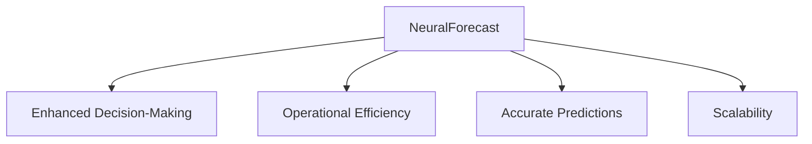
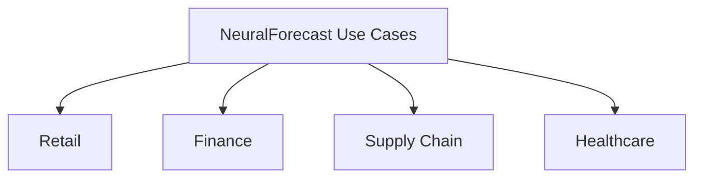
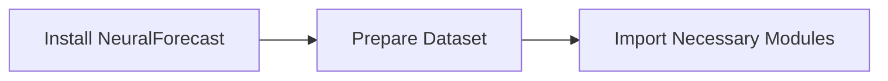
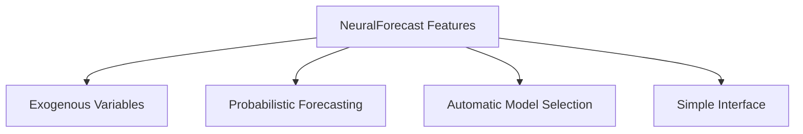

# NeuralForecast: Advanced Neural Network Time Series Forecasting	

Enhance Your Predictive Models with Cutting-Edge Neural Network Techniques


## Introduction

### Overview

Welcome to the world of [NeuralForecast](https://github.com/Nixtla/neuralforecast), a powerful Python library designed to elevate your time series forecasting capabilities using advanced neural networks. Whether you're familiar with classic architectures like RNNs and LSTMs or eager to explore cutting-edge models like N-BEATS and Temporal Fusion Transformers (TFT), NeuralForecast has got you covered.

NeuralForecast is all about usability, performance, and robustness, making it an invaluable tool for businesses aiming to leverage AI for predictive analytics. With its user-friendly interface and extensive [documentation](https://nixtlaverse.nixtla.io/neuralforecast/index.html), data scientists and engineers can easily implement and optimize forecasting models.

If you're new to NeuralForecast, here are some essential resources to get you started:

- [Getting Started with NeuralForecast](https://nixtlaverse.nixtla.io/neuralforecast/index.html#getting-started): This quickstart guide will help you begin using NeuralForecast in your projects.
- [Time Series Forecasting Models](https://nixtlaverse.nixtla.io/neuralforecast/models.models.html): Explore the various neural network models available for time series forecasting.
- [Installation Guide](https://nixtlaverse.nixtla.io/neuralforecast/index.html#installation): Step-by-step instructions on how to install NeuralForecast and its dependencies.
- [NeuralForecast Examples](https://github.com/Nixtla/neuralforecast/tree/main?tab=readme-ov-file#examples-and-guides): Practical examples demonstrating how to use NeuralForecast for different forecasting tasks.
- [NeuralForecast Community](https://github.com/Nixtla/neuralforecast/discussions): Join discussions and share insights with other professionals interested in time series forecasting.

These resources provide a comprehensive foundation for understanding and implementing NeuralForecast in your business or research projects, enabling you to harness the power of neural networks for accurate and reliable time series forecasting.

### Learning Objectives

By the end of this tutorial, you will:
- Understand the significance of NeuralForecast in the AI and data landscape.
- Learn how to install and configure NeuralForecast.
- Apply NeuralForecast to real-world business scenarios.
- Discover detailed features and integration tips for NeuralForecast.
- Implement actionable steps to use NeuralForecast in your business.

## Why NeuralForecast Matters

### Descriptive Overview

NeuralForecast is a game-changer for time series forecasting, making the power of neural networks accessible and efficient. It offers a suite of advanced models including MLP, LSTM, RNN, TCN, N-BEATS, NHITS, ESRNN, and TFT, with support for GPU acceleration to handle large datasets seamlessly.



1. **Enhanced Decision-Making**: NeuralForecast provides precise and reliable forecasts, empowering businesses to make well-informed decisions based on robust data insights. Whether it’s planning inventory, predicting sales trends, or managing resources, accurate forecasting is key to strategic planning.

2. **Operational Efficiency**: By automating and optimizing the forecasting process, NeuralForecast helps businesses save time and reduce the effort required for manual forecasting. This allows teams to focus on higher-value tasks while ensuring consistent and efficient operations.

3. **Accurate Predictions**: Utilizing state-of-the-art neural network models, NeuralForecast delivers high-quality predictions, significantly improving the accuracy of business forecasts and planning. This leads to better outcomes and a competitive edge in the market.

4. **Scalability**: With support for GPU acceleration and distributed training, NeuralForecast is built to handle extensive forecasting tasks. This makes it ideal for businesses with large datasets and substantial computational needs, ensuring that the forecasting process remains fast and scalable.

### Business Use Cases

NeuralForecast is versatile and can be applied across various industries to drive better decision-making and operational efficiency:



- **Retail**: Predicting sales trends to optimize inventory management. Accurate sales forecasts help retailers manage stock levels efficiently, reducing the risks of overstocking and stockouts, and ultimately enhancing customer satisfaction.

- **Finance**: Forecasting stock prices and market trends for better investment strategies. Financial institutions can leverage time series forecasting to predict market movements, aiding in informed investment decisions and effective risk management.

- **Supply Chain**: Anticipating demand to streamline logistics and reduce costs. Accurate demand forecasts enable supply chain managers to optimize logistics operations, minimize warehousing costs, and improve delivery times, leading to more efficient supply chain management.

- **Healthcare**: Predicting patient admissions to manage hospital resources effectively. Hospitals can use forecasting to predict patient admission rates, ensuring they have the necessary staff and resources available to provide quality patient care and maintain operational efficiency.

## Getting Started with NeuralForecast

### Installation and Setup

Let's walk through the steps to get NeuralForecast up and running. You can install it using either pip or conda:



To install NeuralForecast via pip, use the following command:

```bash
pip install neuralforecast
```

Alternatively, if you prefer using conda, you can install it with:

```bash
conda install -c conda-forge neuralforecast
```

If you're interested in development or contributing to the library, you might want to clone the repository and install it in editable mode:

```bash
git clone https://github.com/Nixtla/neuralforecast.git
cd neuralforecast
pip install -e .
```

### Initial Configuration

Once you have NeuralForecast installed, the next step is to import the necessary modules and prepare your dataset. Your dataset should be in a pandas DataFrame with the columns `unique_id`, `ds` (timestamp), and `y` (target variable).

Here's how you can set it up:

```python
import pandas as pd
from neuralforecast import NeuralForecast
from neuralforecast.models import NBEATS

# Create an example dataset
data = pd.DataFrame({
    'unique_id': ['A'] * 10,  # Unique identifier for the time series
    'ds': pd.date_range(start='2022-01-01', periods=10, freq='D'),  # Timestamps
    'y': [1, 2, 3, 4, 5, 6, 7, 8, 9, 10]  # Target variable
})

# Display the first few rows of the dataset
print(data.head())
```

This code snippet demonstrates how to create a simple dataset and prepare it for use with NeuralForecast. The `unique_id` column represents the identifier for the time series, `ds` holds the dates, and `y` contains the values you want to forecast.

With your environment set up and data prepared, you're now ready to dive into using NeuralForecast to create powerful forecasting models!

## Practical Examples

### Example 1: Basic Use Case

Let's dive into a simple example where we use the N-BEATS model to forecast future values. This will give you a hands-on understanding of how to set up and use NeuralForecast for your time series forecasting needs.

Here’s a step-by-step guide:

1. **Import the Necessary Libraries**: Start by importing the required libraries and modules.
2. **Create a Sample Dataset**: For demonstration purposes, we'll create a simple dataset.
3. **Initialize the N-BEATS Model**: Set up the N-BEATS model with specific parameters.
4. **Create a NeuralForecast Instance**: Use the N-BEATS model within a NeuralForecast instance.
5. **Fit the Model**: Train the model using the provided dataset.
6. **Make Predictions**: Forecast future values and print the predictions.

Let's see this in action:

```python
# Step 1: Import the necessary libraries
from neuralforecast import NeuralForecast
from neuralforecast.models import NBEATS
import pandas as pd

# Step 2: Create a sample dataset
data = pd.DataFrame({
    'unique_id': ['A'] * 10,  # Unique identifier for the time series
    'ds': pd.date_range(start='2022-01-01', periods=10, freq='D'),  # Timestamps
    'y': [1, 2, 3, 4, 5, 6, 7, 8, 9, 10]  # Target variable
})

# Step 3: Initialize the N-BEATS model
model = NBEATS(input_size=7, h=3, max_steps=100)  # input_size is the lookback period, h is the forecast horizon

# Step 4: Create a NeuralForecast instance with the N-BEATS model
nf = NeuralForecast(models=[model], freq='D')  # freq='D' indicates daily data

# Step 5: Fit the model to the dataset
nf.fit(df=data)

# Step 6: Predict future values
predictions = nf.predict()
print(predictions)
```

### Explanation

- **Data Preparation**: We create a DataFrame with `unique_id` representing the time series identifier, `ds` for the dates, and `y` for the values we want to forecast.
- **Model Initialization**: We initialize the N-BEATS model, specifying parameters like `input_size` (number of past observations to consider) and `h` (forecast horizon).
- **NeuralForecast Instance**: We create an instance of NeuralForecast, passing our model and specifying the frequency of the data.
- **Model Fitting**: We fit the model to our dataset using the `fit` method.
- **Making Predictions**: Finally, we use the `predict` method to forecast future values and print the results.

This example illustrates the simplicity and power of NeuralForecast in setting up and running neural network-based time series forecasting models. Feel free to experiment with different parameters and models to see how they affect the forecasts!

### Example 2: Advanced Application

In this example, we'll step up the complexity by using the Temporal Fusion Transformer (TFT) model, which allows us to include exogenous variables in our forecasting. This is useful when external factors (like promotions, weather, or economic indicators) can influence the forecast.

Here's a step-by-step guide to implementing this:

1. **Import Libraries and Prepare Data**: Start by importing the necessary libraries and creating a dataset that includes an exogenous variable.

2. **Initialize the TFT Model**: Set up the TFT model with parameters that account for exogenous variables.

3. **Create a NeuralForecast Instance**: Use the TFT model within a NeuralForecast instance.

4. **Fit the Model**: Train the model using the provided dataset.

5. **Make Predictions**: Forecast future values and print the predictions.

Let's see this in action:

```python
# Step 1: Import Libraries and Prepare Data
from neuralforecast import NeuralForecast
from neuralforecast.models import TFT
import pandas as pd

# Sample dataset with exogenous variables
data = pd.DataFrame({
    'unique_id': ['A'] * 10,  # Unique identifier for the time series
    'ds': pd.date_range(start='2022-01-01', periods=10, freq='D'),  # Timestamps
    'y': [1, 2, 3, 4, 5, 6, 7, 8, 9, 10],  # Target variable
    'exog': [0.1, 0.2, 0.3, 0.4, 0.5, 0.6, 0.7, 0.8, 0.9, 1.0]  # Exogenous variable
})

# Step 2: Initialize the TFT Model
model = TFT(input_size=7, h=3, max_steps=100, futr_exog_list=['exog'])  # Include exogenous variables

# Step 3: Create a NeuralForecast Instance with the TFT Model
nf = NeuralForecast(models=[model], freq='D')  # freq='D' indicates daily data

# Step 4: Fit the Model to the Dataset
nf.fit(df=data)

# Step 5: Predict Future Values
predictions = nf.predict()
print(predictions)
```

### Comments and Explanation

1. **Import Libraries and Prepare Data**:
   - We import necessary modules from `neuralforecast` and `pandas`.
   - The dataset includes columns for the unique identifier (`unique_id`), timestamps (`ds`), target variable (`y`), and an exogenous variable (`exog`).

2. **Initialize Model**:
   - We initialize the TFT model by specifying parameters like `input_size` (number of past observations to consider), `h` (forecast horizon), `max_steps`, and `futr_exog_list` to include exogenous variables.

3. **Create NeuralForecast Instance**:
   - An instance of `NeuralForecast` is created with the TFT model. The `freq` parameter indicates the frequency of the data (daily in this case).

4. **Fit Model**:
   - The `fit` method is used to train the model on the dataset.

5. **Predict Future Values**:
   - The `predict` method is used to forecast future values. We then print the predictions to see the results.

This example demonstrates the power and flexibility of NeuralForecast in handling more complex forecasting tasks that include exogenous variables, providing more accurate and informative forecasts. Experiment with different parameters and models to see how they impact your forecasts and tailor them to your specific use cases!

## In-Depth Guide

NeuralForecast comes packed with several advanced features that make time series forecasting more powerful and flexible:



### Key Features

1. **Exogenous Variables**: NeuralForecast supports the inclusion of static, historical, and future exogenous variables. This means you can incorporate additional relevant information, such as holidays, promotions, or economic indicators, which can significantly enhance the accuracy of your forecasts.

2. **Probabilistic Forecasting**: With model adapters for quantile losses and parametric distributions, NeuralForecast allows you to generate prediction intervals along with point forecasts. This feature provides a more comprehensive understanding of the uncertainties in your future projections, enabling better risk management and planning.

3. **Automatic Model Selection**: NeuralForecast automates the process of selecting the best model configuration through parallelized hyperparameter tuning. This means the library efficiently searches through various hyperparameter spaces to find the optimal setup, saving you time and improving the performance of your models.

4. **Simple Interface**: Designed with a unified, SKLearn-like interface, NeuralForecast is easy to use. This intuitive design allows you to apply different models and techniques without extensive learning curves, facilitating quick adoption and experimentation.

### Integration Tips

To seamlessly integrate NeuralForecast into your existing workflows and systems, consider the following tips:

1. **Data Pipelines**: Utilize pandas or polars DataFrames for seamless data integration. These powerful data manipulation libraries will help you preprocess and transform your data efficiently before feeding it into NeuralForecast models.

2. **GPU Acceleration**: Ensure CUDA is installed to leverage GPU capabilities. Utilizing GPUs can drastically speed up the training and inference processes, especially when working with large datasets or complex models.

3. **Distributed Training**: Integrate NeuralForecast with Spark for distributed training on large datasets. This allows you to scale your training processes across multiple machines, making it feasible to handle very large time series datasets efficiently.

## Actionable Takeaways

### Key Points

- **NeuralForecast** simplifies neural network-based time series forecasting.
- It supports a wide range of models and advanced features like exogenous variables and probabilistic forecasting.
- The library is designed for usability and performance, making it suitable for various business applications.

### Implementation Steps

1. **Install NeuralForecast**: Use pip or conda for easy installation.
    ```bash
    pip install neuralforecast
    ```
    or
    ```bash
    conda install -c conda-forge neuralforecast
    ```

2. **Prepare Data**: Ensure your dataset is formatted correctly with columns such as `unique_id`, `ds` (timestamp), and `y` (target variable).

    ```python
    import pandas as pd

    # Example dataset
    data = pd.DataFrame({
        'unique_id': ['A'] * 10,
        'ds': pd.date_range(start='2022-01-01', periods=10, freq='D'),
        'y': [1, 2, 3, 4, 5, 6, 7, 8, 9, 10]
    })
    ```

3. **Select Model**: Choose an appropriate model based on your forecasting needs. For instance, you might use the N-BEATS model for a basic forecast or the TFT model for incorporating exogenous variables.

    ```python
    from neuralforecast.models import NBEATS

    model = NBEATS(input_size=7, h=3, max_steps=100)
    ```

4. **Train Model**: Fit the model to your data.

    ```python
    from neuralforecast import NeuralForecast

    nf = NeuralForecast(models=[model], freq='D')
    nf.fit(df=data)
    ```

5. **Make Predictions**: Use the trained model to forecast future values.

    ```python
    predictions = nf.predict()
    print(predictions)
    ```

By following these steps and leveraging the advanced features of NeuralForecast, you can enhance your time series forecasting capabilities, making your predictive models more accurate and robust.

## Challenge: Implement a Forecasting Model Using NeuralForecast

### Task Description

Develop a forecasting model using NeuralForecast on your business data. Select a relevant problem in your work or projects that could benefit from accurate time series forecasting. Examples include:

- **Sales Forecasting**: Predict future sales to optimize inventory and supply chain management.
- **Financial Market Prediction**: Forecast stock prices or market trends for better investment strategies.
- **Demand Planning**: Anticipate demand to streamline logistics and reduce costs.
- **Healthcare Resource Management**: Predict patient admissions to manage hospital resources effectively.

### Implementation Steps

1. **Select and Load Your Data**: Choose and clean a relevant dataset for analysis.
2. **Prepare Data**: Format the dataset with `unique_id`, `ds` (timestamp), and `y` (target variable) columns, and include any exogenous variables.
3. **Choose a Model**: Select an appropriate model from NeuralForecast, such as N-BEATS or TFT.
4. **Configure the Model**: Set hyperparameters, including input size, horizon, and exogenous variables.
5. **Train the Model**: Fit the model to your data and monitor the training process.
6. **Evaluate Performance**: Assess the model using metrics like MAPE, MAE, or RMSE.
7. **Make Predictions**: Forecast future values and analyze the results.
8. **Document the Process**: Record each step, decisions made, and outcomes for reproducibility and insights.

### Expected Outcome

- **Data Preparation**: A clean and well-prepared dataset.
- **Model Training**: A trained forecasting model with configured hyperparameters.
- **Performance Evaluation**: Detailed evaluation of the model's performance, including metrics and visualizations.
- **Forecasting**: Accurate forecasts for the selected business problem.
- **Documentation**: A comprehensive report documenting the process, insights, and areas for improvement.

### Tips for Completion

- **Data Quality**: Ensure the dataset is clean and preprocessed to remove anomalies.
- **Model Selection**: Choose models that suit your data and forecasting horizon.
- **Hyperparameter Tuning**: Experiment with different hyperparameters for optimal settings.
- **Performance Metrics**: Use appropriate metrics to evaluate forecast accuracy.
- **Visualization Tools**: Utilize visualization tools to present results and gain insights.
- **Documentation**: Keep detailed notes for reproducibility and future reference.

## Conclusion

By implementing a forecasting model with NeuralForecast, you gain hands-on experience with advanced time series forecasting techniques. This challenge helps you improve decision-making processes through accurate predictions and actionable insights.

### Continue Learning

- Explore more advanced time series forecasting techniques, such as hierarchical forecasting and ensemble methods.
- Investigate deep learning-based approaches for time series analysis.
- Participate in Kaggle competitions related to time series forecasting to further hone your skills.

By applying the concepts and techniques learned in this tutorial, you'll be well-equipped to tackle real-world forecasting challenges and drive value for your organization.

### Additional Resources

[1] [NeuralForecast GitHub Repository](https://github.com/Nixtla/neuralforecast)
[2] [NeuralForecast Documentation](https://nixtlaverse.nixtla.io/neuralforecast/index.html)
[3] [NeuralForecast Examples](https://github.com/Nixtla/neuralforecast/tree/main?tab=readme-ov-file#examples-and-guides)
[4] [Time Series Forecasting with TensorFlow](https://www.tensorflow.org/tutorials/structured_data/time_series)
[5] [Machine Learning Mastery: Time Series Forecasting](https://machinelearningmastery.com/time-series-forecasting/)
[6] [Towards Data Science: Time Series Forecasting](https://towardsdatascience.com/time-series-forecasting-using-neural-networks-43c7f457d862)
[7] [Arxiv: Deep Learning for Time Series Forecasting](https://arxiv.org/abs/2006.14166)
[8] [NIxtla: Time Series Forecasting Resources](https://nixtla.github.io/)