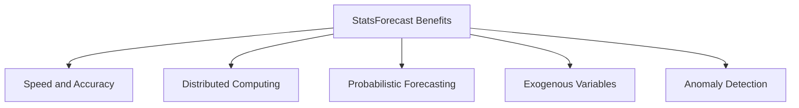
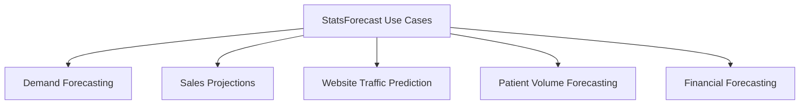
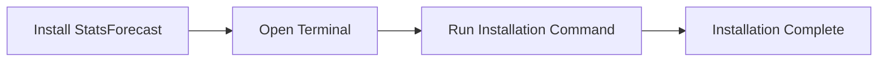
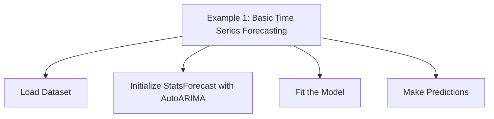
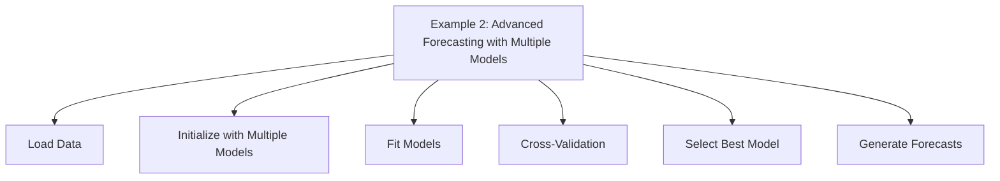

# Accurate Predictions with StatsForecast

Utilize Statistical Models for Reliable Time Series Forecasting


## Introduction

### Overview

Welcome to the world of [StatsForecast](https://github.com/Nixtla/statsforecast)! This powerful library brings together a collection of widely used statistical and econometric models designed for time series forecasting. Created by Nixtla, StatsForecast features lightning-fast implementations of popular models like ARIMA, ETS, and Theta, all optimized for high performance using Numba.

StatsForecast is all about efficiency and accuracy, making it an essential tool for enhancing your forecasting capabilities. Whether you're a data scientist or an engineer, its user-friendly interface and comprehensive [documentation](https://nixtla.github.io/statsforecast/docs/getting-started) will help you easily implement and optimize statistical models.

For those just starting with StatsForecast, here are some helpful links to get you going:

## Examples and Guides

- [End to End Walkthrough](https://nixtla.github.io/statsforecast/docs/getting-started/getting_started_complete.html): Learn how to train, evaluate, and select models for multiple time series.
- [Anomaly Detection](https://nixtla.github.io/statsforecast/docs/tutorials/anomalydetection.html): Discover how to detect anomalies in time series using in-sample prediction intervals.
- [Cross Validation](https://nixtla.github.io/statsforecast/docs/tutorials/crossvalidation.html): Understand robust methods for evaluating model performance.
- [Multiple Seasonalities](https://nixtla.github.io/statsforecast/docs/tutorials/multipleseasonalities.html): Explore forecasting data with multiple seasonal patterns using an MSTL.
- [Predict Demand Peaks](https://nixtla.github.io/statsforecast/docs/tutorials/electricitypeakforecasting.html): Learn about electricity load forecasting to detect daily peaks and reduce electric bills.
- [Intermittent Demand](https://nixtla.github.io/statsforecast/docs/tutorials/intermittentdata.html): Get techniques for forecasting series with very few non-zero observations.
- [Exogenous Regressors](https://nixtla.github.io/statsforecast/docs/how-to-guides/exogenous.html): Incorporate external factors like weather or prices into your forecasts.

These resources will provide you with a solid foundation for understanding and implementing StatsForecast in your business or research projects. By harnessing the power of statistical models, you'll achieve accurate and reliable time series forecasting.

### Learning Objectives

By the end of this tutorial, you will:
- Understand the core functionalities of StatsForecast.
- Learn how to install and set up StatsForecast.
- Gain practical experience with basic and advanced forecasting techniques.
- Discover how to apply StatsForecast in real-world business scenarios.

## Why StatsForecast Matters

### Descriptive Overview

StatsForecast stands out in the AI/data landscape due to its focus on speed, simplicity, and scalability. Here’s what makes it exceptional:



1. **Fast and Accurate Implementations**: StatsForecast provides high-performance implementations of popular statistical models like AutoARIMA, AutoETS, AutoCES, MSTL, and Theta. These models are optimized with Numba, ensuring they run efficiently even on large datasets, delivering accurate forecasts quickly.

2. **Compatibility with Distributed Computing**: StatsForecast works seamlessly with distributed computing frameworks like Spark, Dask, and Ray. This allows it to handle large-scale time series data across multiple machines, making it perfect for enterprise-level forecasting tasks.

3. **Probabilistic Forecasting**: The library supports probabilistic forecasting, which means it can generate prediction intervals alongside point forecasts. This helps quantify the uncertainty in predictions, providing a range of possible future values and improving decision-making.

4. **Support for Exogenous Variables**: StatsForecast can incorporate external factors (exogenous variables) and static covariates into the forecasting models. This allows users to include relevant external information, such as economic indicators or promotional events, that may impact forecast accuracy.

5. **Anomaly Detection Capabilities**: Beyond forecasting, StatsForecast offers anomaly detection features. This helps identify outliers or unusual patterns in the time series data, which can be critical for detecting potential issues or opportunities early.

### Business Use Cases

StatsForecast can be applied in various business scenarios to improve performance:



1. **Demand Forecasting**: Retail companies can use StatsForecast to predict product demand, optimizing inventory management. Accurate demand forecasts help retailers maintain appropriate stock levels, reduce excess inventory, and minimize stockouts, ultimately improving customer satisfaction and profitability.

2. **Sales Projections**: Businesses can leverage StatsForecast to forecast future sales, aiding in resource allocation and goal setting. By predicting sales trends, companies can better plan their marketing strategies, budget allocations, and resource needs, ensuring they meet their sales targets.

3. **Website Traffic Prediction**: Online platforms can anticipate visitor numbers using StatsForecast, helping with server resource planning. Predicting traffic patterns enables website administrators to allocate server resources effectively, ensuring a smooth user experience during peak times and optimizing costs.

4. **Patient Volume Forecasting**: Hospitals can predict patient influx with StatsForecast, improving staff scheduling and resource management. Accurate forecasts of patient volume help hospitals manage their staffing levels, ensure adequate availability of medical supplies, and optimize bed usage, leading to better patient care and operational efficiency.

5. **Financial Forecasting**: Companies can project future financial performance using StatsForecast, assisting in budgeting and strategic planning. Financial forecasts provide insights into revenue trends, expense patterns, and cash flow, enabling businesses to make informed decisions about investments, cost management, and growth strategies.

## Getting Started with StatsForecast

### Installation and Setup

Let's walk through the installation and setup of StatsForecast. It's straightforward and quick, so you'll be up and running in no time.



First, open your terminal or command prompt. Once you're ready, run the following command to install StatsForecast:

```bash
pip install statsforecast
```

If you prefer using Conda, you can install it with:

```bash
conda install -c conda-forge statsforecast
```

For those who want the latest version directly from the source, you can install it from the GitHub repository with:

```bash
pip install git+https://github.com/Nixtla/statsforecast.git
```

### Initial Configuration

Great! Now that you have StatsForecast installed, let's get it set up in your Python environment. You'll need to import the library and any specific models you plan to use. Here's how you do it:

```python
from statsforecast import StatsForecast
from statsforecast.models import AutoARIMA
```

And that's it! You're all set to start using StatsForecast for your time series forecasting needs. Let's move on to some practical examples to see how it works in action.

## Practical Examples

Let's dive into some practical examples to see StatsForecast in action. We'll start with a basic time series forecasting task and then move on to a more advanced scenario involving multiple models and cross-validation.



### Example 1: Basic Time Series Forecasting

We'll use the Air Passengers dataset for this example:

```python
from statsforecast import StatsForecast
from statsforecast.models import AutoARIMA
from statsforecast.utils import AirPassengersDF

# Load the dataset
df = AirPassengersDF

# Initialize StatsForecast with AutoARIMA model
sf = StatsForecast(
    models=[AutoARIMA(season_length=12)],
    freq='M'  # Monthly frequency
)

# Fit the model to the dataset
sf.fit(df)

# Make predictions for the next 12 months
forecasts = sf.predict(h=12)
print(forecasts)
```

In this example, you'll:
1. Load the dataset.
2. Initialize StatsForecast with an AutoARIMA model.
3. Fit the model to the data.
4. Generate forecasts for the next 12 months.


### Example 2: Advanced Forecasting with Multiple Models

Let's explore a more advanced scenario using multiple models and cross-validation:




```python
from statsforecast import StatsForecast
from statsforecast.models import AutoARIMA, AutoETS, AutoTheta
import pandas as pd

# Load your data (replace 'your_data.csv' with your actual dataset)
df = pd.read_csv('your_data.csv')

# Initialize StatsForecast with multiple models
sf = StatsForecast(
    models=[
        AutoARIMA(season_length=12),  # AutoARIMA model with a season length of 12
        AutoETS(season_length=12),    # AutoETS model with a season length of 12
        AutoTheta(season_length=12)   # AutoTheta model with a season length of 12
    ],
    freq='M'  # Monthly frequency
)

# Fit the models to the dataset
sf.fit(df)

# Perform cross-validation with a horizon of 12 and a step size of 1
cv_results = sf.cross_validation(df, h=12, step_size=1)

# Select the best model based on Mean Absolute Percentage Error (MAPE)
best_model = cv_results.groupby('model').mean()['MAPE'].idxmin()

# Make predictions using the best model, with prediction intervals at 80% and 95% confidence levels
forecasts = sf.predict(h=12, level=[80, 95])
print(f"Best model: {best_model}")
print(forecasts)
```

This example showcases:
1. Loading your data.
2. Initializing StatsForecast with multiple models.
3. Fitting the models to the dataset.
4. Performing cross-validation to evaluate model performance.
5. Selecting the best model based on MAPE (Mean Absolute Percentage Error).
6. Generating forecasts with prediction intervals.

## In-Depth Guide

Let's dive deeper into the features and best practices for using StatsForecast effectively.

### Detailed Features

1. **AutoARIMA**:
   - Automatically selects the best ARIMA model based on information criteria like AIC (Akaike Information Criterion).
   - This feature simplifies the process of model selection and ensures that the chosen model provides the best fit for the data.

2. **AutoETS**:
   - Implements automatic exponential smoothing with various trend and seasonal components.
   - AutoETS models are suitable for data with complex seasonal patterns and trends, providing accurate and reliable forecasts.

3. **AutoTheta**:
   - Provides automatic Theta model selection and forecasting, a robust method known for its accuracy in time series forecasting.
   - The Theta model decomposes the time series into different components, improving forecast performance.

4. **Cross-validation**:
   - Allows for robust model evaluation and selection by splitting the data into training and validation sets multiple times.
   - Cross-validation helps in assessing the model's performance and selecting the most reliable one, reducing the risk of overfitting.

5. **Probabilistic Forecasting**:
   - Generates prediction intervals for uncertainty quantification.
   - This feature provides a range of possible future values, helping users understand the uncertainty in their forecasts and make better-informed decisions.

### Integration Tips

1. **Data Preparation**:
   - Ensure your time series data is clean and properly formatted with a consistent frequency.
   - Proper data preparation, including handling missing values and outliers, is crucial for accurate forecasting.

2. **Exogenous Variables**:
   - Incorporate external factors that might influence your forecasts using the `X` parameter in the `fit` and `predict` methods.
   - Including relevant exogenous variables can significantly improve the accuracy of your forecasts by accounting for additional information that impacts the target variable.

3. **Distributed Computing**:
   - Leverage Spark, Dask, or Ray for large-scale forecasting tasks by using the appropriate integration modules.
   - Distributed computing allows you to scale your forecasting operations across multiple nodes, handling large datasets efficiently and reducing computation time.

## Actionable Takeaways

1. **Start Simple**:
   - Begin with a straightforward model like AutoARIMA for your time series data.
   - This helps you get a quick baseline forecast and understand the data's characteristics.

2. **Use Cross-validation**:
   - Compare multiple models using cross-validation to select the best performer.
   - This technique ensures your model generalizes well to unseen data, providing more reliable forecasts.

3. **Incorporate Exogenous Variables**:
   - When relevant external factors are available, include them in your model to improve forecast accuracy.
   - This can add significant predictive power by accounting for additional influences on the target variable.

4. **Understand Uncertainty**:
   - Utilize probabilistic forecasting to grasp the range of possible outcomes.
   - Understanding the uncertainty in your predictions helps in risk management and better decision-making.

5. **Scale Up When Needed**:
   - For large-scale forecasting tasks, explore distributed computing options like Spark, Dask, or Ray.
   - Scaling up your computations allows you to handle larger datasets efficiently, making your forecasting process faster and more robust.

## Challenge: Implement a Sales Forecasting System Using StatsForecast

### Task Description

Let's dive into a practical challenge where you'll implement a sales forecasting system using StatsForecast. This exercise will help you apply what you've learned to a real-world scenario in your work or projects. Think of an area where accurate sales forecasting could provide significant benefits. Here are some examples:

- **E-commerce**: Forecast daily sales to optimize inventory and logistics.
- **Retail**: Predict weekly sales to plan promotions and manage stock levels.
- **Manufacturing**: Anticipate demand to align production schedules and supply chain management.

### Implementation Steps

1. **Select and Load Your Data**: Choose a relevant dataset for sales forecasting. Ensure it's clean and well-prepared.
2. **Prepare Data**: Format your dataset with columns for timestamps and sales figures. Include any relevant exogenous variables that might impact sales, such as promotions or holidays.
3. **Choose Models**: Select appropriate models from StatsForecast, such as AutoARIMA, AutoETS, or AutoTheta.
4. **Configure the Models**: Set the hyperparameters for the chosen models, including season length and exogenous variables.
5. **Train the Models**: Fit the models to your data and monitor the training process to ensure they are learning correctly.
6. **Perform Cross-Validation**: Evaluate the models using cross-validation to compare their performance. This helps in selecting the most reliable model.
7. **Select the Best Model**: Choose the best-performing model based on metrics like MAPE (Mean Absolute Percentage Error).
8. **Generate Forecasts**: Use the best model to forecast future sales. Analyze the results to understand trends and patterns.
9. **Visualize the Results**: Use a plotting library to visualize forecasts and prediction intervals. This helps in communicating your findings effectively.
10. **Document the Process**: Record each step, the decisions made, and the outcomes. This documentation will be useful for reproducibility and future reference.

### Expected Outcome

By the end of this challenge, you should have:

- **Data Preparation**: A clean and well-prepared dataset, ready for forecasting.
- **Model Training**: Trained forecasting models with configured hyperparameters.
- **Performance Evaluation**: Detailed evaluation of the models' performance, including metrics and visualizations.
- **Forecasting**: Accurate forecasts for your sales data, complete with prediction intervals.
- **Documentation**: A comprehensive report or notebook documenting the process, insights, and areas for improvement.

### Tips for Completion

- **Data Quality**: Ensure the dataset is free from errors and anomalies.
- **Model Selection**: Choose models that suit your data characteristics and forecasting horizon.
- **Hyperparameter Tuning**: Experiment with different hyperparameters to find the optimal settings for your models.
- **Performance Metrics**: Use appropriate metrics like MAPE, MAE, or RMSE to evaluate forecast accuracy.
- **Visualization Tools**: Use tools like Matplotlib, Seaborn, or Plotly to create clear and informative visualizations.
- **Documentation**: Keep detailed notes for reproducibility and to provide insights for future improvements.

## Conclusion

StatsForecast offers a powerful and efficient toolkit for time series forecasting in various business contexts. By leveraging its statistical models and advanced features, you can make more informed decisions based on accurate predictions of future trends.

### Continue Learning

1. **Explore the StatsForecast Documentation**: Dive deeper into the advanced features and capabilities of StatsForecast to fully leverage its potential.
2. **Join the Nixtla Community**: Engage with other users and contributors on Slack to exchange knowledge, get support, and stay updated on the latest developments.
3. **Experiment with Integration**: Try integrating StatsForecast into your existing data pipelines and business intelligence tools for seamless forecasting operations.
4. **Participate in Competitions**: Join time series forecasting competitions on platforms like Kaggle to further hone your skills and apply what you've learned.

By mastering StatsForecast, you'll be well-equipped to tackle complex time series forecasting challenges in your business, leading to improved planning, resource allocation, and decision-making.

### Additional Resources

1. [StatsForecast GitHub Repository](https://github.com/Nixtla/statsforecast)
2. [Fast Time Series Forecasting with StatsForecast](https://towardsdatascience.com/fast-time-series-forecasting-with-statsforecast-694d1670a2f3)
3. [StatsForecast Overview](https://nixtlaverse.nixtla.io/statsforecast/index.html)
4. [AutoCES in StatsForecast](https://www.sktime.net/en/latest/api_reference/auto_generated/sktime.forecasting.statsforecast.StatsForecastAutoCES.html)
5. [ARIMA and SARIMA Real-World Time Series Forecasting Guide](https://neptune.ai/blog/arima-sarima-real-world-time-series-forecasting-guide)
6. [StatsForecast on PyPI](https://pypi.org/project/statsforecast/)
7. [StatsForecast Getting Started Guide](https://nixtlaverse.nixtla.io/statsforecast/docs/getting-started/getting_started_complete.html)
8. [Time Series Forecasting with StatsForecast and MindsDB](https://mindsdb.com/blog/time-series-forecasting-with-nixtlas-statsforecast-and-mindsdb-using-sql)
9. [Business Applications of Forecasting](https://scinapse.ai/blog/6-business-applications-forecasting-machine-learni)
10. [StatsForecast Installation Guide](https://nixtlaverse.nixtla.io/statsforecast/docs/getting-started/installation.html)