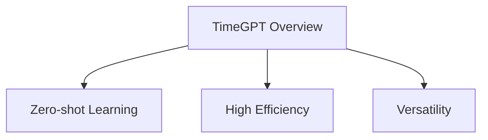
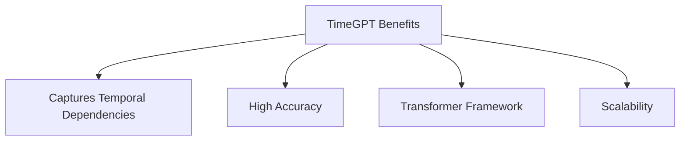
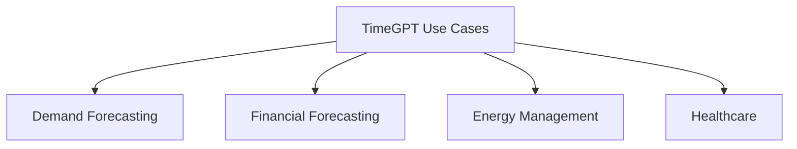
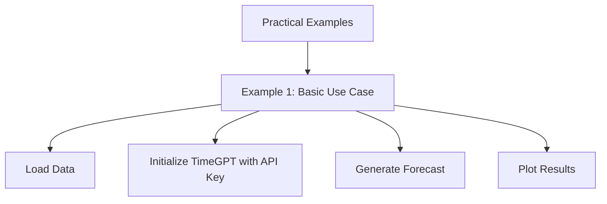
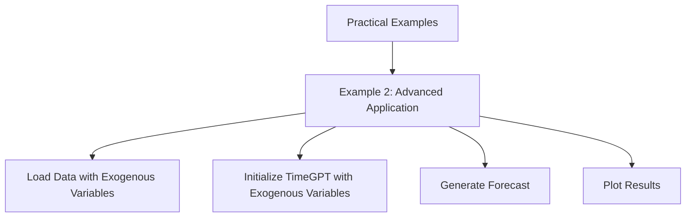

# TimeGPT: Future-Proof Your Forecasting

Leverage GPT Models for State-of-the-Art Time Series Predictions


## Introduction

### Overview

Welcome to the world of [TimeGPT](https://nixtlaverse.nixtla.io/nixtla/docs/getting-started/introduction.html)! TimeGPT is an advanced time series forecasting model that uses Generative Pre-trained Transformers (GPTs) to predict future values based on historical data. This model is a game-changer in the AI and data landscape, offering unparalleled accuracy and efficiency for time series forecasting.

Accurate forecasting is vital for decision-making across various industries, including finance, retail, healthcare, and energy. With TimeGPT's cutting-edge technology, businesses can rely on precise predictions to guide their strategies and operations. Plus, its user-friendly interface and thorough [documentation](https://nixtlaverse.nixtla.io/nixtla/docs/getting-started/introduction.html) make it easy for data scientists and engineers to implement and fine-tune forecasting models.

For those who are just starting with TimeGPT, here are some helpful links to get you going:

- [Getting Started with TimeGPT](https://nixtlaverse.nixtla.io/nixtla/docs/getting-started/getting-started.html): A comprehensive guide to help you begin using TimeGPT in your projects[1].
- [TimeGPT Quickstart](https://docs.nixtla.io/docs/getting-started-timegpt_quickstart): A step-by-step guide to quickly set up and start making forecasts with TimeGPT[5].
- [Installation Guide](https://docs.nixtla.io): Instructions on how to install TimeGPT and its dependencies, including how to set up your API key[2].
- [TimeGPT Examples](https://docs.nixtla.io/docs/capabilities-forecast-quickstart): Practical examples demonstrating how to use TimeGPT for different forecasting tasks[3].
- [API Reference](https://nixtlaverse.nixtla.io/nixtla/docs/api-reference.html): Detailed documentation of the TimeGPT API for advanced users.
- [TimeGPT Community](https://github.com/Nixtla/nixtla/discussions): Join discussions and share insights with other professionals interested in time series forecasting[4].
- [Advanced Techniques](https://nixtlaverse.nixtla.io/nixtla/docs/getting-started/introduction.html): Explore advanced forecasting methods, including anomaly detection, fine-tuning models, and scaling computations[8].
- [Real-World Applications](https://arxiv.org/abs/2404.04885): Discover how TimeGPT is applied in real-world scenarios, such as load forecasting in energy systems[7].

These resources provide a comprehensive foundation for anyone looking to get started with TimeGPT, from installation and basic usage to advanced techniques and real-world applications. The links offer access to official documentation, community discussions, and academic research to support users at various levels of expertise.

### Key Features



- **Zero-shot Learning**: TimeGPT excels at making accurate predictions without extensive retraining on new datasets, saving you time and computational resources.
- **High Efficiency**: Optimized for speed and performance, TimeGPT handles large datasets effortlessly, providing quick and reliable forecasts.
- **Versatility**: Suitable for various applications, from finance to healthcare, TimeGPT adapts to different time series forecasting needs, making it a versatile tool for any industry.

By mastering TimeGPT, you'll be well-equipped to tackle complex time series forecasting challenges and drive data-driven decision-making in your organization. Let's get started!

## Why TimeGPT Matters

### Descriptive Overview

TimeGPT is designed to automatically learn from the structure of time series data, predicting future values with high accuracy. Its architecture is based on a transformer framework, enabling the model to capture complex temporal dependencies and relationships within the data. Let’s dive into why TimeGPT stands out:



- **Captures Temporal Dependencies**: TimeGPT effectively captures and understands the temporal relationships within your data, making it adept at forecasting future values based on past patterns.
- **High Accuracy**: Leveraging advanced transformer architecture, TimeGPT provides highly accurate predictions, essential for making informed business decisions.
- **Transformer Framework**: The transformer model at the core of TimeGPT allows it to handle complex datasets and uncover intricate patterns that simpler models might miss.
- **Scalability**: Whether you have small or large datasets, TimeGPT scales efficiently, ensuring robust performance regardless of data size.

### Key Features

- **Zero-shot Learning Capabilities**: Imagine being able to forecast new datasets without retraining. TimeGPT does just that by leveraging its pre-trained knowledge. This means you get quick and accurate predictions without the need for extensive model training. Perfect for businesses that need fast insights!
- **High Efficiency**: TimeGPT processes large datasets swiftly, thanks to its advanced transformer architecture. This ensures you get timely forecasts, allowing you to make quick, informed decisions and stay ahead of trends.
- **Versatility**: No matter your industry—be it finance, retail, healthcare, or energy—TimeGPT is adaptable. Its flexible design allows it to handle different types of time series data, making it a versatile tool for various forecasting needs.

### Business Use Cases

TimeGPT can be applied in numerous business scenarios to enhance performance. Let’s look at some specific examples:



- **Demand Forecasting**: By predicting future product demand, businesses can optimize inventory levels. This reduces stockouts and excess inventory, leading to improved inventory management and increased profitability. Imagine being able to anticipate exactly how much stock you need next month!
  
- **Financial Forecasting**: TimeGPT helps anticipate market trends, enabling better investment decisions. By analyzing historical financial data, it predicts future market movements, helping investors and financial analysts develop more effective strategies. Think about making investment decisions with confidence, backed by accurate predictions.

- **Energy Management**: Forecasting energy consumption is crucial for optimizing resource allocation. Utilities and energy providers can use TimeGPT to predict usage patterns, thereby enhancing energy efficiency and resource management. Picture being able to manage energy resources effectively, reducing waste, and saving costs.

- **Healthcare**: Managing hospital resources is critical, especially predicting patient admission rates. TimeGPT can forecast patient inflow, aiding in better staffing, bed management, and resource allocation. This leads to improved patient care and operational efficiency. Imagine a hospital that’s always prepared, no matter the patient volume.

By integrating TimeGPT into your business operations, you can leverage its powerful forecasting capabilities to drive better decision-making and enhance overall efficiency. Let's get started with some practical applications!

## Getting Started with TimeGPT

### Installation and Setup

Let's walk through the steps to install and set up TimeGPT:


1. **Install Python**: First, ensure that Python is installed on your system. If you don't have it yet, you can download and install it from [python.org](https://www.python.org/downloads/).
   
2. **Install TimeGPT**: Open your terminal or command prompt and run the following command to install TimeGPT via pip:
   
   ```bash
   pip install timegpt
   ```

3. **Set Up API Key**: Obtain an API key from the TimeGPT provider. This key is crucial as it allows you to access TimeGPT's powerful forecasting capabilities. Set it up in your environment by adding it to your script or configuring it in your environment variables.

### Initial Configuration

Now, let's get everything set up in your Python environment:

1. **Import TimeGPT**: Start by importing the TimeGPT library in your Python script. This is your gateway to utilizing TimeGPT’s advanced features.
   ```python
   from timegpt import TimeGPT
   ```

2. **Initialize the Model**: Next, initialize the TimeGPT model with your API key. This step connects your script to the TimeGPT service.
   ```python
   model = TimeGPT(api_key='your_api_key')
   ```

3. **Load Data**: Finally, load your time series data into a pandas DataFrame. Pandas is a powerful library for data manipulation and analysis, making it easy to handle your time series data.
   ```python
   import pandas as pd

   # Load your dataset
   data = pd.read_csv('your_data.csv')
   ```

And there you have it! You’re all set up to start using TimeGPT for your forecasting needs. This foundational setup ensures that you can now leverage TimeGPT's powerful capabilities to generate accurate predictions and enhance your decision-making processes. 

Ready to dive into some practical examples? Let’s go!

## Practical Examples

### Example 1: Basic Use Case

**Objective**: Forecasting monthly sales data.



1. **Prepare Data**:
   ```python
   import pandas as pd

   # Load the sales data
   data = pd.read_csv('monthly_sales.csv')
   ```

2. **Initialize TimeGPT and Generate Forecast**:
   ```python
   from timegpt import TimeGPT

   # Initialize the TimeGPT model with your API key
   model = TimeGPT(api_key='your_api_key')

   # Generate the forecast
   forecast = model.forecast(data, target='sales', time_column='date')
   ```

3. **Plot Results**:
   ```python
   import matplotlib.pyplot as plt

   # Plot actual vs forecasted sales
   plt.plot(data['date'], data['sales'], label='Actual')
   plt.plot(forecast['date'], forecast['sales'], label='Forecast')
   plt.legend()
   plt.show()
   ```

### Example 2: Advanced Application

**Objective**: Predicting energy consumption with additional features.



1. **Prepare Data**:
   ```python
   import pandas as pd

   # Load the energy consumption data
   data = pd.read_csv('energy_consumption.csv')
   ```

2. **Initialize TimeGPT and Generate Forecast with Exogenous Variables**:
   ```python
   from timegpt import TimeGPT

   # Initialize the TimeGPT model with your API key
   model = TimeGPT(api_key='your_api_key')

   # Generate the forecast including exogenous variables
   forecast = model.forecast(data, target='consumption', time_column='date', exogenous_columns=['temperature', 'humidity'])
   ```

3. **Plot Results**:
   ```python
   import matplotlib.pyplot as plt

   # Plot actual vs forecasted energy consumption
   plt.plot(data['date'], data['consumption'], label='Actual')
   plt.plot(forecast['date'], forecast['consumption'], label='Forecast')
   plt.legend()
   plt.show()
   ```

These examples show how to leverage TimeGPT for both basic and advanced time series forecasting tasks. In the first example, we forecast monthly sales data using just the historical sales figures. In the second example, we enhance our forecasting model by including additional features like temperature and humidity, which are relevant for predicting energy consumption. By following these steps, you can harness the power of TimeGPT to make accurate and insightful forecasts for your specific needs.

## In-Depth Guide

### Detailed Features

Let's dive into some of the standout features of TimeGPT that make it a powerful tool for time series forecasting:

- **Zero-shot Inference**: One of the most remarkable capabilities of TimeGPT is its ability to generate forecasts without prior training on the specific dataset. This means you can use TimeGPT immediately on new data, eliminating the need for model retraining. This feature significantly reduces the time and effort required to get insights, enabling quicker decision-making.

- **Scalability**: TimeGPT efficiently handles large datasets, making it ideal for big data applications. Its scalable architecture ensures that it can process and analyze vast amounts of time series data swiftly. This is particularly beneficial for enterprises dealing with extensive forecasting needs, where processing speed and data volume are crucial.

- **Versatility**: TimeGPT is designed to be flexible and adaptable, making it applicable across various domains such as finance, retail, energy, and healthcare. This versatility allows it to provide accurate forecasts for different types of time series data, catering to a wide range of industries and use cases.

### Integration Tips

To get the most out of TimeGPT, here are some tips for integrating it into your systems and workflows:

- **API Integration**: Utilize TimeGPT's API for seamless integration with your existing systems. By leveraging the API, you can incorporate TimeGPT's forecasting capabilities into your workflows smoothly, ensuring efficient data processing and analysis. This allows for real-time forecasting and automated decision-making within your business operations.

- **Data Preprocessing**: Ensure your data is clean and well-formatted to achieve optimal results with TimeGPT. Proper data preprocessing is crucial—handle missing values and outliers diligently. Clean and structured data helps TimeGPT generate more reliable and accurate predictions, enhancing the quality of your forecasts.

- **Model Fine-tuning**: To further enhance accuracy, fine-tune the model for your specific use cases. Adjusting TimeGPT's parameters and settings for particular datasets or forecasting needs can significantly improve its performance. Tailoring the model to your business requirements ensures that you get precise and relevant forecasts.

## Actionable Takeaways

### Key Points

- **High-accuracy Forecasting**: TimeGPT leverages the advanced GPT architecture for high-accuracy time series forecasting.
- **Efficiency and Versatility**: It offers zero-shot learning, making it highly efficient and versatile for various forecasting needs.
- **Industry Applicability**: Applicable across multiple industries, TimeGPT enhances decision-making and operational efficiency.

### Implementation Steps

Here’s how you can get started with TimeGPT:

1. **Install and Set Up TimeGPT**: Begin by installing TimeGPT and setting it up in your Python environment.
2. **Load and Preprocess Your Data**: Prepare your time series data by loading it into a pandas DataFrame and ensuring it is clean and well-formatted.
3. **Generate Forecasts**: Use TimeGPT to generate forecasts for your time series data, leveraging its powerful zero-shot inference capabilities.
4. **Integrate the Model**: Incorporate TimeGPT into your business workflows through its API, ensuring seamless integration and real-time forecasting capabilities. 

By following these steps, you can harness the power of TimeGPT to make informed decisions and improve operational efficiency in your business.

## Challenge: Implement a Sales Forecasting System Using TimeGPT

### Task Description

Let's dive into a practical challenge: implementing a sales forecasting system using TimeGPT. This task is designed to apply TimeGPT's powerful capabilities to real-world scenarios where accurate sales forecasting is crucial. Whether you're in retail, e-commerce, or manufacturing, forecasting sales can significantly optimize your operations and drive better decision-making.

Here are a few examples of how this can be applied:
- **Retail Business**: Forecast sales for the next quarter to optimize inventory and manage promotions.
- **E-commerce**: Predict future sales to improve logistics and reduce stockouts.
- **Manufacturing**: Anticipate product demand to align production schedules and manage the supply chain effectively.

### Implementation Steps

Follow these steps to build your sales forecasting system with TimeGPT:

1. **Select and Load Your Data**: Choose a relevant dataset that includes historical sales data. Clean and preprocess the data to ensure it is free of anomalies and ready for analysis.

   ```python
   import pandas as pd

   # Load your sales data
   data = pd.read_csv('sales_data.csv')
   ```

2. **Prepare Data**: Format your dataset to include columns for timestamps (e.g., date), sales figures, and any relevant exogenous variables such as promotions or holidays.

   ```python
   data['date'] = pd.to_datetime(data['date'])
   data = data.sort_values(by='date')
   ```

3. **Install and Set Up TimeGPT**: Make sure you have TimeGPT installed. Use pip for installation and set up your API key.

   ```bash
   pip install timegpt
   ```

   ```python
   from timegpt import TimeGPT

   # Initialize TimeGPT with your API key
   model = TimeGPT(api_key='your_api_key')
   ```

4. **Initialize the Model**: Import TimeGPT and initialize it with your API key to authenticate and prepare the model for use.

   ```python
   model = TimeGPT(api_key='your_api_key')
   ```

5. **Generate Forecasts**: Use TimeGPT to forecast future sales based on your historical data and analyze the results.

   ```python
   forecast = model.forecast(data, target='sales', time_column='date')
   ```

6. **Evaluate Model Performance**: Assess the model's accuracy using appropriate metrics such as Mean Absolute Percentage Error (MAPE), Root Mean Squared Error (RMSE), and others. Visualize the forecasted results alongside actual sales data to understand the model's performance.

   ```python
   import matplotlib.pyplot as plt

   # Plot actual vs forecasted sales
   plt.plot(data['date'], data['sales'], label='Actual Sales')
   plt.plot(forecast['date'], forecast['sales'], label='Forecasted Sales')
   plt.legend()
   plt.show()
   ```

7. **Integrate Forecasts**: Incorporate the sales forecasts into your business workflows. This could involve updating inventory management systems, adjusting marketing strategies, or planning production schedules based on the forecasted demand.

8. **Document the Process**: Keep detailed notes on each step, the decisions you made, and the outcomes. This documentation will be invaluable for future reference, reproducibility, and continuous improvement of your forecasting system.

### Expected Outcome

- **Data Preparation**: You should have a clean and well-prepared dataset ready for analysis.
- **Model Initialization**: TimeGPT should be successfully installed, set up, and initialized with your API key.
- **Forecast Generation**: You will generate accurate sales forecasts for the next quarter or your specified time horizon.
- **Performance Evaluation**: You will evaluate the model's performance using metrics and visualizations, providing insights into its accuracy and reliability.
- **Integration and Documentation**: Sales forecasts will be integrated into your business workflows, and the entire process will be documented for future reference and continuous improvement.

### Tips for Completion

- **Data Quality**: Ensure your dataset is clean and well-preprocessed. Removing anomalies and handling missing values is crucial for accurate forecasting.
- **Exogenous Variables**: Incorporate relevant external factors (exogenous variables) that could impact sales, such as holidays, promotions, and economic indicators.
- **Performance Metrics**: Use appropriate metrics to evaluate forecast accuracy. Understanding these metrics will help you gauge the model's performance effectively.
- **Visualization Tools**: Utilize tools like Matplotlib or Seaborn to visualize your data and forecast results. Clear visualizations can provide valuable insights and aid in decision-making.
- **Documentation**: Maintain detailed documentation of your process. This practice ensures reproducibility and helps in refining and improving your forecasting system over time.

## Conclusion

TimeGPT offers a robust and efficient toolkit for time series forecasting, making it applicable in various business contexts. By leveraging its GPT-based architecture, you can generate accurate predictions and make more informed decisions to optimize your operations.

### Continue Learning

1. **Explore the TimeGPT Documentation**: Dive deeper into the advanced features and capabilities of TimeGPT to fully leverage its potential.
2. **Join the TimeGPT Community**: Engage with other users and contributors to exchange knowledge, get support, and stay updated on the latest developments.
3. **Experiment with Integration**: Try integrating TimeGPT into your existing data pipelines and business intelligence tools for seamless forecasting operations.
4. **Participate in Competitions**: Join time series forecasting competitions on platforms like Kaggle to further hone your skills and apply what you've learned.

By mastering TimeGPT, you'll be well-equipped to tackle complex time series forecasting challenges in your business, leading to improved planning, resource allocation, and decision-making.

### Additional Resources

1. [TimeGPT: The First Generative Pre-trained Transformer for Time Series](https://www.reddit.com/r/MachineLearning/comments/176wsne/r_timegpt_the_first_generative_pretrained/)
2. [Revolutionising Time Series Forecasting](https://www.linkedin.com/pulse/timegpt-revolutionising-time-series-forecasting-celia-lozano-grijalba-owysf)
3. [Leveraging TimeGPT for Superior Forecasting Accuracy](https://www.sumoanalytics.ai/post/how-sumo-analytics-ai-leverages-timegpt-and-algorithmic-diversity-for-forecasting-with-superior-accu)
4. [Nixtla Documentation](https://docs.nixtla.io)
5. [TimeGPT in R](https://docs.nixtla.io/docs/reference-timegpt_in_r)
6. [Getting Started with TimeGPT](https://docs.nixtla.io/docs/getting-started-about_timegpt)
7. [Generative AI for Time Series](https://d1.awsstatic.com/events/Summits/reinvent2023/IDE204_TimeGPT-Generative-AI-for-time-series.pdf)
8. [Nixtla GitHub Repository](https://github.com/Nixtla/nixtla)
9.  [Forecast Quickstart](https://docs.nixtla.io/docs/capabilities-forecast-quickstart)
10. [The First Foundation Model for Time Series Forecasting](https://towardsdatascience.com/timegpt-the-first-foundation-model-for-time-series-forecasting-bf0a75e63b3a)
11. [Key Concepts in TimeGPT](https://docs.nixtla.io/docs/key-concepts)