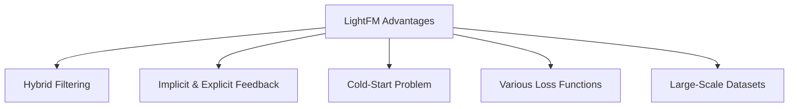
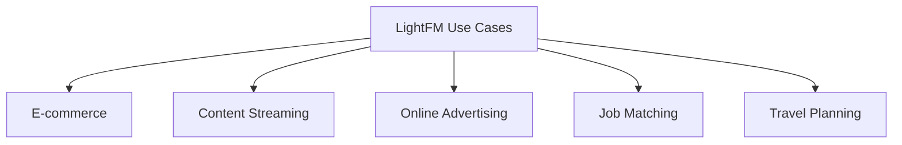

# LightFM: Hybrid Recommendations Made Easy

Combine Collaborative and Content-Based Filtering for Better Recommendations


## Introduction

### Overview

Welcome to LightFM! Today, we're going to explore an incredibly powerful recommendation algorithm that blends collaborative and content-based filtering approaches. LightFM is a game-changer in the AI and data science world because it tackles common challenges in recommendation systems, like the cold-start problem and handling sparse data.

LightFM’s innovative approach ensures that users get highly relevant recommendations by using both user interaction data and item attributes. This makes it an invaluable tool for businesses aiming to boost their recommendation systems. Plus, its user-friendly interface and comprehensive documentation make it a breeze for data scientists and engineers to implement and optimize their models.

Here are some essential resources to get you started with LightFM:

- [Getting Started with LightFM](https://making.lyst.com/lightfm/docs/home.html): This is your go-to guide for beginning your journey with LightFM.
- [LightFM API Reference](https://making.lyst.com/lightfm/docs/lightfm.html): Dive deep into the API documentation for advanced usage.
- [Installation Guide](https://making.lyst.com/lightfm/docs/home.html#installation): Step-by-step instructions to install LightFM and its dependencies.
- [LightFM Examples](https://github.com/lyst/lightfm/tree/master/examples): Check out practical examples that show how to use LightFM for different recommendation tasks.
- [LightFM on PyPI](https://pypi.org/project/lightfm/): Visit the Python Package Index page for installation instructions and an overview.
- [LightFM GitHub Repository](https://github.com/lyst/lightfm): Here’s where you can find the source code, contribute, and report issues.
- [Quickstart Guide](https://making.lyst.com/lightfm/docs/home.html#quickstart): A quick tutorial using the MovieLens dataset to get you up and running fast.
- [How to Cite LightFM](https://github.com/lyst/lightfm#how-to-cite): Learn how to properly cite LightFM in your research or projects.

These resources will give you a solid foundation to understand and implement LightFM in your business or research projects, enabling you to leverage the power of hybrid recommendation algorithms for highly accurate and relevant suggestions.

### Learning Objectives

By the end of this tutorial, you will:

- Understand the core concepts behind LightFM and hybrid recommender systems.
- Learn how to implement LightFM in Python for various recommendation tasks.
- Explore practical business use cases and applications of LightFM.
- Gain hands-on experience through step-by-step examples and a challenge.
  
## Why LightFM Matters

### Descriptive Overview

LightFM is a Python implementation of a hybrid recommendation algorithm that combines both collaborative and content-based filtering. This powerful approach ensures that users receive accurate and relevant recommendations by leveraging multiple types of data. Let's dive into why LightFM is a standout tool in the recommendation landscape.



- **Combines Collaborative and Content-Based Filtering**: LightFM uses the strengths of collaborative filtering, which relies on user-item interactions, and content-based filtering, which uses item and user attributes. This combination leads to more precise and diverse recommendations.

- **Handles Both Implicit and Explicit Feedback**: Whether you're working with implicit feedback like clicks and views, or explicit feedback like ratings, LightFM can handle both. This flexibility allows you to tailor the recommendations based on the type of data you have.

- **Addresses the Cold-Start Problem**: New users and items often lack interaction data. LightFM uses content-based features to generate recommendations even for these new users or items, ensuring a smooth user experience from the start.

- **Supports Various Loss Functions**: LightFM offers different loss functions, such as BPR (Bayesian Personalized Ranking) and WARP (Weighted Approximate-Rank Pairwise), allowing you to optimize for specific recommendation goals, like improving ranking accuracy or focusing on top-N recommendations.

- **Efficient Implementation for Large-Scale Datasets**: LightFM is designed to handle large datasets efficiently. It uses a Cython-based implementation and multi-threading capabilities, ensuring fast training and inference even with vast amounts of data.

### Business Use Cases

LightFM can significantly enhance recommendation systems across various industries. Here are some practical applications:



1. **E-commerce**: Personalized product recommendations can be created based on user behavior and item attributes. This personalization helps increase sales and customer satisfaction by showing users items they are likely to be interested in.

2. **Content Streaming**: Suggesting movies, music, or articles that align with user preferences and content features enhances user engagement and retention, keeping users on the platform longer.

3. **Online Advertising**: Targeting ads based on user demographics and ad characteristics leads to higher click-through rates and better ad performance. This targeting ensures that ads are shown to the most relevant audience.

4. **Job Matching**: Recommending job listings to candidates based on their profiles and job requirements makes the job search process more efficient and improves the chances of a successful match.

5. **Travel Planning**: Suggesting destinations and accommodations tailored to user preferences and travel attributes simplifies trip planning, making it more personalized and enjoyable.

By integrating LightFM into your recommendation systems, you can provide users with highly accurate and relevant suggestions, improving their experience and driving better business outcomes.

## Getting Started with LightFM

### Installation and Setup

Alright, let's get LightFM up and running on your system. This is a straightforward process that involves installing the library via pip. Let's walk through the steps together.


1. **Open Your Terminal**: The first step is to open your terminal or command prompt.
2. **Run the Installation Command**: Type the following command to install LightFM via pip:

```bash
pip install lightfm
```

3. **Ensure Optimal Performance**: For the best performance, make sure you have a C compiler and BLAS/LAPACK libraries installed on your system. This helps in optimizing the performance of LightFM.

### Initial Configuration

Once you've installed LightFM, let's move on to setting up our initial configuration. This involves importing the necessary libraries and setting up your environment.

1. **Import the Necessary Libraries**: Start by importing LightFM and other useful libraries in your Python script:

```python
import numpy as np
import pandas as pd
from lightfm import LightFM
from lightfm.data import Dataset
from lightfm.evaluation import precision_at_k, auc_score
```

By following these steps, you're now ready to start building and optimizing your recommendation models using LightFM. This setup ensures you have all the tools you need to create a robust recommendation system. Let's dive deeper into using LightFM to its full potential in the upcoming sections.

## Practical Examples

Alright, let’s dive into some practical examples of building recommendation systems using LightFM. We’ll walk through two key examples step-by-step, so you can see how to implement basic collaborative filtering and hybrid recommendations with user and item features.

### Example 1: Basic Collaborative Filtering

First, we'll start with a simple example using the MovieLens dataset. This will help you understand the basics of collaborative filtering.

#### Step 1: Load Data

We'll begin by loading our dataset. Here, we're using the MovieLens dataset which includes movie ratings from different users.

```python
from lightfm.datasets import fetch_movielens

# Load the MovieLens 100k dataset
data = fetch_movielens(min_rating=4.0)
```

In this step, we're fetching movies that have at least a 4.0 rating. This helps us focus on more positively rated items.

#### Step 2: Train LightFM Model

Next, we’ll train our model. We'll use the LightFM library which allows us to build a collaborative filtering model.

```python
from lightfm import LightFM

# Create and train the model
model = LightFM(loss='warp')
model.fit(data['train'], epochs=30, num_threads=2)
```

Here, we create a LightFM model with the 'warp' loss function and train it on our dataset. The 'warp' (Weighted Approximate-Rank Pairwise) loss is great for ranking tasks like recommendations.

#### Step 3: Evaluate Model

Finally, we need to evaluate our model’s performance. We’ll use precision at k to see how well our model is doing.

```python
from lightfm.evaluation import precision_at_k

# Evaluate the model
test_precision = precision_at_k(model, data['test'], k=5).mean()
print(f"Test precision: {test_precision:.4f}")
```

This code computes the precision at k, giving us an idea of how accurate our recommendations are. A higher precision means better recommendations.

### Example 2: Hybrid Recommendation with User and Item Features

Now, let’s move on to a more advanced example that includes additional user and item features. This approach allows us to make more personalized recommendations.

#### Step 1: Create Dataset with Features

First, we need to create our dataset, including both user and item features.

```python
from lightfm.data import Dataset
import scipy.sparse as sp

# Create a dataset with user and item features
dataset = Dataset()
dataset.fit(users=['user1', 'user2', 'user3'],
           items=['item1', 'item2', 'item3', 'item4'],
           user_features=['age', 'gender', 'occupation'],
           item_features=['category', 'price'])
```

Here, we define our users, items, and their features, such as age, gender, occupation for users, and category, price for items.

#### Step 2: Generate Example Data

Now, let's generate some interaction data and build our interaction and feature matrices.

```python
# Generate some example data
interactions = [
    ('user1', 'item1', 1),
    ('user1', 'item2', 1),
    ('user2', 'item2', 1),
    ('user2', 'item3', 1),
    ('user3', 'item3', 1),
    ('user3', 'item4', 1),
]

user_features = [
    ('user1', ['25', 'male', 'engineer']),
    ('user2', ['30', 'female', 'teacher']),
    ('user3', ['35', 'male', 'doctor']),
]

item_features = [
    ('item1', ['electronics', 'high']),
    ('item2', ['books', 'low']),
    ('item3', ['clothing', 'medium']),
    ('item4', ['electronics', 'medium']),
]

# Build the interaction matrix
(interactions, weights) = dataset.build_interactions(interactions)

# Build feature matrices
user_features = dataset.build_user_features(user_features)
item_features = dataset.build_item_features(item_features)
```

This step is crucial as it helps us prepare the data in the format needed for our LightFM model.

#### Step 3: Train LightFM Model with Features

Next, we train our model, this time including the user and item features.

```python
from lightfm import LightFM

# Create and train the model
model = LightFM(loss='warp', no_components=20, learning_rate=0.05)
model.fit(interactions, user_features=user_features, item_features=item_features, epochs=50, num_threads=2)
```

With more features, our model can make more nuanced predictions.

#### Step 4: Make Predictions

Now, let’s make some predictions for a specific user.

```python
import numpy as np

# Make predictions
user_id = dataset.mapping()[0]['user1']
n_items = interactions.shape[1]
scores = model.predict(user_id, np.arange(n_items), user_features=user_features, item_features=item_features)
```

We predict scores for all items for user1, which will help us recommend the top items.

#### Step 5: Get Top Recommendations

Finally, we’ll get the top 3 recommendations for the user.

```python
# Get top 3 item recommendations
top_items = np.argsort(-scores)[:3]
print("Top 3 recommendations for user1:", [dataset.mapping()[2][i] for i in top_items])
```

This gives us the top recommended items for user1 based on our trained model.

By following these steps, you can see how to build both basic and advanced recommendation systems using LightFM. This should give you a solid foundation to start experimenting with your own datasets and features.

Alright, let's dive deep into the features and functionalities of LightFM. This guide will walk you through the detailed aspects of using LightFM for building recommendation systems, along with some actionable tips for implementation.

### Detailed Features

1. **Loss Functions**

   Understanding and choosing the right loss function is crucial. LightFM offers several options:

   - **BPR (Bayesian Personalized Ranking): This loss function is optimized for ranking items correctly rather than predicting exact ratings. It's particularly useful when you care about the relative order of recommendations.
   - **WARP (Weighted Approximate-Rank Pairwise): WARP focuses on optimizing the top-N recommendations. It aims to place the relevant items at the top of the list, making it ideal for scenarios where users are presented with a list of top recommendations.
   - **Logistic**: This is suitable for explicit feedback scenarios where you have binary interaction data (liked/disliked).

2. **Embedding Dimension**

   The embedding dimension is controlled by the `no_components` parameter in LightFM. 

   - **Higher Values**: Capturing more complex interactions between users and items, but it may lead to overfitting if the value is too high.
   - **Lower Values**: Simpler models that might not capture all interactions but are less likely to overfit.

3. **Learning Rate and Regularization**

   These parameters control the training process of the model:

   - **`learning_rate`**: Determines the step size during optimization. A higher learning rate can speed up training but might overshoot the optimal solution.
   - **`user_alpha` and `item_alpha`**: These are L2 regularization parameters for user and item features. Regularization helps prevent overfitting by penalizing large weights.

4. **Evaluation Metrics**

   To assess the performance of your recommendation system, LightFM provides several evaluation metrics:

   - **`precision_at_k`**: Measures how many of the top-k recommendations are relevant. It's a direct measure of recommendation accuracy.
   - **`auc_score`**: Area Under the ROC Curve evaluates the ranking quality. A higher AUC score indicates better ranking performance.

### Integration Tips

1. **Data Preprocessing**

   Proper data preprocessing can significantly impact model performance:

   - **Normalize Features**: Normalize user and item features to have a mean of zero and a standard deviation of one. This helps in improving model performance.
   - **Handle Missing Values**: Impute or remove missing values in your dataset to ensure clean and consistent data for training.

2. **Hyperparameter Tuning**

   Finding the optimal hyperparameters can improve your model's performance:

   - **Cross-Validation**: Use cross-validation techniques to systematically search for the best hyperparameters.
   - **Automated Tuning**: Libraries like Optuna can automate the hyperparameter tuning process, making it more efficient.

3. **Scalability**

   Ensuring your model can handle large datasets is crucial for practical applications:

   - **Parallel Processing**: Use the `num_threads` parameter to leverage multiple CPU cores for faster training.
   - **Mini-Batch Training**: For very large datasets, consider implementing mini-batch training to manage memory usage and training time.

4. **Cold-Start Handling**

   New users or items with no interaction data can pose challenges:

   - **Content Features**: Incorporate user and item content features (like demographics or item descriptions) to make initial recommendations.
   - **Incremental Updates**: Continuously update the model with new interaction data to keep it current and relevant.

## Actionable Takeaways

1. **Start Simple**: Begin with a simple collaborative filtering model to understand the basics and gradually incorporate more features.
2. **Experiment with Loss Functions**: Different loss functions suit different goals. Experiment to find the best fit for your recommendation objectives.
3. **Feature Engineering**: Invest time in engineering meaningful features for both users and items. This can significantly enhance your model's performance.
4. **Regular Updates**: Continuously update your model with new interaction data and features to keep it accurate and relevant.
5. **Monitor Performance**: Regularly monitor key performance metrics like precision@k and user engagement to assess the quality of your recommendations and make necessary adjustments.

By following this in-depth guide and integrating these tips, you'll be well-equipped to build and refine powerful recommendation systems using LightFM.

## Challenge: Implement a Personalized Recommendation System Using LightFM

### Task Description

Identify a relevant problem in your work or project where accurate and personalized recommendations could provide significant benefits. Examples include:

- **Online Bookstore**: Recommend books to users based on their past purchases and ratings, as well as user demographics and book attributes.
- **Streaming Service**: Suggest movies or music to users by combining their viewing or listening history with content features and user profiles.
- **E-commerce Platform**: Provide product recommendations by leveraging both user interaction data and item characteristics to enhance customer experience.

Your goal is to create a model that can:
1. Recommend items to existing users.
2. Handle cold-start scenarios for new users and items.
3. Explain recommendations based on user and item features.

### Implementation Steps

1. **Select and Load Data**

   Choose a dataset relevant to your recommendation problem. Ensure it includes user interactions, user features, and item features. For instance, you might use the MovieLens dataset for movie recommendations or an Amazon dataset for product recommendations.

2. **Prepare Data**

   Clean and preprocess your data to ensure it's formatted correctly for LightFM and handle any missing values. This step is crucial for accurate modeling.

3. **Install and Set Up LightFM**

   Install LightFM via pip and set up your environment.

   ```bash
   pip install lightfm
   ```

4. **Build the Interaction Matrix**

   Construct the interaction matrix from user interactions. This matrix will form the core of your recommendation system.

   ```python
   from lightfm.data import Dataset

   dataset = Dataset()
   dataset.fit(users, items)
   interactions, _ = dataset.build_interactions(interactions_data)
   ```

5. **Build Feature Matrices**

   Create feature matrices for users and items using their respective attributes. This allows the model to incorporate additional information beyond just interactions.

   ```python
   user_features = dataset.build_user_features(user_features_data)
   item_features = dataset.build_item_features(item_features_data)
   ```

6. **Train the Model**

   Train the LightFM model with the interaction matrix and feature matrices. Choose an appropriate loss function based on your specific needs (e.g., BPR, WARP, or logistic).

   ```python
   from lightfm import LightFM

   model = LightFM(loss='warp')
   model.fit(interactions, user_features=user_features, item_features=item_features, epochs=30, num_threads=2)
   ```

7. **Generate Recommendations**

   Use the trained model to generate recommendations for users. This involves predicting scores for items and selecting the top recommendations.

   ```python
   import numpy as np

   user_id = 0  # example user_id
   n_items = interactions.shape[1]
   scores = model.predict(user_id, np.arange(n_items), user_features=user_features, item_features=item_features)
   top_items = np.argsort(-scores)[:10]
   ```

8. **Evaluate Model Performance**

   Assess the model's performance using metrics such as precision@k and AUC score. These metrics help you understand how well your model is making recommendations.

   ```python
   from lightfm.evaluation import precision_at_k, auc_score

   precision = precision_at_k(model, test_interactions, k=5).mean()
   auc = auc_score(model, test_interactions).mean()
   print(f"Precision@k: {precision}, AUC: {auc}")
   ```

9. **Document the Process**

   Record each step, the decisions made, and the outcomes. This documentation is essential for reproducibility and future improvements.

### Expected Outcome

- **Trained Model**: A LightFM model capable of generating personalized recommendations.
- **Cold-Start Solutions**: Methods to handle cold-start scenarios for new users and items.
- **Explanations**: Insights and explanations for the recommendations provided.

### Tips for Completion

- **Data Quality**: Ensure the dataset is clean and preprocessed to remove any anomalies or errors.
- **Feature Engineering**: Create meaningful user and item features to improve recommendation accuracy.
- **Performance Metrics**: Use appropriate metrics to evaluate the accuracy and reliability of your recommendations.
- **Documentation**: Keep detailed notes and document each step for reproducibility and future reference.

### Conclusion

LightFM offers a robust solution for building hybrid recommendation systems that can significantly enhance the quality of recommendations in various business contexts. By combining collaborative and content-based filtering, it addresses common challenges like the cold-start problem and sparse data.

### Continue Learning

1. Explore more advanced features of LightFM, such as custom loss functions.
2. Implement A/B testing to measure the impact of LightFM recommendations on user engagement.
3. Investigate other hybrid recommendation algorithms like DeepFM or Wide & Deep models.
4. Integrate LightFM into a production recommendation system using tools like Flask or FastAPI.

By mastering LightFM, you'll be well-equipped to tackle complex recommendation challenges and deliver personalized experiences to users across various domains.

### Additional Resources

1. [LightFM GitHub Repository](https://github.com/lyst/lightfm)
2. [Modern Recommender Systems](https://mattturck.com/mad2023/)
3. [Hybrid Recommender Systems](https://towardsdatascience.com/modern-recommender-systems-a0c727609aa8?gi=f9f7aa101fd5)
4. [Introduction to LightFM](https://msha096.github.io/blog/lightfm/)
5. [Hybrid Recommendation System in LightFM](https://www.kaggle.com/code/niyamatalmass/lightfm-hybrid-recommendation-system)
6. [Business Use Cases for Recommender Systems](https://towardsdatascience.com/solving-business-usecases-by-recommender-system-using-lightfm-4ba7b3ac8e62)
7. [Improving Search and Recommendation on Faire](https://craft.faire.com/how-we-use-engagement-based-embeddings-to-improve-search-and-recommendation-on-faire-912277de4e6d?gi=91190560ad41)
8. [LightFM in Python](https://towardsdatascience.com/recommendation-system-in-python-lightfm-61c85010ce17?gi=f506d8af8e36)
9. [LightFM Documentation](https://making.lyst.com/lightfm/docs/lightfm.html)
10. [Step-by-Step Hybrid Recommender with LightFM](https://www.stepbystepdatascience.com/hybrid-recommender-lightfm-python)