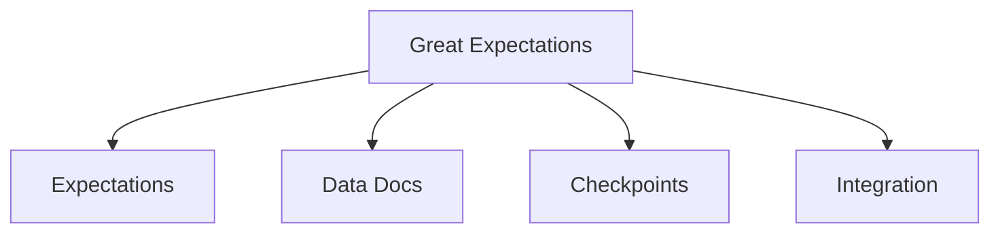
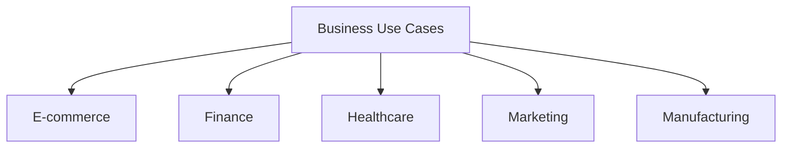
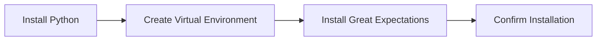
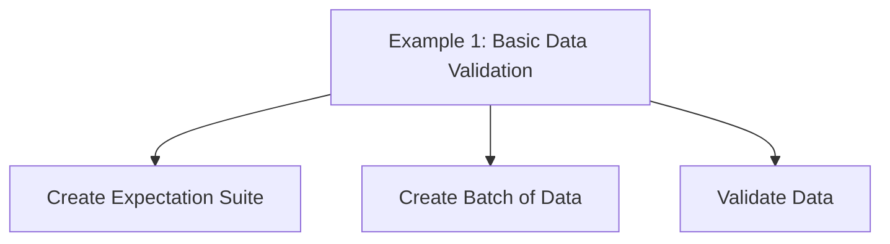
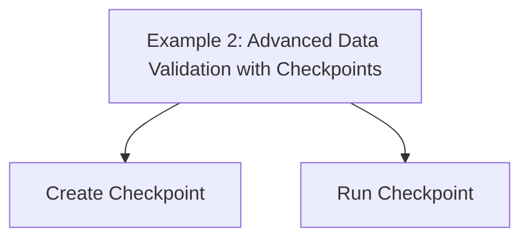
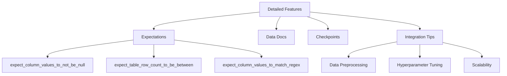

# Ensure Data Quality with Great Expectations

Maintain High Standards with Comprehensive Data Validation and Documentation


## Introduction

### Overview

Let's dive into Great Expectations (GX), an incredibly useful open-source tool designed for validating, documenting, and profiling your data to maintain quality. In today's data-driven world, ensuring data quality is crucial for making informed business decisions. Great Expectations provides a robust framework that simplifies data validation, making it easier for organizations to trust their data and derive actionable insights.

So, why should you consider using Great Expectations? It offers a user-friendly interface and comprehensive [documentation](https://docs.greatexpectations.io/) that enables data engineers and scientists to efficiently implement data quality checks. By integrating seamlessly with existing data pipelines, Great Expectations ensures that your data validation processes are scalable and reliable.

For those of you who are new to Great Expectations, let's explore some valuable resources to get you started:

- [Getting Started with Great Expectations](https://greatexpectations.io): A comprehensive guide to help you begin using Great Expectations in your projects.
- [Quickstart Guide](https://docs.greatexpectations.io/docs/oss/tutorials/quickstart/): A step-by-step tutorial to quickly set up and start using Great Expectations.
- [Installation Guide](https://docs.greatexpectations.io/docs/oss/guides/setup/installation/install_gx/): Detailed instructions on how to install Great Expectations and its dependencies.
- [Data Validation Workflow](https://docs.greatexpectations.io/docs/oss/guides/validation/validate_data_lp/): Learn about the Great Expectations data validation process and workflow.
- [API Reference](https://docs.greatexpectations.io/docs/reference/api_reference): Detailed documentation of the Great Expectations API for advanced users.
- [Community Forum](https://greatexpectations.io/community/): Join discussions and share insights with other professionals interested in data validation.
- [Examples and Tutorials](https://docs.greatexpectations.io/docs/oss/tutorials/quickstart/): Practical examples demonstrating how to use Great Expectations for different data validation tasks.
- [Best Practices and Setup Overview](https://docs.greatexpectations.io/docs/oss/guides/setup/setup_overview/): Guidelines and tips for getting the most out of Great Expectations in your projects, including setup best practices.

These resources provide a comprehensive foundation for understanding and implementing Great Expectations in your business or research projects. They will enable you to maintain high data quality standards and derive more accurate insights from your data.

### Learning Objectives

By the end of this tutorial, you will:

- Understand the core functionalities and unique features of Great Expectations.
- Learn how to install, configure, and use Great Expectations for data validation.
- Explore practical business use cases and applications of Great Expectations.
- Gain hands-on experience through step-by-step examples and a challenge.

With these objectives in mind, you'll be well on your way to mastering data quality validation with Great Expectations, ensuring your data is reliable and actionable. Let's get started!

## Why Great Expectations Matters

### Descriptive Overview

Let’s explore why Great Expectations is such a vital tool in maintaining data quality. Imagine you have a powerful ally that helps you proactively manage and ensure your data meets specific quality standards. That’s exactly what Great Expectations offers! It’s a collaborative data quality platform that brings together several key features:



- **Expectations**: Think of these as verifiable assertions about your data. They can range from simple checks, like ensuring no null values in a column, to more complex assertions, such as ensuring specific patterns in data. For example, you might set an expectation that email addresses follow a certain format or that sales figures never drop below zero.

- **Data Docs**: These are automatically generated documents that provide clear visibility into your data validation results. The beauty of Data Docs is that they are human-readable, making it easy to share with your team. This fosters transparency and collaboration, ensuring everyone is on the same page when it comes to maintaining data quality.

- **Checkpoints**: Imagine having a configurable workflow that validates your data as it flows through your pipeline. Checkpoints allow you to define and manage sequences of validation steps, ensuring consistency. For instance, you can set up a checkpoint to validate data each time it’s imported or processed, catching any issues early on.

- **Integration**: Great Expectations seamlessly integrates with various data sources and orchestration tools. Whether you’re working with SQL databases, CSV files, cloud storage, or orchestration tools like Apache Airflow, Great Expectations can connect and automate your data validation processes, scaling as needed.

### Business Use Cases

Now, let’s talk about how Great Expectations can be applied in different business scenarios to significantly improve data quality and performance:



- **E-commerce**: In the world of online shopping, accurate product listings and inventory management are crucial. Great Expectations helps by validating product data, ensuring that the information customers see is correct. This reduces customer complaints and enhances the overall shopping experience.

- **Finance**: Financial institutions need to ensure the integrity of transactions and reports. Great Expectations can verify the accuracy of transaction data, detect anomalies, and help comply with regulatory standards. This leads to more reliable financial reporting and better fraud detection.

- **Healthcare**: Accurate patient records and clinical trial data are essential for quality care and compliance. Great Expectations validates this data, helping healthcare providers make better clinical decisions and comply with health regulations, ultimately improving patient outcomes.

- **Marketing**: Effective marketing relies on clean and accurate customer data. By validating this data, Great Expectations allows for better targeting, customer segmentation, and personalization. This results in more effective marketing campaigns and a higher return on investment.

- **Manufacturing**: In manufacturing, maintaining operational efficiency and product quality is key. Great Expectations ensures the quality of production data, helping identify defects, improve product quality, and optimize manufacturing processes.

By integrating Great Expectations into your workflows, you’ll be able to ensure that your data is accurate, reliable, and ready to drive your business decisions. This proactive approach to data quality management will set you apart and help you achieve better results in your projects.

## Getting Started with Great Expectations

### Installation and Setup

Alright, let's get started with installing and setting up Great Expectations. Follow these steps to ensure you have everything you need to begin validating your data.



1. **Install Python**: First, ensure you have Python installed, preferably version 3.8 to 3.11. You can download it from the official [Python website](https://www.python.org/downloads/).

2. **Create a Virtual Environment**: This helps you manage dependencies and keep your environment clean.
   ```bash
   python -m venv gx_env
   source gx_env/bin/activate  # On Windows use `gx_env\Scripts\activate`
   ```

3. **Install Great Expectations**: With your virtual environment activated, install Great Expectations using pip.
   ```bash
   pip install great_expectations
   ```

4. **Confirm Installation**: Verify that Great Expectations is installed correctly by checking its version.
   ```bash
   great_expectations --version
   ```

### Initial Configuration

Once you've installed Great Expectations, let's configure it to start validating your data.

1. **Initialize a Data Context**: This command sets up the necessary directory structure and configuration files for Great Expectations.
   ```bash
   great_expectations init
   ```

2. **Configure a Data Source**: Follow the prompts to configure your data source, which could be a CSV file, an SQL database, or other supported formats.
   ```bash
   great_expectations datasource new
   ```

## Practical Examples

Now that we have everything set up, let's look at some practical examples to see Great Expectations in action.

### Example 1: Basic Data Validation



Let's dive into our first example, where we will perform basic data validation on a simple dataset.

1. **Create Expectation Suite**: The first step is to create an expectation suite. Think of this suite as a collection of rules or "expectations" that you want your data to meet.
   ```bash
   great_expectations suite new
   ```
   When you run this command, Great Expectations will prompt you to name your suite and guide you through the process of setting up your initial expectations.

2. **Create Batch of Data**: Next, we need to load a batch of data that we want to validate. This is where we specify the data source and the specific dataset we are working with.
   ```python
   from great_expectations.data_context import DataContext
   
   # Initialize the Data Context
   context = DataContext()
   
   # Define batch kwargs (replace with your specific parameters)
   batch_kwargs = {
       "datasource": "my_datasource",
       "path": "path/to/your/data.csv"
   }
   
   # Load the batch
   batch = context.get_batch(batch_kwargs, suite_name="my_suite")
   ```
   Here, we're initializing our data context, which serves as the main entry point for all Great Expectations operations. We then define our batch parameters, specifying the datasource and the path to our dataset. Finally, we load the batch using these parameters.

3. **Validate Data**: Now it's time to validate our data against the expectations we've defined. This step runs the data through our expectation suite and checks if the data meets the specified criteria.
   ```python
   results = context.run_validation_operator(
       "action_list_operator", 
       assets_to_validate=[batch]
   )
   ```
   The `run_validation_operator` method executes the validation process. Here, "action_list_operator" is a predefined operator that runs the validation and performs a series of actions based on the results. We pass in our batch as the data to be validated. The results will show whether the data meets the expectations or if there are any discrepancies.

### Example 2: Advanced Data Validation with Checkpoints



For our second example, we'll move on to more advanced data validation using checkpoints. Checkpoints provide a way to configure and run validation workflows.

1. **Create Checkpoint**: First, we need to set up a checkpoint. A checkpoint is essentially a predefined validation workflow that you can run at any time.
   ```bash
   great_expectations checkpoint new my_checkpoint
   ```
   Running this command will prompt you to create a new checkpoint. You'll specify details such as the name of the checkpoint and the expectation suite it should use.

2. **Run Checkpoint**: Once the checkpoint is created, we can execute it to validate our data. This is useful for automating regular data validation tasks.
   ```bash
   great_expectations checkpoint run my_checkpoint
   ```
   Here, we simply run the checkpoint by its name. The checkpoint will use the configurations we defined earlier to validate the specified dataset against the expectations.

By following these steps and examples, you'll be well on your way to ensuring data quality with Great Expectations. Whether you're just starting out or diving into advanced features, these practices will help you maintain high standards and trust in your data. Let's get started and explore the powerful capabilities of Great Expectations!

### Example 1: Basic Data Validation

Let's validate a simple CSV file step-by-step.

1. **Create an Expectation Suite**:
   ```bash
   great_expectations suite new
   ```
   Run this command to start the process of creating an expectation suite. You will be prompted to provide a name for the suite and then you can define the initial set of expectations for your data.

2. **Create a Batch of Data**:
   ```python
   import great_expectations as gx
   from great_expectations.core.batch import BatchRequest

   # Initialize a Data Context
   context = gx.get_context()
   
   # Define a Batch Request
   batch_request = BatchRequest(
       datasource_name="my_datasource",
       data_connector_name="default_inferred_data_connector_name",
       data_asset_name="my_data.csv",
   )
   ```
   Here, we are initializing the data context, which is the central object in Great Expectations for managing your data validation workflow. We then define a `BatchRequest`, which specifies the data source and data asset we are working with. This tells Great Expectations where to find the data and what data to load.

3. **Validate the Data**:
   ```python
   # Get a Validator for the batch of data
   validator = context.get_validator(batch_request=batch_request, expectation_suite_name="my_suite")
   
   # Add an expectation to ensure no null values in a specified column
   validator.expect_column_values_to_not_be_null(column="column_name")
   
   # Validate the data against the expectation suite
   results = validator.validate()
   print(results)
   ```
   In this step, we obtain a validator object for our batch of data. We add an expectation to ensure there are no null values in a specific column. Finally, we validate the data against the expectation suite and print the results. This will show whether the data meets the expectation or if there are any issues.

### Example 2: Advanced Data Validation with Checkpoints

1. **Create a Checkpoint**:
   ```bash
   great_expectations checkpoint new
   ```
   Follow the prompts to create a new checkpoint. This involves specifying details such as the name of the checkpoint and the expectation suite it will use. Checkpoints help automate and manage your data validation workflows more efficiently.

2. **Run the Checkpoint**:
   ```python
   # Define the batch request again if not already defined
   batch_request = BatchRequest(
       datasource_name="my_datasource",
       data_connector_name="default_inferred_data_connector_name",
       data_asset_name="my_data.csv",
   )
   
   # Run the checkpoint
   checkpoint_result = context.run_checkpoint(
       checkpoint_name="my_checkpoint",
       batch_request=batch_request,
   )
   print(checkpoint_result)
   ```
   Here, we define the batch request again if it hasn’t been defined previously. Then, we run the checkpoint using the `run_checkpoint` method, passing in the name of the checkpoint and the batch request. The results will indicate whether the data meets the expectations defined in the checkpoint.

In these examples, we've demonstrated how to set up basic and advanced data validation using Great Expectations. By creating expectation suites and checkpoints, you can ensure the quality and integrity of your data consistently and efficiently. Let’s start applying these practices to your own datasets and see the impact of maintaining high data quality standards!

## In-Depth Guide

Let's delve into the detailed features of Great Expectations, which will help you ensure the highest standards of data quality. We'll explore expectations, data docs, checkpoints, and some key integration tips to make the most out of this powerful tool.



### Detailed Features

1. **Expectations**

   Let's start with some fundamental expectations that you can apply to your data:

   - **expect_column_values_to_not_be_null**: This expectation ensures that there are no null values in a specific column. For instance, if you're working with customer data, you might want to ensure that the 'email' column does not contain any null values.
     ```python
     validator.expect_column_values_to_not_be_null(column="email")
     ```

   - **expect_table_row_count_to_be_between**: This expectation checks if the number of rows in your table falls within a specified range. This is useful for validating data loads to ensure you have the expected amount of data.
     ```python
     validator.expect_table_row_count_to_be_between(min_value=1000, max_value=10000)
     ```

   - **expect_column_values_to_match_regex**: Use this expectation to ensure that the values in a column match a specified regex pattern. For example, you can validate that all entries in a phone number column follow a certain format.
     ```python
     validator.expect_column_values_to_match_regex(column="phone_number", regex="^\(\d{3}\) \d{3}-\d{4}$")
     ```

2. **Data Docs**

   - Data Docs are automatically generated documentation that provides a human-readable format of validation results. These documents can be shared with your team to ensure everyone understands the data quality status.
   - You can host Data Docs locally or on cloud platforms, making them easily accessible and shareable. This feature is great for maintaining transparency and facilitating collaboration among team members.

3. **Checkpoints**

   - Checkpoints are configurable workflows for running data validations. They allow you to define and manage sequences of validation steps, making it easier to automate and streamline your data validation process.
   - You can include multiple data sources and expectation suites in a single checkpoint, enabling comprehensive data quality checks across various datasets and scenarios.

### Integration Tips

1. **Data Preprocessing**

   - Before you validate your data, it's essential to normalize and clean it. This step involves standardizing data formats and removing any anomalies.
   - Handle missing values appropriately, either by imputing them with meaningful defaults or by removing incomplete records, depending on your data quality requirements.

2. **Hyperparameter Tuning**

   - Customize your expectations to fit specific business requirements. For example, the threshold for acceptable data quality might vary depending on the context.
   - Use cross-validation techniques to ensure your validation rules are robust and perform well across different subsets of your data.

3. **Scalability**

   - For large-scale data validation tasks, utilize cloud platforms. These platforms provide the necessary computing resources to handle large volumes of data efficiently.
   - Integrate Great Expectations with orchestration tools like Airflow to automate your data validation workflows. This integration allows you to schedule and monitor validations as part of your larger data pipeline.

## Actionable Takeaways

1. **Start Simple**: Begin with basic expectations like ensuring no null values and validating row counts. As you become more comfortable, gradually add complexity to your validation rules.

2. **Automate**: Use checkpoints and orchestration tools to automate your data validation processes. Automation helps ensure consistency and frees up time for more critical tasks.

3. **Monitor**: Regularly review validation results and adjust your expectations as needed. Monitoring helps you stay on top of data quality issues and address them promptly.

4. **Collaborate**: Involve both technical and non-technical stakeholders in defining data quality standards. Collaboration ensures that the expectations set are aligned with business goals and practical requirements.

By understanding and implementing these detailed features and integration tips, you'll be well-equipped to maintain high data quality standards with Great Expectations. Let's get started and see how these practices can enhance the reliability and accuracy of your data!

## Challenge: Implement a Data Validation Pipeline Using Great Expectations

### Task Description

Alright, let’s dive into a practical challenge where you will implement a data validation pipeline using Great Expectations. Think about a problem in your work or project where ensuring data quality is crucial. Here are some examples to consider:

- **Retail**: Validate product information, sales transactions, and customer data to maintain accurate and complete records.
- **Finance**: Ensure the integrity of financial transactions and compliance with regulatory standards.
- **Healthcare**: Validate patient records and clinical trial data for accuracy and compliance.
- **Marketing**: Validate customer data for improved targeting and personalization.
- **Manufacturing**: Ensure the quality of production data for operational efficiency.

Your goal is to create a data validation pipeline that can:
1. Validate the integrity of key data columns (e.g., no null values, valid categories).
2. Ensure numerical data is within expected ranges.
3. Validate the completeness and accuracy of the dataset.

### Implementation Steps

Let's go through the steps to implement your data validation pipeline.

1. **Select and Load Data**

   First, choose a relevant dataset for your project. Ensure that it includes various data types such as numerical, categorical, and text data. Clean and preprocess your data to remove any obvious errors or inconsistencies.

2. **Prepare Data**

   Clean and preprocess your data, ensuring it is formatted correctly. Handle any missing values appropriately—this might involve imputing missing values, removing incomplete records, or other strategies suitable for your data.

3. **Install and Set Up Great Expectations**

   Install Great Expectations using pip and initialize your project.

   ```bash
   pip install great_expectations
   great_expectations init
   ```

   This command sets up the necessary directory structure and configuration files for your project.

4. **Configure a Data Source**

   Use the `great_expectations datasource new` command to set up your data source. Follow the prompts to specify the type of data source you are using, whether it’s a CSV file, an SQL database, or another supported format.

   ```bash
   great_expectations datasource new
   ```

5. **Create Expectation Suites**

   Define your expectations for the data. These could include checks for no null values in key columns, ensuring numerical ranges, or matching specific patterns. Here’s an example of how to define some basic expectations:

   ```python
   import great_expectations as gx
   from great_expectations.core.batch import BatchRequest

   # Initialize a Data Context
   context = gx.get_context()
   
   # Define a Batch Request
   batch_request = BatchRequest(
       datasource_name="my_datasource",
       data_connector_name="default_inferred_data_connector_name",
       data_asset_name="my_data.csv",
   )
   
   # Create a Validator
   validator = context.get_validator(batch_request=batch_request, expectation_suite_name="my_suite")

   # Add Expectations
   validator.expect_column_values_to_not_be_null(column="customer_id")
   validator.expect_column_values_to_be_between(column="age", min_value=0, max_value=120)
   validator.expect_column_values_to_match_regex(column="email", regex="^[A-Za-z0-9._%+-]+@[A-Za-z0-9.-]+\.[A-Z|a-z]{2,}$")
   
   # Save the expectation suite
   validator.save_expectation_suite()
   ```

6. **Create and Run Checkpoints**

   Set up checkpoints to automate the validation process. Checkpoints allow you to define a sequence of validation steps that can be run as part of your data pipeline.

   ```bash
   great_expectations checkpoint new my_checkpoint
   ```

   To run the checkpoint, use:

   ```python
   checkpoint_result = context.run_checkpoint(
       checkpoint_name="my_checkpoint",
       batch_request=batch_request,
   )
   print(checkpoint_result)
   ```

7. **Generate Data Docs**

   Use Data Docs to generate human-readable documentation of your validation results. This provides visibility and transparency into your data quality.

   ```bash
   great_expectations docs build
   ```

### Expected Outcome

By the end of this challenge, you should have:

- **Configured Project**: A Great Expectations project set up with your data sources and expectation suites.
- **Automated Validation**: A validation pipeline using checkpoints to ensure consistent data quality.
- **Documentation**: Clear, human-readable documentation of validation results using Data Docs.
- **Improved Data Quality**: Enhanced trust in your dataset’s quality and reliability.

### Tips for Completion

- **Data Quality**: Ensure your dataset is clean and preprocessed to remove anomalies or errors.
- **Expectation Definition**: Define comprehensive expectations that cover key aspects of your data quality.
- **Automate Validation**: Use checkpoints to automate validation and maintain consistent data quality.
- **Documentation**: Keep detailed notes and document each step for reproducibility and future reference.

### Conclusion

Great Expectations provides a comprehensive framework for ensuring data quality, making it an invaluable tool for modern businesses. By following this tutorial, you will be equipped to implement and automate data validation processes, ensuring your data is reliable and trustworthy.

### Continue Learning

1. Explore advanced features of Great Expectations, such as custom expectations and plugins.
2. Integrate Great Expectations with your existing data pipelines and orchestration tools.
3. Participate in the Great Expectations community to stay updated on best practices and new features.

By mastering Great Expectations, you’ll be able to maintain high data quality standards, leading to more accurate insights and better business decisions.

### Additional Resources

1. [Great Expectations](https://greatexpectations.io)
2. [Validate Data Guide](https://docs.greatexpectations.io/docs/oss/guides/validation/validate_data_lp/)
3. [Great Expectations Documentation](https://greatexpectations.io/expectations/)
4. [Great Expectations GitHub](https://github.com/great-expectations)
5. [Great Expectations Case Studies](https://greatexpectations.io/case-studies/)
6. [How to Generate and Run Business Rules with Great Expectations](https://communities.sas.com/t5/SAS-Communities-Library/How-to-generate-and-run-business-rules-with-Great-Expectations/ta-p/915230)
7. [Assuring Data Quality with Great Expectations](https://www.kdnuggets.com/2023/03/data-quality-dimensions-assuring-data-quality-great-expectations.html)
8. [Install Great Expectations](https://docs.greatexpectations.io/docs/oss/guides/setup/installation/install_gx/)
9. [Setup Overview](https://docs.greatexpectations.io/docs/oss/guides/setup/setup_overview/)
10. [Great Expectations PyPI](https://pypi.org/project/great-expectations/)