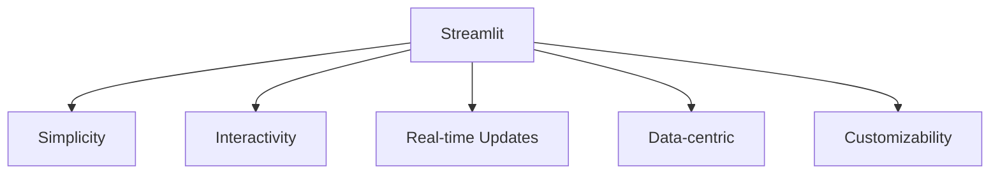
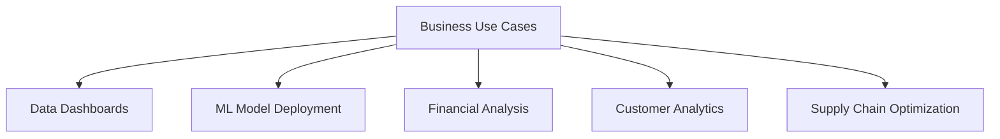
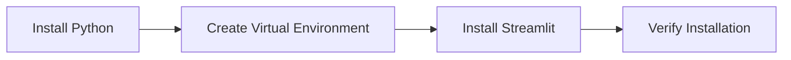
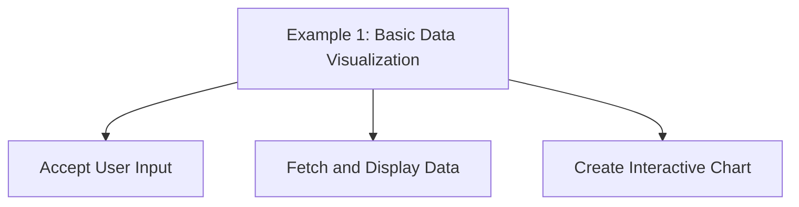
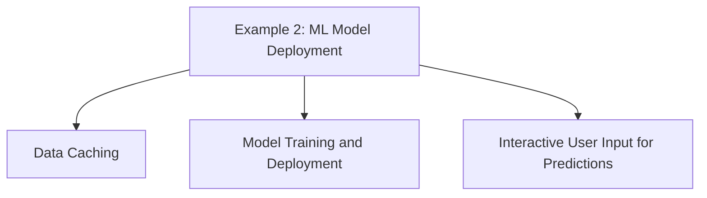
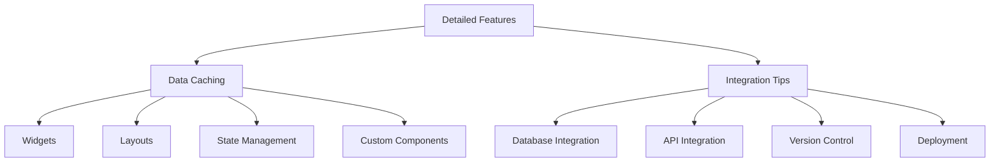

# Build Interactive Data Apps with Streamlit

Create Custom Web Applications for Data Science and ML


## Introduction

### Overview

Welcome! Today, we're going to explore [Streamlit](https://streamlit.io), an open-source Python library that is changing the game for data scientists and machine learning engineers. Streamlit makes it incredibly easy to create and share interactive web applications for your data projects. Whether you want to visualize data, build dashboards, or deploy machine learning models, Streamlit simplifies the process.

So, why is Streamlit so special? It provides a simple yet powerful framework that allows you to transform your data scripts into shareable web apps with minimal effort. With just a few lines of Python code, you can create interactive applications. This means you don’t need to be a web development expert to make your data analyses and machine learning models accessible and engaging.

Streamlit's intuitive interface and extensive [documentation](https://docs.streamlit.io/) make it easy for anyone, even with minimal web development experience, to create polished and professional applications. Let’s get you started with some key resources:

- [Getting Started with Streamlit](https://docs.streamlit.io/get-started/): This guide will help you begin using Streamlit in your projects.
- [Streamlit Fundamentals](https://docs.streamlit.io/get-started/fundamentals): Step-by-step instructions on the basics of Streamlit.
- [Installation Guide](https://docs.streamlit.io/get-started/installation): Instructions on how to install Streamlit and its dependencies.
- [Tutorials and Examples](https://docs.streamlit.io/get-started/tutorials): Practical examples demonstrating how to use Streamlit for different data visualization and machine learning tasks.
- [API Reference](https://docs.streamlit.io/library/api-reference): Detailed documentation of the Streamlit API for advanced users.
- [Community Discussions](https://discuss.streamlit.io/): Join discussions and share insights with other professionals interested in building interactive data apps.
- [Best Practices](https://docs.streamlit.io/library/advanced-features): Guidelines and tips for getting the most out of Streamlit in your projects.

These resources will give you a comprehensive foundation for understanding and using Streamlit in your work. By leveraging these tools, you can create interactive, data-driven applications that enhance your data analysis and decision-making processes.

### Learning Objectives

By the end of this tutorial, you will:
- Understand the significance of Streamlit in the data science ecosystem.
- Learn how to install and set up Streamlit.
- Create both basic and advanced Streamlit applications.
- Explore real-world business use cases for Streamlit apps.
- Gain practical experience through hands-on examples and challenges.

Let's get started and see how Streamlit can transform your data projects into interactive web applications that everyone can enjoy and understand.

## Why Streamlit Matters

### Descriptive Overview

Alright, let’s explore why Streamlit is such an important tool for data visualization and machine learning. Imagine you want to build web applications that showcase your data analysis or machine learning models. Streamlit makes this process incredibly simple and efficient. Here are some key features that make Streamlit stand out:



- **Simplicity**: One of the best things about Streamlit is its simplicity. You can write web applications using pure Python scripts. This means you don’t need to learn HTML, CSS, or JavaScript. With just a few lines of code, you can create a fully functional web app. Streamlit’s straightforward syntax makes it accessible to everyone, even if you have minimal web development experience.

- **Interactivity**: Streamlit makes it easy to add interactive elements to your apps. You can include widgets like sliders, text inputs, and buttons. These widgets allow users to interact with your data and models in real-time. For example, you can create a slider that lets users adjust parameters and see how the results change instantly.

- **Real-time Updates**: One of the coolest features of Streamlit is its ability to automatically reload your app whenever you save changes to your script. This means you can see the impact of your changes in real-time without having to restart your app. It makes the development process much more efficient and enjoyable.

- **Data-centric**: Streamlit is built with data scientists in mind. It integrates seamlessly with popular data science libraries like Pandas, NumPy, Matplotlib, and Plotly. This means you can easily visualize and analyze your data within your Streamlit app.

- **Customizability**: Streamlit provides flexible layout and styling options. You can use columns, expanders, and sidebars to organize your app’s content. This allows you to create polished and professional interfaces that look great and are easy to navigate.

### Business Use Cases

Now, let’s look at how Streamlit can be applied in various business scenarios. Here are some examples:



1. **Data Dashboards**: Streamlit is perfect for creating interactive dashboards that display real-time business metrics. Imagine you need a dashboard that shows up-to-date insights into key performance indicators. With Streamlit, you can build a dynamic dashboard that helps your team make data-driven decisions.

2. **ML Model Deployment**: Deploying machine learning models to stakeholders can be challenging. Streamlit simplifies this by allowing you to create interactive applications where stakeholders can test and visualize model predictions. It’s a great way to showcase your models and make them accessible to non-technical users.

3. **Financial Analysis**: Financial analysts can use Streamlit to build tools for modeling and forecasting. You can develop interactive applications that analyze market trends, predict financial outcomes, and visualize investment strategies. This makes it easier to communicate complex financial insights.

4. **Customer Analytics**: Understanding customer behavior is crucial for businesses. Streamlit can help you create apps that analyze customer data, segment audiences, and optimize marketing strategies. By visualizing customer trends, you can make more informed decisions to improve customer engagement.

5. **Supply Chain Optimization**: Managing a supply chain involves monitoring various metrics and making timely decisions. With Streamlit, you can build applications that provide real-time insights into supply chain operations. This helps businesses optimize logistics, manage inventory, and reduce costs.

By leveraging Streamlit’s capabilities, you can transform your data projects into interactive web applications that drive better decision-making and enhance user engagement. Let's dive into building your first Streamlit app and see these features in action!

## Getting Started with Streamlit

### Installation and Setup

Let's kick off by setting up Streamlit. We'll walk through each step to get you up and running quickly.



1. **Install Python**: Make sure you have Python 3.8 to 3.12 installed on your system. If not, download and install it from the [official Python website](https://www.python.org/downloads/).

2. **Create a Virtual Environment**: Open your terminal and create a new virtual environment. This helps keep your project dependencies isolated.
   ```bash
   python -m venv streamlit_env
   ```

3. **Activate the Environment**:
   - On Windows, run:
     ```bash
     streamlit_env\Scripts\activate
     ```
   - On macOS/Linux, run:
     ```bash
     source streamlit_env/bin/activate
     ```

4. **Install Streamlit**: With the virtual environment activated, install Streamlit using pip.
   ```bash
   pip install streamlit
   ```

5. **Verify the Installation**: Check if Streamlit is installed correctly by running the following command, which starts a sample app.
   ```bash
   streamlit hello
   ```

### Initial Configuration

Now that we have Streamlit installed, let's create a simple app to ensure everything is working perfectly.

1. **Create a New Python File**: Open your code editor and create a new file named `app.py`.

2. **Import Streamlit and Add a Simple Greeting**: Write a few lines of code to display a title and a greeting message.
   ```python
   import streamlit as st
   
   st.title("Welcome to My Streamlit App")
   st.write("Hello, World!")
   ```

3. **Run the App**: Save the file and run your Streamlit app from the terminal.
   ```bash
   streamlit run app.py
   ```

When you run this command, Streamlit will start a local server and open your app in a new browser tab. You should see your title and greeting message displayed.

### What's Next?

Congratulations, you've just created your first Streamlit app! This simple example demonstrates how easy it is to get started with Streamlit. From here, you can explore more advanced features and build interactive, data-driven applications.

Let's keep going and build some more complex apps that showcase data visualizations, user inputs, and machine learning models. But for now, enjoy the simplicity and power of what you've just created with a few lines of Python!


## Practical Examples

Let's dive into some practical examples to see Streamlit in action. We'll start with basic data visualization and then move on to deploying a machine learning model.

### Example 1: Basic Data Visualization



Let's create a simple app that visualizes stock price data:

```python
import streamlit as st
import yfinance as yf
import pandas as pd
import plotly.express as px

# Set the title of the Streamlit app
st.title("Stock Price Analyzer")

# Create a text input widget for the user to enter a stock symbol
symbol = st.text_input("Enter stock symbol (e.g., AAPL):", "AAPL")

# Fetch the stock data from Yahoo Finance using the yfinance library
# The data is retrieved for the specified stock symbol from 2020-01-01 to 2023-12-31
data = yf.download(symbol, start="2020-01-01", end="2023-12-31")

# Display the first few rows of the retrieved data as a table in the app
st.write(data.head())

# Create an interactive line chart using Plotly to visualize the stock's closing prices
# The chart shows the closing prices over time for the specified stock symbol
fig = px.line(data, x=data.index, y="Close", title=f"{symbol} Stock Price")

# Display the interactive chart in the Streamlit app
st.plotly_chart(fig)
```

This example demonstrates how to:
- Accept user input.
- Fetch and display data.
- Create an interactive chart.

### Example 2: ML Model Deployment



Now, let's deploy a simple machine learning model:

```python
import streamlit as st
import pandas as pd
from sklearn.model_selection import train_test_split
from sklearn.ensemble import RandomForestClassifier
from sklearn.metrics import accuracy_score

# Set the title of the Streamlit app
st.title("Iris Flower Classification")

# Define a function to load the Iris dataset and cache the result to improve performance
@st.cache_data
def load_data():
    # Load the Iris dataset from a URL and assign column names
    return pd.read_csv("https://archive.ics.uci.edu/ml/machine-learning-databases/iris/iris.data", 
                       header=None, names=["sepal_length", "sepal_width", "petal_length", "petal_width", "class"])

# Call the load_data function and store the result in the data variable
data = load_data()

# Display the first few rows of the loaded data as a table in the app
st.write(data.head())

# Split the data into features (X) and target (y)
X = data.drop("class", axis=1)
y = data["class"]

# Split the dataset into training and testing sets (80% training, 20% testing)
X_train, X_test, y_train, y_test = train_test_split(X, y, test_size=0.2, random_state=42)

# Define a function to train a RandomForestClassifier model and cache the result to improve performance
@st.cache_resource
def train_model():
    # Create a RandomForestClassifier model with 100 estimators
    model = RandomForestClassifier(n_estimators=100, random_state=42)
    # Train the model on the training data
    model.fit(X_train, y_train)
    # Return the trained model
    return model

# Call the train_model function and store the result in the model variable
model = train_model()

# Use the trained model to make predictions on the test data
y_pred = model.predict(X_test)

# Calculate the accuracy of the model's predictions
accuracy = accuracy_score(y_test, y_pred)

# Display the model's accuracy in the app
st.write(f"Model Accuracy: {accuracy:.2f}")

# Create sliders for user input to specify the features of a new iris flower for prediction
st.subheader("Make a prediction")
sepal_length = st.slider("Sepal Length", 4.0, 8.0, 5.4)
sepal_width = st.slider("Sepal Width", 2.0, 4.5, 3.4)
petal_length = st.slider("Petal Length", 1.0, 7.0, 4.7)
petal_width = st.slider("Petal Width", 0.1, 2.5, 1.5)

# Create a button for the user to trigger the prediction
if st.button("Predict"):
    # Make a prediction using the user-specified features
    prediction = model.predict([[sepal_length, sepal_width, petal_length, petal_width]])
    # Display the predicted iris class in the app
    st.write(f"Predicted Iris Class: {prediction[0]}")
```

This example showcases:
- Data caching for performance.
- ML model training and deployment.
- Interactive user input for predictions.

With these examples, you can see how easy it is to create interactive and powerful applications using Streamlit. Now, go ahead and try building your own apps!

## In-Depth Guide

Let's dive deeper into the world of Streamlit and explore its detailed features. We will cover how to use data caching, widgets, layouts, state management, and custom components. Additionally, we'll look at some tips for integrating Streamlit with databases, APIs, version control, and deployment platforms.



### Detailed Features

1. **Data Caching**

   Streamlit's caching mechanisms help optimize your app's performance by storing the results of expensive computations and reusing them when the input data hasn't changed. Let's see how to use them.

   ```python
   import streamlit as st

   @st.cache_data
   def load_data():
       # Simulate an expensive data loading process
       data = ...  # Load your data here
       return data

   data = load_data()
   st.write(data)
   ```
   This simple decorator caches the data, ensuring that it only reloads when necessary, thus speeding up your app.

2. **Widgets**

   Widgets are a fantastic way to make your apps interactive. Streamlit offers various widgets like sliders, buttons, and text inputs that let users interact with your app in real-time.

   ```python
   import streamlit as st

   age = st.slider("Select your age:", 0, 100, 25)
   st.write(f"Your age is: {age}")

   if st.button("Click me"):
       st.write("Button clicked!")

   name = st.text_input("Enter your name:")
   st.write(f"Hello, {name}")
   ```

3. **Layouts**

   Organizing your app's layout is crucial for user experience. Streamlit provides flexible layout options to structure your app content neatly.

   ```python
   import streamlit as st

   st.sidebar.title("Sidebar")
   st.sidebar.write("This is a sidebar.")

   col1, col2 = st.columns(2)
   with col1:
       st.write("This is column 1.")
   with col2:
       st.write("This is column 2.")

   with st.expander("Expand for more information"):
       st.write("Here is some more information.")
   ```

4. **State Management**

   Managing the state of your app across reruns is essential for a seamless user experience. Streamlit's session state feature helps maintain the state of variables and data.

   ```python
   import streamlit as st

   if 'count' not in st.session_state:
       st.session_state.count = 0

   increment = st.button("Increment")
   if increment:
       st.session_state.count += 1

   st.write(f"Count: {st.session_state.count}")
   ```

5. **Custom Components**

   Streamlit allows you to create and integrate custom components, extending your app's functionality with unique features.

   ```python
   import streamlit as st
   import streamlit.components.v1 as components

   # Load a custom component (replace with actual component code)
   components.html("<h1>Hello, Streamlit!</h1>")
   ```

### Integration Tips

1. **Database Integration**

   Integrating your app with databases is straightforward with libraries like SQLAlchemy, enabling real-time data fetching and display.

   ```python
   import streamlit as st
   from sqlalchemy import create_engine
   import pandas as pd

   engine = create_engine('sqlite:///mydatabase.db')
   df = pd.read_sql('SELECT * FROM mytable', engine)
   st.write(df)
   ```

2. **API Integration**

   Streamlit can interact with external APIs using libraries like `requests`, allowing you to retrieve and display data from various sources.

   ```python
   import streamlit as st
   import requests

   response = requests.get("https://api.example.com/data")
   data = response.json()
   st.write(data)
   ```

3. **Version Control**

   Use Git for version control to manage your Streamlit apps, track changes, and collaborate with others.

   ```bash
   git init
   git add .
   git commit -m "Initial commit"
   git remote add origin <your-repository-url>
   git push -u origin master
   ```

4. **Deployment**

   Deploy your Streamlit apps on platforms like Streamlit Cloud, Heroku, or AWS to share your applications with a wider audience and scale them as needed.

   ```bash
   # Example for Streamlit Cloud
   streamlit run app.py
   ```

## Actionable Takeaways

### Key Points
- Streamlit simplifies web app creation for data scientists.
- It supports a wide range of data science libraries and visualizations.
- Caching mechanisms improve app performance.
- Interactive widgets enhance user engagement.

### Implementation Steps
1. Identify a data-driven problem in your organization.
2. Design a Streamlit app to address the problem.
3. Develop the app using Streamlit's features and your data science skills.
4. Test the app thoroughly with potential users.
5. Deploy the app and gather feedback for improvements.

By following these steps and utilizing Streamlit's detailed features and integration tips, you can create powerful, interactive data applications that enhance your data analysis and decision-making processes. Let's get started and see how Streamlit can transform your data projects into interactive web applications!

## Challenge: Create a Streamlit App to Analyze and Visualize Data

### Task Description

Let's take on a challenge to create a Streamlit app that analyzes and visualizes data for a specific scenario in your work or project. Your app should achieve the following:

1. **Upload Data**: Allow users to upload a CSV file containing the data.
2. **Display Key Metrics**: Show important metrics relevant to the data, such as totals, averages, counts, or other summary statistics.
3. **Visualize Trends**: Create visualizations to show trends over time or other relevant dimensions, highlighting patterns and insights.
4. **Interactive Filters**: Provide interactive filters for users to explore the data by different categories and date ranges.
5. **Machine Learning Component**: Implement at least one machine learning component, such as a predictive model, to analyze the data and provide additional insights.

### Implementation Steps

Let's break this down step-by-step to make it manageable and clear.

1. **Identify Data-Driven Problem**

   First, determine the key questions and insights you want to derive from the data. For example, are you looking to find trends, identify top performers, or forecast future values? Understanding the problem will guide the design of your app.

2. **Design the App Layout**

   Plan the layout of your Streamlit app. Think about how to structure the sections for data upload, key metrics display, trend visualizations, interactive filters, and the machine learning component.

3. **Develop the App**

   ```mermaid
   graph TD;
       A[Develop the App] --> B[Data Upload]
       A --> C[Display Key Metrics]
       A --> D[Visualize Trends]
       A --> E[Interactive Filters]
       A --> F[Machine Learning Component]
   ```

   Let's develop each section:

   - **Data Upload**: Start by creating a section in your app that allows users to upload a CSV file. This is crucial for enabling users to input their data into the app.

   - **Display Key Metrics**: Once the data is uploaded, calculate and display key metrics. Think about what summary statistics would be most relevant for your users—totals, averages, counts, etc.

   - **Visualize Trends**: Create charts and graphs to show trends over time or other relevant dimensions. Highlight patterns and insights that can be derived from the data. Consider using popular visualization libraries like Matplotlib, Seaborn, or Plotly to make your visualizations interactive and informative.

   - **Interactive Filters**: Add filters that allow users to explore the data by different categories and date ranges. This interactivity will enable users to drill down into the data and uncover more specific insights.

   - **Machine Learning Component**: Implement a machine learning model to analyze the data. This could involve building a predictive model to forecast future trends or a classification model to categorize the data. Display the results and provide interpretations to add value to the analysis.

4. **Test the App**

   Ensure your app works smoothly with different datasets and user inputs. Validate that calculations, visualizations, and predictions are accurate and responsive. Testing is key to providing a reliable and user-friendly application.

5. **Deploy the App**

   Deploy your app using a platform like Streamlit Cloud, Heroku, or AWS. Deployment makes your app accessible to your intended users, allowing them to benefit from your work.

6. **Gather Feedback**

   Share the app with potential users and gather their feedback. Identify areas for improvement and iterate on the design and functionality based on user input. Continuous improvement will help you refine the app to better meet user needs.

### Expected Outcome

By the end of this challenge, you should have a functional Streamlit app that provides valuable insights into the data. Users will be able to:

- **Upload Data**: Upload their data and view key metrics.
- **Visualizations**: Explore interactive visualizations to understand trends.
- **Filters**: Segment data by various categories and date ranges.
- **Machine Learning**: Utilize a machine learning model to predict future trends or classify data, adding an advanced layer of analysis.

### Tips for Completion

- **Data Quality**: Ensure the dataset is clean and preprocessed to remove any anomalies or errors. High-quality data is essential for accurate analysis.
- **Visualization Tools**: Utilize effective visualization libraries for presenting data clearly. Interactive and visually appealing charts will enhance user engagement.
- **Interactive Elements**: Use Streamlit widgets like sliders, dropdowns, and date pickers to make your app interactive and user-friendly.
- **Documentation**: Keep detailed notes and document each step for reproducibility and future reference. Good documentation will help others understand and build upon your work.

### Conclusion

Streamlit offers a powerful yet accessible way to create data applications, bridging the gap between data analysis and web development. By mastering Streamlit, you can quickly prototype ideas, share insights, and deploy data science solutions in a business context.

### Continue Learning

1. **Explore Advanced Features**: Dive deeper into Streamlit's capabilities, such as custom components, session state management, and advanced layout options.
2. **Implement A/B Testing**: Use A/B testing to measure the effectiveness of different app features and user interfaces.
3. **Join the Community**: Engage with the Streamlit community to stay updated on best practices, new features, and innovative use cases.
4. **Integrate with Other Tools**: Explore integrations with other data science tools and platforms to enhance your Streamlit apps' functionality and scalability.

By mastering Streamlit, you'll be well-equipped to create interactive, data-driven applications that can significantly impact your business's data analysis and decision-making processes.

### Additional Resources

1. [Generative AI and Streamlit: A Perfect Match](https://blog.streamlit.io/generative-ai-and-streamlit-a-perfect-match/)
2. [Streamlit](https://streamlit.io)
3. [Create an App](https://docs.streamlit.io/get-started/tutorials/create-an-app)
4. [Installation](https://docs.streamlit.io/get-started/installation)
5. [Get Started](https://docs.streamlit.io/get-started)
6. [Command Line Installation](https://docs.streamlit.io/get-started/installation/command-line)
7. [Streamlit for Data Science](https://github.com/dataprofessor/streamlit-for-datascience)
8. [Streamlit Introduction and Setup](https://www.geeksforgeeks.org/streamlit-introduction-and-setup/)