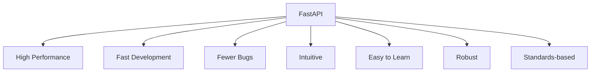
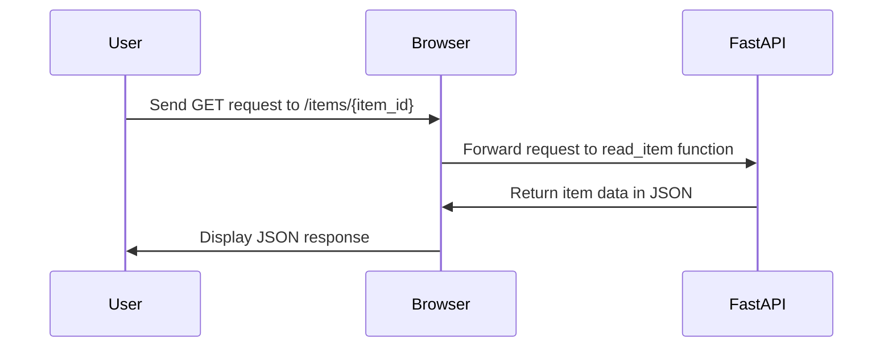
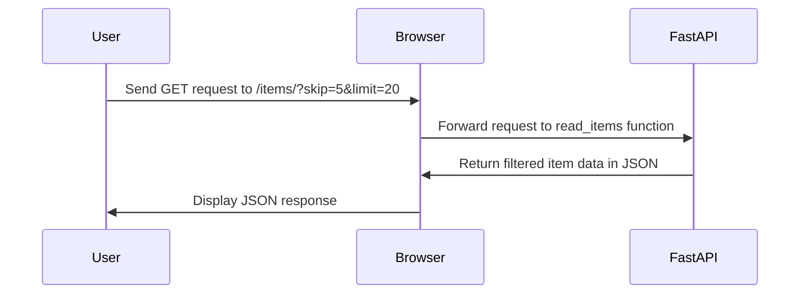

# FastAPI Tutorial: Building High-Performance APIs with Python

Learn to Create, Optimize, and Deploy FastAPI Applications Efficiently


## Introduction

### Overview

Welcome! Today, we're diving into [FastAPI](https://fastapi.tiangolo.com), a cutting-edge, high-performance web framework that's perfect for building APIs with Python 3.7 and above. FastAPI stands out because it uses standard Python type hints, which makes it not only super fast but also very intuitive to work with. Throughout this tutorial, we'll explore the fantastic features of FastAPI and walk you through creating your very own simple API.

So, why is FastAPI so special? It offers a simple yet powerful framework that enables you to build robust APIs with minimal effort. With just a few lines of Python code, you can create high-performance endpoints. This means you don’t need to be an expert in web development to build efficient and scalable APIs.

FastAPI's intuitive interface and extensive [documentation](https://fastapi.tiangolo.com) make it easy for anyone, even those with minimal web development experience, to create polished and professional APIs. Let’s get you started with some key resources:

- [FastAPI Documentation](https://fastapi.tiangolo.com/): Comprehensive guide and reference
- [FastAPI Tutorial](https://fastapi.tiangolo.com/tutorial/): Step-by-step tutorial
- [Advanced User Guide](https://fastapi.tiangolo.com/advanced/): More advanced topics and features
- [FastAPI GitHub Discussions](https://github.com/tiangolo/fastapi/discussions): Community discussions and support

These resources will provide you with a comprehensive foundation for understanding and using FastAPI in your work. By leveraging these tools, you can create high-performance APIs that enhance your development process and meet your project's needs efficiently.

### Learning Objectives

By the end of our journey together, you will:

1. Grasp the basics of FastAPI and understand why it's so advantageous.
2. Learn the steps to install and set up FastAPI in your development environment.
3. Build a simple API using FastAPI, step by step.
4. Dive into key concepts such as path operations, path parameters, query parameters, request bodies, and data validation.
5. Master handling errors, using dependency injection, and incorporating asynchronous programming in your FastAPI applications.

Let's jump in and unlock the power of FastAPI together!

## Why FastAPI Matters

### Descriptive Overview

Alright, let's dive into why FastAPI is such a game-changer for building APIs. FastAPI is all about being user-friendly and lightning-fast, which makes it a fantastic choice for anyone looking to build APIs efficiently. It leverages Python type hints, which not only helps with better code completion but also significantly reduces bugs in your code. This means you can write cleaner, more reliable code without the hassle.

### Key Features

Let's dive into what makes FastAPI stand out and why it's such a powerful tool for building APIs:



- **High Performance**: FastAPI is blazing fast, comparable to the performance of heavyweights like NodeJS and Go. This means your APIs will be incredibly responsive, capable of handling high traffic with ease.
- **Fast Development**: One of the things you'll love about FastAPI is how quickly you can develop with it. It can boost your development speed by up to 200% to 300%, allowing you to build and iterate on your projects much faster.
- **Fewer Bugs**: FastAPI leverages Python type hints to catch errors early in the development process. This can reduce human-induced bugs by around 40%, making your codebase more stable and easier to maintain.
- **Intuitive**: FastAPI offers excellent support for code completion and is very intuitive to use. You'll find that writing code is smooth and efficient, with great support from your code editor.
- **Easy to Learn**: FastAPI is designed to be user-friendly and easy to pick up. You won't need to spend endless hours reading through documentation; you can start using it right away.
- **Robust**: It generates production-ready code with automatic interactive documentation. This makes the transition from development to deployment seamless and efficient.
- **Standards-based**: FastAPI adheres to OpenAPI and JSON Schema standards, ensuring that your APIs are compatible with a wide range of tools and services.

### Practical Use Cases

Now, let's talk about where you can apply FastAPI in real-world scenarios:

- **Building RESTful APIs**: FastAPI is perfect for creating RESTful APIs that are scalable and easy to maintain. Whether you're building a small project or a large-scale application, FastAPI can handle it.
- **Creating Microservices**: With its high performance and ease of use, FastAPI is ideal for developing microservices architectures. You can create efficient, modular services that communicate seamlessly with each other.
- **Developing Backend Services**: Whether you're working on a web application or a mobile app, FastAPI provides a robust framework for your backend services. It handles everything from database interactions to business logic.
- **Implementing Asynchronous Applications**: FastAPI fully supports asynchronous programming. This makes it a great choice for applications that require high concurrency and low latency, such as real-time data processing or chat applications.

FastAPI is all about making your development process faster, easier, and more efficient. Its powerful features and practical applications have made it a favorite among developers. Ready to see FastAPI in action? Let's jump into the setup and start building!

## Getting Started with FastAPI

### Installation and Setup
Alright, let's get our hands dirty with FastAPI! The first thing we need to do is install FastAPI and an ASGI server called Uvicorn. This is super easy and won't take long. 


Open your terminal and run these commands:

```bash
pip install fastapi
pip install "uvicorn[standard]"
```

Perfect! Now FastAPI and Uvicorn are ready to go.

### Initial Configuration
Let's dive into some coding. We're going to create a simple API to see FastAPI in action. Follow these steps:

1. **Create a New File:**

   First, create a new file named `main.py`. This will be our main application file.

2. **Add Some Code:**

   Open `main.py` and add the following code:

```python
from typing import Union
from fastapi import FastAPI

app = FastAPI()

@app.get("/")
def read_root():
    return {"Hello": "World"}

@app.get("/items/{item_id}")
def read_item(item_id: int, q: Union[str, None] = None):
    return {"item_id": item_id, "q": q}
```

Here's a quick rundown of what this code does:
- We're importing `FastAPI` from the `fastapi` module.
- We create an instance of the FastAPI class.
- We define two endpoints: one at the root URL (`/`) that returns a simple greeting, and another that takes a path parameter (`/items/{item_id}`) and an optional query parameter (`q`).

3. **Run the Server:**

   Now, let's fire up our server using Uvicorn. Go back to your terminal and run:

```bash
uvicorn main:app --reload
```

The `--reload` flag is super handy because it automatically reloads the server when you make changes to your code. Great for development!

4. **Check It Out:**

   Open your web browser and go to `http://127.0.0.1:8000`. You should see a JSON response: `{"Hello": "World"}`.

And there you have it! You've just set up your first FastAPI application. You've got a simple API running, and you can see how straightforward it is to create endpoints. Next, we'll explore more features and dive deeper into building robust APIs with FastAPI.

## Practical Examples

### Example 1: Path Operations

Alright, let's get into the fun part – creating API endpoints with FastAPI, also known as path operations. Path operations are essentially how you define what your API should do when it receives a request at a specific URL.



Let’s start with the basics. Imagine you want your API to respond with a simple message when someone accesses the root URL (like `http://127.0.0.1:8000/`). We use something called a decorator to tell FastAPI which function to call for a specific URL path.

Here’s how you do it:

```python
@app.get("/")
def read_root():
    return {"Hello": "World"}
```

In this snippet:
- `@app.get("/")`: This is a decorator. It tells FastAPI that the function `read_root` should handle GET requests sent to the root URL ("/").
- `def read_root()`: This defines the function that runs when a GET request is received at the root URL.
- `return {"Hello": "World"}`: The function returns a simple dictionary that FastAPI automatically converts to JSON. So, when you visit `http://127.0.0.1:8000/`, you’ll see `{"Hello": "World"}`.

Now, let’s make it a bit more dynamic. Suppose we want an endpoint that accepts an `item_id` in the URL and returns it back. Here’s how we can do that:

```python
@app.get("/items/{item_id}")
def read_item(item_id: int):
    return {"item_id": item_id}
```

Here's what’s happening here:
- `@app.get("/items/{item_id}")`: This decorator tells FastAPI that the function `read_item` handles GET requests sent to URLs like `/items/42`, where `42` is the `item_id`.
- `def read_item(item_id: int)`: The `item_id` is captured from the URL and passed as an argument to the function. The type hint `int` ensures that `item_id` is treated as an integer.
- `return {"item_id": item_id}`: The function returns a dictionary containing the `item_id`, which FastAPI converts to JSON.

So, if you visit `http://127.0.0.1:8000/items/42`, you’ll get `{"item_id": 42}`. Simple and powerful, right?

Let's go ahead and try this out. Add the above code to your `main.py` file, run your FastAPI server, and test these endpoints in your browser or with a tool like Postman. You’ll see how easy and intuitive it is to create API endpoints with FastAPI. Next, we’ll dive into more complex operations and features!

### Example 2: Query Parameters

Alright, now that we've got the basics of path operations down, let's take a look at another powerful feature in FastAPI: query parameters. These are parameters that you can include in the URL to filter or modify the data you want to retrieve from your API.



Imagine you're building an API to fetch items, and you want to allow users to skip a certain number of items and limit the number of items returned. Query parameters make this easy and straightforward.

Here’s how we can do it in FastAPI:

```python
@app.get("/items/")
def read_items(skip: int = 0, limit: int = 10):
    return {"skip": skip, "limit": limit}
```

Let’s break this down:
- `@app.get("/items/")`: This decorator tells FastAPI to call the `read_items` function when a GET request is made to the `/items/` URL.
- `def read_items(skip: int = 0, limit: int = 10)`: Here, we define two query parameters: `skip` and `limit`. Both parameters have default values (`0` for `skip` and `10` for `limit`). This means if the user doesn't provide these parameters in the URL, the function will use the default values.
- `return {"skip": skip, "limit": limit}`: The function returns a dictionary with the values of `skip` and `limit`, which FastAPI will convert to JSON.

So, what does this look like in action? If you navigate to `http://127.0.0.1:8000/items/?skip=5&limit=20` in your browser, FastAPI will automatically parse the query parameters from the URL. The `read_items` function will then receive `skip` as `5` and `limit` as `20`, and you'll get the following JSON response: `{"skip": 5, "limit": 20}`.

This feature is incredibly useful when you want to add flexibility to your API endpoints. It allows clients to customize their requests and get just the data they need.

Let’s try it out together:
1. Add the `read_items` function to your `main.py` file.
2. Start your FastAPI server if it's not already running.
3. Open your browser or Postman, and go to `http://127.0.0.1:8000/items/?skip=5&limit=20`.

You should see the JSON response reflecting the query parameters you provided. This is just the beginning of what you can do with query parameters in FastAPI. You can add as many parameters as you need, each with their own default values and types.

Great job! You've just learned how to use query parameters to make your API endpoints more flexible and powerful. Next, we'll dive into more advanced features and see how we can further enhance our FastAPI applications.

## Advanced Usage

### Detailed Features

#### Request Body
Alright, now we're stepping into some more advanced territory. Let’s talk about handling request bodies in FastAPI using Pydantic models. Imagine you’re building an endpoint where users can create new items by sending a JSON payload. Pydantic models make this a breeze by defining the structure and ensuring the data is valid.

Here's how we do it:

```python
from pydantic import BaseModel

class Item(BaseModel):
    name: str
    price: float
    is_offer: Union[bool, None] = None

@app.post("/items/")
def create_item(item: Item):
    return item
```

What’s happening here?
- We import `BaseModel` from Pydantic, which we’ll use to create our data model.
- We define a class `Item` that inherits from `BaseModel`. This class has three fields: `name` (a string), `price` (a float), and `is_offer` (an optional boolean).
- The `@app.post("/items/")` decorator tells FastAPI to call the `create_item` function when a POST request is made to `/items/`.
- The `create_item` function takes an `Item` as input and returns it. FastAPI will automatically validate the incoming request body against the `Item` model and return a structured response.

Try it out by sending a POST request with a JSON body like this:

```json
{
    "name": "Sample Item",
    "price": 29.99,
    "is_offer": true
}
```

FastAPI will validate the input and return it as a response. If the input doesn’t match the model, FastAPI will return an error. This makes your API robust and reliable.

#### Data Validation with Pydantic
FastAPI’s use of Pydantic for data validation is a game changer. Pydantic models not only define the structure of your data but also validate it automatically. This means you can focus on building your application without worrying about data integrity issues. It's like having a built-in safety net for your API.

### Customization and Optimization

#### Handling Errors
Handling errors gracefully is crucial for providing a good user experience. FastAPI has built-in support for exception handling. Let’s say you want to handle cases where an item isn’t found. You can raise an `HTTPException` to return a custom error response.

Here’s how:

```python
from fastapi import HTTPException

@app.get("/items/{item_id}")
def read_item(item_id: int):
    if item_id not in items:
        raise HTTPException(status_code=404, detail="Item not found")
    return {"item": items[item_id]}
```

In this example:
- We import `HTTPException` from FastAPI.
- In the `read_item` function, we check if the `item_id` exists in our items dictionary.
- If it doesn’t, we raise an `HTTPException` with a 404 status code and a custom error message.

This way, users will get a clear error message if they try to access an item that doesn’t exist.

#### Dependency Injection
FastAPI's dependency injection system is a powerful feature that helps manage shared resources and logic in a clean and efficient way. It allows you to declare dependencies that FastAPI will automatically provide when calling your endpoints.

For example, let’s say you have a database connection that you need to access in several endpoints:

```python
from fastapi import Depends

def get_db():
    db = SessionLocal()
    try:
        yield db
    finally:
        db.close()

@app.get("/users/")
def read_users(db: Session = Depends(get_db)):
    return db.query(User).all()
```

Here’s what’s happening:
- We define a function `get_db` that opens a database session and ensures it’s closed after use.
- The `Depends` function tells FastAPI that `read_users` depends on `get_db`. FastAPI will call `get_db`, get the database session, and pass it to `read_users`.
- This makes your code cleaner and more modular, as you can easily reuse dependencies across multiple endpoints.

With these advanced features, FastAPI helps you build robust, efficient, and maintainable APIs. You're now equipped with the knowledge to handle complex data validations, error handling, and shared dependencies. Keep experimenting and see how these features can streamline your API development!

## Integration and Deployment

### Integration Tips

Alright, now let's talk about how to integrate FastAPI with other essential parts of your tech stack. 

First up, databases. If your application needs to store data, you'll want to integrate FastAPI with a database. One of the best ways to do this is by using an ORM (Object Relational Mapper) like SQLAlchemy. ORMs help you interact with your database using Python classes and objects, making your code more organized and easier to work with.

Next, let's tackle authentication. Keeping your application secure is crucial, and implementing OAuth2 or JWT (JSON Web Tokens) is a great way to handle authentication. These methods ensure that only authorized users can access your API endpoints.

### Deployment Considerations

Once your FastAPI application is ready, it's time to deploy it so users can start using it. Here are a couple of key considerations:

- **ASGI Servers**: FastAPI applications need to be deployed using ASGI servers. Uvicorn and Daphne are two popular choices. These servers are designed to handle asynchronous requests, which is essential for maintaining the high performance of FastAPI.
  
- **Containerization**: For scalable and consistent deployments, consider containerizing your FastAPI application with Docker. Containers package your application with all its dependencies, so it runs smoothly in any environment. This is especially useful when you're deploying across different stages like development, testing, and production.

### Maintenance and Updates

Keeping your FastAPI application running smoothly involves regular maintenance. Here are a couple of tips:

- Regularly update your dependencies to benefit from the latest features and security patches.
- Use automated testing to catch issues early and ensure the integrity of your application as it evolves.

## Actionable Takeaways

### Summary of Key Points

Alright, let's recap what we've learned about FastAPI:
- It's a high-performance, easy-to-use framework for building APIs.
- Some of its standout features include high performance, fast development, fewer bugs, and robust, automatic documentation.

### Practical Advice

Here are some tips to help you get the most out of FastAPI:
- Start with simple examples to get comfortable with the framework.
- Gradually move on to more complex applications as you gain confidence.
- Make use of the built-in interactive documentation to test and understand your APIs better.

### Next Steps

Now that you're equipped with the basics, here are a few steps to continue your learning journey:
- Dive deeper into the official [FastAPI documentation](https://fastapi.tiangolo.com) to explore more advanced features and best practices.
- Challenge yourself by building more complex APIs, integrating databases, and adding authentication to secure your endpoints.

Remember, the more you experiment and build, the more proficient you'll become. Happy coding!

## Challenge: Real-World Application

### Task Description

Alright, it's challenge time! Now that you've learned the basics and some advanced features of FastAPI, let's put your skills to the test with a real-world application. Your task is to create a simple API that allows users to create, read, update, and delete (CRUD) items in a database. This will give you hands-on experience with the core functionality you'll use in many FastAPI applications.

### Steps to Complete
Here's a step-by-step guide to help you through this challenge:

1. **Set Up a FastAPI Project**: Start by setting up a new FastAPI project. Make sure you have your environment ready and FastAPI installed.
2. **Define Pydantic Models for Data Validation**: Create Pydantic models that define the structure and validation rules for your data. This will ensure that any data coming into your API is properly validated.
3. **Implement CRUD Operations**: Develop the endpoints for creating, reading, updating, and deleting items. Use the Pydantic models for request bodies and FastAPI's built-in tools for handling these operations.
4. **Test the API Using the Interactive Documentation**: FastAPI automatically generates interactive API documentation. Use this feature to test your endpoints and ensure everything is working as expected.

### Expected Outcome
By the end of this challenge, you should have a fully functional CRUD API built with FastAPI. This API will allow users to manage items in a database, demonstrating your ability to handle real-world API development tasks.

### Example Projects
Need some inspiration? Here are a couple of example projects you might consider:

- **To-Do List API**: Create an API to manage to-do items. Users should be able to add new tasks, view all tasks, update existing tasks, and delete tasks they no longer need.
- **User Management API**: Build an API for managing user accounts. This could include functionality for creating new user accounts, retrieving user details, updating user information, and deleting user accounts.

## Conclusion

### Summary
Congratulations! You've just taken a big step into the world of FastAPI. We've covered a lot of ground, from setting up your FastAPI project to exploring advanced features like data validation, error handling, and dependency injection. FastAPI is a powerful and efficient framework that makes building APIs in Python a breeze. Its combination of speed, ease of use, and built-in features make it an excellent choice for both beginners and experienced developers.

### Encouragement
The journey doesn't stop here. Keep exploring more complex applications, integrate with databases, and consider deploying your FastAPI projects in production environments. The more you practice, the more proficient you'll become.

## Additional Resources

[1] https://fastapi.tiangolo.com/tutorial/
[2] https://fastapi.tiangolo.co
[3] https://fastapi.tiangolo.com/tutorial/first-steps/
[4] https://fastapi.tiangolo.com/deployment/manually/
[5] https://fastapi.tiangolo.com/tutorial/metadata/
[6] https://fastapi.tiangolo.com/es/tutorial/
[7] https://fastapi.tiangolo.com/fastapi-cli/
[8] https://fastapi.tiangolo.com/tutorial/schema-extra-example/
[9] https://fastapi.tiangolo.com/advanced/
[10] https://fastapi.tiangolo.com/reference/
[11] https://fastapi.tiangolo.com/reference/request/
[12] https://fastapi.tiangolo.com/tutorial/sql-databases/
[13] https://fastapi.tiangolo.com/tutorial/body/
[14] https://fastapi.tiangolo.com/tutorial/security/

These resources will provide you with more examples, best practices, and advanced techniques to master FastAPI. Happy coding!