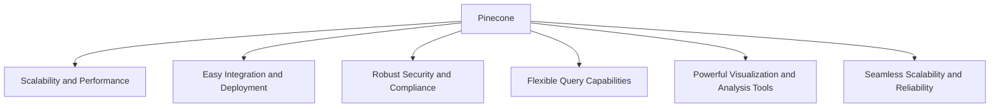
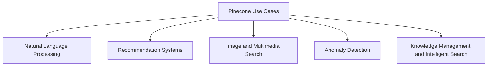
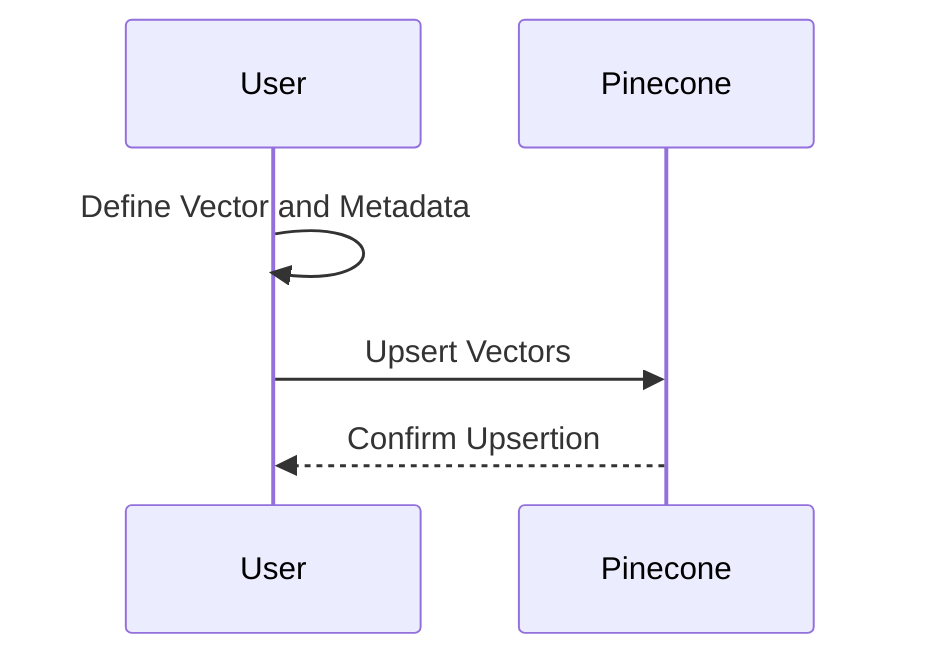
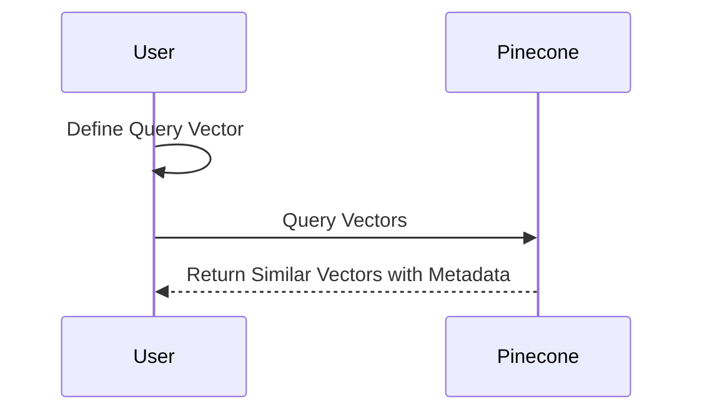

# Pinecone Tutorial: Mastering Vector Databases for AI

Learn to Set Up, Integrate, and Optimize Pinecone for AI Applications


## Introduction

### Overview

Welcome! Today, we're diving into [Pinecone](https://pinecone.io), a managed vector database that's tailored for machine learning and AI applications. Think of Pinecone as your go-to solution for providing long-term memory in high-performance AI tasks. It’s a powerful tool that can significantly enhance your projects, and I’m excited to guide you through it. We'll break down the steps to understand, set up, and effectively use Pinecone, making sure you feel confident in leveraging its capabilities.

Why is Pinecone so special? It offers a streamlined API for vector operations, low-latency queries at scale, and managed infrastructure, eliminating operational hassles. With Pinecone, you can focus on building and scaling your AI applications without worrying about the underlying infrastructure.

Pinecone's intuitive interface and extensive [documentation](https://docs.pinecone.io) make it easy for anyone, even those with minimal experience, to create and manage vector databases. Let’s get you started with some key resources:

- [Pinecone Documentation](https://docs.pinecone.io): Comprehensive guide and reference
- [Getting Started with Pinecone](https://docs.pinecone.io/guides/get-started/quickstart): Step-by-step guide
- [Pinecone Blog](https://www.pinecone.io/blog/): Insights and updates
- [Pinecone GitHub Repository](https://github.com/pinecone-io/examples): Example projects and community support

These resources will provide you with a solid foundation for understanding and using Pinecone in your AI projects. By leveraging these tools, you can create high-performance, scalable AI applications that meet your project's needs efficiently.

### Learning Objectives

By the end of this tutorial, you will:

1. Grasp the core concepts and recognize the benefits of using Pinecone.
2. Know how to install and set up Pinecone in your development environment.
3. Discover the key features and practical use cases for Pinecone.
4. Master advanced features and best practices to optimize Pinecone.
5. Learn how to integrate Pinecone with other AI tools and frameworks.
6. Understand how to deploy Pinecone-based applications and maintain them over time.

Let's dive in and unlock the full potential of Pinecone together!

---

## Why Pinecone Matters

### Descriptive Overview

Alright, let's delve into why Pinecone is such a crucial tool in the AI landscape. Pinecone is a cloud-native vector database specifically engineered to manage the complexities associated with AI-driven tasks. It offers streamlined API operations, low-latency queries, and a fully managed infrastructure. This makes Pinecone an ideal choice for developers who want to scale their AI applications without the operational headaches of managing the underlying infrastructure.

### Key Features

Let's explore the key features that set Pinecone apart:



1. **Scalability and Performance**: Pinecone is built to handle billions of vectors with remarkable efficiency. It ensures low-latency queries, which means your AI applications will remain responsive even under heavy load. This feature is crucial for applications that require real-time processing and quick response times.
2. **Easy Integration and Deployment**: Pinecone simplifies the integration process with its user-friendly API. Whether you are working with existing AI workflows or setting up a new project, Pinecone can be easily incorporated, reducing the time and effort needed to get started.
3. **Robust Security and Compliance**: Security is paramount in any AI application. Pinecone ensures your data is protected with encryption and adheres to various compliance standards such as GDPR and HIPAA. This is particularly important for applications that handle sensitive or personal data.
4. **Flexible Query Capabilities**: Pinecone supports a wide range of query types, allowing for versatile use cases. Whether you need to perform nearest neighbor searches, filter by metadata, or execute complex boolean queries, Pinecone has you covered.
5. **Powerful Visualization and Analysis Tools**: Pinecone provides tools for visualizing and analyzing your data, helping you gain insights and manage your datasets more effectively. These tools are essential for understanding your data’s structure and making informed decisions.
6. **Seamless Scalability and Reliability**: Pinecone automatically scales based on your usage, ensuring that your application remains reliable and performant. This feature is particularly beneficial for growing applications that experience variable loads.

### Practical Use Cases

Now, let's look at some practical applications of Pinecone in the real world:



1. **Natural Language Processing (NLP)**: Pinecone can significantly enhance NLP tasks by providing efficient semantic search and text understanding capabilities. This is useful in applications like chatbots, automated customer support, and text classification, where quick and accurate text processing is vital.
2. **Recommendation Systems**: Pinecone's ability to handle large volumes of vectors efficiently makes it ideal for building recommendation systems. Whether it’s product recommendations in an e-commerce site or content recommendations in a streaming service, Pinecone can help personalize the user experience by providing relevant suggestions.
3. **Image and Multimedia Search**: Pinecone excels in handling image and multimedia searches. By indexing visual and multimedia data as vectors, Pinecone enables advanced search functionalities, such as finding similar images or videos, which is valuable in digital asset management, social media, and e-commerce.
4. **Anomaly Detection**: Identifying unusual patterns and outliers in large datasets is critical for many applications, such as fraud detection, network security, and predictive maintenance. Pinecone’s low-latency and high-performance capabilities allow for real-time anomaly detection, making it an essential tool for monitoring and security systems.
5. **Knowledge Management and Intelligent Search**: Pinecone enhances knowledge management by enabling intelligent search capabilities. Organizations can optimize information retrieval, making it easier for employees to find and use relevant information quickly. This is particularly useful in large enterprises with vast amounts of data and documents.

By understanding these features and use cases, you can see how Pinecone is an essential tool for scaling and enhancing your AI applications. Next, we’ll dive into how you can get started with Pinecone and leverage these powerful capabilities in your projects.

## Getting Started with Pinecone

### Installation and Setup


#### Step-by-Step Installation Instructions

1. **Sign Up and Get API Key**:
   - First, you need to sign up for a free Pinecone account if you haven't already. You can do this by visiting the [Pinecone website](https://www.pinecone.io) and creating an account.
   - Once logged in, navigate to the Pinecone console and obtain your API key. This key is crucial as it will allow you to interact with the Pinecone service from your application.

2. **Install Pinecone Client**:
   - Next, you need to install the Pinecone client library. This can be done easily using pip, which is the package installer for Python. Open your terminal and run the following command:
     ```bash
     pip install "pinecone-client[grpc]"
     ```
   - This command will install the Pinecone client along with gRPC support, which is necessary for efficient communication with the Pinecone service.

#### Initial Configuration

1. **Initialize Client Connection**:
   - Now that the Pinecone client is installed, you need to initialize the client connection using your API key. This step establishes a connection between your application and the Pinecone service.
     ```python
     # Import the necessary modules from the Pinecone library
     from pinecone.grpc import PineconeGRPC as Pinecone
     from pinecone import ServerlessSpec

     # Initialize the Pinecone client with your API key
     pc = Pinecone(api_key='YOUR_API_KEY')
     ```
   - Replace `'YOUR_API_KEY'` with the API key you obtained earlier. This script imports the Pinecone client and initializes it using your API key.

2. **Create a Serverless Index**:
   - With the client initialized, you can now create a serverless index. An index in Pinecone is where your vectors are stored and managed. Specify the dimensions and similarity metric for your vectors.
     ```python
     # Define the name of your index
     index_name = "docs-quickstart-index"

     # Check if the index already exists
     if index_name not in pc.list_indexes().names():
         # Create the index with specified dimensions and similarity metric
         pc.create_index(
             name=index_name,
             dimension=2,  # Set the number of dimensions for your vectors
             metric="cosine",  # Choose the similarity metric (e.g., cosine)
             spec=ServerlessSpec(
                 cloud='aws',  # Specify the cloud provider (AWS in this case)
                 region='us-east-1'  # Specify the region
             )
         )
     ```
   - This script creates an index named "docs-quickstart-index" with two dimensions and uses the cosine similarity metric. It first checks if the index already exists to avoid duplicates.

3. **Verify Setup**:
   - After creating the index, you should verify that it was set up correctly and is ready for use. You can do this by listing all indexes and checking if your new index appears in the list.
     ```python
     # List all available indexes and print their names
     indexes = pc.list_indexes()
     print("Available indexes:", indexes.names())
     ```
   - This will print the names of all available indexes, and you should see "docs-quickstart-index" in the output if everything is set up correctly.

By following these steps, you have successfully signed up for Pinecone, installed the necessary client, initialized the connection, created an index, and verified the setup. Now you're ready to start working with Pinecone and leveraging its powerful vector database capabilities for your AI applications.

## Practical Examples

### Example 1: Upserting Vectors



#### Task Description

In this example, we'll learn how to insert or update vectors in your Pinecone index. This process is known as "upserting," a combination of "update" and "insert." Upserting allows you to add new vectors or update existing ones in your index.

#### Step-by-Step Guide

1. **Define Vector and Metadata**:
   - First, we need to define the vector and its associated metadata that we want to insert into the index.
     ```python
     # Example vector with values; ensure the length matches the dimensions specified in the index
     vector = [0.1, 0.2, ..., 0.9]
     
     # Example metadata associated with the vector
     metadata = {"id": 1, "description": "Example item"}
     ```

2. **Upsert Vectors**:
   - Now, let's insert (or upsert) the vector into the index along with its metadata. This involves creating an instance of the index and using the `upsert` method to add the vector.
     ```python
     # Create an instance of the index using the name defined earlier
     index = pc.Index(index_name)

     # Upsert the vector into the index
     index.upsert(
         vectors=[
             {"id": "item1", "values": vector, "metadata": metadata}
         ]
     )
     ```
   - In this code snippet:
     - We create an instance of the index using `pc.Index(index_name)`, where `index_name` is the name of your index.
     - We then use the `upsert` method to insert the vector into the index. The vector is provided along with its `id` and `metadata`.

3. **Explanation of Results**:
   - After running the above code, the vector is inserted into the index with the associated metadata. The `id` helps uniquely identify the vector, while the `metadata` provides additional information about the vector.
   - You can verify the successful upsertion by querying the index or checking the Pinecone dashboard for the inserted vectors.

By following these steps, you have successfully upserted a vector into your Pinecone index. This allows you to manage your vector data efficiently and make use of Pinecone's powerful search and retrieval capabilities in your AI applications.

### Example 2: Querying Vectors



#### Task Description

In this example, we'll learn how to perform similarity search queries in your Pinecone index. This involves finding vectors in the index that are most similar to a given query vector.

#### Step-by-Step Guide

1. **Define Query Vector**:
   - First, we need to define the query vector that we want to use for the similarity search. Ensure the length of the vector matches the dimensions specified in the index.
     ```python
     # Example query vector with values; ensure length matches the dimension of the index
     query_vector = [0.1, 0.2, ..., 0.9]
     ```

2. **Query Vectors**:
   - Now, let's execute the query to find the most similar vectors in the index. We will retrieve the top 3 similar vectors and include their metadata in the results.
     ```python
     # Perform the query to find the top 3 most similar vectors
     results = index.query(vector=query_vector, top_k=3, include_metadata=True)

     # Loop through the results and print the ID, score, and metadata of each match
     for match in results.matches:
         print(f"ID: {match.id}, Score: {match.score}, Metadata: {match.metadata}")
     ```
   - In this code snippet:
     - We use the `query` method of the index instance to find vectors similar to the `query_vector`.
     - The `top_k=3` parameter specifies that we want the top 3 most similar vectors.
     - The `include_metadata=True` parameter ensures that the metadata associated with each vector is included in the results.
     - We then loop through the `results.matches` to print the `ID`, `Score`, and `Metadata` of each match.

3. **Explanation of Results**:
   - After running the above code, the query returns the top 3 most similar vectors from the index. Each match includes:
     - `ID`: The unique identifier of the vector.
     - `Score`: The similarity score, indicating how close the match is to the query vector.
     - `Metadata`: Additional information associated with the vector.
   - This allows you to understand which vectors in your index are most similar to the query vector and gain insights from their associated metadata.

By following these steps, you have successfully performed a similarity search query in your Pinecone index. This functionality is essential for applications like recommendation systems, anomaly detection, and more, where finding similar items is a critical operation.

## Challenge: Real-World Application

### Task Description

Alright, now it's time to put what you've learned into practice! We're going to create a simple Pinecone-based application that allows users to perform CRUD operations on vectors. This hands-on challenge will help you understand the practical aspects of working with Pinecone in real-world scenarios.

### Steps to Complete

1. **Set Up Pinecone Project**
   - First things first, ensure you've signed up for Pinecone and have your API key ready. Then, set up your development environment by installing the Pinecone client using pip:
     ```bash
     pip install "pinecone-client[grpc]"
     ```
   - Initialize the Pinecone client with your API key to start interacting with the Pinecone service.

2. **Define Data Models and Indexes**
   - Define the structure of your data and create the necessary indexes. For this challenge, let's create an index that will store vectors representing various items. Here's an example:
     ```python
     from pinecone.grpc import PineconeGRPC as Pinecone
     from pinecone import ServerlessSpec

     pc = Pinecone(api_key='YOUR_API_KEY')
     index_name = "crud-example-index"
     if index_name not in pc.list_indexes().names():
         pc.create_index(
             name=index_name,
             dimension=128,
             metric="cosine",
             spec=ServerlessSpec(
                 cloud='aws',
                 region='us-east-1'
             )
         )
     index = pc.Index(index_name)
     ```

3. **Implement CRUD Operations**
   - Now, let's implement the Create, Read, Update, and Delete operations for your vectors. Start by defining your vectors and metadata:
     ```python
     # Define vector and metadata
     vector = [0.1, 0.2, ..., 0.9]  # Ensure length matches dimension
     metadata = {"id": "item1", "description": "Example item"}

     # Create (Upsert) operation
     index.upsert(vectors=[{"id": "item1", "values": vector, "metadata": metadata}])

     # Read operation
     results = index.query(vector=vector, top_k=1, include_metadata=True)
     for match in results.matches:
         print(f"ID: {match.id}, Score: {match.score}, Metadata: {match.metadata}")

     # Update operation
     updated_vector = [0.2, 0.3, ..., 1.0]  # New vector values
     index.upsert(vectors=[{"id": "item1", "values": updated_vector, "metadata": metadata}])

     # Delete operation
     index.delete(ids=["item1"])
     ```
   - Each operation interacts with the Pinecone index, demonstrating how to manage your vector data effectively.

4. **Test and Deploy the Application**
   - Test your application thoroughly to ensure all CRUD operations work as expected. Use Pinecone’s web-based dashboard to monitor your index and operations.
   - Once satisfied with the functionality, deploy your application to a cloud service or hosting platform of your choice. This step makes your application accessible to users, allowing them to interact with your Pinecone-based vector database.

### Expected Outcome

By the end of this challenge, you will have a fully functional application that demonstrates Pinecone’s capabilities in managing vector data. You'll gain practical experience in setting up a Pinecone project, defining data models, and performing CRUD operations.

### Example Projects

To inspire you further, here are some example projects you can build:

- **Recommendation System**: Create a recommendation system that suggests products or content based on user preferences and behavior.
- **Image Search Engine**: Develop an image search engine that uses vector similarity to find and retrieve images similar to a given query image.

## Conclusion

### Summary

Congratulations on completing the Pinecone tutorial! We've covered a lot of ground, from setting up Pinecone to exploring advanced features and implementing practical examples. Pinecone is a powerful and scalable solution for vector search in AI applications, and now you have the knowledge to leverage its full potential.

### Continue Learning

Keep experimenting with Pinecone in your AI projects. The more you explore and implement, the more proficient you'll become. Pinecone’s flexibility and scalability make it a valuable tool for a wide range of applications, so take full advantage of its capabilities.

### Additional Resources

To continue your learning journey, check out these resources:

1. [Getting Started with Pinecone Quickstart](https://docs.pinecone.io/guides/get-started/quickstart)
2. [The New AI Stack](https://www.pinecone.io/blog/the-new-ai-stack/)
3. [Learn Vector Database](https://www.pinecone.io/learn/vector-database/)
4. [Understanding Indexes](https://docs.pinecone.io/guides/indexes/understanding-indexes)
5. [Pinecone Official Website](https://www.pinecone.io)
6. [Pinecone AI Guide](https://www.trantorinc.com/blog/pinecone-ai-guide)
7. [Pinecone Authentication Guide](https://docs.pinecone.io/guides/get-started/authentication)
8. [Pinecone GitHub Repository](https://github.com/pinecone-io/examples)

These resources will provide deeper insights and advanced techniques to further enhance your AI applications with Pinecone. Happy coding and exploring!