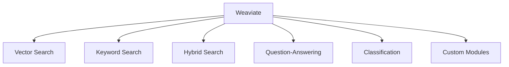
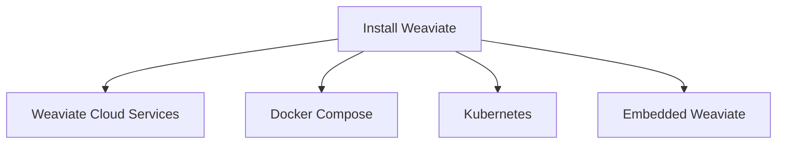
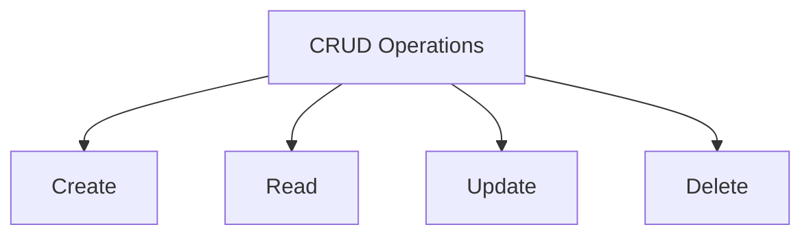
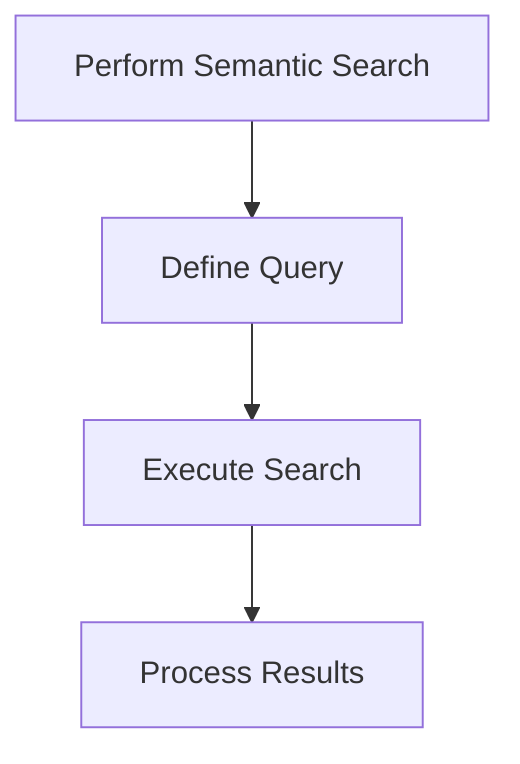

# Weaviate Tutorial: Mastering Vector Databases for AI

Learn to Set Up, Integrate, and Optimize Weaviate for AI Applications


## Introduction

### Overview

Welcome, everyone! I'm excited to guide you through an incredible tool in the AI world—[Weaviate](https://weaviate.io). Weaviate is an open-source vector database that’s a game-changer for AI applications. Think of Weaviate as your powerful, cloud-native, modular, real-time vector search engine that allows you to store data objects and vector embeddings. It’s designed to scale with your machine learning models and integrate seamlessly with a variety of AI platforms.

Why is Weaviate so special? It supports vector search, helping you find semantically similar data points. It also has keyword search (using BM25), which is great for traditional text search. But the magic happens when you combine these into hybrid search, giving you the best of both worlds. Additionally, Weaviate can handle question-answering, classification, and allows for custom modules. These features make it an incredibly versatile tool for developing advanced AI applications.

Weaviate's intuitive interface and extensive [documentation](https://weaviate.io/developers/weaviate) make it easy for anyone, even those with minimal experience, to create and manage vector databases. Let’s get you started with some key resources:

- [Weaviate Documentation](https://weaviate.io/developers/weaviate): Comprehensive guide and reference
- [Getting Started with Weaviate](https://weaviate.io/developers/weaviate/quickstart): Step-by-step guide
- [Weaviate Blog](https://weaviate.io/blog): Insights and updates
- [Weaviate GitHub Repository](https://github.com/semi-technologies/weaviate): Example projects and community support

These resources will provide you with a solid foundation for understanding and using Weaviate in your AI projects. By leveraging these tools, you can create high-performance, scalable AI applications that meet your project's needs efficiently.

### Learning Objectives

By the end of this tutorial, you will:

1. Understand the core concepts and see the benefits of using Weaviate.
2. Know how to install and set up Weaviate in your development environment.
3. Discover key features and practical use cases for Weaviate.
4. Learn how to integrate Weaviate with other AI platforms.
5. Implement best practices and optimization techniques to make the most out of Weaviate.

Ready to unlock the full potential of Weaviate? Let’s get started!

## Why Weaviate Matters

### Descriptive Overview

Let's dive into why Weaviate is a crucial tool in the AI landscape. Weaviate is a cloud-native vector database that’s designed specifically to handle AI-driven tasks. It seamlessly integrates with machine learning models, making it perfect for real-time vector search. This means it can provide powerful semantic search capabilities, helping you find data that’s contextually relevant.

But that’s not all! Weaviate’s modular architecture is incredibly flexible, allowing you to easily integrate various functionalities like text vectorization and image processing. This makes it a versatile tool that can adapt to your specific needs.

### Key Features

Let's dive into some of the standout features of Weaviate and see how they can power your AI applications:



**Vector Search**: Imagine being able to search through your data based on the semantic content, not just keywords. Vector search uses vector embeddings to perform semantic search, giving you highly relevant results that understand the meaning behind your data.

**Keyword Search (BM25)**: Sometimes, you just need a good old-fashioned keyword search. Weaviate supports this too, using the BM25 algorithm to ensure efficient and accurate text-based search queries.

**Hybrid Search**: Why choose between vector and keyword search when you can have both? Hybrid search combines the strengths of both methods, offering a more comprehensive search capability that leverages the best of both worlds.

**Question-Answering**: Ever wanted to build a system that can understand and answer questions based on your data? With Weaviate, you can. It supports sophisticated question-answering systems that can provide accurate responses to user queries.

**Classification**: Organizing and categorizing your data is a breeze with Weaviate. It supports classification, helping you manage and retrieve information more efficiently.

**Custom Modules**: The true power of Weaviate lies in its modular architecture. This allows you to integrate custom functionalities like text vectorization and image processing, tailoring the database to fit your exact needs.

### Practical Use Cases

Now, let’s talk about how you can apply Weaviate in real-world scenarios:

- **Semantic Search**: Enhance your text understanding and search capabilities. Imagine being able to search through vast amounts of data and find exactly what you need based on the context.
- **Recommendation Systems**: Improve your product and content recommendations. Whether it’s an e-commerce site or a streaming service, Weaviate can help personalize the user experience.
- **Content Classification**: Automatically categorize and manage large datasets. This is particularly useful for businesses that deal with vast amounts of information and need an efficient way to organize it.
- **Question-Answering Systems**: Develop systems that can provide accurate answers to user queries, enhancing customer support and user interaction.
- **E-commerce Applications**: Implement advanced search and recommendation features for online stores, making it easier for customers to find what they’re looking for and boosting sales.

By understanding these features and use cases, you can see how Weaviate is an essential tool for scaling and enhancing your AI applications. Next, we’ll dive into how you can get started with Weaviate and leverage these powerful capabilities in your projects.

## Getting Started with Weaviate

### Installation and Setup

Alright, let's get you up and running with Weaviate. There are a few ways to deploy Weaviate depending on your needs and environment. Let's walk through them.



#### Step-by-Step Installation Instructions

1. **Weaviate Cloud Services (WCS)**:
   - This is the quickest way to get started if you prefer a managed solution. WCS takes care of the deployment and infrastructure for you.
   - Head over to the [WCS documentation](https://weaviate.io/developers/weaviate/quickstart) for detailed instructions on setting this up.
   - Once you're there, you'll find a straightforward guide to get your instance up and running in the cloud with just a few clicks.

2. **Docker Compose**:
   - For local development, Docker Compose is a fantastic option. It allows you to set up Weaviate quickly on your local machine.
   - Check out the [official Quickstart tutorial](https://weaviate.io/developers/weaviate/quickstart) for a step-by-step guide.
   - This tutorial will walk you through downloading the Docker Compose file and running the necessary commands to get Weaviate up and running locally.

3. **Kubernetes**:
   - If you're looking for scalable and robust deployments, Kubernetes is the way to go.
   - Follow the [Kubernetes setup guide](https://weaviate.io/developers/weaviate/installation/kubernetes) for detailed instructions.
   - This guide will help you deploy Weaviate on a Kubernetes cluster, ensuring that you can scale your instance as needed.

4. **Embedded Weaviate**:
   - Perfect for local development and testing, Embedded Weaviate allows you to run Weaviate directly within your application.
   - Learn how to set it up with the [Embedded Weaviate guide](https://weaviate.io/developers/weaviate/installation/embedded).
   - This guide provides all the details you need to get Weaviate running in an embedded environment, making it easy to test and develop your applications.

#### Initial Configuration

Before you start adding data to Weaviate, you need to define a data schema. The schema sets up the structure of your data, defining classes, properties, and vector configurations. Let's get into it.

1. **Initialize Weaviate**:
   - Depending on your chosen deployment method, set up your Weaviate instance. If you followed one of the guides above, you should already have Weaviate running.
   - Next, you'll configure your data schema. This involves defining the classes (types of objects you'll store) and their properties (attributes of those objects).
   - For more details on how to structure your schema, check out [Weaviate's schema documentation](https://weaviate.io/developers/weaviate/concepts/data).

2. **Verify Setup**:
   - Now, let's make sure everything is running smoothly. Start by accessing the health check endpoint of your Weaviate instance. This will confirm that Weaviate is up and running.
   - Use the Weaviate dashboard or API to verify your schema. Make sure the classes and properties you defined are correctly set up.
   - If everything looks good, you're ready to start adding data and exploring the powerful capabilities of Weaviate!

By following these steps, you'll have a solid Weaviate setup tailored to your specific needs. Let's move on to adding data and leveraging Weaviate's features!

## Practical Examples

Alright, let's dive into some hands-on practice with Weaviate. In this example, we'll learn how to add data objects to Weaviate and vectorize them for semantic search. Follow along step-by-step, and you'll see how easy it is to work with this powerful tool.

### Example 1: Adding Data to Weaviate

#### Task Description

Our goal here is to add data objects to Weaviate and ensure they are vectorized so we can perform semantic searches on them. By the end of this example, you'll be able to input data into Weaviate and leverage its vector search capabilities.



#### Step-by-Step Guide

1. **Define Your Data Schema**

   Before we can add data, we need to define the structure of our data. This involves setting up classes and properties in your schema. Think of it as creating a blueprint for the kind of data you'll store.

   - Head over to the [Weaviate schema documentation](https://weaviate.io/developers/weaviate/concepts/data) for detailed information on how to structure your schema.

2. **Add Data Objects**

   Once your schema is defined, it's time to add data objects to your Weaviate instance. These objects need to be vectorized using a model provider like OpenAI or Hugging Face to enable semantic search.

#### Code Snippet

Let's look at some Python code to see how this works in practice. Follow along with the comments to understand each step:

```python
import weaviate  # Import the Weaviate client library

# Create a Weaviate client instance, connecting to your local Weaviate instance
client = weaviate.Client("http://localhost:8080")

# Define the schema for your data
# Here, we're creating a schema for an "Article" class with properties: title, content, and vector
schema = {
    "classes": [
        {
            "class": "Article",
            "properties": [
                {"name": "title", "dataType": ["text"]},  # The title of the article
                {"name": "content", "dataType": ["text"]},  # The main content of the article
                {"name": "vector", "dataType": ["number[]"]}  # The vector embedding for semantic search
            ]
        }
    ]
}

# Create the schema in Weaviate
client.schema.create(schema)

# Define an example article to add to Weaviate
# This article includes a title, content, and a vector embedding (which would be generated by a model provider)
article = {
    "class": "Article",
    "properties": {
        "title": "Weaviate Introduction",
        "content": "Weaviate is an open-source vector database for AI applications.",
        "vector": [0.1, 0.2, 0.3, ...]  # Vector embedding of the content
    }
}

# Add the article to the Weaviate instance
client.data_object.create(article)
```

3. **Explanation of Results**

   After running this code:
   
   - The schema is created in your Weaviate instance, defining how articles should be structured.
   - The article object is added to the Weaviate database with its title, content, and vector embedding.
   - The vector embedding allows Weaviate to perform efficient semantic searches, making it easier to find relevant articles based on their content.

By following these steps, you now have a working setup where data is added to Weaviate, complete with vector embeddings for powerful search capabilities. This is just the beginning, and there are many more features and optimizations you can explore with Weaviate.

### Example 2: Performing a Semantic Search

Alright, now that we've added some data to Weaviate, let's take it a step further and perform a semantic search. This will allow us to find articles that are related to a specific query based on their content. Ready? Let's get started!



#### Task Description

Our goal here is to perform a semantic search to find articles that are related to a query. By the end of this example, you'll be able to use Weaviate's powerful search capabilities to retrieve relevant information.

#### Step-by-Step Guide

1. **Define Your Query**

   First, we need to formulate a search query. Think about what information you're looking for and how you might describe it.

   - For this example, let's say we're interested in finding articles related to "What is Weaviate?"

2. **Execute the Search**

   Now that we have our query, we'll use the Weaviate API to perform a semantic search. This involves sending our query to Weaviate and asking it to find articles that match the semantic content of our query.

#### Code Snippet

Let's walk through the code together. I'll explain each step as we go along:

```python
import weaviate  # Import the Weaviate client library

# Create a Weaviate client instance, connecting to your local Weaviate instance
client = weaviate.Client("http://localhost:8080")

# Define the search query
# Here, we're looking for articles that are related to "What is Weaviate?"
query = {
    "query": "What is Weaviate?",
    "fields": ["title", "content"]  # Specify the fields we want to search within
}

# Execute the search query
# We use the 'query.get' method to search for articles and specify the fields we want to retrieve
response = client.query.get("Article", ["title", "content"])\
                       .with_search(query)\
                       .do()

# Process and print the search results
# Loop through the returned articles and print their titles and content
for article in response["data"]["Get"]["Article"]:
    print(f"Title: {article['title']}, Content: {article['content']}")
```

3. **Explanation of Results**

   After running this code:
   
   - We've defined a query asking "What is Weaviate?" and specified that we want to search within the title and content of articles.
   - We sent this query to Weaviate, which performed a semantic search to find articles related to our query.
   - The search results are processed and printed, showing the titles and content of articles that match the semantic content of our query.

This example demonstrates how to leverage Weaviate's powerful search capabilities to retrieve relevant information based on the semantic content of your data. It's a great way to see how Weaviate can make finding and using data much more intuitive and efficient.

By practicing these steps, you'll become more comfortable using Weaviate to perform semantic searches and unlock the full potential of your data. Keep experimenting with different queries and data to see just how powerful this tool can be!

Certainly! Here’s the advanced usage section with detailed explanations and comments to make it educational and engaging:

---

## Advanced Usage

Alright, let's delve into some advanced features and capabilities of Weaviate. These will help you maximize the potential of your AI applications by fine-tuning your Weaviate setup and exploring more sophisticated use cases.

### Detailed Features

Weaviate is packed with advanced features that allow you to refine and optimize your searches. Let’s explore some key ones:

1. **Metadata Filtering**:
   - **What it is**: This feature allows you to combine vector search with metadata filters to get more precise results.
   - **How to use it**: Imagine you have a large database of articles and want to find those related to AI but only those published in the last year. You can filter your search results based on the publication date.

   ```python
   import weaviate

   # Initialize the Weaviate client
   client = weaviate.Client("http://localhost:8080")

   # Define the filter for publication date
   filter = {
       "operator": "Equal",  # We are looking for exact matches
       "path": ["publicationDate"],  # The path in the schema to the field we want to filter by
       "valueString": "2023"  # The value we are filtering for
   }

   # Perform the query with the filter applied
   query_result = client.query.get("Article", ["title", "content"])\
                     .with_filter(filter)\
                     .do()

   # Iterate through the results and print the titles and content
   for article in query_result["data"]["Get"]["Article"]:
       print(f"Title: {article['title']}, Content: {article['content']}")
   ```

2. **Hybrid Search**:
   - **What it is**: This combines the strengths of vector similarity with keyword boosting to enhance search capabilities.
   - **How to use it**: Let’s say you’re searching for documents about "machine learning." Hybrid search can combine the semantic similarity of your query with keyword relevance to provide more accurate and relevant results.

   ```python
   # Define the hybrid search query
   hybrid_query = {
       "query": "machine learning",  # The query string
       "fields": ["title", "content"],  # Fields to search within
       "boost": 1.5  # Boost factor to prioritize keyword matches
   }

   # Execute the hybrid search query
   response = client.query.get("Document", ["title", "content"])\
                       .with_search(hybrid_query)\
                       .do()

   # Iterate through the results and print the titles and content
   for doc in response["data"]["Get"]["Document"]:
       print(f"Title: {doc['title']}, Content: {doc['content']}")
   ```

3. **Real-time Updates**:
   - **What it is**: Weaviate indexes update in real-time, ensuring that your search results are always fresh and up-to-date.
   - **How to use it**: If you are running a news website, for instance, you can ensure that as soon as a new article is published, it is immediately searchable.

   ```python
   # Define a new article to upsert into Weaviate
   new_article = {
       "class": "Article",  # The class defined in your schema
       "properties": {
           "title": "Latest AI Trends",  # Title of the article
           "content": "This article covers the latest trends in AI.",  # Content of the article
           "vector": [0.1, 0.2, 0.3, 0.4]  # Vector embedding of the content
       }
   }

   # Upsert the new article into the Weaviate instance
   client.data_object.create(new_article)
   ```

### Customization and Optimization

Now, let’s talk about how you can customize and optimize your Weaviate setup to fit your specific needs and ensure it performs efficiently.

1. **Optimize Schema Design**:
   - **Why it's important**: Tailoring your schema to fit your specific use case can greatly improve performance.
   - **How to do it**: Carefully consider the structure of your data, the properties you need, and how they will be queried. For example, if you frequently search by date, make sure your schema includes date fields that are indexed.

   ```python
   optimized_schema = {
       "classes": [
           {
               "class": "NewsArticle",  # Name of the class
               "properties": [
                   {"name": "headline", "dataType": ["string"]},  # Headline property
                   {"name": "body", "dataType": ["string"]},  # Body content property
                   {"name": "publicationDate", "dataType": ["date"]},  # Publication date property
                   {"name": "vector", "dataType": ["number[]"]}  # Vector embedding property
               ]
           }
       ]
   }

   # Create the optimized schema in Weaviate
   client.schema.create(optimized_schema)
   ```

2. **Vector Compression**:
   - **Why it's important**: Reducing memory usage can help improve performance and lower costs.
   - **How to do it**: Implement vector compression techniques that can store vectors more efficiently without losing significant information.

   ```python
   from sklearn.decomposition import PCA
   import numpy as np

   # Original high-dimensional vectors
   vectors = np.array([[0.1, 0.2, 0.3, 0.4], [0.5, 0.6, 0.7, 0.8]])

   # Apply PCA to reduce the dimensions to 2
   pca = PCA(n_components=2)
   compressed_vectors = pca.fit_transform(vectors)

   # Print the compressed vectors
   print(compressed_vectors)
   ```

3. **Scaling Weaviate**:
   - **Why it's important**: Adjusting resources ensures your Weaviate deployment can handle increased load and perform efficiently.
   - **How to do it**: Scale your deployment by adjusting CPU, memory, and GPU resources as needed. Monitor performance and make adjustments to resources to ensure optimal performance.

   ```yaml
   # Example Kubernetes configuration to scale Weaviate deployment
   apiVersion: apps/v1
   kind: Deployment
   metadata:
     name: weaviate
   spec:
     replicas: 3  # Scale to 3 replicas for handling more traffic
     template:
       spec:
         containers:
           - name: weaviate
             image: semitechnologies/weaviate:latest
             resources:
               limits:
                 memory: "4Gi"  # Limit the memory usage to 4Gi
                 cpu: "2"  # Limit the CPU usage to 2 cores
               requests:
                 memory: "2Gi"  # Request 2Gi memory
                 cpu: "1"  # Request 1 CPU core
   ```

## Integration and Deployment

Weaviate’s flexibility allows it to seamlessly integrate with several AI platforms and model providers. Let’s look at how you can integrate and deploy Weaviate effectively.

### Integration Tips

Weaviate integrates smoothly with popular AI platforms like OpenAI, Google AI, Cohere, Hugging Face, and AWS. Here’s how you can get started:

- **Example**: To use Google AI models with Weaviate, you can follow the detailed steps provided in the [Google AI integration guide](https://weaviate.io/developers/weaviate/model-providers/google). This will walk you through the process of connecting Weaviate with Google AI to leverage powerful machine learning models in your applications.

### Deployment Considerations

When deploying Weaviate-based applications, keep these best practices in mind to ensure smooth operation and easy maintenance:

1. **Monitoring and Maintenance**:
   - **Why it matters**: Keeping an eye on performance helps you address issues before they become problems.
   - **How to do it**: Use Weaviate’s dashboard to monitor performance metrics and manage resources effectively.
   
2. **Regular Updates**:
   - **Why it matters**: Regular updates ensure you have the latest features and improvements.
   - **How to do it**: Keep your Weaviate deployment updated by following the release notes and applying updates as they become available.

## Actionable Takeaways

Alright, let's wrap up with some actionable takeaways that will help you leverage Weaviate to its fullest potential.

### Summary of Key Points

- **Weaviate** is a powerful and scalable solution for vector search in AI applications.
- **Key features** include vector search, keyword search, hybrid search, and a modular architecture that allows for customization and integration with various AI platforms.

### Practical Advice

- **Start simple**: Begin with the basics to get comfortable with Weaviate’s core features. Gradually explore advanced features as you gain more confidence.
- **Utilize resources**: Make good use of Weaviate’s comprehensive documentation and active community forums for deeper insights and support.

### Next Steps

- **Experiment**: Try implementing Weaviate in different AI-driven projects to see how it enhances your data management and search capabilities.
- **Explore advanced configurations**: Dive into more complex configurations and integrations to fully exploit Weaviate’s potential.

Alright, let's dive into an exciting hands-on challenge to solidify your understanding of Weaviate! Today, we'll be creating a simple Weaviate-based application that allows users to perform CRUD (Create, Read, Update, Delete) operations on vectors. This exercise will give you a practical grasp of how to work with Weaviate in real-world scenarios.

## Challenge: Real-World Application

### Task Description

Our goal is to create a Weaviate-based application where users can perform CRUD operations on vectors. By the end of this challenge, you'll have a fully functional application that showcases Weaviate's capabilities in managing vector data.

### Steps to Complete

1. **Set Up Weaviate Project**
2. **Define Data Models and Indexes**
3. **Implement CRUD Operations**
4. **Test and Deploy the Application**

### Step 1: Set Up Weaviate Project

First things first, let's get our Weaviate environment ready. You need to sign up for Weaviate, get your API key, and set up your development environment.

1. **Sign up for Weaviate**: Go to the [Weaviate website](https://weaviate.io) and create an account.
2. **Get your API key**: After signing up, log in to your account and retrieve your API key from the dashboard.
3. **Set up your environment**: Make sure you have Python installed. You'll also need the Weaviate client library, which you can install using pip:

   ```bash
   pip install weaviate-client
   ```

### Step 2: Define Data Models and Indexes

Next, we need to create a schema that defines the structure of our data. This involves specifying classes and their properties.

1. **Create a schema**: Define the classes and properties for the items you'll be storing. Let's say we're creating an index for "Items" with properties like name, description, and a vector.

   ```python
   import weaviate

   # Initialize the Weaviate client
   client = weaviate.Client("http://localhost:8080")

   # Define the schema
   schema = {
       "classes": [
           {
               "class": "Item",  # Class name
               "properties": [
                   {"name": "name", "dataType": ["string"]},  # Name property
                   {"name": "description", "dataType": ["string"]},  # Description property
                   {"name": "vector", "dataType": ["number[]"]}  # Vector embedding property
               ]
           }
       ]
   }

   # Create the schema in Weaviate
   client.schema.create(schema)
   ```

### Step 3: Implement CRUD Operations

Now, we'll implement the Create, Read, Update, and Delete operations for our vectors. Let's walk through each operation step by step.

1. **Create (Upsert) Operation**: Adding a new item to the Weaviate instance.

   ```python
   # Define a new item
   item = {
       "class": "Item",  # Class name
       "properties": {
           "name": "Item 1",  # Name of the item
           "description": "This is the first item.",  # Description of the item
           "vector": [0.1, 0.2, 0.3, 0.4]  # Vector embedding for the item
       }
   }

   # Create (upsert) the item in Weaviate
   client.data_object.create(item)
   ```

2. **Read Operation**: Retrieving an item from Weaviate using its ID.

   ```python
   # Assume you have the item's ID
   item_id = "your-item-id"

   # Perform the query to get the item
   query_result = client.query.get("Item", ["name", "description"])\
                       .with_id(item_id)\
                       .do()

   # Print the result
   for item in query_result["data"]["Get"]["Item"]:
       print(f"Name: {item['name']}, Description: {item['description']}")
   ```

3. **Update Operation**: Modifying an existing item in Weaviate.

   ```python
   # Define the updated item
   updated_item = {
       "class": "Item",  # Class name
       "properties": {
           "name": "Updated Item 1",  # Updated name of the item
           "description": "This is the updated first item.",  # Updated description
           "vector": [0.2, 0.3, 0.4, 0.5]  # Updated vector embedding
       }
   }

   # Update the item in Weaviate
   client.data_object.create(updated_item, with_id=item_id)
   ```

4. **Delete Operation**: Removing an item from Weaviate using its ID.

   ```python
   # Delete the item from Weaviate
   client.data_object.delete(item_id)
   ```

### Step 4: Test and Deploy the Application

Once you have implemented all CRUD operations, it's time to test your application to ensure everything works as expected.

1. **Test your operations**: Run your code to test the create, read, update, and delete functionalities. Make sure each operation works correctly.
2. **Deploy your application**: Deploy your application to a cloud service or hosting platform of your choice. This makes your application accessible to users and allows them to interact with your Weaviate-based vector database.

### Expected Outcome

By the end of this challenge, you will have a fully functional application that demonstrates Weaviate’s capabilities in managing vector data. You'll understand how to set up a Weaviate project, define data models, and perform CRUD operations, all while leveraging the power of vector search.

### Additional Resources

For more detailed information and advanced usage, check out these resources:
1. [Weaviate Official Site](https://weaviate.io)
2. [What is a Vector Database?](https://weaviate.io/blog/what-is-a-vector-database)
3. [Weaviate Tutorial on DataCamp](https://www.datacamp.com/tutorial/weaviate-tutorial)
4. [Weaviate Documentation](https://weaviate.io/developers/weaviate)
5. [Weaviate Schema Concepts](https://weaviate.io/developers/weaviate/concepts/data)
6. [Enterprise Use Cases for Weaviate](https://weaviate.io/blog/enterprise-use-cases-weaviate)
7. [Google AI Integration Guide](https://weaviate.io/developers/weaviate/model-providers/google)
8. [Weaviate Model Providers](https://weaviate.io/developers/weaviate/model-providers)
9. [Weaviate Tutorials](https://weaviate.io/developers/weaviate/tutorials)
10. [Beginner's Guide to Weaviate](https://towardsdatascience.com/getting-started-with-weaviate-a-beginners-guide-to-search-with-vector-databases-14bbb9285839?gi=17b2e1d3f060)
11. [Weaviate Resource Concepts](https://weaviate.io/developers/weaviate/concepts/resources)
12. [Weaviate Quickstart Guide](https://weaviate.io/developers/weaviate/quickstart)

Good luck, and happy coding!