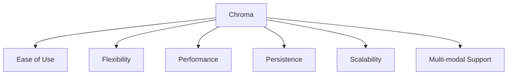
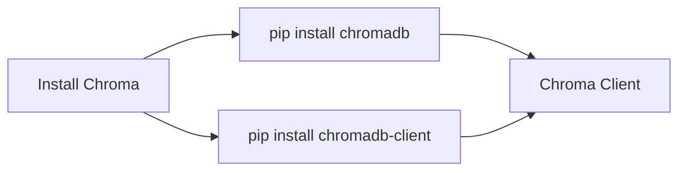
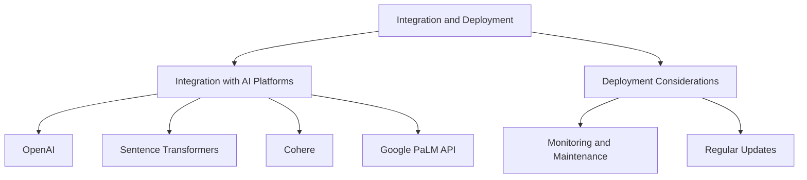
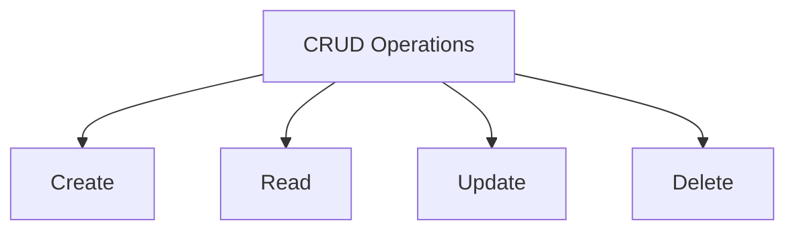

# Chroma Tutorial: Mastering Vector Databases for AI

Learn to Set Up, Integrate, and Optimize Chroma for AI Applications


## Introduction

### Overview

Welcome, everyone! I’m thrilled to guide you through this in-depth tutorial on [Chroma](https://www.trychroma.com). Chroma is an open-source, AI-native vector database that's specifically designed for storing and retrieving embeddings in large language model (LLM) applications. Imagine a tool that efficiently manages high-dimensional vector data, making it indispensable for developers working with AI and machine learning models. That’s Chroma.

Why is Chroma so special? It supports vector search, helping you find semantically similar data points. It also has keyword search, which is great for traditional text search. But the magic happens when you combine these into hybrid search, giving you the best of both worlds. Additionally, Chroma can handle question-answering, classification, and allows for custom modules. These features make it an incredibly versatile tool for developing advanced AI applications.

Chroma's intuitive interface and extensive [documentation](https://docs.trychroma.com/getting-started) make it easy for anyone, even those with minimal experience, to create and manage vector databases. Let’s get you started with some key resources:

- [Chroma Documentation](https://docs.trychroma.com/getting-started): Comprehensive guide and reference
- [Getting Started with Chroma](https://docs.trychroma.com/guides/embeddings): Step-by-step guide
- [Chroma Blog](https://zeet.co/blog/exploring-chroma-vector-database-capabilities): Insights and updates
- [Chroma GitHub Repository](https://github.com/chroma-core/chroma): Example projects and community support

These resources will provide you with a solid foundation for understanding and using Chroma in your AI projects. By leveraging these tools, you can create high-performance, scalable AI applications that meet your project's needs efficiently.

### Learning Objectives

By the end of this tutorial, you will:

1. Understand the core concepts and see the benefits of using Chroma.
2. Know how to install and set up Chroma in your development environment.
3. Discover key features and practical use cases for Chroma.
4. Learn how to integrate Chroma with other AI platforms.
5. Implement best practices and optimization techniques to make the most out of Chroma.

Ready to unlock the full potential of Chroma? Let’s get started!

## Why Chroma Matters

### Descriptive Overview

Chroma is a crucial tool in the AI landscape due to its ability to efficiently manage and retrieve high-dimensional vector data. It is designed to handle the complexities associated with LLM applications, providing a robust and scalable solution for developers.

### Key Features

Let's break down some of the standout features of Chroma:



1. **Ease of Use**: Chroma offers a simple and intuitive API designed with developer productivity in mind. This makes it easy for developers to quickly get started and integrate Chroma into their existing workflows without a steep learning curve.

2. **Flexibility**: Chroma supports various embedding models, including OpenAI, Sentence Transformers, Cohere, and Google PaLM API. This flexibility allows developers to choose the best embedding model for their specific use case, ensuring optimal performance and accuracy.

3. **Performance**: Optimized for high-throughput operations with in-memory storage capabilities, Chroma ensures fast retrieval and processing of vector data. This is particularly important for applications that require real-time responses, such as interactive AI systems and recommendation engines.

4. **Persistence**: Chroma offers both in-memory and persistent storage options. This means you can choose to store your data in memory for faster access during runtime or persist it to disk for long-term storage, ensuring data durability and consistency.

5. **Scalability**: Chroma can be run locally for development and testing or deployed as a server for larger-scale applications. This scalability ensures that Chroma can handle growing data volumes and increasing query loads, making it suitable for both small projects and enterprise-level applications.

6. **Multi-modal Support**: Chroma handles embeddings for text, images, and potentially audio and video. This multi-modal support allows you to use Chroma for a wide range of applications, from text-based semantic search to image classification and similarity search.

### Practical Use Cases

Chroma can be applied to various real-world scenarios, such as:

- **Semantic Search Engines**: Implement context-aware search functionality in applications. Chroma uses vector embeddings to understand the meaning behind the text, allowing search engines to return more relevant and contextually appropriate results. For example, a user searching for "how to cook pasta" might receive results that include related cooking techniques, recipes, and ingredient tips.

- **Enhancing Large Language Models**: Improve LLM performance by providing relevant context from stored embeddings. Chroma allows LLMs to access pertinent background information quickly, which enhances their ability to generate accurate and relevant responses. This is particularly useful in applications like customer support or virtual assistants, where context from previous interactions can significantly improve the quality of the response.

- **Recommendation Systems**: Build personalized recommendation engines based on content similarity. Chroma helps by storing and retrieving embeddings that represent user preferences and item characteristics, enabling the system to suggest products, movies, books, or other content that align closely with the user's interests. For instance, a streaming service could recommend shows and movies based on a user's viewing history and preferences.

- **Knowledge Graphs**: Support complex data science applications by managing interconnected information. Chroma's ability to store and retrieve high-dimensional vectors makes it an excellent tool for creating and navigating knowledge graphs, where understanding the relationships between different pieces of data is crucial. This can be used in fields like research, where linking related studies and data sets is essential.

- **Image Classification and Similarity Search**: Extend beyond text to handle image-based queries and similarity searches. Chroma can manage embeddings for images, allowing applications to find visually similar images or classify them based on their content. This is particularly useful in e-commerce for finding products based on image searches or in digital asset management for organizing and retrieving images efficiently.

## Getting Started with Chroma



### Installation and Setup

Alright, let's dive in and get Chroma set up on your system. We'll walk through the installation and initial configuration steps together.

#### Installation

First things first, we need to install Chroma. You can do this using pip, the Python package installer. Open your terminal and run the following command:

```bash
pip install chromadb
```

If you only need the client version for a client-server setup, you can install it with:

```bash
pip install chromadb-client
```

### Initial Configuration

Now that we have Chroma installed, let's configure it to start using it. We'll go through creating a client, setting up a collection, adding documents, and querying the collection.

1. **Create a Chroma Client**

   Let's start by creating a Chroma client. This client will allow us to interact with Chroma.

   ```python
   import chromadb

   # Create a Chroma client instance
   client = chromadb.Client()
   ```

   If you want to use persistent storage, where your data is saved to disk rather than kept in memory, you can set up a persistent client like this:

   ```python
   # Create a persistent Chroma client instance
   client = chromadb.PersistentClient(path="path/to/storage")
   ```

   In this setup, replace `"path/to/storage"` with the actual path where you want to store your data.

2. **Create a Collection**

   Next, we need to create a collection within Chroma. Think of a collection as a container where we store related documents.

   ```python
   # Create a collection named "my_collection"
   collection = client.create_collection("my_collection")
   ```

   Here, we're creating a collection called `"my_collection"`. You can name your collection whatever makes the most sense for your application.

3. **Add Documents**

   Now that we have a collection, let's add some documents to it. Each document can also have associated metadata and an ID.

   ```python
   # Add documents to the collection
   collection.add(
       documents=["This is a document", "This is another document"],
       metadatas=[{"source": "my_source"}, {"source": "my_source"}],
       ids=["id1", "id2"]
   )
   ```

   In this example:
   - We add two documents: `"This is a document"` and `"This is another document"`.
   - Each document has associated metadata, in this case, a `source` field.
   - Each document is given a unique ID: `"id1"` and `"id2"`.

4. **Query the Collection**

   Finally, let's query our collection to retrieve documents based on some search criteria.

   ```python
   # Query the collection
   results = collection.query(
       query_texts=["This is a query document"],
       n_results=2
   )
   ```

   In this query:
   - We're searching for documents related to the text `"This is a query document"`.
   - We want the top 2 results (`n_results=2`).

By following these steps, you've set up Chroma, created a collection, added documents, and performed a query. This is just the beginning, and there's a lot more you can do with Chroma. We'll dive deeper into its features and capabilities in the next sections.

## Practical Examples

Alright, now let's dive into some hands-on examples to get you comfortable with Chroma. We'll explore how to use custom embedding functions and how to filter query results based on metadata. 

### Example 1: Custom Embedding Functions

#### Task Description

In this example, we'll set up a custom embedding function using OpenAI. Custom embedding functions allow you to generate embeddings tailored to your specific needs.

#### Step-by-Step Guide

1. **Set Up Custom Embedding Function**

   First, we need to import the necessary module and set up the embedding function using OpenAI.

   ```python
   from chromadb.utils import embedding_functions

   # Create an embedding function using OpenAI
   openai_ef = embedding_functions.OpenAIEmbeddingFunction(
       api_key="your-api-key",  # Replace with your actual OpenAI API key
       model_name="text-embedding-ada-002"  # Specify the model name
   )

   # Create a collection with the custom embedding function
   collection = client.create_collection("my_collection", embedding_function=openai_ef)
   ```

   In this code:
   - We import the `embedding_functions` module from Chroma.
   - We create an embedding function using OpenAI's API. Make sure to replace `"your-api-key"` with your actual API key.
   - We specify the model name, in this case, `"text-embedding-ada-002"`.
   - We create a collection called `"my_collection"` and assign the custom embedding function to it.

2. **Explanation of Results**

   By setting up a custom embedding function, Chroma can now use the specified OpenAI model to generate embeddings for the documents in your collection. This means that every time you add a document to `"my_collection"`, the custom embedding function will be used to generate its embedding, enabling more precise and tailored searches.

### Example 2: Metadata Filtering

#### Task Description

Next, we'll learn how to filter query results based on metadata. This is useful when you need to narrow down search results to documents that meet certain criteria.

#### Step-by-Step Guide

1. **Set Up Metadata Filtering**

   Let's see how to perform a query with metadata filtering.

   ```python
   # Query the collection with metadata filtering
   results = collection.query(
       query_texts=["This is a query document"],  # The text to query
       where={"source": "my_source"},  # Filter results where the metadata 'source' is 'my_source'
       n_results=2  # Number of results to return
   )
   ```

   In this code:
   - We query the collection for documents related to the text `"This is a query document"`.
   - We add a filter to only include documents where the `source` metadata is `"my_source"`.
   - We specify that we want the top 2 results.

2. **Explanation of Results**

   The query results will be filtered based on the specified metadata, meaning that only documents with the metadata `source` equal to `"my_source"` will be included in the results. This allows you to refine your search and retrieve documents that meet specific criteria, making your search results more relevant and useful.

By following these steps, you'll be able to leverage Chroma's capabilities to create custom embedding functions and filter query results based on metadata. These features will help you manage and retrieve your data more efficiently and effectively. Keep practicing with different queries and configurations to become more proficient with Chroma!

## Advanced Usage

Alright, let's dive into some advanced features and configurations of Chroma. These will help you get the most out of your Chroma setup.

### Detailed Features

First, let's look at how to customize the distance function used for similarity searches. This can significantly impact the results depending on your use case.

1. **Changing Distance Function**:

   By default, Chroma uses the "l2" distance function. However, you can change this to "cosine" or "ip" depending on your needs. Let's see how to set this up.

   ```python
   # Create a collection with a custom distance function
   collection = client.create_collection(
       "my_collection",  # Name of the collection
       metadata={"hnsw:space": "cosine"}  # Setting the distance function to cosine
   )
   ```

   Here’s what’s happening:
   - We're creating a collection named "my_collection".
   - We're customizing the distance function to "cosine" by setting the metadata parameter `"hnsw:space": "cosine"`. You can also use "l2" (the default) or "ip" (inner product).

### Customization and Optimization

To get the best performance from Chroma, consider these customization and optimization techniques:

1. **Optimize Schema Design**:

   Tailoring your schema to fit your specific use case can improve performance. Think carefully about what properties you need and how you will query them. For example, if you frequently search by date, ensure your schema includes date fields that are indexed.

2. **Vector Compression**:

   Implementing vector compression can help reduce memory usage, especially with large datasets. This involves reducing the dimensionality of your vectors while maintaining their essential features. Techniques like PCA (Principal Component Analysis) can be used for this purpose.

3. **Scaling Chroma**:

   Adjusting CPU, memory, and GPU resources is crucial for efficiently scaling your Chroma deployment. Monitor your resource usage and scale up as needed to handle increased loads. This can involve moving from a local setup to a more robust client-server architecture.

## Integration and Deployment

Chroma integrates seamlessly with several AI platforms and model providers. Let’s go over some tips and considerations for integrating and deploying Chroma.



### Integration Tips

Chroma works well with popular AI platforms like OpenAI, Sentence Transformers, Cohere, and Google PaLM API. Here’s how you can get started:

- **Example**: To use OpenAI models with Chroma, you can set up a custom embedding function as we did earlier in the tutorial. This allows you to leverage powerful pre-trained models for generating embeddings.

### Deployment Considerations

When deploying Chroma-based applications, keep these best practices in mind:

1. **Monitoring and Maintenance**:

   - **Why it matters**: Regular monitoring ensures your deployment is performing optimally and helps you catch issues early.
   - **How to do it**: Use Chroma’s dashboard to keep an eye on performance metrics and manage resources effectively. Set up alerts for any anomalies to ensure you can respond quickly.

2. **Regular Updates**:

   - **Why it matters**: Keeping your Chroma deployment updated ensures you benefit from the latest features, improvements, and security patches.
   - **How to do it**: Regularly check for updates and follow the upgrade procedures outlined in the Chroma documentation.

## Actionable Takeaways

Alright, let's wrap up with some key points and practical advice to help you make the most of Chroma.

### Summary of Key Points

- **Chroma** is a powerful and scalable solution for managing embeddings in AI applications.
- **Key features** include ease of use, flexibility, performance, persistence, scalability, and multi-modal support.

### Practical Advice

- **Start simple**: Begin with the basics and get comfortable with Chroma’s core features. Then, gradually explore more advanced features as you gain confidence.
- **Leverage resources**: Utilize Chroma’s documentation and community resources for deeper insights and support. They can be incredibly helpful as you experiment and troubleshoot.

### Next Steps

- **Experiment**: Try using Chroma in different AI-driven projects to see how it enhances your data management and search capabilities.
- **Explore**: Dive into advanced configurations and integrations to fully exploit Chroma’s potential.

By following these steps and exploring Chroma’s features, you’ll be well on your way to mastering this powerful tool and leveraging it to build sophisticated, AI-powered applications. Keep experimenting and learning, and don’t hesitate to seek help from the community and documentation whenever needed. Happy coding!

## Challenge: Real-World Application

Alright, it's time to put everything we've learned into practice. We're going to create a simple Chroma-based application that allows users to perform CRUD operations on vectors. This hands-on challenge will give you practical experience with Chroma and help solidify your understanding.

### Task Description

Our goal is to create a Chroma-based application where users can perform Create, Read, Update, and Delete (CRUD) operations on vectors. By the end of this challenge, you’ll have a fully functional application that demonstrates Chroma’s capabilities in managing vector data.

### Steps to Complete

1. **Set Up Chroma Project**:
   - First, sign up for Chroma and get your API key.
   - Next, set up your development environment. Ensure you have Python installed, and then install the Chroma client library using pip:

     ```bash
     pip install chromadb
     ```

2. **Define Data Models and Indexes**:
   - Create an index to store vectors representing various items. Here’s how you can define a simple schema for items:

     ```python
     import chromadb

     # Create a Chroma client instance
     client = chromadb.Client()

     # Define the schema and create a collection named "items"
     schema = {
         "classes": [
             {
                 "class": "Item",
                 "properties": [
                     {"name": "name", "dataType": ["string"]},
                     {"name": "description", "dataType": ["string"]},
                     {"name": "vector", "dataType": ["number[]"]}
                 ]
             }
         ]
     }
     client.schema.create(schema)

     # Create the collection
     collection = client.create_collection("items")
     ```

3. **Implement CRUD Operations**:



   - **Create Operation**:
     - Add items to the collection with their respective vectors.

     ```python
     # Add items to the collection
     collection.add(
         documents=["Item 1 description", "Item 2 description"],
         metadatas=[{"name": "Item 1"}, {"name": "Item 2"}],
         ids=["item1", "item2"]
     )
     ```

   - **Read Operation**:
     - Retrieve an item from the collection using its ID.

     ```python
     # Query the collection to get an item by its ID
     item_id = "item1"
     result = collection.get(id=item_id)
     print(result)
     ```

   - **Update Operation**:
     - Update the details of an existing item in the collection.

     ```python
     # Update an existing item
     updated_item = {
         "class": "Item",
         "properties": {
             "name": "Updated Item 1",
             "description": "This is the updated description for Item 1",
             "vector": [0.2, 0.3, 0.4, 0.5]
         }
     }
     collection.update(updated_item, id=item_id)
     ```

   - **Delete Operation**:
     - Remove an item from the collection using its ID.

     ```python
     # Delete an item from the collection
     collection.delete(id=item_id)
     ```

4. **Test and Deploy the Application**:
   - Ensure all CRUD operations work as expected by running the code and verifying the outputs.
   - Once verified, deploy your application to a cloud service or hosting platform of your choice. This will make your application accessible to users, allowing them to interact with your Chroma-based vector database.

### Expected Outcome

By the end of this challenge, you will have a fully functional application that demonstrates Chroma’s capabilities in managing vector data. You’ll be comfortable with setting up a Chroma project, defining data models, and performing CRUD operations.

## Conclusion

### Summary

Chroma offers a powerful and flexible solution for managing embeddings in AI and machine learning applications. Its ease of use, performance optimizations, and integration capabilities make it an excellent choice for developers working with LLMs and other AI models.

### Continue Learning

By leveraging Chroma's features and following best practices, you can build sophisticated, AI-powered applications that efficiently handle large-scale vector data. Keep exploring and experimenting to uncover the full potential of Chroma.

### Additional Resources

To further your understanding and capabilities with Chroma, check out these additional resources:

1. [Chroma Official Site](https://www.trychroma.com)
2. [Chroma Embedding Guides](https://docs.trychroma.com/guides/embeddings)
3. [Chroma Tutorial on DataCamp](https://www.datacamp.com/tutorial/chromadb-tutorial-step-by-step-guide)
4. [Chroma Getting Started Documentation](https://docs.trychroma.com/getting-started)
5. [Chroma Schema Concepts](https://docs.trychroma.com/guides)
6. [Integration with LangChain](https://python.langchain.com/v0.2/docs/integrations/vectorstores/chroma/)
7. [What is a Vector Database?](https://realpython.com/chromadb-vector-database/)
8. [Exploring Chroma Vector Database Capabilities](https://zeet.co/blog/exploring-chroma-vector-database-capabilities)
9. [Pinecone, Chroma, or Faiss: Which is the Best Vector Database?](https://blog.getbind.co/2024/02/23/pinecone-chroma-or-faiss-which-is-the-best-vector-database-for-building-llm-applications/)
10. [Mastering AI-Native Embedding Storage with Chroma](https://myscale.com/blog/mastering-ai-native-embedding-storage-with-chroma-vector-database/)
11. [LangChain and Chroma Integration](https://blog.langchain.dev/langchain-chroma/)

Good luck, and happy coding!