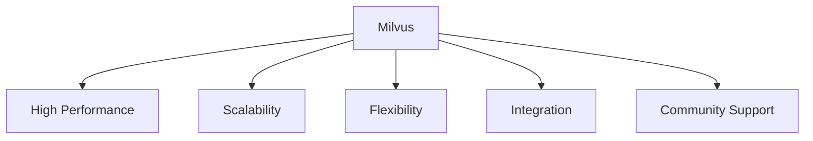
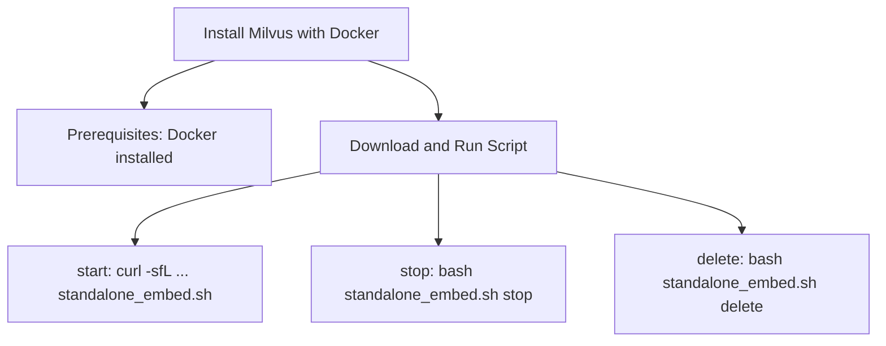
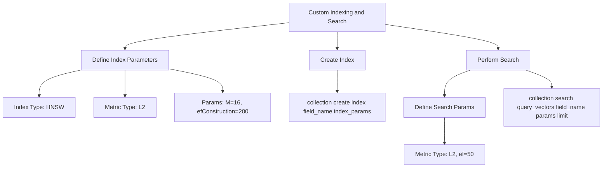
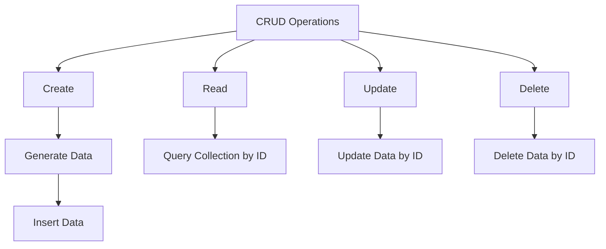

# Milvus Tutorial: Mastering Vector Databases for AI

Learn to Set Up, Integrate, and Optimize Milvus for AI Applications


## Introduction

### Overview

Welcome, everyone! I’m excited to guide you through this comprehensive tutorial on [Milvus](https://milvus.io). Milvus is an open-source vector database specifically designed for managing and searching large-scale embedding vectors generated by deep neural networks and other machine learning models. It is optimized for high-performance vector similarity search and supports a wide range of AI applications, including image retrieval, recommendation systems, and natural language processing.

Why is Milvus so special? It supports high-performance vector search, making it ideal for finding semantically similar data points. Milvus also scales horizontally to accommodate increasing workloads and offers flexibility in handling various data types, including vectors, scalar, and structured data. These features make it an incredibly versatile tool for developing advanced AI applications.

Milvus's intuitive interface and extensive [documentation](https://milvus.io/docs/overview.md) make it easy for anyone, even those with minimal experience, to create and manage vector databases. Let’s get you started with some key resources:

- [Milvus Documentation](https://milvus.io/docs/overview.md): Comprehensive guide and reference
- [Getting Started with Milvus](https://milvus.io/docs/v2.0.x/install_standalone-docker.md): Step-by-step guide
- [Milvus Blog](https://milvus.io/blog): Insights and updates
- [Milvus GitHub Repository](https://github.com/milvus-io/milvus): Example projects and community support

These resources will provide you with a solid foundation for understanding and using Milvus in your AI projects. By leveraging these tools, you can create high-performance, scalable AI applications that meet your project's needs efficiently.

### Learning Objectives

By the end of this tutorial, you will:

1. **Understand the Core Concepts and Benefits**: You'll grasp why Milvus is a game-changer for managing embeddings in AI applications.
2. **Know How to Install and Set Up Milvus**: We'll walk through the installation and setup process, ensuring you’re ready to start using Milvus in your development environment.
3. **Discover Key Features and Practical Use Cases**: You’ll learn about the standout features of Milvus and see how it can be applied in real-world scenarios.
4. **Learn How to Integrate Milvus with Other AI Platforms**: We’ll explore how Milvus integrates seamlessly with popular AI platforms to enhance your projects.
5. **Implement Best Practices and Optimization Techniques**: You’ll gain insights into best practices for using Milvus effectively and optimizing it for your specific needs.

Ready to unlock the full potential of Milvus? Let’s get started!

## Why Milvus Matters



### Descriptive Overview

Alright, let's dive into why Milvus is such a big deal in the AI world. Imagine you have a massive amount of data, like millions of images, texts, or even complex molecular structures. You need a way to search through this data quickly and accurately. This is where Milvus comes in. It's a high-performance, open-source vector database that makes managing and retrieving high-dimensional vector data a breeze. It's specifically designed to tackle the complexities of AI applications, offering a robust and scalable solution for developers.

### Key Features

Now, let’s break down some of the key features that make Milvus stand out:

1. **High Performance**: Imagine being able to search through billions of data points in just milliseconds. Milvus is optimized for speed, delivering lightning-fast search performance even with vast datasets. This means you can run complex queries on enormous data volumes without significant delays, making real-time AI applications feasible.

2. **Scalability**: Whether you're starting small or handling petabytes of data, Milvus scales horizontally to meet your needs. This means you can grow your data without worrying about hitting performance bottlenecks. You can add more nodes to your cluster as your data grows, ensuring that your system remains responsive and efficient.

3. **Flexibility**: Milvus isn't just limited to vector data. It supports various data types, including scalar and structured data. This flexibility allows you to handle diverse datasets seamlessly. Whether you're working with text, images, audio, or numerical data, Milvus can accommodate your needs, integrating smoothly with different types of machine learning models.

4. **Integration**: Milvus offers SDKs and connectors for popular programming languages like Python, Java, and Go. This makes it easy to integrate Milvus into your existing workflows and applications. Whether you're developing in a web environment, mobile apps, or backend systems, Milvus provides the tools you need to incorporate advanced search capabilities.

5. **Community Support**: An active and vibrant community backs Milvus. With regular updates and feature enhancements, you can rely on a steady stream of improvements and support from fellow developers. The community's collective knowledge and experience can help you troubleshoot issues, optimize performance, and discover new use cases.

### Practical Use Cases

So, how can you actually use Milvus in real-world scenarios? Let’s explore some practical applications:

- **Semantic/Text Similarity Search**: Need to find documents that are similar in meaning? Milvus excels at searching for semantically similar texts within large collections. This is perfect for applications like legal document retrieval, academic research, and customer support, where finding relevant information quickly can save time and improve efficiency.

- **Recommender Systems**: Ever wondered how Netflix or Amazon recommends products? By using Milvus, you can build systems that recommend similar products or information based on user behavior, enhancing the user experience. For instance, an e-commerce site can use Milvus to suggest products that match a user's browsing history and preferences, increasing the likelihood of a purchase.

- **Image Similarity Search**: Have a large image library? Milvus can help you find visually similar images, making it ideal for applications in e-commerce, digital asset management, and more. For example, a fashion retailer can allow customers to upload a photo of a garment they like and find similar items in their catalog.

- **Audio Similarity Search**: Searching for similar audio clips in a huge database? Milvus enables efficient audio similarity search, which can be useful in music recommendation engines, audio forensics, and podcast discovery. Imagine a platform that recommends songs based on the acoustic characteristics of a track you like.

- **Question Answering Systems**: Building an interactive chatbot or a question-answering system? Milvus can store and retrieve relevant information to provide accurate responses, enhancing the capabilities of your AI models. For instance, a customer service bot can use Milvus to fetch answers from a knowledge base, providing users with quick and precise information.

- **Molecular Similarity Search**: In fields like drug discovery, finding similar molecular structures can be crucial. Milvus allows for efficient molecular similarity search, aiding researchers in identifying potential compounds. This capability can accelerate the process of finding new drugs by comparing the structures of known compounds with new candidates.

By understanding these features and use cases, you can see why Milvus is a vital tool for scaling and enhancing your AI applications. Ready to dive deeper into how to get started with Milvus? Let’s move on to the next section!


## Getting Started with Milvus

### Installation and Setup

Alright, let's roll up our sleeves and get Milvus up and running! You can install Milvus using several methods, such as Docker, Docker Compose, and package managers like APT/YUM. I'll guide you through each method step-by-step.

#### Installing Milvus with Docker

First, we'll tackle Docker. Docker is a fantastic tool for creating isolated environments, making it easier to manage dependencies and configurations.



1. **Prerequisites**: Make sure you have Docker installed on your system. If you haven't installed it yet, head over to the [Docker installation page](https://docs.docker.com/get-docker/) and follow the instructions for your operating system.

2. **Download and Run the Installation Script**:

   Open your terminal and execute the following commands to download and run the Milvus installation script:

   ```bash
   curl -sfL https://raw.githubusercontent.com/milvus-io/milvus/master/scripts/standalone_embed.sh -o standalone_embed.sh
   bash standalone_embed.sh start
   ```

   This script will start a Docker container named `milvus` on port 19530. 

   - `curl -sfL`: This command downloads the script from the specified URL.
   - `bash standalone_embed.sh start`: This command runs the script to start Milvus.

3. **Stopping and Deleting the Container**:

   If you need to stop or delete the Milvus container, use the following commands:

   ```bash
   bash standalone_embed.sh stop
   bash standalone_embed.sh delete
   ```

   - `bash standalone_embed.sh stop`: Stops the running Milvus container.
   - `bash standalone_embed.sh delete`: Deletes the Milvus container.

#### Installing Milvus with Docker Compose

Next, let's look at Docker Compose. This tool is excellent for managing multi-container Docker applications. 

1. **Download the Docker Compose YAML File**:

   Use the following command to download the Docker Compose YAML file for Milvus:

   ```bash
   wget https://github.com/milvus-io/milvus/releases/download/v2.0.2/milvus-standalone-docker-compose.yml -O docker-compose.yml
   ```

   - `wget`: Downloads the file from the specified URL.
   - `-O docker-compose.yml`: Saves the downloaded file as `docker-compose.yml`.

2. **Start Milvus**:

   Start Milvus by running the following command:

   ```bash
   sudo docker-compose up -d
   ```

   - `sudo docker-compose up -d`: Starts the Milvus service in detached mode, meaning it runs in the background.

3. **Stopping Milvus**:

   To stop Milvus, use:

   ```bash
   sudo docker-compose down
   ```

   - `sudo docker-compose down`: Stops and removes the Milvus containers.

4. **Deleting Data**:

   If you need to delete the stored data, execute:

   ```bash
   sudo rm -rf volumes
   ```

   - `sudo rm -rf volumes`: Deletes the directory containing the Milvus data volumes.

#### Installing Milvus with APT/YUM

Finally, let's cover installation using APT (for Ubuntu) and YUM (for CentOS).

**On Ubuntu**:

1. Add the Milvus repository and install Milvus:

   ```bash
   sudo apt install software-properties-common
   sudo add-apt-repository ppa:milvusdb/milvus
   sudo apt update
   sudo apt install milvus
   ```

   - `sudo apt install software-properties-common`: Installs the software-properties-common package, which provides an abstraction of the used apt repositories.
   - `sudo add-apt-repository ppa:milvusdb/milvus`: Adds the Milvus PPA (Personal Package Archive) to your system.
   - `sudo apt update`: Updates the package list.
   - `sudo apt install milvus`: Installs Milvus.

**On CentOS**:

1. Download and install the Milvus RPM package:

   ```bash
   sudo yum install https://github.com/milvus-io/milvus/releases/download/v2.0.2/milvus-2.0.2-.el7.x86_64.rpm
   ```

   - `sudo yum install`: Installs the specified RPM package from the given URL.

And there you have it! Whether you prefer Docker, Docker Compose, or package managers, you now have the steps to get Milvus installed and ready to use. If you encounter any issues or have questions, don’t hesitate to ask. Let’s move on to setting up and using Milvus in your projects!


### Initial Configuration

Now that you have Milvus installed, let's configure it to start using it effectively. We'll go through connecting to Milvus, creating a collection, inserting data, creating an index, and finally, performing a search. Follow along, and you'll see how easy and intuitive it is.

1. **Connecting to Milvus**

   First, we need to connect to Milvus using Python. For this, we use the `pymilvus` library. Here's how you do it:

   ```python
   from pymilvus import connections

   # Establish a connection to the Milvus server
   connections.connect(alias='default', host='localhost', port='19530')
   ```

   This script connects to Milvus running on your local machine at port 19530. The `alias='default'` part is handy for referring to this connection later in your code.

2. **Creating a Collection**

   In Milvus, a collection is similar to a table in traditional databases. Let's create one:

   ```python
   from pymilvus import CollectionSchema, FieldSchema, DataType, Collection

   # Define the fields for the collection schema
   fields = [
       FieldSchema(name="id", dtype=DataType.INT64, is_primary=True),
       FieldSchema(name="vector", dtype=DataType.FLOAT_VECTOR, dim=128)
   ]
   # Create the collection schema
   schema = CollectionSchema(fields, description="example collection")
   # Create the collection
   collection = Collection(name="example_collection", schema=schema)
   ```

   Here, we're defining a collection named `example_collection` with two fields: `id` (an integer that serves as the primary key) and `vector` (a 128-dimensional float vector).

3. **Inserting Data**

   Next, let's insert some data into our collection. We'll generate random vectors for this example:

   ```python
   import random

   # Generate 1000 random vectors
   vectors = [[random.random() for _ in range(128)] for _ in range(1000)]
   # Generate corresponding IDs
   ids = [i for i in range(1000)]
   # Prepare the data for insertion
   entities = {"id": ids, "vector": vectors}
   # Insert the data into the collection
   collection.insert(entities)
   ```

   This script generates 1000 random vectors, each with 128 dimensions, and inserts them into the collection with their corresponding IDs.

4. **Creating an Index**

   To optimize search performance, we need to create an index on the vector field. Here's how:

   ```python
   # Define index parameters
   index_params = {"index_type": "IVF_FLAT", "metric_type": "L2", "params": {"nlist": 100}}
   # Create the index on the vector field
   collection.create_index(field_name="vector", index_params=index_params)
   ```

   In this example, we are using the `IVF_FLAT` index type with `L2` as the distance metric. The `nlist` parameter is set to 100, which is a key parameter for IVF indexes.

5. **Searching Vectors**

   Finally, let's perform a similarity search to find vectors similar to a query vector:

   ```python
   # Generate a random query vector
   query_vectors = [[random.random() for _ in range(128)]]
   # Perform the search
   results = collection.search(query_vectors, "vector", params={"nprobe": 10}, limit=5)
   # Print the results
   print(results)
   ```

   This script searches the collection for vectors similar to the `query_vectors`. We use `nprobe=10` for searching, which affects the search accuracy and speed, and limit the results to the top 5 matches.

By following these steps, you have successfully connected to Milvus, created a collection, inserted data, optimized it with an index, and performed a search. Great job! This is just the beginning; there's so much more you can do with Milvus. Let's keep exploring its features and capabilities. 

## Practical Examples

Alright, let's dive into some hands-on examples to see how you can leverage Milvus to its full potential. We'll start with custom indexing and search, then move on to metadata filtering. I'll guide you through each step, explaining the concepts and code as we go.



### Example 1: Custom Indexing and Search

#### Task Description

Milvus supports various indexing algorithms like Faiss, HNSW, and SCANN. Customizing these indexing and search parameters can help you optimize performance for your specific needs.

#### Step-by-Step Guide

1. **Custom Indexing**

   Let's start by creating a custom index using the HNSW (Hierarchical Navigable Small World) algorithm. This algorithm is excellent for high-dimensional vector spaces.

   ```python
   # Define custom index parameters for HNSW
   index_params = {
       "index_type": "HNSW",  # Type of index
       "metric_type": "L2",   # Distance metric
       "params": {"M": 16, "efConstruction": 200}  # Specific parameters for HNSW
   }
   # Create the index on the vector field
   collection.create_index(field_name="vector", index_params=index_params)
   ```

   Here, `M` is the number of neighbor links, and `efConstruction` is the size of the dynamic list during the construction phase. Adjusting these parameters can significantly affect the performance and accuracy of the search.

2. **Performing a Custom Search**

   Next, we'll perform a search using the custom index we just created. We'll generate a random query vector and search for the most similar vectors in our collection.

   ```python
   import random

   # Generate a random query vector
   query_vectors = [[random.random() for _ in range(128)]]
   # Define search parameters for HNSW
   search_params = {"metric_type": "L2", "params": {"ef": 50}}  # 'ef' controls the accuracy/speed trade-off
   # Perform the search
   results = collection.search(query_vectors, "vector", params=search_params, limit=5)
   # Print the search results
   print(results)
   ```

   In this code, `ef` is the size of the dynamic list during the search phase, which affects the search speed and accuracy. The `limit` parameter specifies the number of top results to return.

### Example 2: Metadata Filtering

#### Task Description

Sometimes, you need to filter search results based on metadata. This can help you narrow down your search to only the most relevant documents.

#### Step-by-Step Guide

1. **Setting Up Metadata Filtering**

   Let's perform a query that filters results based on specific metadata. For this example, we'll filter by the `id` field.

   ```python
   # Query the collection with a metadata filter
   results = collection.query(expr="id in [1, 2, 3]")
   # Print the filtered results
   print(results)
   ```

2. **Explanation of Results**

   The query uses the `expr` parameter to specify a condition that filters the results. In this case, we're retrieving documents where the `id` is either 1, 2, or 3. This allows you to combine metadata filtering with vector similarity searches for more targeted results.

## Advanced Usage

Now, let's explore some advanced features of Milvus that can take your vector database management to the next level.

### Detailed Features

1. **Hybrid Search**

   Combine vector similarity search with scalar filtering for more complex queries. This feature allows you to refine your searches using both vector distances and scalar attributes, making your searches more precise and relevant.

2. **Data Sharding and Streaming Ingestion**

   Milvus supports data sharding and streaming ingestion, making it suitable for real-time applications. Data sharding allows you to split your data across multiple nodes, improving performance and scalability. Streaming ingestion enables real-time data processing, which is crucial for applications that require immediate updates and responses.

### Customization and Optimization

1. **Optimize Schema Design**

   Tailoring your schema to fit your specific use case can improve performance. Think carefully about what fields you need and how you will query them. For example, if you frequently search by date, ensure your schema includes indexed date fields.

2. **Vector Compression**

   Implementing vector compression can help reduce memory usage, especially with large datasets. Techniques like PCA (Principal Component Analysis) can be used to reduce the dimensionality of your vectors while maintaining their essential features.

3. **Scaling Milvus**

   Adjusting CPU, memory, and GPU resources is crucial for efficiently scaling your Milvus deployment. Monitor your resource usage and scale up as needed to handle increased loads. This might involve moving from a local setup to a more robust, distributed architecture.

By understanding and applying these advanced features and customization options, you can optimize Milvus to meet your specific needs and handle even the most demanding AI applications. Keep experimenting, and don't hesitate to explore further to unlock the full potential of Milvus!

## Integration and Deployment

### Integration Tips

Alright, let's talk about integrating Milvus with other tools. Milvus plays really well with popular AI and data processing tools like TensorFlow, PyTorch, and Apache Spark. This means you can easily incorporate it into your existing workflows, enhancing your data management and search capabilities without starting from scratch.

- **TensorFlow and PyTorch**: You can use Milvus to store and search vectors generated by models in these frameworks. This is particularly useful for tasks like image retrieval, where you need to compare the feature vectors of different images.
- **Apache Spark**: For large-scale data processing, integrating Milvus with Spark allows you to leverage Spark's powerful data manipulation capabilities alongside Milvus’s efficient vector search.

Milvus also supports various SDKs, making integration straightforward. Whether you're using Python, Java, or Go, there's an SDK to help you get Milvus up and running in your project quickly.

### Deployment Considerations

Now, let's discuss some important aspects of deploying Milvus to ensure it runs smoothly and efficiently.

1. **Monitoring and Maintenance**

   Keeping an eye on how Milvus is performing is crucial. Use Milvus’s dashboard to monitor performance metrics and manage your resources effectively. This dashboard provides insights into the health and performance of your Milvus deployment, helping you identify and resolve issues before they become problems.

   - **Why it matters**: Regular monitoring ensures your deployment is running optimally and helps you catch issues early.
   - **How to do it**: Set up alerts for any anomalies in performance metrics, such as increased query times or resource usage spikes, so you can respond quickly and maintain high performance.

2. **Regular Updates**

   Keeping your Milvus deployment up to date is essential. Updates bring new features, improvements, and security patches that can enhance the functionality and stability of your deployment.

   - **Why it matters**: Updates ensure you benefit from the latest enhancements and fixes, maintaining a secure and efficient deployment.
   - **How to do it**: Regularly check for updates and follow the upgrade procedures outlined in the Milvus documentation. Schedule maintenance windows to apply updates with minimal disruption to your operations.

## Actionable Takeaways

### Summary of Key Points

Let's recap what we've covered:

- **Milvus** is a robust and scalable solution for managing embeddings in AI applications.
- **Key features** include high performance, scalability, flexibility, integration, and community support.

### Practical Advice

Here are some tips to help you get started and make the most out of Milvus:

- **Start simple**: Begin with the basics. Get comfortable with Milvus’s core features before diving into more complex configurations.
- **Leverage resources**: Utilize Milvus’s extensive documentation and active community resources. These are invaluable for troubleshooting, gaining deeper insights, and learning from others' experiences.

### Next Steps

What should you do next? Here are some actionable steps:

- **Experiment**: Try using Milvus in various AI-driven projects. See firsthand how it can enhance your data management and search capabilities.
- **Explore**: Dive into the advanced features and integrations we discussed. Customize and optimize Milvus to fully exploit its potential in your specific use cases.

By following these steps, you'll be well on your way to mastering Milvus and leveraging it to build sophisticated, AI-powered applications. Keep experimenting, stay curious, and make the most of this powerful tool!

## Challenge: Real-World Application

Alright, it's time to put everything we've learned into practice. We're going to create a simple Milvus-based application that allows users to perform CRUD operations on vectors. This hands-on challenge will give you practical experience with Milvus and help solidify your understanding.

### Task Description

Our goal is to create a Milvus-based application where users can perform Create, Read, Update, and Delete (CRUD) operations on vectors. By the end of this challenge, you’ll have a fully functional application that demonstrates Milvus’s capabilities in managing vector data.

### Steps to Complete

1. **Set Up Milvus Project**:
   - First, sign up for Milvus and get your API key.
   - Next, set up your development environment. Ensure you have Python installed, and then install the Milvus client library using pip:

     ```bash
     pip install pymilvus
     ```

2. **Define Data Models and Indexes**:
   - Create an index to store vectors representing various items. Here’s how you can define a simple schema for items:

     ```python
     import pymilvus
     from pymilvus import FieldSchema, CollectionSchema, DataType, Collection, connections

     # Connect to Milvus
     connections.connect(alias='default', host='localhost', port='19530')

     # Define the schema and create a collection named "items"
     fields = [
         FieldSchema(name="id", dtype=DataType.INT64, is_primary=True),
         FieldSchema(name="vector", dtype=DataType.FLOAT_VECTOR, dim=128)
     ]
     schema = CollectionSchema(fields, description="items collection")
     collection = Collection(name="items", schema=schema)
     ```

3. **Implement CRUD Operations**:



   - **Create Operation**:
     - Add items to the collection with their respective vectors.

     ```python
     import random

     # Generate random vectors and IDs
     vectors = [[random.random() for _ in range(128)] for _ in range(1000)]
     ids = [i for i in range(1000)]
     
     # Insert vectors into the collection
     entities = {"id": ids, "vector": vectors}
     collection.insert(entities)
     ```

   - **Read Operation**:
     - Retrieve an item from the collection using its ID.

     ```python
     # Query the collection to get an item by its ID
     item_id = 1
     result = collection.query(expr=f"id == {item_id}")
     print(result)
     ```

   - **Update Operation**:
     - Update the details of an existing item in the collection.

     ```python
     # Update an existing item
     updated_vector = [random.random() for _ in range(128)]
     updated_item = {"id": item_id, "vector": updated_vector}
     collection.update(updated_item)
     ```

   - **Delete Operation**:
     - Remove an item from the collection using its ID.

     ```python
     # Delete an item from the collection
     collection.delete(expr=f"id == {item_id}")
     ```

4. **Test and Deploy the Application**:
   - Ensure all CRUD operations work as expected by running the code and verifying the outputs.
   - Once verified, deploy your application to a cloud service or hosting platform of your choice. This will make your application accessible to users, allowing them to interact with your Milvus-based vector database.

### Expected Outcome

By the end of this challenge, you will have a fully functional application that demonstrates Milvus’s capabilities in managing vector data. You’ll be comfortable with setting up a Milvus project, defining data models, and performing CRUD operations.

## Conclusion

### Summary

Milvus offers a powerful and flexible solution for managing embeddings in AI and machine learning applications. Its ease of use, performance optimizations, and integration capabilities make it an excellent choice for developers working with large-scale embedding vectors.

### Continue Learning

By leveraging Milvus's features and following best practices, you can build sophisticated, AI-powered applications that efficiently handle large-scale vector data. Keep exploring and experimenting to uncover the full potential of Milvus.

### Additional Resources

To further your understanding and capabilities with Milvus, check out these additional resources:

1. [Milvus Official Site](https://milvus.io)
2. [Milvus Documentation](https://milvus.io/docs/overview.md)
3. [Milvus Blog](https://milvus.io/blog)
4. [Milvus GitHub Repository](https://github.com/milvus-io/milvus)
5. [Milvus Installation Guide](https://milvus.io/docs/install_standalone-docker.md)
6. [Milvus Python SDK](https://pypi.org/project/pymilvus/)
7. [Milvus Use Cases](https://milvus.io/use-cases)
8. [Exploring Milvus Capabilities](https://thenewstack.io/what-is-milvus-vector-database/)
9. [Getting Started with Milvus](https://devblogs.microsoft.com/dotnet/get-started-milvus-vector-db-dotnet/)
10. [Milvus Architecture Overview](https://milvus.io/docs/architecture_overview.md)
11. [Milvus and AI Integrations](https://milvus.io/blog/how-to-get-started-with-milvus.md)

Good luck, and happy coding!