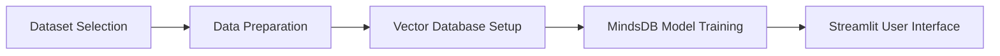
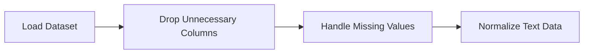
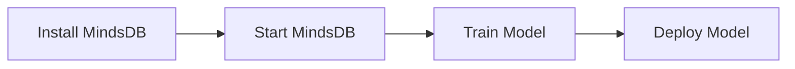

# Creating an AI-Driven Interactive Search Engine MVP

Building a Powerful and User-Friendly AI Search Solution Using Pinecone, MindsDB, and Streamlit.


## Introduction

### Overview

Welcome to this tutorial! Today, we're going to learn how to create a minimum viable product (MVP) for an AI-driven interactive search engine. By the end of our journey, you'll have the skills to use a vector database, integrate AI with MindsDB, and develop an engaging user interface with Streamlit. Let's dive in and explore the amazing possibilities this technology offers!



### Learning Objectives

Here's what we aim to achieve:

- **Choose and Prepare a Dataset**: You'll learn how to select the right dataset and get it ready for our project.
- **Set Up and Use a Vector Database**: Understand how to store and retrieve data efficiently using a vector database.
- **Integrate AI with MindsDB**: Discover how to deploy machine learning models seamlessly.
- **Develop an Interactive User Interface with Streamlit**: Create a dynamic and user-friendly web application.

## Why Building an AI-Driven Interactive Search Engine Matters

### Descriptive Overview
Imagine a search engine that not only fetches results quickly but also understands and interprets your queries intelligently. That's what an AI-driven interactive search engine can do! This technology leverages advanced AI and data processing techniques to provide powerful search capabilities. It's a game-changer in fields like e-commerce, knowledge management, and customer support.

### Key Features
- **Vector Database**: Think of this as a super-efficient storage and retrieval system for data vectors, making searches faster and more accurate.
- **MindsDB Integration**: MindsDB makes deploying machine learning models a breeze, bringing AI capabilities right to your fingertips.
- **Streamlit Interface**: With Streamlit, you can quickly develop interactive and visually appealing web applications that users will love.

### Practical Use Cases
Let's explore some real-world applications where this technology can make a significant impact:
- **E-commerce**: Enhance product search functionalities to help users find exactly what they need, boosting sales and customer satisfaction.
- **Knowledge Management**: Build robust search tools that can sift through large volumes of information, making knowledge more accessible.
- **Customer Support**: Implement intelligent search engines that provide quick and accurate responses to customer queries, improving service efficiency.

By the end of this tutorial, you'll be well-equipped to create an AI-driven interactive search engine that can transform how we search for and interact with information. So, are you ready to get started? Let's go!

## Getting Started with AI-Driven Interactive Search Engines

### Installation and Setup

#### Step 1: Choose Your Data

Alright, let's kick things off by selecting the right dataset for our project. The choice of dataset is crucial because it will serve as the foundation for everything we build. Here are some fantastic sources where you can find a diverse range of datasets. Let's explore a few options and see what suits your needs best!

- [Google Dataset Search](https://datasetsearch.research.google.com): Aggregates datasets from various sources.
- [Kaggle](https://www.kaggle.com/datasets): Open datasets and machine learning projects.
- [Data.gov](https://www.data.gov): US government open data portal.
- [UCI Machine Learning Repository](https://archive.ics.uci.edu): Datasets for training machine learning algorithms.
- [Datahub.io](https://datahub.io): Business and finance data.
- [AWS Open Data Search](https://registry.opendata.aws): Amazon's open datasets service.
- [Microsoft Research Open Data](https://msropendata.com): Research-focused datasets from Microsoft.
- [Earth Data](https://earthdata.nasa.gov): NASA's Earth science data.
- [CERN Open Data Portal](http://opendata.cern.ch): Data from CERN experiments.
- [ImageNet](http://www.image-net.org): Labeled images for computer vision.
- [Awesome Public Datasets](https://github.com/awesomedata/awesome-public-datasets): Curated public datasets on GitHub.
- [Reddit r/datasets](https://www.reddit.com/r/datasets): Community-driven datasets list.
- [Open Data Inception](https://opendatainception.io): Global open data portals directory.
- [Common Crawl](https://commoncrawl.org): Repository of web crawl data.
- [COCO Dataset](https://cocodataset.org): Object detection and image captioning.
- [Mozilla Common Voice](https://commonvoice.mozilla.org): Voice recordings for speech applications.
- [Waymo Open Dataset](https://waymo.com/open): Self-driving vehicle sensor data.
- [Million Song Dataset](http://millionsongdataset.com): Audio features and metadata.
- [Breast Cancer Wisconsin Diagnostic Dataset](https://archive.ics.uci.edu/ml/datasets/Breast+Cancer+Wisconsin+(Diagnostic)): Breast cancer diagnosis data.
- [United Nations SDG Global Database](https://unstats.un.org/sdgs/indicators/database): Sustainable Development Goals datasets.

Once you have chosen and downloaded your dataset, the next step is to prepare it for use. This involves cleaning and processing the data to ensure it's in a suitable format for vectorization. For beginners, I recommend starting with a well-documented and relatively simple dataset like the [UCI Machine Learning Repository](https://archive.ics.uci.edu). This repository provides a variety of datasets that are excellent for learning and experimentation.

#### Step 2: Data Preparation

Alright, let's move on to an essential part of our project: preparing your dataset. This step is crucial because a well-prepared dataset ensures that your search engine will function efficiently and accurately. Let's dive into it step-by-step!



First, we need to clean and process our dataset. This involves a few key tasks: text preprocessing, removing unnecessary elements, and normalizing the text data. Think of it like tidying up your room before a big study session – everything needs to be in its place for you to work effectively.

#### Let's get started with some code!

1. **Loading Your Dataset**

   We'll start by loading our dataset using pandas, a powerful data manipulation library in Python.

   ```python
   import pandas as pd

   # Load your dataset
   data = pd.read_csv('path/to/your/dataset.csv')

   # Display the first few rows of the dataset
   print(data.head())
   ```

   This code will load your dataset and display the first few rows so you can see what you're working with.

2. **Dropping Unnecessary Columns**

   Often, datasets come with columns that aren't needed for your specific project. Let's drop those to keep things streamlined.

   ```python
   # Drop unnecessary columns
   data = data.drop(['unnecessary_column_1', 'unnecessary_column_2'], axis=1)
   ```

   By dropping these columns, we're removing any clutter that might interfere with our analysis.

3. **Handling Missing Values**

   Missing data can be a common issue. We'll handle this by dropping any rows that contain missing values.

   ```python
   # Handle missing values
   data = data.dropna()
   ```

   This ensures that our dataset is complete and won't cause errors later on.

4. **Normalizing Text Data**

   Text data often needs to be cleaned and standardized. We'll convert all text to lowercase and remove any punctuation.

   ```python
   # Normalize text data
   data['text_column'] = data['text_column'].str.lower()
   data['text_column'] = data['text_column'].str.replace('[^\w\s]', '')
   ```

   Converting text to lowercase ensures consistency, while removing punctuation helps in focusing on the actual content.

And that's it! You've successfully cleaned and prepared your dataset for the next steps. Remember, this process is crucial as it sets the foundation for all the AI magic we'll be doing later. Take your time with this step, and make sure your data is as clean and accurate as possible.

Next, we'll move on to setting up our vector database, where we'll store and manage the data vectors efficiently. Let's keep the momentum going!

Alright, now that we've prepared our dataset, let's dive into setting up our vector database. This is where we'll store and manage our data vectors efficiently. Think of it as organizing your tools before starting a big project – everything will be easier to find and use.

### Setting Up the Vector Database


#### Step 3: Install and Set Up Pinecone

We'll use Pinecone, a powerful vector database, to store our data vectors. Follow these steps to get Pinecone up and running.

1. **Install Pinecone:**

   First, we need to install the Pinecone client. Open your terminal or command prompt and run:

   ```bash
   pip install pinecone-client
   ```

   This command installs the Pinecone client, which we'll use to interact with our vector database.

2. **Initialize Pinecone and Create an Index:**

   Now, let's initialize Pinecone and create an index. The index is where our vectors will be stored.

   ```python
   import pinecone

   # Initialize Pinecone with your API key and environment
   pinecone.init(api_key='YOUR_API_KEY', environment='us-west1-gcp')

   # Define the name and dimension of your index
   index_name = 'example-index'
   pinecone.create_index(index_name, dimension=128)

   # Connect to the index
   index = pinecone.Index(index_name)
   ```

   - **API Key**: Replace `'YOUR_API_KEY'` with your actual Pinecone API key.
   - **Environment**: Specify your Pinecone environment (e.g., `'us-west1-gcp'`).
   - **Index Name and Dimension**: Choose a name for your index and set the dimension (128 in this example).

3. **Index Your Data:**

   With our index set up, it's time to index our data. We'll use a sentence transformer model to convert our data into vectors.

   ```python
   from sentence_transformers import SentenceTransformer

   # Load the pre-trained model
   model = SentenceTransformer('paraphrase-MiniLM-L6-v2')

   # Example data items to be indexed
   data = ["Your dataset items here..."]

   # Convert data items to vectors
   vectors = model.encode(data)

   # Generate unique IDs for each data item
   ids = [str(i) for i in range(len(data))]

   # Upsert (update/insert) vectors into the index
   index.upsert(vectors=list(zip(ids, vectors)))
   ```

   - **Model**: We're using the `SentenceTransformer` model `paraphrase-MiniLM-L6-v2` to convert text into vectors.
   - **Data**: Replace `["Your dataset items here..."]` with your actual data items.
   - **Vectors**: The `model.encode(data)` function converts our data items into vectors.
   - **IDs**: We generate unique IDs for each data item.
   - **Upsert**: The `index.upsert` function inserts or updates the vectors in our index.

Great job! You've successfully set up your vector database with Pinecone. This will allow us to efficiently store and retrieve data vectors, which is crucial for building our AI-driven search engine.

Next, we'll integrate AI using MindsDB to bring intelligent search capabilities to our engine. Let's keep moving forward!

### Integrating AI with MindsDB

Alright, let's move on to integrating AI with MindsDB. This is where our search engine gets its intelligence, allowing it to understand and predict based on the data we've indexed. We'll go through the process of installing MindsDB and training a model with it.

#### Step 4: Install MindsDB

First, we'll need to install MindsDB, an open-source platform that makes it easy to train and deploy machine learning models. Follow these steps to get started:



1. **Install MindsDB:**

   Open your terminal or command prompt and run:

   ```bash
   pip install mindsdb
   ```

   This command installs the MindsDB client, which we'll use to create and manage our machine learning models.

2. **Train a Model in MindsDB:**

   Once we have MindsDB installed, we can start it and train a model. Here's how to do it:

   ```python
   import mindsdb

   # Start MindsDB
   mindsdb.start()

   # Train a model using MindsDB
   # Assume you have a training dataset called 'training_data.csv'
   # 'target_column' is the column you want to predict
   mindsdb.train(
       name='example_model',  # Name your model
       from_data='training_data.csv',  # Path to your training data
       to_predict='target_column'  # Column you want to predict
   )
   ```

   Let's break this down:

   - **Start MindsDB**: The `mindsdb.start()` function initializes the MindsDB server.
   - **Train a Model**: The `mindsdb.train()` function trains a model. 
     - `name='example_model'` is where you give your model a name.
     - `from_data='training_data.csv'` specifies the path to your training dataset.
     - `to_predict='target_column'` tells MindsDB which column in your dataset you want the model to predict.

   Ensure your training data is in CSV format and located in the specified path. The `target_column` should be the column you want to predict.

By the end of this step, you'll have a trained machine learning model ready to make predictions based on your data. This model will add the "brains" to our search engine, enabling it to provide intelligent and relevant search results.

If you need more details or run into any issues, check out the following resources:

- [MindsDB Documentation](https://docs.mindsdb.com/what-is-mindsdb)
- [MindsDB Integrations](https://docs.mindsdb.com/integrations/integrations)

Great work! With MindsDB integrated, we're well on our way to building a powerful AI-driven search engine. Next, we'll create an interactive user interface using Streamlit to make our search engine user-friendly and accessible. Let's keep going!

### Developing the User Interface with Streamlit

Alright, now let's dive into creating the user interface for our search engine. We'll be using Streamlit, which is a fantastic tool for building interactive web applications quickly and easily.

#### Step 5: Create a Streamlit App


1. **Install Streamlit**

   First things first, let's install Streamlit. Open up your terminal or command prompt and type in:

   ```bash
   pip install streamlit
   ```

   This command will install Streamlit on your machine, and we'll be ready to start building our app.

2. **Create a Streamlit App**

   Now, let's create our Streamlit application. Follow along with the steps below, and I'll explain what's happening at each stage.

   ```python
   import streamlit as st  # Import Streamlit for the web app
   import pinecone  # Import Pinecone for vector database operations
   from sentence_transformers import SentenceTransformer  # Import model for text encoding

   # Initialize Pinecone
   pinecone.init(api_key='YOUR_API_KEY', environment='us-west1-gcp')  # Replace 'YOUR_API_KEY' with your actual API key
   index = pinecone.Index('example-index')  # Connect to your Pinecone index

   # Load the pre-trained sentence transformer model
   model = SentenceTransformer('paraphrase-MiniLM-L6-v2')

   # Set up the title of the Streamlit app
   st.title('Interactive AI Search Engine')

   # Create a text input box for user queries
   query = st.text_input('Enter your search query:')
   if query:  # Check if the user has entered a query
       query_vector = model.encode([query])  # Encode the query into a vector
       result = index.query(query_vector, top_k=10)  # Search for the top 10 similar items in the index

       # Display the search results
       st.write('Results:')
       for match in result['matches']:
           st.write(f"ID: {match['id']}, Score: {match['score']}")  # Display each match with its ID and score
   ```

   Let's break down what each part of this code does:

   - **Importing Libraries**: We're importing Streamlit, Pinecone, and Sentence Transformers. Streamlit is for building the app, Pinecone is for interacting with our vector database, and Sentence Transformers is for encoding our text data.
   - **Initializing Pinecone**: Here, we initialize Pinecone with your API key and connect to your index. Make sure to replace `'YOUR_API_KEY'` with your actual Pinecone API key.
   - **Loading the Model**: We're loading a pre-trained sentence transformer model (`paraphrase-MiniLM-L6-v2`) which will be used to encode our search queries into vectors.
   - **Setting Up the App Title**: The `st.title('Interactive AI Search Engine')` line sets the title of our Streamlit app.
   - **Creating the Search Input**: We create a text input box using `st.text_input`. When the user enters a query, we encode it into a vector and query the Pinecone index to find the top 10 matches.
   - **Displaying Results**: Finally, we loop through the search results and display each match with its ID and score.

**Resources:**
- [Streamlit Documentation](https://docs.streamlit.io/)
- [Streamlit Tutorial](https://blog.streamlit.io/create-a-search-engine-with-streamlit-and-google-sheets/)

With these steps, you've built a simple but powerful AI-driven search engine with an interactive interface using Streamlit. Well done! This is a great starting point, and you can expand and customize your app as needed. Keep experimenting and have fun with it!

## Conclusion

### Summary of Key Points

Alright, let's recap what we've learned. By following these steps, you've created an MVP for an AI-powered search engine using a vector database, MindsDB, and Streamlit. This setup isn't just a one-off solution—it's scalable and easy to deploy, which means you can continue testing and refining your search functionality without hitting major roadblocks.

### Practical Advice

Here's some practical advice to keep in mind:

- **Data Preparation**: Always ensure your data is clean and well-prepared before you dive into vectorization. This will save you a lot of headaches down the road.
- **Leveraging MindsDB**: Use MindsDB to seamlessly integrate AI models into your application. It simplifies the process and makes your development more efficient.
- **Using Streamlit**: Streamlit is your go-to tool for quickly developing and iterating on your user interface. It's designed to help you build interactive web apps with ease.

### Next Steps

Now that you've got the basics down, here are a few next steps to consider:

- **Advanced Features**: Dive deeper into the advanced features of Pinecone and MindsDB. There's a lot more they can do!
- **Customizing Streamlit**: Tailor your Streamlit application to better fit your specific needs. Customization can enhance user experience significantly.
- **Experimenting with Datasets and Models**: Don't stop at one dataset or one model. Try different datasets and AI models to discover what works best for your particular use case.

### Challenge: Real-World Application

#### Task Description

Now, let's put your skills to the test. Your challenge is to apply the steps you've learned to create a search engine for a different dataset, such as customer reviews or scientific research papers. This will help solidify your understanding and give you practical experience.

#### Steps to Complete

1. **Select a New Dataset**: Find a dataset that interests you and is relevant to your goals.
2. **Clean and Prepare the Data**: Make sure your data is in top shape before moving forward.
3. **Set Up a Vector Database**: Use Pinecone or another vector database to store and index your data vectors.
4. **Train a New Model Using MindsDB**: Use MindsDB to create and deploy a machine learning model tailored to your new dataset.
5. **Develop a Streamlit Interface**: Build a user-friendly interface with Streamlit to interact with your new search engine.

#### Expected Outcome

By the end of this challenge, you should have a functional search engine tailored to your chosen dataset. This will demonstrate your ability to apply the concepts and techniques you've learned in a real-world scenario.

**Additional Resources:**

To help you along the way, here are some valuable resources:

- [Vector Databases for Your LLM + Streamlit Applications](https://pub.towardsai.net/vector-databases-for-your-streamlit-ai-apps-56cd0af7bbba?gi=37f5ccb3a6aa)
- [Understanding and Evaluating Vector Databases in Production](https://mlops.community/empowering-language-model-applications-understanding-and-evaluating-vector-databases-in-production/)
- [Mastering Vector Databases with Pinecone Tutorial](https://www.datacamp.com/tutorial/mastering-vector-databases-with-pinecone-tutorial)
- [Milvus Quickstart: Install Milvus Vector Database in 5 Minutes](https://zilliz.com/learn/milvus-vector-database-quickstart)

Happy coding, and I can't wait to see what you create next!