# Creating Flowcharts with AI: Mermaid Diagrams and ChatGPT

Effortlessly Generate Detailed Flowcharts Using Natural Language Processing


## Introduction

### Overview

Welcome! Today, we're diving into the world of flowcharts, powerful tools for visualizing processes, workflows, and complex concepts. By combining Mermaid, a markdown-like diagramming tool, with ChatGPT's natural language processing capabilities, we can effortlessly create detailed flowcharts. This tutorial will guide you through using AI to generate Mermaid diagrams for complicated concepts.

### Learning Objectives

By the end of this tutorial, you will:
- Understand the basics of using Mermaid to create flowcharts.
- Learn how to leverage ChatGPT to generate Mermaid diagrams.
- Implement and refine AI-generated flowcharts for business applications.

## Why Mermaid and ChatGPT Matter

### Descriptive Overview

Mermaid is a versatile JavaScript-based diagramming tool that uses Markdown-inspired text definitions to dynamically create and modify diagrams. On the other hand, ChatGPT, with its advanced natural language processing, simplifies the creation of these diagrams.

### Key Features

- **Mermaid**: Supports various diagram types, including flowcharts, sequence diagrams, and class diagrams.
- **ChatGPT**: Generates Mermaid code from natural language descriptions, streamlining the diagram creation process.

### Practical Use Cases

- **Visualizing Business Processes**: Make complex workflows clear and understandable.
- **Simplifying Technical Documentation**: Enhance documentation with easy-to-create diagrams.
- **Enhancing Presentations and Reports**: Add dynamic diagrams to communicate ideas effectively.

## Getting Started with Mermaid

### Installation and Setup

Getting started with Mermaid is simple and doesn't require any complicated setup.

- **Mermaid Live Editor**: Use it online at [Mermaid Live Editor](https://mermaid.live) for quick and easy diagram creation.


- **Integrating Mermaid**: For more advanced uses, integrate Mermaid into your projects using plugins or APIs.

### Initial Configuration

- **Mermaid Live Editor**: Access the editor online, no installation needed.
- **GitHub**: Use Mermaid syntax in Markdown files on platforms like GitHub to include diagrams in your project documentation.


## Practical Examples

### Example 1: Basic Mermaid Syntax for Flowcharts

#### Introduction to Flowcharts
Flowcharts are essential for visualizing step-by-step processes. Today, we'll create a flowchart for a machine learning pipeline using Mermaid.

#### Hypothetical Scenario
Imagine you're working on a machine learning project. First, check if the data is clean. If not, clean the data. Once clean, perform feature engineering, train the model, and evaluate its performance. If the model performs well, deploy it; if not, fine-tune and retrain.

#### Prompt for Creating the Chart
"Create a Mermaid flowchart for a machine learning pipeline, including stages for data cleaning, feature engineering, model training, model evaluation, and decision points for data cleanliness and model performance."

#### Final Code

```
flowchart LR
    A[Start] --> B{Is Data Clean?}
    B -->|Yes| C[Feature Engineering]
    B -->|No| D[Data Cleaning]
    D --> B
    C --> E[Model Training]
    E --> F[Model Evaluation]
    F --> G{Is Performance Satisfactory?}
    G -->|Yes| H[Deploy Model]
    G -->|No| I[Fine-tune Model]
    I --> E
```

#### Final Chart

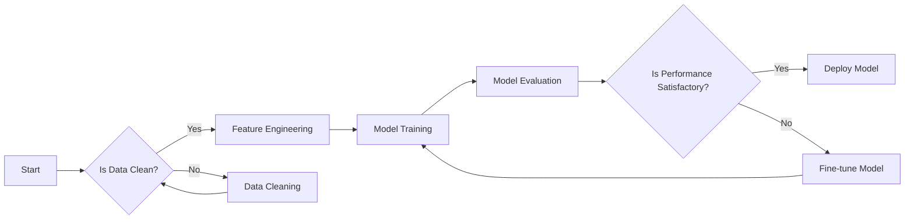

#### Wrapping Up
This flowchart represents the key steps in a machine learning pipeline, making the workflow easier to understand and communicate.

### Example 2: Sequence Diagram

#### Introduction to Sequence Diagrams
Sequence diagrams visualize interactions between components or participants over time. Today, we'll create a sequence diagram for an AI-driven chatbot system using Mermaid.

#### Hypothetical Scenario
Imagine you're designing an AI-driven chatbot system. When a user sends a message, the chatbot processes it through an NLP service to determine the intent. Based on the intent, the chatbot queries a database to fetch the relevant response data and sends this response back to the user.

#### Prompt for Creating the Chart
"Create a Mermaid sequence diagram showing the interaction between a user, a chatbot, an NLP service, and a database, illustrating how a message is processed and responded to."

#### Final Code

```
sequenceDiagram
    participant User
    participant Chatbot
    participant NLP_Service
    participant Database
    User->>Chatbot: Send Message
    Chatbot->>NLP_Service: Process Message
    NLP_Service-->>Chatbot: Return Intent
    Chatbot->>Database: Query Response
    Database-->>Chatbot: Return Data
    Chatbot-->>User: Send Response
```

#### Final Chart

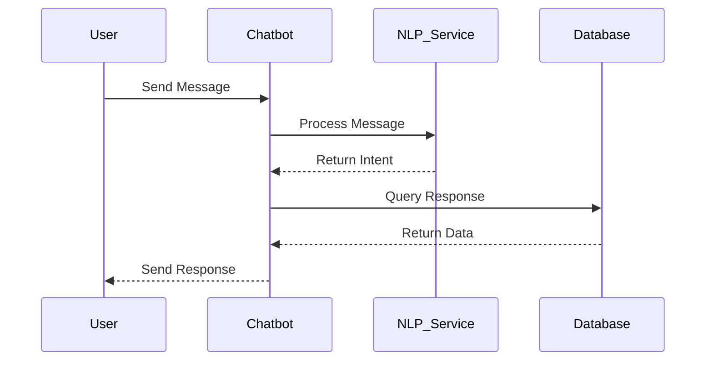

#### Wrapping Up
This sequence diagram illustrates the interaction flow between different components in an AI-driven chatbot system, ensuring clarity and understanding of the communication sequence.

### Example 3: Class Diagram

#### Introduction to Class Diagrams
Class diagrams show the structure of a system by illustrating its classes, attributes, methods, and relationships. Today, we'll create a class diagram using Mermaid for different machine learning model types.

#### Hypothetical Scenario
Imagine you're designing a machine learning library with a base class `MachineLearningModel`, and subclasses `SupervisedModel`, `UnsupervisedModel`, and `RegressionModel`.

#### Prompt for Creating the Chart
"Create a Mermaid class diagram for machine learning models, including a base class and subclasses for supervised, unsupervised, and regression models."

#### Final Code

```
classDiagram
    class MachineLearningModel {
        +String name
        +String type
        +void train()
        +void predict()
    }
    class SupervisedModel {
        +void crossValidate()
    }
    class UnsupervisedModel {
        +void cluster()
    }
    class RegressionModel {
        +void regress()
    }
    MachineLearningModel <|-- SupervisedModel
    MachineLearningModel <|-- UnsupervisedModel
    SupervisedModel <|-- RegressionModel
```

#### Final Chart

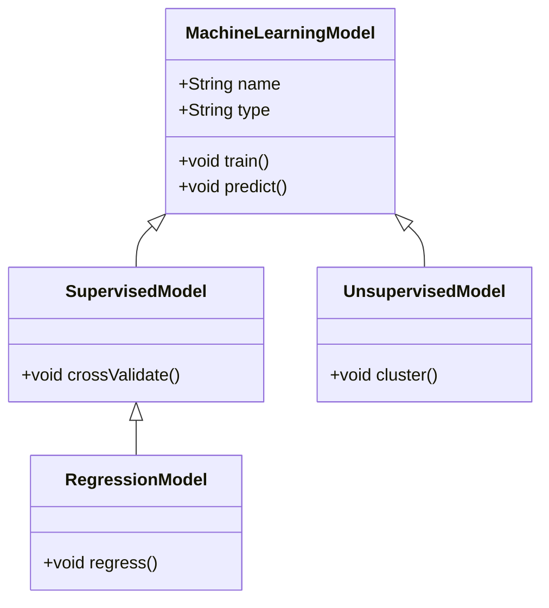

#### Wrapping Up

This class diagram shows the relationships between different machine learning models, clarifying the structure of your library.


### Example 4: State Diagram

#### Introduction to State Diagrams
State diagrams model the dynamic behavior of a system by showing its states and transitions. Today, we'll create a state diagram using Mermaid for a machine learning model's lifecycle.

#### Hypothetical Scenario
Imagine you're working on a machine learning model with various states. The model starts in an Idle state, transitions to Active when being trained or used, and can return to Idle after processing.

#### Prompt for Creating the Chart
"Create a Mermaid state diagram to represent the lifecycle of a machine learning model, including Idle and Active states, and transitions between them."

#### Final Code

```
stateDiagram
    [*] --> Idle
    Idle --> Active
    Active --> Idle
    Active --> [*]
```

#### Final Chart

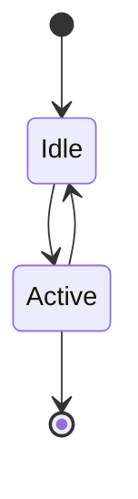

#### Wrapping Up
This state diagram illustrates the transitions between Idle and Active states in a machine learning model's lifecycle, clarifying its dynamic behavior.

### Example 5: Entity Relationship Diagram

#### Introduction to Entity Relationship Diagrams
Entity Relationship Diagrams (ERDs) model the data structure of a system by showing entities and their relationships. Today, we'll create an ERD using Mermaid for a machine learning project management system.

#### Hypothetical Scenario
Imagine you're designing a project management system for machine learning projects with entities like `Project`, `Dataset`, and `Model`. Each project can have multiple datasets and models associated with it.

#### Prompt for Creating the Chart
"Create a Mermaid entity relationship diagram for a machine learning project management system, including entities for Project, Dataset, and Model, and their relationships."

#### Final Code

```
erDiagram
    PROJECT ||--o{ DATASET : uses
    PROJECT ||--o{ MODEL : trains
    DATASET ||--|{ FILE : contains

    PROJECT {
        string name
        string description
    }
    DATASET {
        string type
        string source
    }
    MODEL {
        string algorithm
        string accuracy
    }
    FILE {
        string filename
        string size
    }
```

#### Final Chart

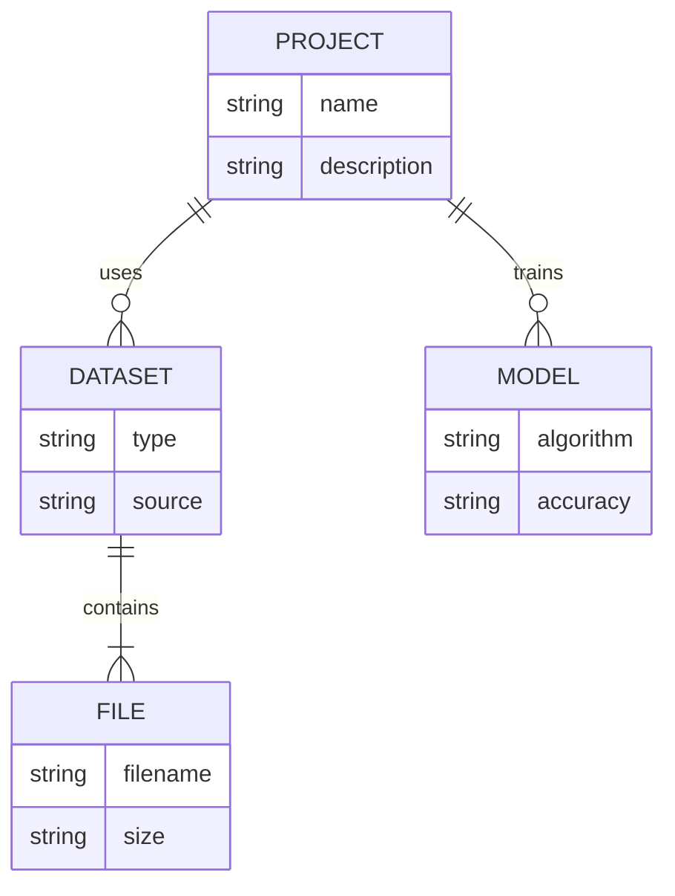

#### Wrapping Up
This ERD illustrates the relationships between projects, datasets, models, and files in a machine learning project management system, helping to understand and design the data structure.

### Example 6: User Journey

#### Introduction to User Journey Diagrams
User journey diagrams show the stages a user goes through when interacting with a product. Today, we'll create a user journey diagram using Mermaid for an AI-powered application.

#### Hypothetical Scenario
Imagine you're developing an AI-powered task management app. The user journey starts when they begin using the app, continues as they discover features, and ends when they achieve their goals.

#### Prompt for Creating the Chart
"Create a Mermaid user journey diagram showing stages of user satisfaction for an AI-powered task management app, from starting to use the app, discovering features, to achieving goals."

#### Final Code

```
journey
    title User Journey
    section Start
      User: Happy: 5: Start using the app
    section Mid
      User: Satisfied: 4: Finds useful features
    section End
      User: Delighted: 5: Achieves goal
```

#### Final Chart

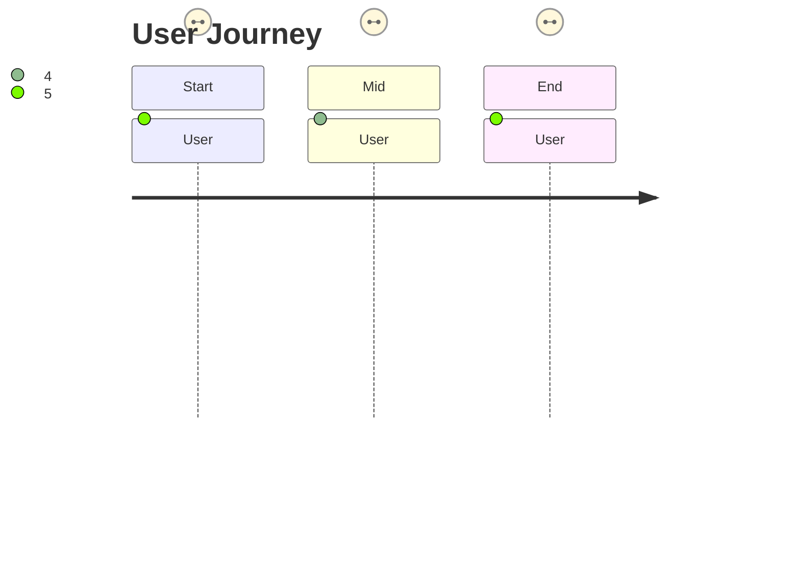

#### Wrapping Up
This user journey diagram shows stages of user satisfaction in an AI-powered app, aiding in understanding and improving user experience.

### Example 7: Gantt Chart

#### Introduction to Gantt Charts

Gantt charts visualize the timeline and dependencies of tasks in a project. Today, we'll create a Gantt chart using Mermaid for a machine learning project.

#### Hypothetical Scenario
Imagine you're managing a machine learning project with tasks like data collection, preprocessing, model training, and evaluation, each with specific start dates and durations.

#### Prompt for Creating the Chart
"Create a Mermaid Gantt chart illustrating the timeline of tasks in a machine learning project, including data collection, preprocessing, model training, and evaluation, with their respective start dates and durations."

#### Final Code

```
gantt
    dateFormat  YYYY-MM-DD
    title Machine Learning Project Timeline
    section Project Phases
    Data Collection         :done,    dc1, 2024-01-01,2024-01-10
    Data Preprocessing      :active,  dp1, 2024-01-11, 5d
    Model Training          :         mt1, after dp1, 10d
    Model Evaluation        :         me1, after mt1, 7d
    Model Deployment        :         md1, after me1, 3d
```

#### Final Chart

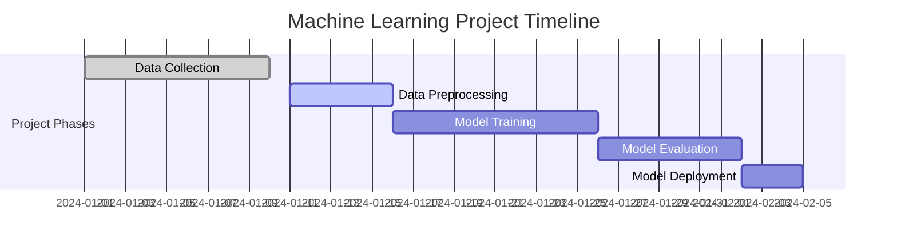

#### Wrapping Up
This Gantt chart illustrates the timeline and dependencies of tasks in a machine learning project, helping with planning and management.

### Example 8: Pie Chart

#### Introduction to Pie Charts
Pie charts visually represent the proportions of different components within a whole. Today, we'll create a pie chart using Mermaid for an AI project budget.

#### Hypothetical Scenario
Imagine you're managing an AI project budget divided into data acquisition, model development, and deployment. You want to visualize the budget allocation across these components.

#### Prompt for Creating the Chart
"Create a Mermaid pie chart showing the distribution of an AI project budget, including data acquisition, model development, and deployment, with their respective percentages."

#### Final Code

```
pie
    title AI Project Budget Allocation
    "Data Acquisition" : 40
    "Model Development" : 35
    "Deployment" : 25
```

#### Final Chart

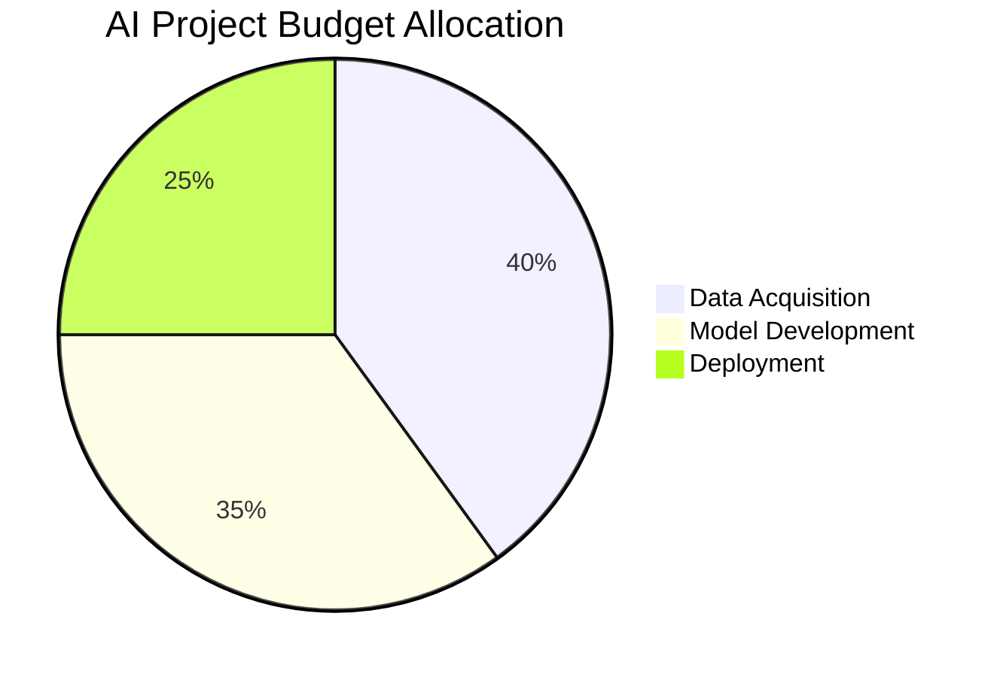

#### Wrapping Up
This pie chart illustrates the budget allocation for an AI project, helping to understand and communicate the distribution of resources.

### Example 9: Quadrant Chart

#### Introduction to Quadrant Charts
Quadrant charts visualize data across two dimensions, categorizing items based on their performance on two metrics. Today, we'll create a quadrant chart using Mermaid for AI marketing campaigns.

#### Hypothetical Scenario
Imagine you're analyzing AI marketing campaigns based on their reach and engagement to determine which to expand, promote, re-evaluate, or improve.

#### Prompt for Creating the Chart
"Create a Mermaid quadrant chart showing the reach and engagement of AI marketing campaigns, categorizing them into four quadrants: expand, promote, re-evaluate, and improve."

#### Final Code

```
quadrantChart
    title Reach and Engagement of Campaigns
    x-axis Low Reach --> High Reach
    y-axis Low Engagement --> High Engagement
    quadrant-1 We should expand
    quadrant-2 Need to promote
    quadrant-3 Re-evaluate
    quadrant-4 May be improved
    Campaign A: [0.3, 0.6]
    Campaign B: [0.45, 0.23]
    Campaign C: [0.57, 0.69]
    Campaign D: [0.78, 0.34]
    Campaign E: [0.40, 0.34]
    Campaign F: [0.35, 0.78]
```

#### Final Chart
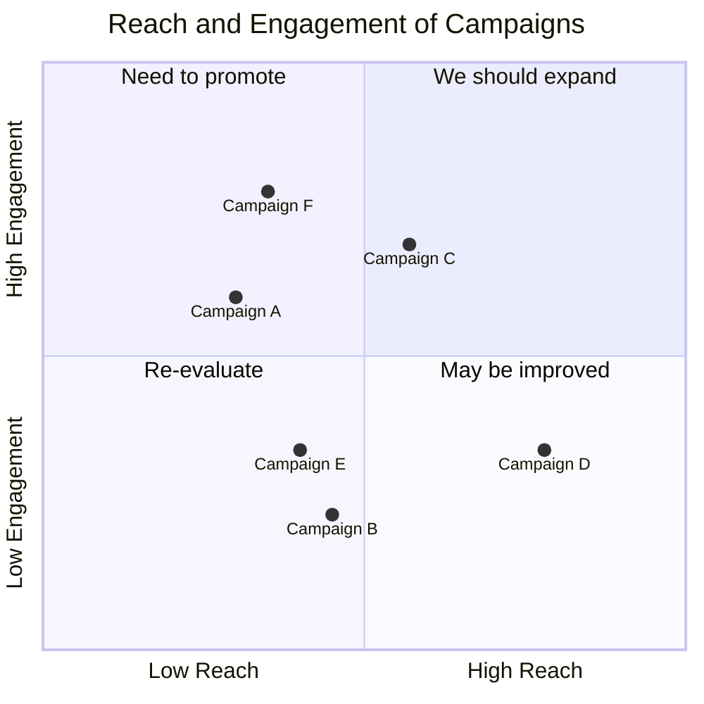

#### Wrapping Up
This quadrant chart categorizes the reach and engagement of AI marketing campaigns, helping to identify which to expand, promote, re-evaluate, or improve.

### Example 10: Requirement Diagram

#### Introduction to Requirement Diagrams
Requirement diagrams document and visualize system requirements, verification methods, and associated risks. Today, we'll create a requirement diagram using Mermaid for an AI system.

#### Hypothetical Scenario
Imagine you're documenting requirements for an AI system, including a high-risk test requirement with a testing verification method, satisfied by a simulation element.

#### Prompt for Creating the Chart
"Create a Mermaid requirement diagram showing a high-risk requirement with a testing verification method, and an element that satisfies this requirement."

#### Final Code

```
requirementDiagram

    requirement test_req {
        id: 1
        text: the test text.
        risk: high
        verifymethod: test
    }

    element test_entity {
        type: simulation
    }

    test_entity - satisfies -> test_req
```

#### Final Chart

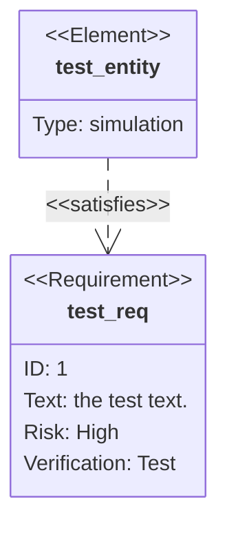

#### Wrapping Up
This requirement diagram shows the relationship between a high-risk requirement and an element that satisfies it, aiding in managing and documenting system requirements.

### Example 11: Gitgraph (Git) Diagram

#### Introduction to Gitgraph Diagrams
Gitgraph diagrams visualize the branching, merging, and commit history in a Git repository, helping developers manage and collaborate on code. Today, we'll create a Gitgraph diagram using Mermaid for a simple Git workflow.

#### Hypothetical Scenario
Imagine you're managing a software project using Git. You start with a commit on the main branch, create a develop branch for ongoing development, branch off to work on a new feature, commit changes, and merge it back into the develop branch.

#### Prompt for Creating the Chart
"Create a Mermaid Gitgraph diagram illustrating a simple Git workflow with a main branch, a develop branch, and a feature branch, showing commits and merging."

#### Final Code

```
gitGraph
    commit
    branch develop
    commit
    branch feature
    commit
    checkout develop
    merge feature
    commit
```

#### Final Chart

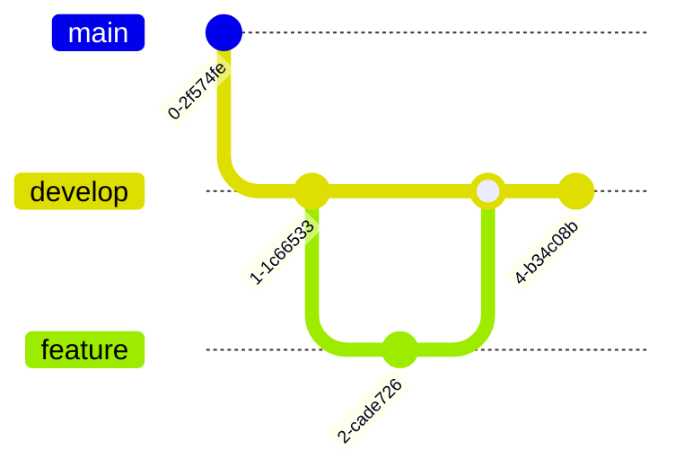

#### Wrapping Up
This Gitgraph diagram shows a simple Git workflow, helping to visualize branching, committing, and merging actions in a project.

### Example 12: C4 Diagram

#### Introduction to C4 Diagrams
C4 diagrams visualize the architecture of software systems, showing the system's context, containers, components, and code. Today, we'll create a C4 context diagram using Mermaid for an Internet Banking System.

#### Hypothetical Scenario
Imagine you're designing an Internet Banking System with various users interacting with it, which in turn interacts with external systems like a mainframe banking system, email system, and mobile banking system.

#### Prompt for Creating the Chart
"Create a Mermaid C4 context diagram for an Internet Banking System, showing interactions between banking customers, the Internet Banking System, and external systems like a mainframe banking system, an email system, and a mobile banking system."

#### Final Code

```
C4Context
    title System Context Diagram for Internet Banking System
    Enterprise_Boundary(b0, "BankBoundary") {
        Person(customerA, "Banking Customer A")
        Person(customerB, "Banking Customer B")
        System(SystemAA, "Internet Banking System")
        System_Ext(SystemB, "Mainframe Banking System")
        System_Ext(SystemC, "Email System")
        System_Ext(SystemD, "Mobile Banking System")
        Rel(customerA, SystemAA, "Uses")
        Rel(SystemAA, SystemB, "Uses")
        Rel(SystemB, SystemC, "Sends email to")
        Rel(SystemC, customerB, "Sends email to")
        Rel(SystemB, SystemD, "Sends info to")
    }
```

#### Final Chart

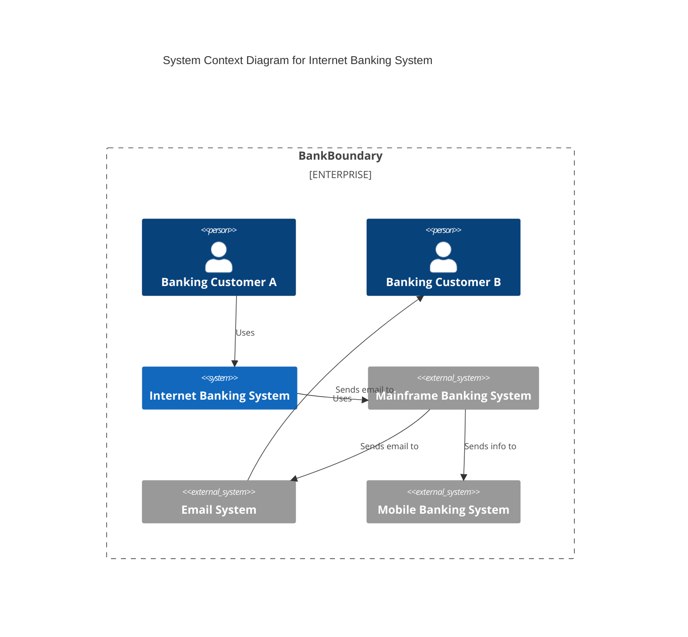

#### Wrapping Up
This C4 context diagram shows the interactions between different systems and users in an Internet Banking System, helping to understand and communicate the system's architecture.

### Example 13: Mindmap

#### Introduction to Mindmaps
Mindmaps are tools for brainstorming and organizing ideas visually, showing relationships between different concepts. Today, we'll create a mindmap using Mermaid for an AI project.

#### Hypothetical Scenario
Imagine you're planning an AI project, breaking it down into components like data collection, model development, and deployment, with further sub-components under each.

#### Prompt for Creating the Chart
"Create a Mermaid mindmap showing the components of an AI project, including data collection, model development, and deployment, with further sub-components under each."

#### Final Code

```
mindmap
  root((AI Project))
    DataCollection
      DataSources
      DataCleaning
    ModelDevelopment
      AlgorithmSelection
      ModelTraining
    Deployment
      CloudDeployment
      EdgeDeployment
```

#### Final Chart

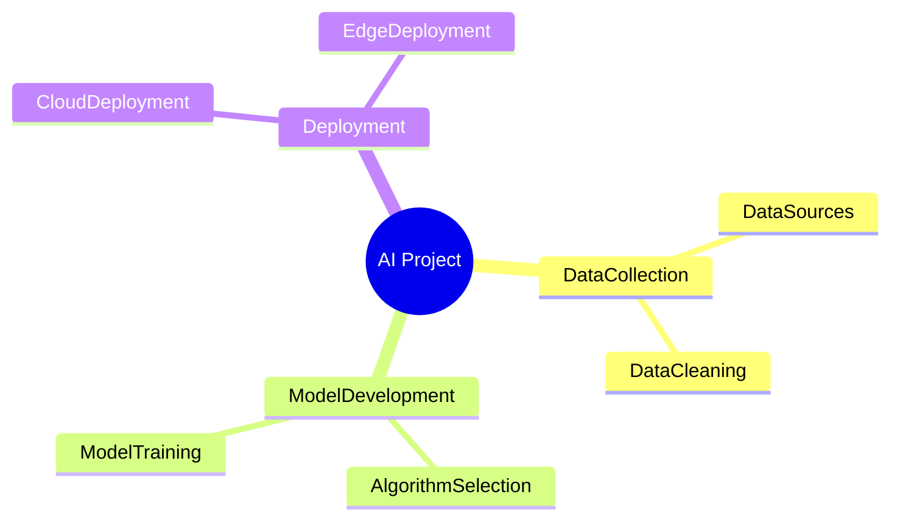

#### Wrapping Up
This mindmap shows the components and sub-components of an AI project, helping to organize and plan effectively.

### Example 14: Timeline

#### Introduction to Timelines
Timelines visualize events in chronological order, helping you understand their sequence and timing. Today, we'll create a timeline using Mermaid for an AI project.

#### Hypothetical Scenario
Imagine you're managing an AI project with key milestones such as project initiation, data collection, model development, and deployment, each with specific dates.

#### Prompt for Creating the Chart
"Create a Mermaid timeline showing the key milestones in an AI project, including project initiation, data collection, model development, and deployment, with their respective dates."


#### Final Code

```
timeline
    title AI Project Timeline
    2024-01-01: Project Initiation
    2024-02-01: Data Collection Begins
    2024-05-01: Model Development Starts
    2024-09-01: Model Deployment
```

#### Final Chart
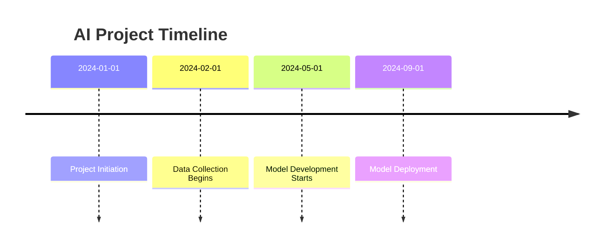

#### Wrapping Up
This timeline shows the key milestones in an AI project, helping to manage and track progress effectively.

### Example 15: XY Chart

#### Introduction to XY Charts
XY charts, also known as scatter plots or line charts, are useful for visualizing relationships between two variables. They help identify trends, patterns, and correlations. Today, we'll create an XY chart using Mermaid to illustrate the monthly sales revenue of a company throughout a year.

#### Hypothetical Scenario
Imagine you're analyzing the sales revenue of a company over the course of a year. You have monthly revenue data and want to visualize this information to identify trends and patterns in sales performance.

#### Prompt for Creating the Chart
"Create a Mermaid XY chart to visualize the monthly sales revenue of a company over a year, with months on the x-axis and revenue on the y-axis."

#### Final Code

```
xychart-beta
    title "Sales Revenue"
    x-axis [jan, feb, mar, apr, may, jun, jul, aug, sep, oct, nov, dec]
    y-axis "Revenue (in $)" 4000 --> 11000
    bar [5000, 6000, 7500, 8200, 9500, 10500, 11000, 10200, 9200, 8500, 7000, 6000]
    line [5000, 6000, 7500, 8200, 9500, 10500, 11000, 10200, 9200, 8500, 7000, 6000]
```

#### Final Diagram

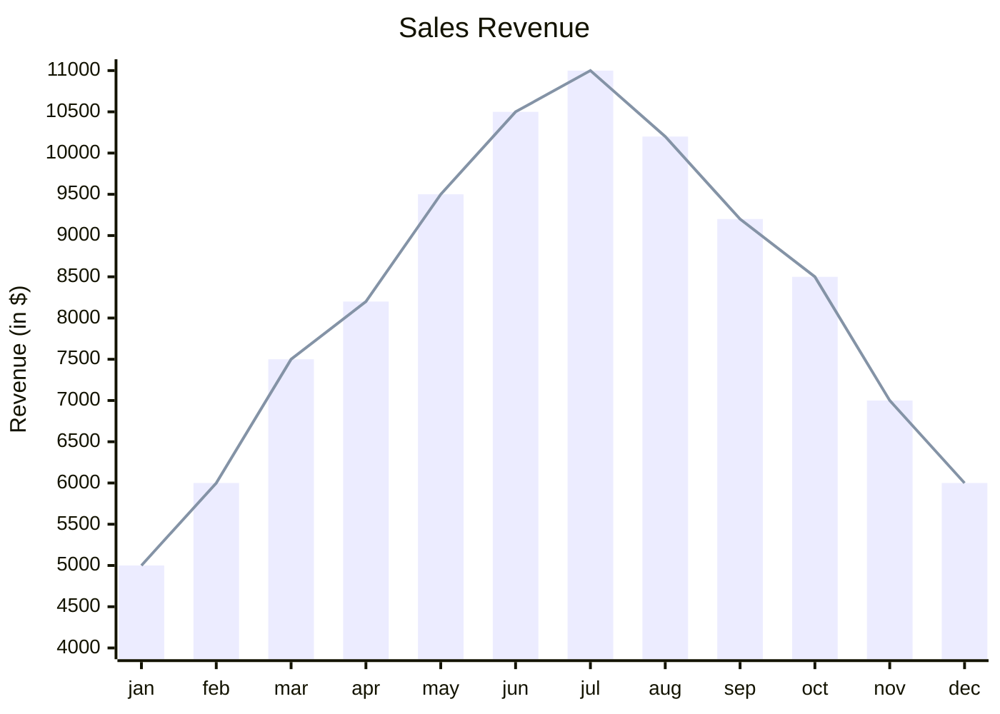

#### Wrapping Up
This XY chart illustrates the monthly sales revenue of a company, helping to identify trends and patterns over the year and make informed decisions.

### Example 16: Block Diagram

#### Introduction to Block Diagrams
Block diagrams represent the components of a system and their relationships, helping visualize the structure and flow of information. Today, we'll create a block diagram using Mermaid for a database system.

#### Hypothetical Scenario
Imagine you're designing a database system. You want to represent the main components, including the database and various processing units, and how they interact.

#### Prompt for Creating the Chart
"Create a Mermaid block diagram to visualize the components of a database system, including the database and processing units, and their relationships."

#### Final Code

```
block-beta
    columns 1
    db(("DB"))
    blockArrowId6<["&nbsp;&nbsp;&nbsp;"]>(down)
    block:ID
        A
        B["A wide one in the middle"]
        C
    end
    space
    D
    ID --> D
    C --> D
    style B fill:#969,stroke:#333,stroke-width:4px
```


#### Final Diagram
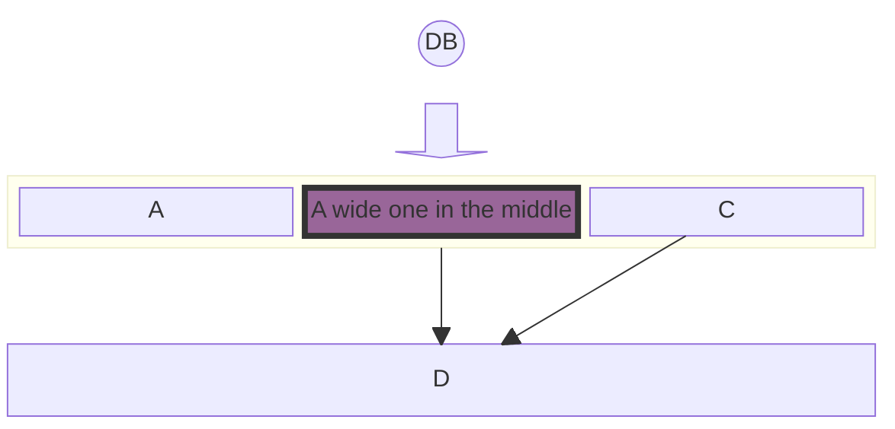

#### Wrapping Up
This block diagram illustrates the components of a database system and their relationships, helping to understand and communicate the system's structure effectively.

## Advanced Usage

### Detailed Features

Alright, let's dive into some advanced features of Mermaid that can really make your diagrams stand out.

- **Subgraphs**: Imagine you have a lot of nodes and want to keep things organized. Subgraphs let you group related nodes together, making your diagram cleaner and easier to understand.
- **Styling**: Want to make your diagram visually appealing? You can customize colors, shapes, and fonts. This is especially useful when you need to highlight specific parts of your diagram.
- **Different Diagram Types**: Don’t limit yourself to just flowcharts. Try sequence diagrams to show interactions over time, Gantt charts for project timelines, or class diagrams to illustrate the structure of your code.

### Customization and Optimization

Now, let's talk about how to make your diagrams not only look good but also function smoothly.

- **Styling**: By enhancing the visual appeal of your diagrams, you can make them more engaging and easier to read. Play around with different styles to see what works best for your needs.
- **Optimization**: Mermaid offers advanced features that allow you to create more complex diagrams. For instance, you can use conditional formatting or interactive elements to make your diagrams more dynamic.

## Integration and Deployment

### Integration Tips

Integrating Mermaid diagrams into your web projects is straightforward and powerful. Here’s how you can do it:

- **JavaScript API**: If you're working on a web project, use Mermaid's JavaScript API to embed diagrams directly into your site. This allows for dynamic and interactive diagrams that can enhance user experience.
- **Web Frameworks**: Implementing Mermaid in popular frameworks like React, Angular, or Vue.js can streamline the process and ensure your diagrams are well-integrated into your web applications.

### Deployment Considerations

When you’re ready to deploy, keep these tips in mind:

- **Platforms**: Platforms like GitHub natively support Mermaid, making it easy to include diagrams in your README files or project documentation.
- **Documentation Tools**: Explore plugins for documentation tools such as Docusaurus or Jekyll to seamlessly include Mermaid diagrams in your docs.

### Maintenance and Updates

To keep your diagrams accurate and up-to-date:

- **Regular Updates**: Ensure Mermaid and any related tools are regularly updated to benefit from the latest features and improvements.
- **Verification**: Periodically check your diagrams to verify their accuracy, especially if the underlying data or processes have changed.

## Actionable Takeaways

### Summary of Key Points

- Combining Mermaid with ChatGPT can streamline the creation of detailed flowcharts and diagrams.
- Utilize online tools and platforms for easy integration and enhanced functionality.

### Practical Advice

- Be specific with your prompts to ChatGPT to get the most accurate and useful diagrams.
- Don’t hesitate to iterate and refine the AI-generated diagrams until they meet your needs.

### Next Steps

- Explore and experiment with the advanced features of Mermaid to enhance your diagrams.
- Practice creating various types of diagrams for different concepts to improve your skills and efficiency.

## Challenge: Real-World Application

### Task Description
Alright, let's take what we've learned and apply it to a real-world scenario. Our goal is to create a flowchart for a complex business process. This will help us see how these tools work in practice and how they can streamline our workflows.

### Steps to Complete

1. **Define the Process**
   - Start by clearly defining the business process you want to visualize. Break it down into individual steps and decision points.
   
2. **Use ChatGPT to Generate the Initial Mermaid Code**
   - Ask ChatGPT to help you create the initial Mermaid code for your flowchart. Provide it with the steps and decision points you've defined.
   
3. **Refine and Implement the Code in the Mermaid Live Editor**
   - Take the code generated by ChatGPT and refine it as needed. Then, implement the code in the Mermaid Live Editor to create your flowchart.

### Expected Outcome
By the end of this exercise, you should have a clear and detailed flowchart that accurately represents the business process you chose to visualize. This will help in understanding and communicating the process effectively.

### Example Projects
- **Workflow Automation:** Visualize the steps involved in automating a business workflow.
- **Customer Journey Mapping:** Create a flowchart that maps out the journey a customer takes from initial contact to final purchase.

## Conclusion

### Summary
By combining the power of AI with Mermaid's diagramming capabilities, you can quickly create informative and visually appealing flowcharts. This approach not only saves time but also enhances the clarity and effectiveness of your diagrams.

### Encouragement
I encourage you to practice using these tools regularly. The more you use them, the more proficient you'll become at translating complex ideas into clear visual representations. This skill is invaluable in both personal and professional settings.

### Additional Resources
For further learning and exploration, check out these resources:
- [Mermaid Documentation](https://mermaid.js.org/syntax/flowchart.html)
- [Advanced Mermaid Features](https://mermaid.js.org/intro/getting-started.html)

### Citations
1. [Mermaid Syntax](https://mermaid.js.org/syntax/flowchart.html)
2. [Getting Started with Mermaid](https://mermaid.js.org/intro/getting-started.html)
3. [Reddit: Using ChatGPT to Generate Mermaid Diagrams](https://www.reddit.com/r/ObsidianMD/comments/11xqwrw/using_chatgpt_to_generate_mermaid_diagrams/)
4. [Dev.to: Guide to ChatGPT and Mermaid](https://dev.to/alexanderop/how-to-use-ai-for-effective-diagram-creation-a-guide-to-chatgpt-and-mermaid-2gip)
5. [Swimm: Complete Guide to Mermaid](https://swimm.io/learn/mermaid-js/mermaid-js-a-complete-guide)
6. [CKEditor: Creating Flowcharts with Mermaid](https://ckeditor.com/blog/basic-overview-of-creating-flowcharts-using-mermaid/)
7. [Mermaid Official Site](https://mermaid.js.org)

By leveraging these resources, you can continue to improve your skills and make the most out of AI and diagramming tools like Mermaid. Happy diagramming!