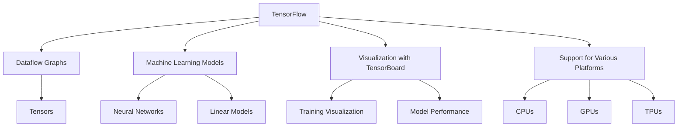
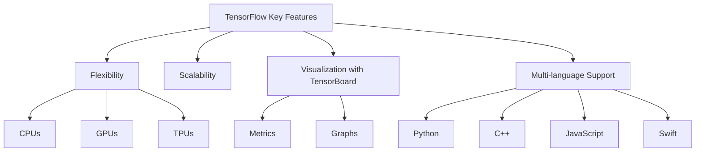
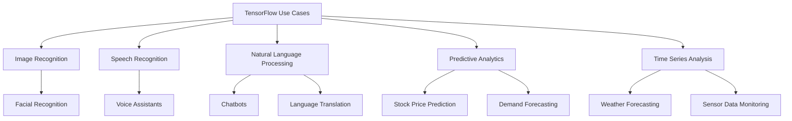
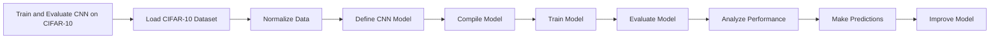

# Getting Started with TensorFlow: A Practical Guide

Harness the Power of AI with Google's Premier Machine Learning Library


## Introduction

### Overview

Welcome to the world of TensorFlow! Today, we're going to explore this powerful open-source machine learning library developed by Google. TensorFlow is your go-to for numerical computation and large-scale machine learning, and it’s widely used for developing and training neural networks. In this session, we'll get you up and running with TensorFlow, guiding you through the basics and a practical example to illustrate its capabilities.

For more detailed information, check out these resources:

- [TensorFlow Official Website](https://www.tensorflow.org)
- [TensorFlow GitHub Repository](https://github.com/tensorflow/tensorflow)
- [TensorFlow Documentation](https://www.tensorflow.org/guide)
- [TensorFlow YouTube Channel](https://www.youtube.com/tensorflow)

### Learning Objectives

By the end of this tutorial, you will:

- Understand what TensorFlow is and its key features.
- Install TensorFlow on your system.
- Learn the basic workflow of TensorFlow through a simple example.
- Explore advanced features and practical use cases of TensorFlow.

Let's dive in and discover why TensorFlow is such a significant tool in the machine learning landscape.

## Why TensorFlow Matters

### Descriptive Overview

Alright, let's talk about why TensorFlow is such a big deal. Imagine you're working on a complex machine learning project. You need to process a lot of data, perform numerous mathematical operations, and keep track of everything. TensorFlow makes this manageable by allowing you to create dataflow graphs.



Picture this: each node in the graph represents a specific mathematical operation. It could be something simple like addition or something more complex like a convolution in a neural network. The connections between these nodes are the data, flowing in the form of multidimensional arrays, which we call tensors. This setup makes TensorFlow extremely powerful and efficient for handling complex computations and large datasets.

### Key Features

Let's dive into some of the standout features of TensorFlow:



- **Flexibility**: One of the coolest things about TensorFlow is its flexibility. You can run it on various platforms, whether you're using CPUs, GPUs, or TPUs. This means you can start small on your laptop and scale up to powerful cloud-based servers as your needs grow.

- **Scalability**: TensorFlow shines when it comes to scalability. It's built to handle production-scale machine learning, so you can train massive models and deploy them without a hitch.

- **Visualization with TensorBoard**: Ever wish you could visualize your model training process? TensorBoard is your friend here. It provides amazing visualization capabilities, helping you understand and debug your model training in real time. You can see metrics like loss and accuracy, view the model graph, and more. Check out [TensorBoard](https://www.tensorflow.org/tensorboard) for more details.

- **Multi-language Support**: While Python is the most popular language for TensorFlow, it's not the only option. TensorFlow also supports other languages like C++, JavaScript, and Swift, making it versatile for various applications.

### Practical Use Cases

Now, let’s talk about some real-world applications. TensorFlow isn’t just a theoretical tool; it’s used across numerous fields to solve practical problems:



- **Image and Speech Recognition**: TensorFlow is fantastic for building models that can recognize objects in images or transcribe speech to text. This is used in applications ranging from facial recognition systems to virtual assistants like Google Assistant.

- **Natural Language Processing (NLP)**: If you're interested in making machines understand and generate human language, TensorFlow is the go-to tool. It’s used in chatbots, language translation services, and more.

- **Predictive Analytics**: Want to forecast future events based on historical data? TensorFlow can help you build predictive models. This is particularly useful in fields like finance for stock price prediction or in retail for demand forecasting.

- **Time Series Analysis**: Analyzing time-dependent data, such as weather forecasting or monitoring sensor data in real-time, becomes much more manageable with TensorFlow. It’s built to handle the complexities of time series data, making accurate predictions possible.

By understanding these key features and practical use cases, you can start to see why TensorFlow is such a powerful tool in the machine learning toolkit. It provides the flexibility, scalability, and tools you need to build and deploy sophisticated models efficiently. So, whether you're just starting or looking to scale up, TensorFlow has got you covered.

## Getting Started with TensorFlow

Alright, let's roll up our sleeves and get TensorFlow up and running on your machine. It's easier than you might think!

### Installation and Setup

First things first, we need to install TensorFlow. The easiest way to do this is by using pip, which is a package manager for Python. Open up your terminal (or command prompt if you're on Windows) and type the following command:

```bash
pip install tensorflow
```

Hit Enter, and pip will take care of the rest. It'll download and install TensorFlow along with any dependencies it needs. This might take a few minutes, so grab a cup of coffee while you wait.

### Initial Configuration

Now that TensorFlow is installed, we need to make sure everything is set up correctly. Let's write a quick Python script to check the installation. You can do this in your favorite Python editor or directly in a Python interactive shell.

Open a new Python script and type the following:

```python
import tensorflow as tf

# This line prints out the version of TensorFlow installed
print("TensorFlow version:", tf.__version__)
```

Let's break down what's happening here:

- `import tensorflow as tf`: This line imports the TensorFlow library and assigns it the alias `tf`. This is a common practice to keep the code concise.
- `print("TensorFlow version:", tf.__version__)`: This line prints the version of TensorFlow that you have installed. It's a quick way to verify that the installation was successful.

Go ahead and run this script. If everything is set up correctly, you should see the version number of TensorFlow printed out in your terminal or console.

Congratulations! You've just installed TensorFlow and verified that it's working. Now you're ready to start building some amazing machine learning models. Let's move on to a practical example to get some hands-on experience with TensorFlow.

## Practical Examples

### Example 1: Simple Neural Network for MNIST Classification

Alright, now it's time to get our hands dirty with some code! We're going to train a simple neural network to classify handwritten digits from the MNIST dataset. This dataset is a classic in the world of machine learning, consisting of 60,000 training images and 10,000 testing images of digits from 0 to 9.

#### Step-by-Step Guide

Let's walk through this step-by-step, and I'll explain each part along the way.

1. **Load and preprocess data:**

First, we need to load the MNIST dataset and preprocess the data. Preprocessing usually involves normalizing the data so that each pixel value is between 0 and 1. This helps the model train more effectively.

```python
import tensorflow as tf

# Load the MNIST dataset directly from TensorFlow
mnist = tf.keras.datasets.mnist

# Split the data into training and testing sets
(x_train, y_train), (x_test, y_test) = mnist.load_data()

# Normalize the pixel values from [0, 255] to [0.0, 1.0]
x_train, x_test = x_train / 255.0, x_test / 255.0
```

What's happening here?
- We're importing TensorFlow and loading the MNIST dataset.
- The `load_data()` function splits the dataset into training and testing sets.
- We then normalize the data to ensure the pixel values are between 0 and 1, which helps our neural network learn more effectively.

2. **Define the model:**

Next, let's define our neural network model. We'll use a Sequential model, which is a linear stack of layers.

```python
# Define a simple neural network model
model = tf.keras.models.Sequential([
  # Flatten the input data from 28x28 pixels to a 1D array of 784 elements
  tf.keras.layers.Flatten(input_shape=(28, 28)),
  # Add a dense layer with 128 neurons and ReLU activation
  tf.keras.layers.Dense(128, activation='relu'),
  # Add a dropout layer to prevent overfitting
  tf.keras.layers.Dropout(0.2),
  # Add a dense output layer with 10 neurons (one for each digit) and softmax activation
  tf.keras.layers.Dense(10, activation='softmax')
])
```

Here's the breakdown:
- **Flatten layer**: Converts each 28x28 image into a flat array of 784 pixels.
- **Dense layer**: A fully connected layer with 128 neurons and ReLU activation, which helps the model learn non-linear relationships.
- **Dropout layer**: Randomly sets 20% of the inputs to zero during training to help prevent overfitting.
- **Output layer**: Another fully connected layer with 10 neurons (one for each digit) and softmax activation, which gives us a probability distribution over the 10 classes.

3. **Compile the model:**

Now, we need to compile the model. This step configures the model for training by specifying the optimizer, loss function, and evaluation metrics.

```python
# Compile the model with the Adam optimizer and sparse categorical crossentropy loss
model.compile(optimizer='adam',
              loss='sparse_categorical_crossentropy',
              metrics=['accuracy'])
```

What we're doing:
- **Optimizer**: Adam is a popular optimizer that adjusts the learning rate during training.
- **Loss function**: Sparse categorical crossentropy is used for multi-class classification problems like ours.
- **Metrics**: We're tracking accuracy, which is the percentage of correctly classified images.

4. **Train the model:**

Let's train the model with our training data. We'll run through the dataset for a few epochs, which means going through the entire dataset multiple times.

```python
# Train the model for 5 epochs
model.fit(x_train, y_train, epochs=5)
```

What's happening here:
- **fit() method**: This method trains the model for a fixed number of epochs (5 in this case) on the training data.

5. **Evaluate the model:**

Finally, let's see how well our model performs on the test data.

```python
# Evaluate the model's performance on the test data
model.evaluate(x_test, y_test)
```

This step gives us an idea of how well our model generalizes to new, unseen data. The `evaluate()` method will return the loss and accuracy on the test dataset.

And there you have it! You've just trained a simple neural network to classify handwritten digits. This is just the beginning, and there's so much more you can do with TensorFlow. Keep experimenting and exploring!

### Example 2: Linear Regression

Alright, let’s dive into another exciting example: implementing a simple linear regression model. Linear regression is a fundamental technique in machine learning used to predict a continuous value. We'll create a model to predict values based on some synthetic data. Ready? Let's go!

#### Step-by-Step Guide

1. **Generate synthetic data:**

First, we need some data to work with. We'll generate synthetic data that follows a linear pattern with a bit of noise. This will help us simulate a real-world scenario where data isn't perfectly linear.

```python
import numpy as np

# Generate 100 random data points between 0 and 1
X = np.random.rand(100).astype(np.float32)

# Create a linear relationship with some noise
# y = 3.5 * X + 2 + some noise
y = 3.5 * X + 2 + np.random.randn(100) * 0.1
```

What's happening here?
- `np.random.rand(100)`: Generates 100 random numbers between 0 and 1.
- `y = 3.5 * X + 2 + np.random.randn(100) * 0.1`: Creates a linear relationship with some added random noise to make the data more realistic.

2. **Define the model:**

Next, we'll define our linear regression model using TensorFlow's Sequential API. A linear regression model is essentially a neural network with a single neuron.

```python
import tensorflow as tf

# Define a simple linear regression model
model = tf.keras.Sequential([
  # Dense layer with 1 neuron and input shape of 1 (since we have a single feature)
  tf.keras.layers.Dense(1, input_shape=(1,))
])
```

Here’s what’s going on:
- **Dense layer**: This is our only layer with one neuron. Since we have only one input feature, we set `input_shape=(1,)`.

3. **Compile the model:**

After defining the model, we need to compile it. This step involves specifying the optimizer and the loss function. For linear regression, we’ll use Mean Squared Error (MSE) as our loss function.

```python
# Compile the model with SGD optimizer and mean squared error loss
model.compile(optimizer='sgd', loss='mean_squared_error')
```

Explanation:
- **Optimizer**: Stochastic Gradient Descent (SGD) is a simple yet effective optimizer.
- **Loss function**: MSE measures the average squared difference between the predicted and actual values.

4. **Train the model:**

Now it's time to train our model. We'll use our synthetic data and train the model for 50 epochs.

```python
# Train the model with the synthetic data for 50 epochs
model.fit(X, y, epochs=50)
```

What’s happening here:
- **fit() method**: This trains the model for a fixed number of epochs (50 in this case). An epoch is one complete pass through the training data.

5. **Predict new values:**

Finally, let's use our trained model to make some predictions. We’ll predict the value for a new input, say `1.0`.

```python
# Predict the output for a new input value
prediction = model.predict([1.0])
print("Prediction for input 1.0:", prediction)
```

What’s happening here:
- **predict() method**: This generates a prediction based on the trained model. We’re asking the model to predict the value for the input `1.0`.

And there you have it! You’ve built and trained a simple linear regression model using TensorFlow. Linear regression is just the beginning. You can build on these basics to tackle more complex machine learning problems. Keep experimenting and have fun!

## Advanced Usage

Great! Now that we've covered the basics, let's dive into some advanced features of TensorFlow. This is where things get really exciting as we explore custom training loops, distributed training, and optimizing our models for deployment.

### Detailed Features

Alright, let's talk about some advanced features that make TensorFlow incredibly powerful. These include custom training loops, distributed training across multiple devices, and fine-tuning models for optimal performance. Understanding these features will take your machine learning projects to the next level.

### Customization and Optimization

One of the coolest aspects of TensorFlow is the ability to customize and optimize your training process. Let's start with custom training loops.

#### Custom Training Loops

Sometimes, you need more control over the training process than what the built-in `fit()` method provides. This is where custom training loops come in handy. Let’s break down a simple custom training loop.

```python
# Let's say we have defined our model, loss function, and optimizer already

# Number of epochs we want to train for
epochs = 10

# Custom training loop
for epoch in range(epochs):
    print(f"Epoch {epoch+1}/{epochs}")
    for step, (x_batch_train, y_batch_train) in enumerate(train_dataset):
        with tf.GradientTape() as tape:
            # Forward pass: compute predictions
            logits = model(x_batch_train, training=True)
            # Compute the loss
            loss_value = loss_fn(y_batch_train, logits)
        # Compute gradients
        grads = tape.gradient(loss_value, model.trainable_weights)
        # Apply gradients to update model weights
        optimizer.apply_gradients(zip(grads, model.trainable_weights))
        
        if step % 100 == 0:
            print(f"Step {step}, Loss: {loss_value.numpy()}")
```

What's happening here:
- **Epoch loop**: We're running through the dataset multiple times, once per epoch.
- **Batch loop**: For each batch of training data, we:
  - **Forward pass**: Calculate the predictions.
  - **Loss computation**: Compute how far off our predictions are from the actual values.
  - **Backpropagation**: Calculate the gradients of the loss with respect to the model's parameters.
  - **Weight update**: Adjust the model's parameters to minimize the loss.

This gives you fine-grained control over the training process, allowing you to implement custom behaviors or log additional metrics.

### Integration and Deployment

Once you have a well-trained model, the next step is deploying it so it can be used in real-world applications. TensorFlow provides several tools to make this process seamless.

#### Integration Tips

Integrating TensorFlow models with other systems is straightforward with TensorFlow Serving. This tool is designed to serve machine learning models in production environments efficiently. You can deploy models to various platforms including cloud services, mobile devices, and web applications.

- **TensorFlow Serving**: Ideal for deploying models in production. It allows you to deploy new versions of your model without downtime.
- **TensorFlow Lite**: Optimizes models for mobile and IoT devices.
- **TensorFlow.js**: Enables deployment of models in web applications using JavaScript.

#### Deployment Considerations

When deploying models, consider the environment:
- **Cloud services**: Great for scalable deployments. You can use platforms like Google Cloud AI, AWS SageMaker, or Azure Machine Learning.
- **Mobile devices**: TensorFlow Lite is perfect for deploying models on mobile and IoT devices. It optimizes models to run efficiently on these devices.
- **Web applications**: TensorFlow.js allows you to run models directly in the browser, making it perfect for interactive web apps.

### Maintenance and Updates

Once deployed, it's crucial to maintain and monitor your models to ensure they continue to perform well. Regularly update TensorFlow to the latest version to take advantage of new features and improvements. Use tools like TensorBoard to visualize and monitor your model's performance over time.

## Actionable Takeaways

Alright, let’s recap the key points and what you should do next.

### Summary of Key Points
- **TensorFlow's power**: It's a robust tool for machine learning and neural networks.
- **Installation**: Simple and straightforward.
- **Advanced features**: Custom training loops, distributed training, and model optimization.

### Practical Advice
- **Start small**: Begin with simple projects to get comfortable.
- **Explore**: Gradually delve into TensorFlow’s advanced features.
- **Resources**: Utilize TensorFlow's extensive documentation and community support.

### Next Steps
- **Experiment**: Try different types of neural networks.
- **Explore applications**: Look into TensorFlow's capabilities in natural language processing and computer vision.
- **Kaggle competitions**: Participate to practice and enhance your skills.

With these steps, you're well on your way to mastering TensorFlow and making a significant impact with your machine learning projects. Keep experimenting, stay curious, and happy coding!

## Challenge: Real-World Application

Alright, time to put your skills to the test! Let's build a convolutional neural network (CNN) to classify images from the CIFAR-10 dataset. This will give you hands-on experience with a real-world application of TensorFlow.

### Task Description

Our challenge is to create a CNN that can classify images from the CIFAR-10 dataset. This dataset contains 60,000 32x32 color images in 10 different classes, such as airplanes, cars, and birds.

### Steps to Complete

Let's break this down into manageable steps. I'll guide you through each one:



1. **Load and preprocess the CIFAR-10 dataset:**

    We'll start by loading the dataset and normalizing the image data.

    ```python
    import tensorflow as tf
    from tensorflow.keras.datasets import cifar10

    # Load the CIFAR-10 dataset
    (x_train, y_train), (x_test, y_test) = cifar10.load_data()

    # Normalize pixel values to be between 0 and 1
    x_train, x_test = x_train / 255.0, x_test / 255.0
    ```

    Here, we're loading the data and scaling the pixel values to the range [0, 1], which helps the model train more effectively.

2. **Define and compile a CNN model:**

    Next, we define the architecture of our CNN. We'll use a Sequential model and add convolutional layers, pooling layers, and dense layers.

    ```python
    model = tf.keras.models.Sequential([
        # First convolutional layer
        tf.keras.layers.Conv2D(32, (3, 3), activation='relu', input_shape=(32, 32, 3)),
        tf.keras.layers.MaxPooling2D((2, 2)),
        # Second convolutional layer
        tf.keras.layers.Conv2D(64, (3, 3), activation='relu'),
        tf.keras.layers.MaxPooling2D((2, 2)),
        # Third convolutional layer
        tf.keras.layers.Conv2D(64, (3, 3), activation='relu'),
        # Flatten the output and feed into a dense layer
        tf.keras.layers.Flatten(),
        tf.keras.layers.Dense(64, activation='relu'),
        tf.keras.layers.Dense(10, activation='softmax')
    ])

    # Compile the model
    model.compile(optimizer='adam',
                  loss='sparse_categorical_crossentropy',
                  metrics=['accuracy'])
    ```

    Here's the breakdown:
    - **Conv2D layers**: These layers apply convolution operations to the input image to detect features.
    - **MaxPooling2D layers**: These layers downsample the feature maps, reducing the dimensionality and computation.
    - **Flatten layer**: Flattens the 3D output to 1D so it can be fed into a dense layer.
    - **Dense layers**: Fully connected layers that output the class probabilities.

3. **Train and evaluate the model:**

    Now, let's train the model using our training data and then evaluate its performance on the test data.

    ```python
    # Train the model
    model.fit(x_train, y_train, epochs=10, validation_data=(x_test, y_test))
    ```

    This code trains the model for 10 epochs and evaluates it using the test set during training.

4. **Analyze and improve the model's performance:**

    After training, we need to analyze the model's performance. Look at the accuracy and loss on the test set to see how well the model performs. You might also want to visualize some predictions and compare them to the true labels.

    ```python
    test_loss, test_acc = model.evaluate(x_test, y_test, verbose=2)
    print(f"Test accuracy: {test_acc}")

    # Make predictions
    predictions = model.predict(x_test)
    ```

    If the performance isn't satisfactory, consider adding more layers, using data augmentation, or tweaking hyperparameters to improve the model.

### Expected Outcome

By the end of this challenge, you should have:
- A trained CNN model that can classify images from the CIFAR-10 dataset with reasonable accuracy.
- Insights into how the model can be improved and optimized.

### Example Projects

Here are a couple of example projects you might explore:
- **Image classification with CIFAR-10**: Use transfer learning to improve performance by leveraging pre-trained models.
- **Transfer learning for custom datasets**: Apply what you've learned to classify images from a custom dataset by fine-tuning a pre-trained model.

## Conclusion

### Summary

Congratulations! You've made it through a comprehensive tutorial on TensorFlow. We've covered everything from installation and basic usage to advanced features and a hands-on challenge.

### Encouragement

Remember, mastering machine learning and TensorFlow takes practice. Keep experimenting, try new projects, and don't hesitate to dive into the extensive resources available.

### Additional Resources

Here are some resources to help you continue your learning journey:
- [TensorFlow Official Documentation](https://www.tensorflow.org/guide)
- [TensorFlow YouTube Channel](https://www.youtube.com/tensorflow)
- [Coursera TensorFlow Courses](https://www.coursera.org/courses?query=tensorflow)

Keep exploring and have fun with TensorFlow. Happy coding!