# AI Projects: Hands-On Guide to Developing Real-World AI Solutions

Unleash the Potential of AI with Practical Projects and Essential Tools

## Introduction

### Overview

Welcome, everyone! Today, we're going to explore an exciting variety of AI projects that are perfect for developing and refining your machine learning and AI skills. Whether it's sentiment analysis, image classification, or generative AI, these projects cover a wide range of applications. I'll guide you through the tools and resources you'll need to succeed.

### Learning Objectives

By the end of our session, you will:
- Grasp the core concepts and applications of different AI projects.
- Know how to set up and use relevant tools and libraries.
- Be able to implement and refine AI models for real-world applications.

## Why AI Projects Matter

### Descriptive Overview

Alright, let's talk about why AI projects are so crucial. Imagine learning to ride a bike just by reading about it – you'd miss out on the actual experience! It's the same with AI. These projects give you the chance to build, test, and deploy models, making the concepts you're learning come alive. By diving into hands-on projects, you'll gain practical experience that's vital for truly understanding and excelling in AI.

### Key Features

- **Practical Application**: This is where the magic happens! You'll take what you've learned in theory and use it to solve real-world problems. It's incredibly rewarding to see your code in action.
- **Skill Development**: These projects are fantastic for sharpening your skills. You'll enhance your coding abilities, boost your analytical thinking, and improve your problem-solving strategies.
- **Portfolio Building**: By the end of these projects, you'll have impressive work to showcase. Whether you're applying for jobs or looking for collaborations, having a solid portfolio is a huge advantage.

### Practical Use Cases

Let’s explore some real-world applications where these projects shine:

- **Sentiment Analysis**: Ever wondered what customers think about a product? Sentiment analysis helps you understand their opinions and feedback, which can be invaluable for improving products and services.
- **Image Classification**: Imagine automating the categorization of thousands of images. Whether it's sorting photos by content or identifying objects, image classification can save countless hours of manual work.
- **Predictive Maintenance**: Think about industrial equipment – predicting when a machine might fail can prevent costly downtime. AI models can forecast these failures, allowing for timely maintenance.
- **Recommendation Systems**: Personalized recommendations can enhance user experience significantly. From suggesting products on an e-commerce site to recommending movies or songs, these systems are everywhere and make a big impact.

Each of these use cases not only demonstrates the power of AI but also offers practical benefits that can be directly applied to various fields and industries.

## Getting Started with AI Projects

### Installation and Setup

Each project requires specific tools and libraries. Follow the provided tutorials for step-by-step installation instructions.

### Initial Configuration

Configure your environment as per the tutorial guidelines to ensure a smooth start.

## Practical Examples

### Example 1: Sentiment Analysis of Product Reviews

Analyzing customer sentiment in product reviews allows businesses to understand feedback and improve their products. This project will guide you through using the Amazon Product Reviews dataset to extract and analyze customer sentiments. By utilizing tools like NLTK for natural language processing and scikit-learn for machine learning, you'll gain hands-on experience in text analytics and model building.

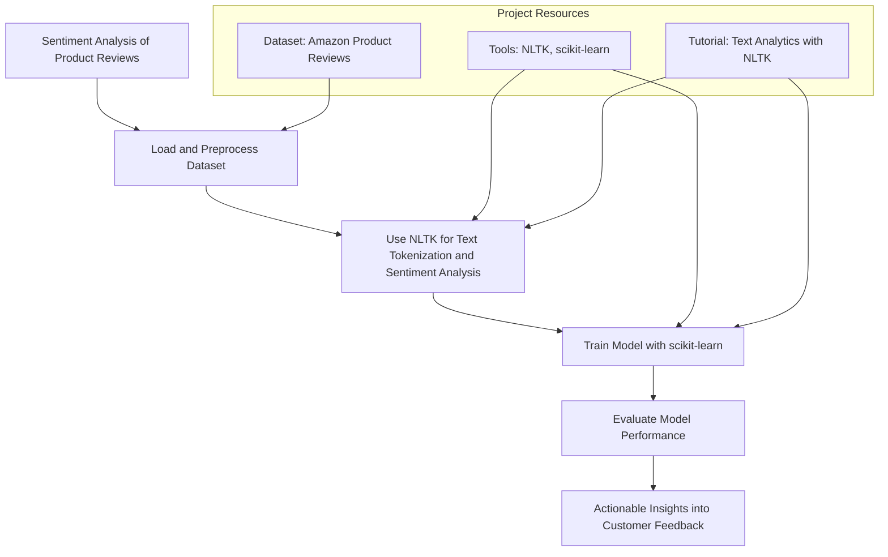

#### Project Resources

- **Dataset**: [Amazon Product Reviews dataset](https://nijianmo.github.io/amazon/index.html)
- **Tools**: [NLTK](https://www.nltk.org/), [scikit-learn](https://scikit-learn.org/)
- **Tutorial**: [Text Analytics with NLTK](https://www.datacamp.com/tutorial/text-analytics-beginners-nltk)

#### Steps to Complete
1. Load and preprocess the dataset.
2. Use NLTK for text tokenization and sentiment analysis.
3. Train a model using scikit-learn and evaluate its performance.

Dive into this project to enhance your skills in NLP and machine learning, and create a tool that can provide actionable insights into customer feedback. Not only will you build a valuable skill set, but you'll also develop a project that showcases your ability to transform raw data into meaningful business intelligence. Happy analyzing!

### Example 2: Image Classification with Convolutional Neural Networks

Dive into the world of image classification by building a convolutional neural network (CNN). This project focuses on using the CIFAR-10 dataset to classify images into various categories, such as airplanes, cars, and animals. Leveraging powerful tools like TensorFlow and Keras, you'll construct a robust model that can learn to recognize and categorize images effectively.

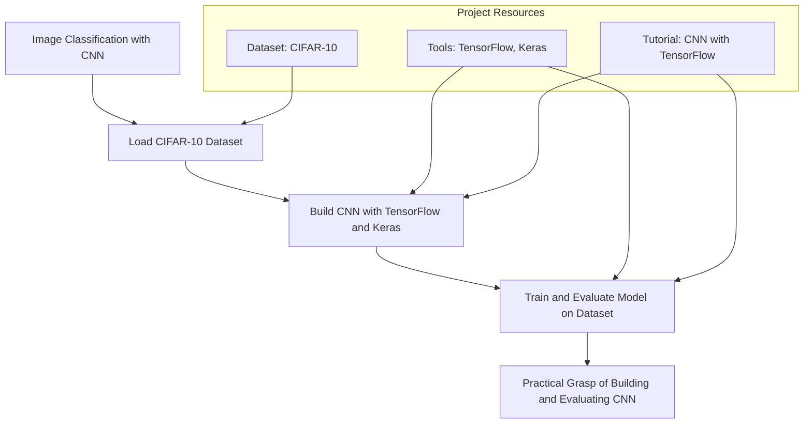

#### Project Resources

- **Dataset**: [CIFAR-10](https://www.cs.toronto.edu/~kriz/cifar.html)
- **Tools**: [TensorFlow](https://www.tensorflow.org/), [Keras](https://keras.io/)
- **Tutorial**: [CNN with TensorFlow](https://www.tensorflow.org/tutorials/images/cnn)

#### Steps to Complete

1. Load the CIFAR-10 dataset.
2. Build a CNN using TensorFlow and Keras.
3. Train and evaluate the model on the dataset.

Complete this project to deepen your understanding of deep learning and computer vision. By the end, you'll have a practical grasp of how to build, train, and evaluate a CNN, preparing you to tackle more complex image classification tasks. This project not only sharpens your technical skills but also adds a compelling showcase to your portfolio. Happy coding!

### Example 3: Natural Language Processing Chatbot

Step into the fascinating world of conversational AI by developing a chatbot using movie dialogues. This project utilizes the Cornell Movie-Dialogs Corpus to train a model that can engage in human-like conversations. With TensorFlow and NLTK, you'll build a sequence-to-sequence model with attention, enabling your chatbot to understand and generate contextually relevant responses.

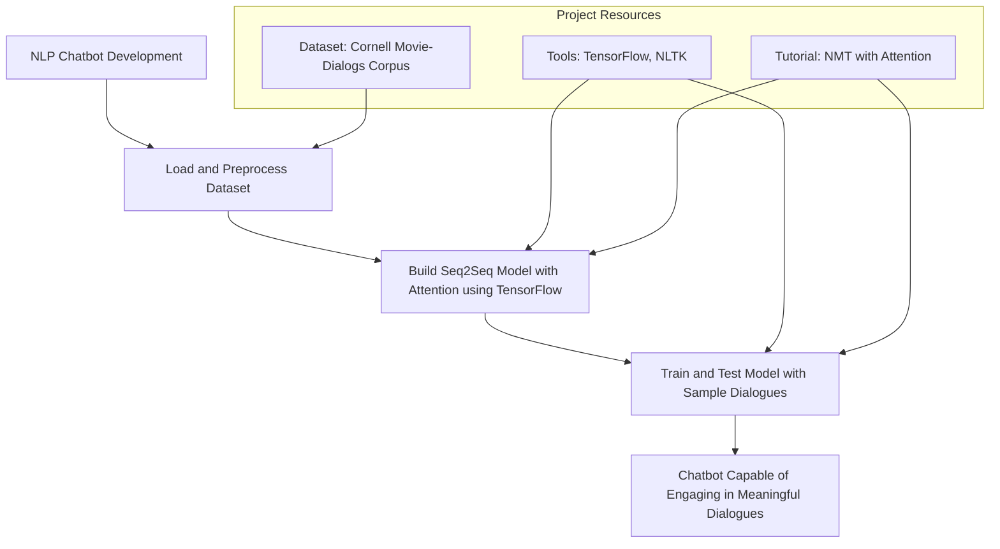

#### Project Resources

- **Dataset**: [Cornell Movie-Dialogs Corpus](https://www.cs.cornell.edu/~cristian/Cornell_Movie-Dialogs_Corpus.html)
- **Tools**: TensorFlow, NLTK
- **Tutorial**: [NMT with Attention](https://www.tensorflow.org/tutorials/text/nmt_with_attention)

#### Steps to Complete
1. Load and preprocess the dataset.
2. Use TensorFlow to build a sequence-to-sequence model with attention.
3. Train the model and test it with sample dialogues.

Complete this project to explore natural language processing and conversational AI. By the end, you'll have a chatbot capable of engaging in meaningful dialogues, showcasing your skills in NLP and deep learning. This project not only enhances your technical expertise but also provides a captivating addition to your portfolio. Dive in and enjoy creating your own chatbot!

### Example 4: Predictive Maintenance for Industrial Equipment

Discover how to leverage AI to predict equipment failures and schedule timely maintenance. This project uses the NASA Turbofan Engine Degradation Simulation Dataset to build a model that forecasts equipment breakdowns. Utilizing scikit-learn and pandas, you'll delve into predictive maintenance, a crucial application in industrial settings.

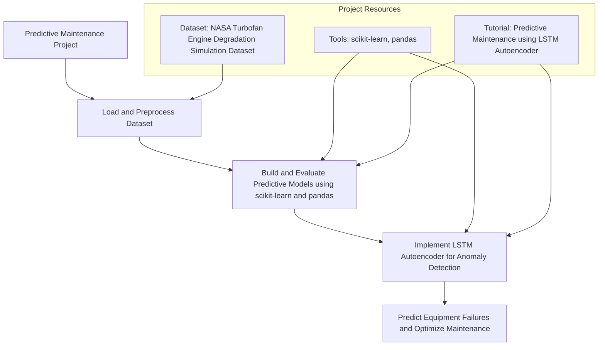

#### Project Resources

- **Dataset**: [NASA Turbofan Engine Degradation Simulation Dataset](https://ti.arc.nasa.gov/tech/dash/groups/pcoe/prognostic-data-repository/)
- **Tools**: scikit-learn, pandas
- **Tutorial**: [Predictive Maintenance using LSTM Autoencoder](https://towardsdatascience.com/predictive-maintenance-using-lstm-autoencoder-6742aad6f44b)

#### Steps to Complete
1. Load and preprocess the dataset.
2. Use scikit-learn and pandas to build and evaluate predictive models.
3. Implement an LSTM autoencoder for anomaly detection.

Take on this project to enhance your understanding of time-series analysis and machine learning. By predicting equipment failures, you can help industries minimize downtime and optimize maintenance schedules. This project will not only build your technical skills but also demonstrate your ability to apply AI to real-world challenges. Dive in and start predicting!

### Example 5: Recommendation System for E-commerce

Explore the world of recommendation systems by creating a model that suggests products or content to users. Using the MovieLens dataset, you'll implement collaborative filtering techniques to build a system that enhances user experience by providing personalized recommendations.

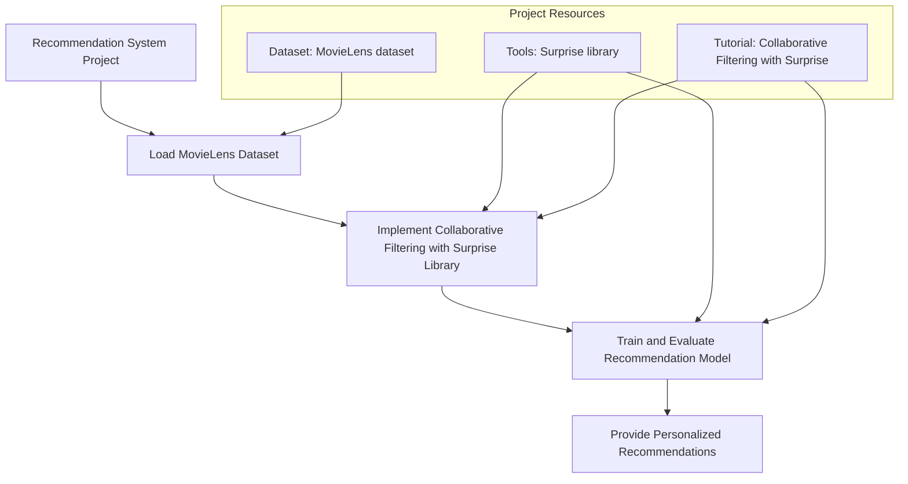

#### Project Resources

- **Dataset**: [MovieLens dataset](https://grouplens.org/datasets/movielens/)
- **Tools**: [Surprise library](http://surpriselib.com/)
- **Tutorial**: [Collaborative Filtering with Surprise](https://realpython.com/build-recommendation-engine-collaborative-filtering/)

#### Steps to Complete
1. Load the MovieLens dataset.
2. Use the Surprise library to implement collaborative filtering.
3. Train and evaluate the recommendation model.

This project will deepen your understanding of machine learning algorithms and their applications in e-commerce. By the end, you'll have a functional recommendation system that can be showcased in your portfolio. Jump into this project to develop a valuable skill set and improve user engagement with personalized recommendations.

### Example 6: Fraud Detection in Financial Transactions

Dive into the critical task of detecting fraudulent transactions to prevent financial losses. By leveraging the Credit Card Fraud Detection dataset, you'll learn to build and evaluate a robust classification model using scikit-learn and XGBoost. You'll also tackle the challenge of class imbalance, ensuring your model is accurate and reliable.

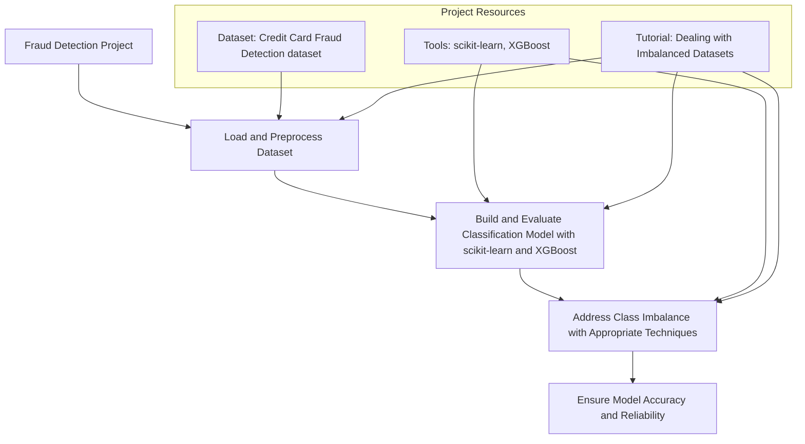

#### Project Resources

- **Dataset**: [Credit Card Fraud Detection dataset](https://www.kaggle.com/mlg-ulb/creditcardfraud)
- **Tools**: scikit-learn, [XGBoost](https://xgboost.readthedocs.io/)
- **Tutorial**: [Dealing with Imbalanced Datasets](https://www.kaggle.com/janiobachmann/credit-fraud-dealing-with-imbalanced-datasets)

#### Steps to Complete
1. Load and preprocess the dataset.
2. Use scikit-learn and XGBoost to build and evaluate a classification model.
3. Address class imbalance with appropriate techniques.

This project not only enhances your machine learning skills but also equips you with the knowledge to handle real-world financial data challenges. Completing this project will be a significant addition to your portfolio, demonstrating your ability to create impactful solutions in the financial sector. Take on this project to develop a valuable skill set and make a difference in fraud prevention.

### Example 7: Object Detection in Images

Explore the exciting field of object detection by identifying and locating objects within images using the powerful YOLO algorithm. By working with the COCO dataset, you'll gain hands-on experience with one of the most widely used datasets for image recognition tasks. Using YOLO and OpenCV, you'll implement a model that can detect and classify objects in real-time.

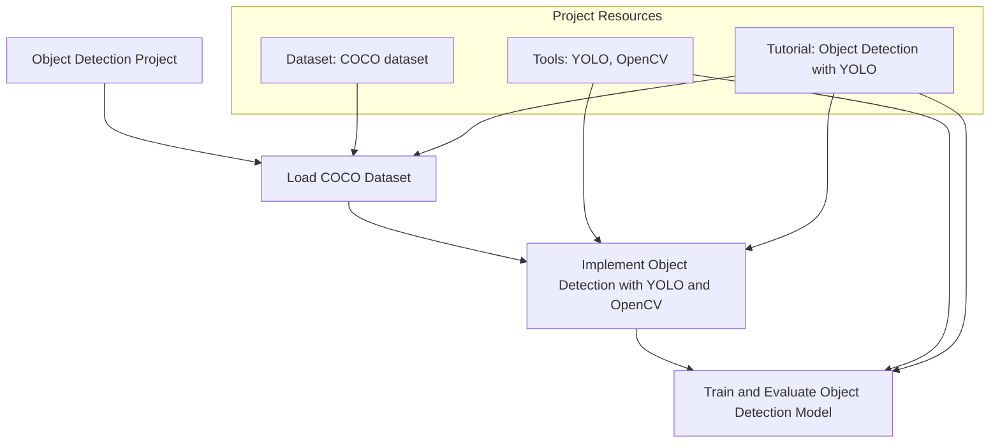

#### Project Resources

- **Dataset**: [COCO dataset](https://cocodataset.org/)
- **Tools**: [YOLO](https://pjreddie.com/darknet/yolo/), [OpenCV](https://opencv.org/)
- **Tutorial**: [Object Detection with YOLO](https://machinelearningmastery.com/how-to-perform-object-detection-with-yolov3-in-keras/)

#### Steps to Complete
1. Load the COCO dataset.
2. Use YOLO and OpenCV to implement object detection.
3. Train and evaluate the object detection model.

This project not only helps you understand the intricacies of object detection but also prepares you to tackle more advanced computer vision tasks. Completing this project will significantly enhance your skill set, making you proficient in using state-of-the-art tools and techniques for image analysis. Take on this challenge to elevate your expertise in computer vision and create impressive projects for your portfolio.

### Example 8: Speech Recognition System

Dive into the fascinating world of speech recognition by developing a system that converts spoken language into text. Using the LibriSpeech ASR corpus, you'll work with high-quality audio data to build and train your model. Kaldi and PyTorch provide the necessary tools and frameworks to construct an effective speech recognition pipeline.

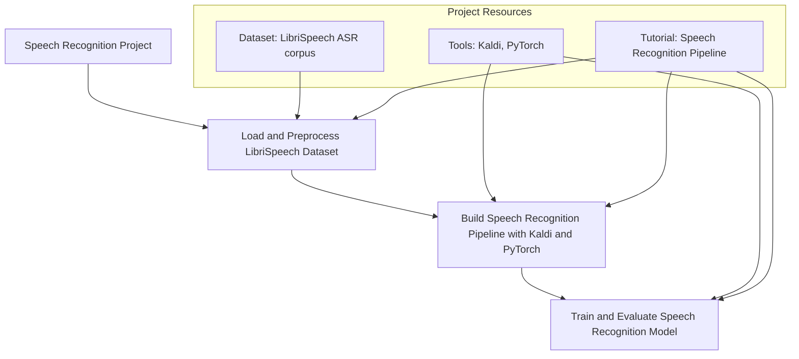

#### Project Resources

- **Dataset**: [LibriSpeech ASR corpus](http://www.openslr.org/12/)
- **Tools**: [Kaldi](https://kaldi-asr.org/), [PyTorch](https://pytorch.org/)
- **Tutorial**: [Speech Recognition Pipeline](https://pytorch.org/tutorials/intermediate/speech_recognition_pipeline_tutorial.html)

#### Steps to Complete
1. Load and preprocess the LibriSpeech dataset.
2. Use Kaldi and PyTorch to build a speech recognition pipeline.
3. Train and evaluate the speech recognition model.

This project is perfect for those looking to enhance their understanding of natural language processing and audio data handling. By the end of this project, you'll have a working speech recognition model and a deeper insight into the complexities of converting spoken words into text. Embark on this journey to strengthen your skills in one of the most dynamic areas of AI.

### Example 9: Time Series Forecasting for Stock Prices

Explore the intriguing field of time series forecasting by predicting future stock prices based on historical data. Using the Yahoo Finance API, you'll gather real stock market data and employ Prophet and pandas to preprocess and analyze the information. This project is designed to enhance your data analysis and forecasting skills, providing valuable insights into market trends.

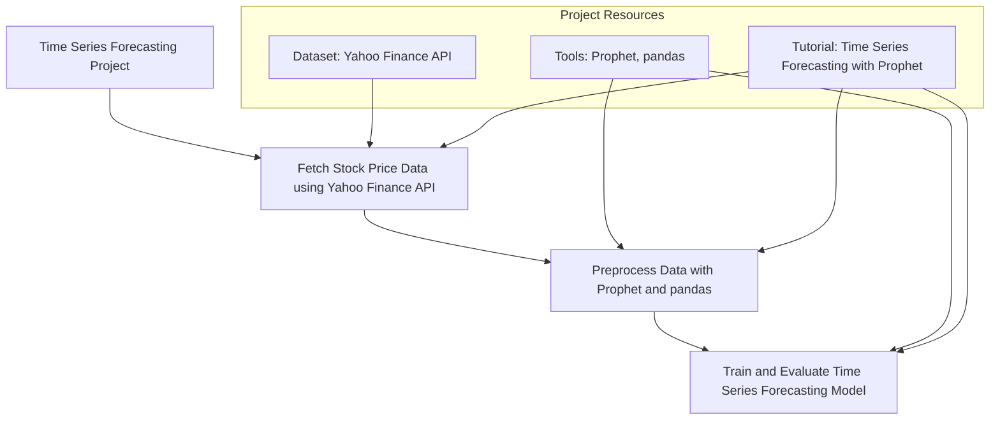

#### Project Resources

- **Dataset**: [Yahoo Finance API](https://pypi.org/project/yfinance/)
- **Tools**: [Prophet](https://facebook.github.io/prophet/), pandas
- **Tutorial**: [Time Series Forecasting with Prophet](https://facebook.github.io/prophet/docs/quick_start.html)

#### Steps to Complete
1. Fetch stock price data using the Yahoo Finance API.
2. Use Prophet and pandas to preprocess the data.
3. Train and evaluate a time series forecasting model.

By the end of this project, you'll have a robust model capable of forecasting stock prices, a skill highly valued in finance and trading. Engage in this project to deepen your understanding of time series analysis and predictive modeling, and gain the ability to apply these techniques to various real-world scenarios.

### Example 10: Generative AI for Image Creation

Dive into the world of Generative Adversarial Networks (GANs) by creating new images with a Deep Convolutional Generative Adversarial Network (DCGAN). Using the MNIST dataset, you'll learn how to generate realistic images through the adversarial process between a generator and a discriminator. This project will enhance your understanding of generative models and their applications.

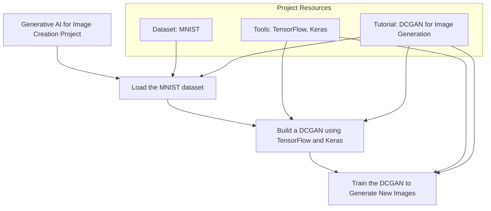

#### Project Resources

- **Dataset**: [MNIST](http://yann.lecun.com/exdb/mnist/)
- **Tools**: TensorFlow, Keras
- **Tutorial**: [DCGAN for Image Generation](https://www.tensorflow.org/tutorials/generative/dcgan)

#### Steps to Complete
1. Load the MNIST dataset.
2. Use TensorFlow and Keras to build a DCGAN.
3. Train the DCGAN to generate new images.

By the end of this project, you'll have a functional DCGAN capable of generating new, realistic images. This experience will provide you with a solid foundation in generative AI, opening up possibilities for creative applications in fields such as art, design, and beyond. Engage in this exciting project to expand your AI expertise and creativity.

## Advanced Usage

### Detailed Features

Let’s enhance your AI projects with advanced features. Explore techniques like advanced data preprocessing, hyperparameter tuning, and ensemble methods to boost your model's performance.

### Customization and Optimization

Tailor your models to meet specific needs and improve performance. Learn strategies for adjusting neural network architectures and optimizing training times for the best results.

## Integration and Deployment

### Integration Tips

Integrate your AI models seamlessly into larger systems or workflows. Discover how to embed models into web-based, mobile, or data processing applications to provide continuous value.

### Deployment Considerations

Ensure reliability and scalability in deployment. Explore best practices like containerization and cloud services to handle real-world data streams and scale with demand.

### Maintenance and Updates

Keep your models accurate and performing well over time. Learn strategies for regular updates, retraining with new data, and monitoring performance to ensure ongoing success.

## Actionable Takeaways

### Summary of Key Points

Hands-on AI projects enhance learning and application. Utilize online tools for easy integration and better functionality.

### Practical Advice

Start with simple projects and gradually tackle more complex ones. Experiment, iterate, and refine your models to improve your skills.

### Next Steps

Explore more AI projects and datasets. Continuously refine your machine learning and AI skills. Keep learning and pushing your boundaries. Happy coding!

## Challenge: Real-World Application

Alright, let's dive into a real-world challenge! This is your chance to apply all the skills you've learned so far by developing an AI solution for a specific task. This hands-on experience will solidify your understanding and help you see the practical applications of AI.

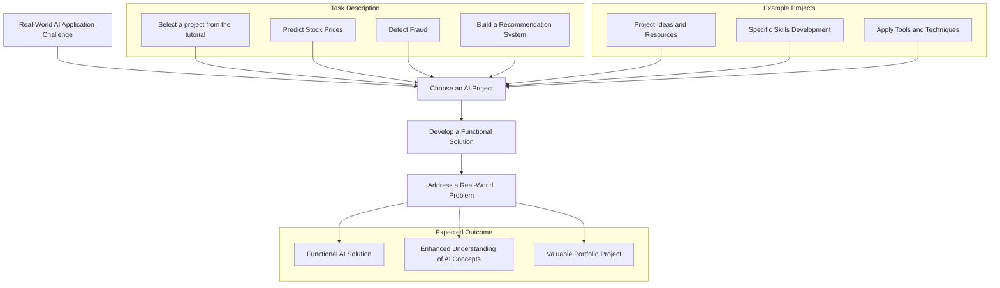

### Task Description

Choose one of the exciting AI projects from the list provided in this tutorial and develop a functional solution. Whether it's predicting stock prices, detecting fraud, or building a recommendation system, this project will give you practical experience in solving real-world problems with AI.

### Expected Outcome

By the end of this challenge, you will have a functional AI solution that effectively addresses a real-world problem. This will not only enhance your understanding of AI concepts but also provide you with a valuable project to showcase in your portfolio.

### Example Projects

To get started, review the project ideas and resources listed earlier in this tutorial. Pick the one that interests you the most and start building your AI solution. Each project is designed to help you develop specific skills and apply various tools and techniques.

## Conclusion

### Summary

This guide has provided a comprehensive overview of various AI projects, offering you the tools and knowledge to start your journey in machine learning and artificial intelligence. By working on these projects, you'll gain hands-on experience and deepen your understanding of AI concepts.

### Continue Learning

Keep experimenting and applying what you've learned. The more you practice, the more proficient you'll become in developing AI solutions. Remember, each project you complete adds to your skill set and enhances your portfolio.
