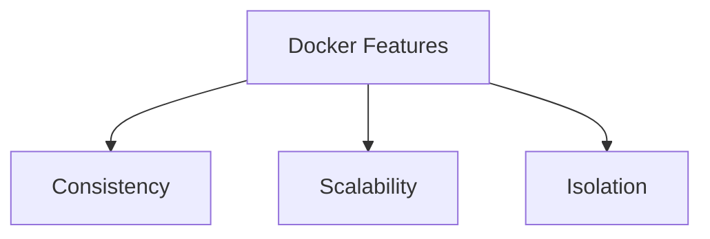
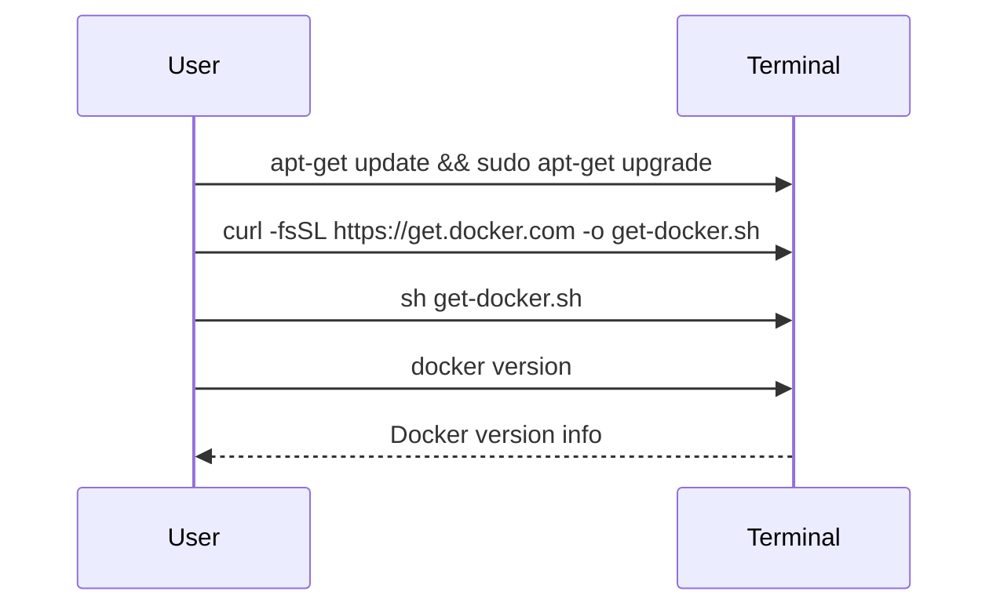
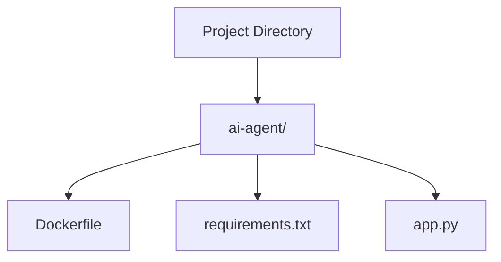
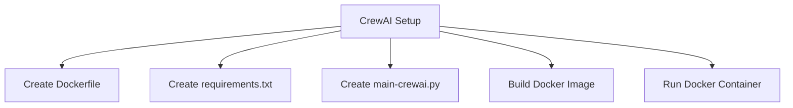

# How to Create AI Agents with Docker: A Comprehensive Tutorial

Streamline Your AI Projects with Docker: From Installation to Deployment


### Introduction

#### Overview
Welcome to our tutorial on creating AI agents with Docker! Today, we'll explore how Docker can make your development process smoother by providing a consistent and controlled environment. Imagine having a sandbox where everything works the same, no matter where you are – that's what Docker does for your applications. By the end of this session, you'll be equipped with the knowledge to build and run AI agents using Docker. Let's dive in!

#### Learning Objectives
Here's what you'll learn:
- How to set up Docker on your machine.
- How to build and run Docker containers.
- How to create AI agents using Docker and integrate them with various tools.

### Why Creating AI Agents with Docker Matters

#### Descriptive Overview
So, why should we use Docker for AI agents? Docker allows us to package applications along with all their dependencies into a neat container. This container can run seamlessly across different environments, which is a huge advantage when working with AI agents that rely on specific libraries and tools. It ensures that what works on your machine will work everywhere else too.

#### Key Features

Alright, let's dive into some of the standout features of Docker. These are the reasons why Docker is such a game-changer for developers:



- **Consistency**: Imagine never having to hear "it works on my machine" again. With Docker, your application behaves the same way in development, testing, and production. This consistency saves you from those annoying bugs that only appear in certain environments.

- **Scalability**: Need more processing power? No problem! Docker allows you to easily scale your applications by running multiple containers. Think of it like having multiple copies of your application working together to handle more tasks.

- **Isolation**: Each Docker container runs in its own isolated environment. This means no more conflicts between different versions of libraries or dependencies. Your project stays clean and conflict-free, which is a huge relief when managing multiple applications.

#### Practical Use Cases

Now, let's see Docker in action with some real-world examples where it truly shines:

- **Developing Machine Learning Models**: When working on machine learning projects, you often need specific libraries and dependencies. Docker lets you create a controlled environment for your models, ensuring that everything works seamlessly. No more setup headaches!

- **Deploying AI-Driven Applications**: Deploying applications across different platforms can be tricky. Docker ensures that your AI applications run smoothly, whether they're on your local machine, a cloud server, or a colleague's computer. This consistency is crucial for reliable deployment.

- **Onboarding New Developers**: Bringing new developers onto a project can be time-consuming. With Docker, you can simplify the setup process by providing a consistent development environment. New team members can get up and running quickly without dealing with configuration issues. 

By understanding these key features and practical uses, you'll see why Docker is such a powerful tool for developers. Let's keep going and learn how to set it up and use it effectively!

### Getting Started with Docker

#### Installation and Setup

Alright, let's roll up our sleeves and get Docker installed on your machine! I'll walk you through each step, and before you know it, you'll have Docker up and running.



1. **Docker Installation**:
   - If you're using Windows or macOS, head over to the [Docker website](https://www.docker.com/products/docker-desktop) and download Docker Desktop. The installation process is straightforward – just follow the prompts.
   - For Linux users, we'll use the command line. Open your terminal and enter the following commands. I'll explain each step:
     ```bash
     apt-get update && sudo apt-get upgrade
     ```
     This command updates your package list and upgrades your installed packages. It's always good to have the latest versions!

     ```bash
     curl -fsSL https://get.docker.com -o get-docker.sh
     ```
     Here, we're downloading the Docker installation script.

     ```bash
     sh get-docker.sh
     ```
     This command runs the script to install Docker.

     ```bash
     docker version
     ```
     Finally, this verifies that Docker is installed correctly. You should see the Docker version information if everything went well.

2. **Python Installation**:
   - Make sure Python is installed on your system. If you don't have it yet, download it from the [official Python website](https://www.python.org/). Having Python is crucial since we'll be running some Python scripts later.

3. **Code Editor**:
   - I recommend using Visual Studio Code for this tutorial. It's a fantastic code editor with many useful features. You can download it from the [Visual Studio Code website](https://code.visualstudio.com/).

#### Initial Configuration

Now that we have Docker installed, let's make sure everything is set up correctly:

1. **Verify Docker Installation**:
   - Open your terminal and run the following command:
     ```bash
     docker --version
     ```
     This command checks if Docker is installed and shows the version number. If you see the version information, congratulations! Docker is successfully installed on your machine.

And that's it for the initial setup! With Docker installed and verified, we're ready to move on to creating and running Docker containers. If you have any questions or run into issues, feel free to ask. Let's continue our journey into the world of Docker!

### Practical Examples

#### Example 1: Building Your AI Agent Docker Image

**Step-by-Step Guide**

Alright, let's get our hands dirty and build our first AI agent Docker image! I'll guide you through each step, explaining everything along the way.



1. **Create a Project Directory**:
   First, we need a place to store our project files. Let's create a directory and navigate into it:
   ```bash
   mkdir ai-agent && cd ai-agent
   ```
   This command creates a new directory called `ai-agent` and then changes into that directory. Now, all our project files will be neatly organized in one place.

2. **Create a Dockerfile**:

   The Dockerfile is the recipe for our Docker image. It tells Docker how to set up our environment. Let's create one:

   ```Dockerfile
   # Use an official Python runtime as a parent image
   FROM python:3.9-slim

   # Set the working directory in the container
   WORKDIR /app

   # Copy the current directory contents into the container at /app
   COPY . /app

   # Install any needed packages specified in requirements.txt
   RUN pip install --no-cache-dir -r requirements.txt

   # Make port 80 available to the world outside this container
   EXPOSE 80

   # Define environment variable
   ENV NAME World

   # Run app.py when the container launches
   CMD ["python", "app.py"]
   ```
   Let's break this down:
   - `FROM python:3.9-slim`: This line tells Docker to use a slim version of Python 3.9 as the base image.
   - `WORKDIR /app`: Sets the working directory inside the container to `/app`.
   - `COPY . /app`: Copies all files from the current directory on your machine to the `/app` directory in the container.
   - `RUN pip install --no-cache-dir -r requirements.txt`: Installs the Python packages listed in `requirements.txt`.
   - `EXPOSE 80`: Opens port 80 so we can access our application from outside the container.
   - `ENV NAME World`: Sets an environment variable named `NAME` with the value `World`.
   - `CMD ["python", "app.py"]`: Specifies the command to run when the container starts, which in this case is to run our Python application.

3. **Create `requirements.txt`**:
   Next, we need to list our project's dependencies. Create a file named `requirements.txt` with the following content:
   ```txt
   flask
   anthropic
   ```
   This file tells Docker which Python packages our application needs.

4. **Create `app.py`**:
   Now, let's create our application code. In a file named `app.py`, add the following:
   ```python
   from flask import Flask
   from anthropic import Claude

   app = Flask(__name__)
   claude = Claude(api_key="YOUR_API_KEY")

   @app.route('/')
   def hello_world():
       return 'Hello, AI Agent!'

   if __name__ == '__main__':
       app.run(host='0.0.0.0')
   ```
   Here's what's happening:
   - We import Flask to create a simple web server.
   - We import Claude from the `anthropic` package.
   - We create a Flask app and a Claude instance (make sure to replace `"YOUR_API_KEY"` with your actual API key).
   - We define a single route `/` that returns "Hello, AI Agent!".
   - Finally, we run the app, making it accessible from any network interface.

5. **Build the Docker Image**:
   Now it's time to build our Docker image. Run this command in your terminal:
   ```bash
   docker build -t ai-agent .
   ```
   This command tells Docker to build an image with the tag `ai-agent` using the current directory (`.`) as the context.

6. **Run the Docker Container**:
   Once the image is built, we can run it in a container:
   ```bash
   docker run -p 4000:80 ai-agent
   ```
   This command starts a container from the `ai-agent` image, mapping port 4000 on your machine to port 80 in the container.

7. **Access the Application**:
   Open your web browser and navigate to `http://localhost:4000`. You should see "Hello, AI Agent!" displayed on the screen, indicating that your AI agent is up and running!

Great job! You've just built and run your first AI agent using Docker. If you have any questions or run into issues, don't hesitate to ask. Let's keep going and explore more advanced setups!

#### Example 2: Advanced Setup with CrewAI

**Step-by-Step Guide**

Alright, now that we've got the basics down, let's step it up a notch with an advanced setup using CrewAI. This will allow us to create more sophisticated AI agents. Follow along, and I'll explain each part as we go.




1. **Create a Dockerfile for CrewAI**:
   Let's start by creating a Dockerfile specifically for our CrewAI setup. This file will tell Docker how to build our environment.

   ```Dockerfile
   # Start with a slim version of Python 3.9
   FROM python:3.9-slim

   # Set the working directory inside the container to /app
   WORKDIR /app

   # Copy all the files from our current directory to /app in the container
   COPY . /app

   # Install the required Python packages listed in requirements.txt
   RUN pip install --no-cache-dir -r requirements.txt

   # Expose port 80 to allow access to our application
   EXPOSE 80

   # Specify the command to run our main script when the container starts
   CMD ["python", "main-crewai.py"]
   ```
   Here's a breakdown:
   - `FROM python:3.9-slim`: We're using a lightweight version of Python 3.9 as our base image.
   - `WORKDIR /app`: Sets the directory inside the container where our code will reside.
   - `COPY . /app`: Copies all the files from our current directory into the container.
   - `RUN pip install --no-cache-dir -r requirements.txt`: Installs the Python dependencies.
   - `EXPOSE 80`: Opens port 80 so we can access our application.
   - `CMD ["python", "main-crewai.py"]`: Runs our main script when the container starts.

2. **Create `requirements.txt`**:
   Next, we need to specify the dependencies for our project. Create a file named `requirements.txt` with the following content:
   ```txt
   crewai
   langchain
   ```
   These are the Python packages our application will need.

3. **Create `main-crewai.py`**:
   Now, let's write our main application script. Create a file named `main-crewai.py` and add the following code:
   ```python
   from crewai import Agent, Task, Crew, Process
   from langchain.llms import Ollama

   # Initialize the language model
   ollama_model = Ollama(model="openhermes")

   # Create agents with specific roles and goals
   researcher = Agent(
       role='Researcher',
       goal='Discover new insights',
       llm=ollama_model
   )

   writer = Agent(
       role='Writer',
       goal='Create engaging content',
       llm=ollama_model
   )

   # Define tasks for each agent
   task1 = Task(description='Investigate the latest AI trends', agent=researcher)
   task2 = Task(description='Write a blog post on AI advancements', agent=writer)

   # Set up a crew to manage the agents and tasks
   crew = Crew(
       agents=[researcher, writer],
       tasks=[task1, task2],
       llm=ollama_model,
       process=Process.sequential
   )

   # Execute the tasks and get results
   result = crew.kickoff()
   print(result)
   ```
   Here's what this script does:
   - Imports necessary classes from `crewai` and `langchain`.
   - Initializes a language model named `ollama_model`.
   - Creates two agents: a researcher and a writer, each with specific roles and goals.
   - Defines tasks for each agent.
   - Sets up a crew to manage the agents and tasks, specifying that tasks should be processed sequentially.
   - Executes the tasks and prints the results.

4. **Build and Run the CrewAI Container**:
   Now, let's build our Docker image and run the container:
   ```bash
   docker build -t crewai .
   ```
   This command builds the Docker image and tags it as `crewai`.

   ```bash
   docker run -p 4000:80 crewai
   ```
   This command runs the container, mapping port 4000 on your machine to port 80 in the container.

### Integration and Deployment

#### Integration Tips
- **Integrate with Other Systems**: Docker makes it easy to package your AI agents and integrate them with other applications or workflows. Just package everything into a container and you're good to go!

#### Deployment Considerations
- **Best Practices**: Ensure your Docker containers are stateless and use environment variables for configuration. This makes your containers more portable and easier to manage.

#### Maintenance and Updates
- **Regular Updates**: Keep your Docker images updated with the latest security patches and dependencies. Regular updates ensure your applications remain secure and up-to-date.

### Actionable Takeaways

#### Summary of Key Points
- Docker provides a consistent and scalable environment for developing and deploying AI agents.
- Building and running Docker containers is straightforward with a well-defined Dockerfile.
- Advanced setups like CrewAI offer powerful frameworks for creating sophisticated AI agents.

#### Practical Advice
- Regularly update your Docker images and dependencies to keep your applications secure.
- Use Docker Compose for managing applications that require multiple containers working together.

#### Next Steps
- Explore Docker Compose for orchestrating multiple containers.
- Look into Kubernetes for scaling your Docker applications and managing complex deployments.

Fantastic work! You've now set up an advanced AI agent environment using CrewAI and Docker. Keep experimenting and exploring the vast possibilities with Docker and AI. If you have any questions or need further assistance, feel free to ask. Let's keep pushing the boundaries of what we can create!

### Challenge: Real-World Application

Alright, it's time for a hands-on challenge! Let's put what we've learned into practice by creating a Dockerized AI agent tailored to your specific project or interest. This will not only reinforce your skills but also give you a tangible outcome to showcase.

#### Task Description
Your task is to create a Dockerized AI agent that performs a specific function relevant to your project or interest. This could be anything from an AI chatbot to a machine learning model for data analysis.

#### Steps to Complete

1. **Define the Task and Requirements**:
   - Think about what you want your AI agent to do. Is it a chatbot? A recommendation system? Write down the specific requirements and goals for your AI agent. This will guide you in the next steps.

2. **Create a Dockerfile and Necessary Scripts**:
   - Start by writing a Dockerfile that sets up the environment for your AI agent. Include any dependencies and configurations needed.
   - Next, create the scripts that your AI agent will run. This could be a Python script, for instance, that defines the logic of your AI agent.

   Example Dockerfile:
   ```Dockerfile
   # Use a base Python image
   FROM python:3.9-slim

   # Set the working directory
   WORKDIR /app

   # Copy the current directory contents into the container
   COPY . /app

   # Install necessary packages
   RUN pip install --no-cache-dir -r requirements.txt

   # Run the script when the container starts
   CMD ["python", "your_script.py"]
   ```

3. **Build and Run the Docker Container**:
   - Open your terminal and navigate to the project directory. Build your Docker image with the following command:
     ```bash
     docker build -t your-ai-agent .
     ```
   - Once the image is built, run the container:
     ```bash
     docker run -p 4000:80 your-ai-agent
     ```

4. **Verify the AI Agent Performs the Task as Expected**:
   - Test your AI agent to ensure it performs the task correctly. This might involve interacting with the agent through a web interface or running some test data through it.

   Example: If you built a chatbot, open your browser and navigate to `http://localhost:4000` to chat with your AI agent.

#### Expected Outcome
By the end of this challenge, you should have a fully functioning AI agent running inside a Docker container. This agent should be capable of performing the task you defined, whether it's responding to user queries, analyzing data, or any other AI-driven function.

#### Example Projects
Need some inspiration? Here are a couple of example projects:
- **AI Chatbot for Customer Service**: Create a chatbot that can answer customer queries and provide support.
- **Machine Learning Model for Data Analysis**: Develop a model that can analyze data and provide insights or predictions.

### Conclusion

#### Summary
In this tutorial, we've taken a comprehensive journey through creating AI agents using Docker. We covered installation and setup, practical examples, advanced usage with CrewAI, and deployment strategies. You now have a solid foundation to build and deploy your AI agents in a consistent and scalable environment.

#### Encouragement
I encourage you to apply these concepts to your own projects. Experiment, explore, and don't hesitate to push the boundaries of what you can create with Docker and AI. The more you practice, the more proficient you'll become.

#### Additional Resources
To further your learning, check out these resources:
- **YouTube Tutorials**:
  - [Build AI Agents with Docker](https://www.youtube.com/watch?v=AhPXGKG4RZ4)
  - [Build AI Apps in 5 Minutes: Dify AI + Docker Setup](https://www.youtube.com/watch?v=jwNxfRgSr-0)
- **Documentation**:
  - [Docker Official Documentation](https://docs.docker.com/)
  - [CrewAI GitHub Repository](https://github.com/langgenius/dify)
- **Community Support**:
  - Join forums and Discord channels to get real-time help and engage with others in the field.

Remember, learning is a journey, and every project you undertake brings you one step closer to mastery. Happy coding!

## Additional Resources
- [Build AI Agents with Docker - YouTube Tutorial](https://www.youtube.com/watch?v=AhPXGKG4RZ4)
- [Build AI Apps in 5 Minutes: Dify AI + Docker Setup - YouTube Tutorial](https://www.youtube.com/watch?v=jwNxfRgSr-0)
- [AI Agents with CrewAI - Foss Engineer](https://fossengineer.com/ai-agents-crewai/)
- [Build AI Agents with Docker - Reddit Post](https://www.reddit.com/r/PostAI/comments/1dqeloy/build_ai_agents_with_docker_heres_how/)
- [Summarize.tech - Video Summary](https://www.summarize.tech/www.youtube.com/watch?v=AhPXGKG4RZ4)
- [Docker Documentation AI-Powered Assistant - Docker Blog](https://www.docker.com/blog/docker-documentation-ai-powered-assistant/)