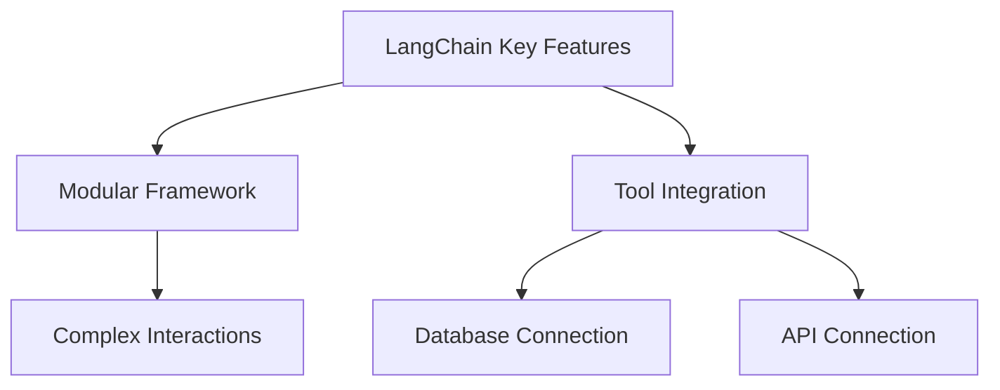
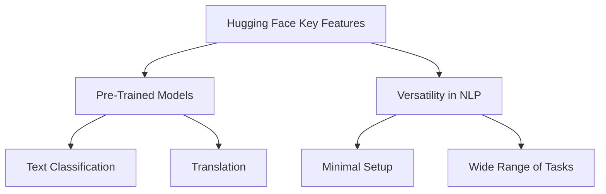
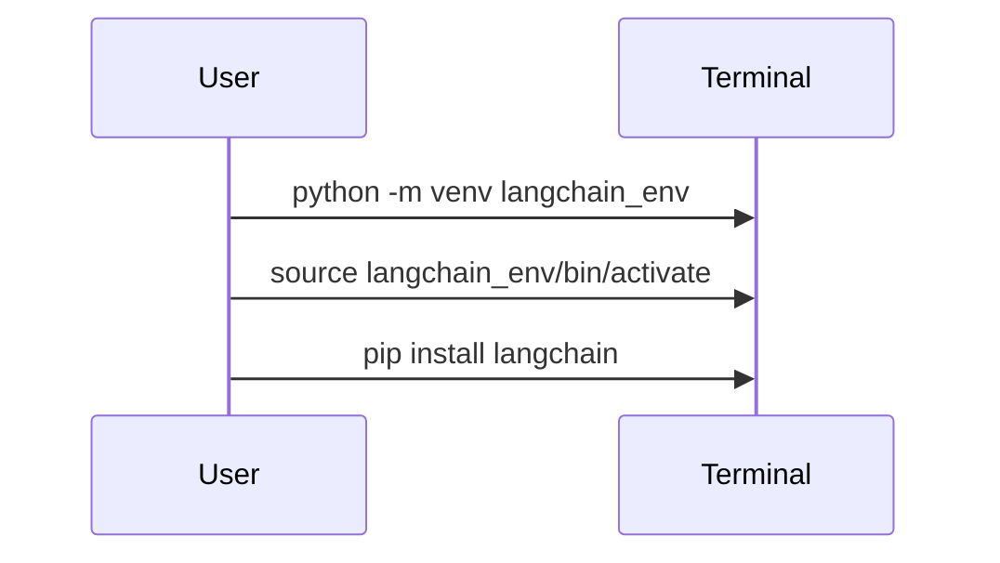
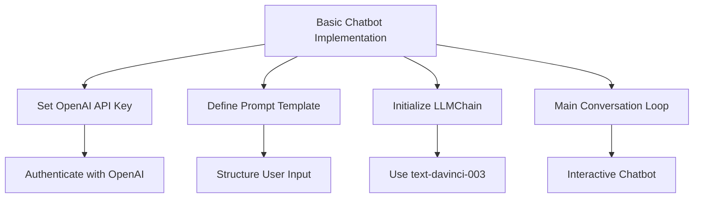
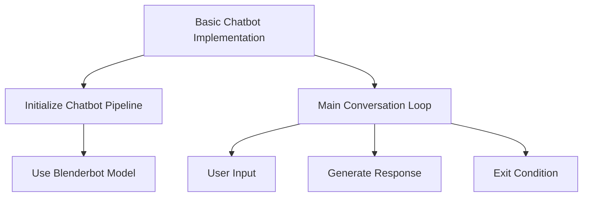

# Building a Chatbot with LangChain and Hugging Face

Creating AI-Powered Chatbots Using LangChain and Hugging Face

## Introduction

### Overview

Hello and welcome! Today, we’re going to embark on an exciting journey into the world of AI-powered chatbots. We’ll be using two powerful frameworks: LangChain and Hugging Face. These tools are incredible for building intelligent, interactive applications that leverage large language models (LLMs).

LangChain is fantastic for creating complex workflows and integrating various tools, while Hugging Face shines with its extensive library of pre-trained models, perfect for all your natural language processing (NLP) needs.

Before we dive in, here are some resources to get you started:

- [LangChain Documentation](https://docs.langchain.com/): Comprehensive guides and tutorials to understand and implement LangChain.
- [Getting Started with LangChain](https://docs.langchain.com/en/latest/getting_started.html): A beginner-friendly guide to kickstart your journey with LangChain.
- [Hugging Face Documentation](https://huggingface.co/docs/transformers): Detailed guides and tutorials to understand and implement Hugging Face Transformers.
- [Getting Started with Hugging Face](https://huggingface.co/docs/transformers/quicktour): A beginner-friendly guide to kickstart your journey with Hugging Face.
- [LangChain Community](https://community.langchain.com/): Join the community to ask questions, share your projects, and collaborate with other LangChain users.
- [Hugging Face Community](https://huggingface.co/join/discord): Join the community on Discord to ask questions, share your projects, and collaborate with other Hugging Face users.

## Learning Objectives

By the end of our session, you'll know how to set up and configure both LangChain and Hugging Face, implement basic chatbots, and customize their functionalities to suit your specific requirements. Let's get started!

- **Understand LangChain and Hugging Face**: Learn what these frameworks are and why they are important for modern AI applications.
- **Install and Set Up**: Be able to install and configure both LangChain and Hugging Face on your system.
- **Build Basic Chatbots**: Implement basic chatbots using both frameworks.
- **Explore Practical Examples**: Understand how to use these tools in real-world scenarios with hands-on examples.
- **Customize and Extend Functionalities**: Gain knowledge on how to customize and extend the capabilities of your chatbots.
- **Deploy and Monitor**: Learn how to deploy and monitor your chatbot in a real-world setting.

## Why AI-Powered Chatbots Matter

### Descriptive Overview

First, let’s talk about why AI chatbots are so important. AI chatbots enhance user engagement by providing instant and accurate responses. They are transforming how businesses interact with customers by automating routine tasks and delivering personalized experiences. Imagine having a virtual assistant that can handle customer queries 24/7!

### Key Features

Alright, let's dive into the standout features of LangChain and Hugging Face, our tools for building amazing chatbots.

**LangChain**:



1. **Modular Framework**: 
   Think of LangChain as a set of building blocks. You can piece these blocks together to create complex interactions with ease. This modularity means you can customize and expand your chatbot without breaking a sweat.

2. **Tool Integration**: 
   LangChain is like a multi-tool that works well with various services and tools. Need to connect to a database, API, or another service? LangChain makes it seamless, adding incredible versatility to your chatbot projects.

**Hugging Face**:



1. **Rich Library of Pre-Trained Models**:
   Imagine having access to a treasure trove of pre-trained models ready to go. Whether it's for text classification, translation, or summarization, Hugging Face offers a wide range of models that you can start using immediately.

2. **Versatility in NLP Tasks**:
   Hugging Face is like a Swiss Army knife for NLP. With minimal setup, it supports a vast array of natural language processing tasks. This means you can quickly adapt it to different needs without extensive configuration.

These features make LangChain and Hugging Face indispensable for building sophisticated chatbots.

### Practical Use Cases

Now, let’s explore some real-world scenarios where AI-powered chatbots can make a big difference:

- **Customer Support Automation**: Imagine having a chatbot that answers common customer queries instantly, freeing up human agents to handle more complex issues.
- **Interactive User Interfaces**: Create chatbots that guide users through your services or products, offering a dynamic and engaging experience.
- **Personalized User Experiences**: Develop chatbots that provide tailored recommendations and support based on user interactions, making each conversation unique and helpful.

With a clear understanding of these tools' capabilities, let's jump into setting up LangChain and Hugging Face and start building our chatbots!

## Getting Started with LangChain

### Installation and Setup

Alright, let’s get started with LangChain! Before we dive into the fun stuff, we need to make sure we have the basics covered. First, do you have Python installed on your system? Great! If not, you can download it from [python.org](https://www.python.org/).



Now, let’s set up a virtual environment. This will keep our project dependencies organized and avoid conflicts with other projects you might be working on.

1. **Create a Virtual Environment**:
    - Open your terminal or command prompt.
    - Type the following command to create a virtual environment called `langchain_env`:
        ```bash
        python -m venv langchain_env
        ```
    - Next, we need to activate this virtual environment. If you’re on macOS or Linux, type:
        ```bash
        source langchain_env/bin/activate
        ```
      If you’re on Windows, type:
        ```bash
        langchain_env\Scripts\activate
        ```

    Now your terminal should show that you’re working within `langchain_env`.

2. **Install LangChain**:
    - With your virtual environment activated, it’s time to install LangChain. Just type:
        ```bash
        pip install langchain
        ```

    This command will download and install LangChain along with all the necessary dependencies. Easy, right?

### Initial Configuration

Now that we have LangChain installed, let's configure it to use the OpenAI models. You’ll need your OpenAI API key for this step. If you don’t have one, you can get it from the [OpenAI website](https://beta.openai.com/signup/).

1. **Set Up Your OpenAI API Key**:
    - Open your Python environment (this could be a script, Jupyter notebook, or an interactive Python session).
    - We need to set the OpenAI API key in your environment. Here’s how you can do it in Python:
        ```python
        import os
        os.environ["OPENAI_API_KEY"] = "your-openai-api-key"
        ```
    - Replace `"your-openai-api-key"` with your actual API key. This line of code ensures that the LangChain framework can authenticate and use the OpenAI models.

And that’s it! You’ve set up LangChain and configured it with your OpenAI API key. Now you’re ready to start building some amazing chatbots. In the next part, we’ll dive into creating a basic chatbot with LangChain. Let’s keep going!

## Practical Examples with LangChain

### Example 1: Basic Chatbot Implementation

Alright, now it’s time to get our hands dirty and build a basic chatbot using LangChain. This is going to be fun and quite straightforward!



First, let’s create a new Python file. Name it `langchain_chatbot.py`. This is where all the magic will happen.

Ready? Let's dive into the code step-by-step:

```python
import os
from langchain import OpenAI, LLMChain, PromptTemplate

# Step 1: Set your OpenAI API key
# Here, we are setting up the environment variable for our OpenAI API key.
os.environ["OPENAI_API_KEY"] = "your-openai-api-key"

# Step 2: Define a prompt template
# A prompt template helps to structure how the input from the user will be handled.
# We're creating a template where the chatbot will act as a helpful assistant.
template = PromptTemplate(
    input_variables=["user_input"],
    template="You are a helpful assistant. Answer the following question: {user_input}"
)

# Step 3: Initialize the LLMChain
# LLMChain is the main component that ties together the language model and the prompt template.
# We're using the OpenAI model named "text-davinci-003" here.
chain = LLMChain(
    llm=OpenAI(model="text-davinci-003"),
    prompt=template
)

# Step 4: Main conversation loop
# This is the interactive part of our chatbot. It keeps asking for user input and provides responses until the user types 'quit'.
print("Hello! I'm your LangChain chatbot. Type 'quit' to exit.")
while True:
    user_input = input("You: ")
    if user_input.lower() == 'quit':
        break
    response = chain.run(user_input)
    print(f"Bot: {response}")

print("Goodbye!")
```

Let's break down what’s happening here:

1. **Setting the OpenAI API Key**:
   - We start by importing the necessary modules. 
   - The `os.environ["OPENAI_API_KEY"]` line is crucial as it allows our application to authenticate with OpenAI's services. Make sure to replace `"your-openai-api-key"` with your actual OpenAI API key.

2. **Defining the Prompt Template**:
   - The `PromptTemplate` is like a recipe. It tells the chatbot how to frame its responses. 
   - In this example, the chatbot is instructed to be a helpful assistant and answer questions based on user input.

3. **Initializing the LLMChain**:
   - This part ties everything together. `LLMChain` uses the specified OpenAI model and the prompt template to generate responses.
   - We’re using the "text-davinci-003" model, which is known for its high-quality text generation capabilities.

4. **Creating the Main Conversation Loop**:
   - Here’s where the interaction happens. The loop continuously prompts the user for input and processes it through the `chain.run` method.
   - If the user types "quit", the loop breaks, and the chatbot session ends.

5. **Running the Chatbot**:
   - To run your chatbot, simply execute the script:
     ```bash
     python langchain_chatbot.py
     ```
   - Start chatting with your bot! Type messages and see how it responds. When you’re done, type "quit" to end the session.

And there you have it! You’ve just built a basic chatbot with LangChain. Feel free to experiment and modify the prompt template or the model to see how the responses change. In the next steps, we’ll explore more advanced features and customizations. Keep going, and happy coding!

### Running the Chatbot

Alright, now that we've built our chatbot, it’s time to see it in action! Let’s run the script and start interacting with it.

To run your chatbot, open your terminal and type the following command:

```bash
python langchain_chatbot.py
```

When you execute this command, you’ll see a greeting message from your chatbot: “Hello! I'm your LangChain chatbot. Type 'quit' to exit.”

Now, try typing a message to the chatbot. For example, you might ask, “What’s the weather like today?” Observe how the chatbot responds. This interaction will continue until you type ‘quit’ to end the session.

---

## Getting Started with Hugging Face

Now, let’s switch gears and set up another powerful tool: Hugging Face. This will allow us to build and experiment with different kinds of NLP models.

### Installation and Setup

First, make sure you have Python installed on your system. If you don’t, go ahead and download it from [python.org](https://www.python.org/). Once that’s done, we’ll create a virtual environment to keep our project dependencies organized.



1. **Create a Virtual Environment**:

   Open your terminal and type the following command to create a new virtual environment called `hf_env`:

   ```bash
   python -m venv hf_env
   ```

   To activate this virtual environment:
   - On macOS/Linux, type:
     ```bash
     source hf_env/bin/activate
     ```
   - On Windows, type:
     ```bash
     hf_env\Scripts\activate
     ```

2. **Install Hugging Face Transformers**:

   With your virtual environment activated, let’s install the Hugging Face Transformers library. This library provides us with a collection of pre-trained models that are ready to use.

   Type the following command to install it:

   ```bash
   pip install transformers
   ```

### Initial Configuration

Great! Now that we have everything set up, let’s move on to configuring our environment to use Hugging Face.

1. **Import the Necessary Modules**:

   Open your Python environment (this could be a Jupyter notebook, a Python script, or an interactive Python session). The first thing we need to do is import the pipeline function from the transformers library.

   Here’s the code to do that:

   ```python
   from transformers import pipeline
   ```

   This pipeline function will help us set up various NLP tasks quickly and efficiently.

Now you’re all set to start using Hugging Face! In the next steps, we’ll dive into building a chatbot with Hugging Face and explore its powerful capabilities. Let’s keep the momentum going!

## Practical Examples with Hugging Face

### Example 1: Basic Chatbot Implementation

Alright, let’s dive into building a basic chatbot using Hugging Face. This will be an exciting journey, and I’ll guide you through every step of the way.

First, we need to create a new Python file. Let’s name it `huggingface_chatbot.py`. This is where we will write our chatbot code.

Now, let’s add the following code to your new file:

```python
from transformers import pipeline

# Step 1: Initialize the chatbot pipeline
# We're using a pre-trained conversational model called "facebook/blenderbot-400M-distill"
chatbot = pipeline("conversational", model="facebook/blenderbot-400M-distill")

# Step 2: Main conversation loop
# This loop keeps the conversation going until the user types 'quit'
print("Hello! I'm your Hugging Face chatbot. Type 'quit' to exit.")
while True:
    user_input = input("You: ")
    if user_input.lower() == 'quit':
        break
    response = chatbot(user_input)
    # The response from the model is a list; we need the 'generated_text' from the first item
    print(f"Bot: {response[0]['generated_text']}")

print("Goodbye!")
```

Let’s break down what we’re doing here:

1. **Initializing the Chatbot Pipeline**:
   - We start by importing the `pipeline` function from the `transformers` library.
   - We then initialize our chatbot pipeline with a pre-trained model called "facebook/blenderbot-400M-distill". This model is designed for conversational tasks.

2. **Creating the Main Conversation Loop**:
   - We print a greeting message to let the user know they can start interacting with the chatbot.
   - We then enter a `while` loop that continuously asks for user input.
   - If the user types "quit", the loop breaks, and the chatbot session ends.
   - Otherwise, we pass the user input to the chatbot model and print the chatbot’s response.

### Running the Chatbot

Now, it’s time to run our chatbot and see it in action. Go to your terminal and type the following command:

```bash
python huggingface_chatbot.py
```

When you run this command, you’ll see a message saying, “Hello! I'm your Hugging Face chatbot. Type 'quit' to exit.” This means your chatbot is ready to chat!

Try typing a message, like “What’s the weather like today?” and see how the chatbot responds. Keep interacting with it to see the various responses it generates. When you’re done, type "quit" to end the session.

And that’s it! You’ve successfully built and run a basic chatbot using Hugging Face. Feel free to experiment with different questions and enjoy your chatbot’s company. Next, we’ll explore more advanced features and customizations. Let’s keep learning and having fun!

## Challenge: Real-World NLP Solutions with Hugging Face Transformers

### Task Description

Welcome to the challenge! Now that you've learned the basics, it’s time to apply your knowledge to a real-world problem. Your goal is to identify an area in your business or personal projects where natural language processing (NLP) can add significant value. Using Hugging Face Transformers, you'll create a solution to address this problem. This hands-on exercise will help you see the tangible benefits of NLP in action.

### Potential Areas

Consider these areas where NLP can have a big impact:

- **Customer Service Automation**: Build a chatbot to handle customer inquiries and provide quick responses.
- **Sentiment Analysis**: Analyze social media posts, reviews, or customer feedback to gauge sentiment and make informed decisions.
- **Content Generation**: Automate the creation of marketing copy, product descriptions, or other content.
- **Language Translation**: Develop a system for translating text into multiple languages to support a global audience.
- **Document Processing**: Extract and summarize key information from contracts, invoices, or other important documents.
- **Market Research**: Analyze large text datasets to uncover insights about market trends and customer preferences.

### Steps

Follow these steps to complete the challenge:

1. **Identify the Problem**: Choose a relevant challenge that NLP can solve. Think about areas in your business or projects where text analysis or automation could add value.
2. **Select a Model**: Browse the Hugging Face model repository and pick a pre-trained model that suits your task. Whether it's for sentiment analysis, translation, or something else, there's likely a model ready to use.
3. **Fine-tune**: If needed, fine-tune the model on your specific dataset to improve its performance for your particular use case.
4. **Develop the Solution**: Implement your solution using Hugging Face Transformers. This involves setting up the model, processing the input data, and generating the desired output.
5. **Test and Validate**: Ensure your solution works as expected by testing it thoroughly. Validate its accuracy and effectiveness using real-world data.
6. **Deploy and Monitor**: Deploy your solution in a real-world setting. Set up monitoring to track its performance and make adjustments as needed.

### Example Projects

Here are some example projects to inspire you:

- **Customer Support Chatbot**: Use a transformer model to categorize and respond to customer inquiries automatically.
- **Social Media Sentiment Analysis**: Monitor sentiment in real-time across social media platforms to stay on top of public opinion.
- **Automated Content Generator**: Create a system that generates product descriptions or email content, saving time and ensuring consistency.
- **Multilingual Customer Assistant**: Develop a tool that translates customer interactions in real-time to support a diverse, global customer base.

### Tips

- **Use Pre-trained Models**: Leverage existing models to get started quickly and achieve initial results.
- **Iterate and Improve**: Refine your solution based on feedback and performance metrics to continually enhance its effectiveness.
- **Engage with the Community**: Join the Hugging Face community to seek advice, share your progress, and learn from others.

### Expected Outcome

By the end of this challenge, you'll have created a functional NLP solution tailored to a specific problem. This will demonstrate the power and potential of Hugging Face Transformers in addressing real-world challenges and delivering tangible benefits.

---

## Conclusion

Both LangChain and Hugging Face offer fantastic tools for building chatbots, each with its unique strengths. Let’s quickly recap:

**LangChain**:
- **Modular and Flexible**: Perfect for applications that need complex interactions and extensive customization. You can think of LangChain as a toolkit for creating sophisticated and highly customized workflows.

**Hugging Face**:
- **Easy and Powerful**: Provides a straightforward approach with a rich library of pre-trained models. If you need to get started quickly and efficiently with conversational AI, Hugging Face is your go-to.

Choose the tool that best fits your project requirements. Whether you need the flexibility of LangChain or the ease of Hugging Face, you now have the knowledge to build and run a modern AI chatbot. Happy coding!

### Continue Learning

1. Explore the [Hugging Face documentation](https://huggingface.co/docs) for in-depth guides and tutorials.
2. Join the [Hugging Face community](https://discuss.huggingface.co/) to stay updated on the latest developments.
3. Experiment with different models and tasks to discover new applications for your business.

Remember, the key to success with Transformers is continuous experimentation and adaptation to your specific business needs. Start small, measure the impact, and scale your NLP solutions as you see tangible benefits.

### Additional Resources

Dive deeper into NLP with these resources to expand your knowledge and skills:

1. [Hugging Face Documentation](https://huggingface.co/docs/hub/en/transformers)
2. [NLP Course](https://huggingface.co/learn/nlp-course/en/chapter1/4)
3. [Transformers Index](https://huggingface.co/docs/transformers/en/index)
4. [NLP Course](https://huggingface.co/learn/nlp-course/en/chapter1/3?fw=pt)
5. [Using Hugging Face Models with Private Company Data](https://discuss.huggingface.co/t/using-hugging-face-models-with-private-company-data/56403)
6. [Case Studies](https://huggingface.co/case-studies/aws/kustomer)
7. [Installation Guide](https://huggingface.co/docs/transformers/en/installation)
8. [Examples](https://huggingface.co/docs/transformers/v4.15.0/en/examples)
9. [Notebooks](https://huggingface.co/docs/transformers/en/notebooks)
10. [Azure Guide](https://learn.microsoft.com/en-us/azure/databricks/machine-learning/train-model/huggingface/)
11. [4 Real-Life Problems Solved Using Transformers](https://towardsdatascience.com/4-real-life-problems-solved-using-transformers-and-hugging-face-a-complete-guide-e45fe698cc4d?gi=9a17657240b3)
12. [DataCamp Tutorial](https://www.datacamp.com/tutorial/an-introduction-to-using-transformers-and-hugging-face)

Good luck, and enjoy the process of building innovative NLP solutions with Hugging Face Transformers!