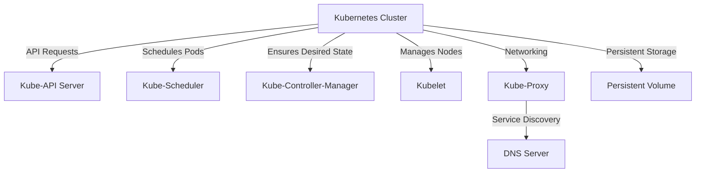
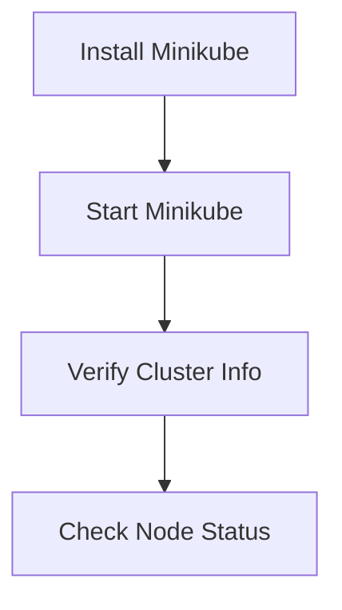
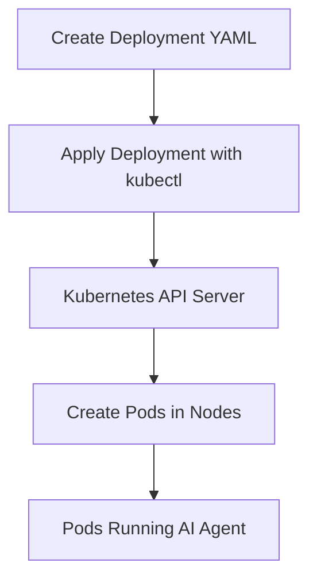
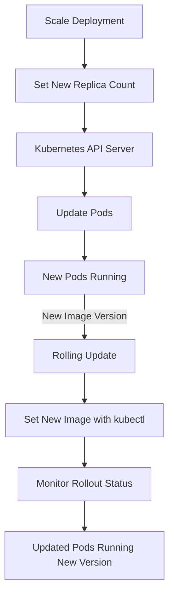

# Deploying AI Agents with Kubernetes

A Hands-On Guide to Orchestrating Dockerized AI Agents Using Kubernetes


## Introduction

### Overview

Welcome! Today, we're diving into the exciting world of Kubernetes to deploy a Dockerized AI agent. Kubernetes is a powerful, open-source container orchestration platform that automates the deployment, scaling, and management of containerized applications. This tool is essential for handling large-scale, dynamic environments efficiently.

Here are some resources to help you get started with Kubernetes:

- [Kubernetes Documentation](https://kubernetes.io/docs/): The official documentation is a comprehensive resource for all things Kubernetes.
- [Kubernetes Community](https://kubernetes.io/community/): Join the community to stay updated and get support.
- [Kubernetes Tutorials](https://kubernetes.io/docs/tutorials/): Hands-on tutorials to deepen your understanding.
- [Kubeflow for AI Workflows](https://www.kubeflow.org/): Learn how to streamline machine learning workflows on Kubernetes.
- [Advanced Kubernetes Features](https://kubernetes.io/docs/concepts/): Dive into more advanced concepts and features.

### Learning Objectives

By the end of this tutorial, you'll be able to:

- **Understand Kubernetes**: Grasp the basics and why it's crucial for modern app deployment.
- **Set Up a Local Kubernetes Cluster**: Use Minikube to create a local Kubernetes environment.
- **Deploy a Dockerized AI Agent**: Implement a Dockerized AI agent using Kubernetes deployments and services.
- **Scale and Update Deployments**: Learn how to manage scaling and perform rolling updates.
- **Access Deployed Services**: Expose and access your services locally.

## Why Kubernetes Matters

### Descriptive Overview

Kubernetes is a cornerstone of modern DevOps. It provides a resilient framework for running distributed systems, simplifying the complexities of container management so you can focus on development rather than infrastructure.



### Key Features

Let's break down some of the standout features of Kubernetes:

- **Automated Rollouts and Rollbacks**: Kubernetes manages the deployment of new versions of your app, ensuring smooth updates and the ability to roll back if something goes wrong.
- **Service Discovery and Load Balancing**: It can expose your applications using DNS names or their own IP addresses and balances the load between containers.
- **Self-Healing**: Kubernetes restarts containers that fail, replaces containers, kills containers that don't respond to your health checks, and only makes them available when they're ready.
- **Secret and Configuration Management**: It allows you to manage sensitive information like passwords, tokens, and SSH keys securely.

### Practical Use Cases

Here are a few scenarios where Kubernetes shines:

- **Customer Service Automation**: Scale AI agents to handle customer queries efficiently.
- **Data Processing Pipelines**: Manage and scale data processing workflows seamlessly.
- **Web Application Deployment**: Deploy and scale web applications with ease, ensuring high availability and reliability.

## Getting Started with Kubernetes

### Installation and Setup

Alright, let's get you started with Kubernetes! We'll set up a local Kubernetes cluster using Minikube. This will help you get hands-on experience with Kubernetes right on your own machine.

#### Prerequisites

Before we dive in, make sure you have:

- Docker installed and running
- A basic understanding of containerization concepts
- A Dockerized AI agent from our previous tutorials

Got all that? Great! Let's move on.

#### Step-by-Step Installation



1. **Install Minikube**:
   First, we need to install Minikube. Minikube lets you run Kubernetes locally, which is perfect for development and testing. Follow the official [Minikube installation guide](https://minikube.sigs.k8s.io/docs/start/) tailored to your operating system.

2. **Start Minikube**:
   Once Minikube is installed, we need to start it up. Open your terminal and type:
   ```bash
   minikube start
   ```
   This command sets up a local Kubernetes cluster. It might take a few minutes, so be patient.

3. **Verify the Cluster**:
   Now, let's make sure everything is running smoothly. We can do this by checking the cluster information. Type:
   ```bash
   kubectl cluster-info
   ```
   This command gives you details about your cluster. If everything is set up correctly, you should see information about the Kubernetes master and other components.

4. **Check Node Status**:
   Finally, let's ensure that our nodes are up and running. Type:
   ```bash
   kubectl get nodes
   ```
   This will list the nodes in your cluster. You should see at least one node listed with a status of 'Ready'.

And that's it! You've successfully set up your local Kubernetes cluster using Minikube. Now you're ready to start deploying applications on Kubernetes. Let's move on to deploying our Dockerized AI agent.

### Initial Configuration

Once Minikube is set up, we need to prepare our Kubernetes environment.

## Practical Examples

### Example 1: Deploying a Dockerized AI Agent

Alright, now we get to the exciting part—deploying our AI agent using Kubernetes! This will involve creating a deployment to manage our application and a service to expose it. Let's walk through this step by step.



#### Creating a Deployment

First, we need to create a deployment. Think of a deployment as a manager that ensures the right number of instances (or replicas) of our application are running. We'll start by creating a YAML file for our deployment.

1. **Create a Deployment YAML File**:
   Let's create a file named `ai-agent-deployment.yaml`. This file will describe how our deployment should look.

   ```yaml
   apiVersion: apps/v1
   kind: Deployment
   metadata:
     name: ai-agent-deployment  # The name of our deployment
     labels:
       app: ai-agent            # Labels help in identifying resources
   spec:
     replicas: 3                # We want three replicas of our AI agent
     selector:
       matchLabels:
         app: ai-agent          # Selector to match the pods we want to manage
     template:
       metadata:
         labels:
           app: ai-agent        # Labels to apply to the pods
       spec:
         containers:
         - name: ai-agent
           image: your-docker-image:tag  # Replace with your Docker image
           ports:
           - containerPort: 8080          # The port our container listens on
           resources:                     # Resource management
             limits:
               memory: 512Mi
               cpu: 500m
             requests:
               cpu: 200m
               memory: 256Mi
   ```

   Here’s a breakdown of what each section does:
   - **apiVersion** and **kind**: These define the type of Kubernetes object we’re creating.
   - **metadata**: Contains the name and labels for our deployment.
   - **spec**: Defines the desired state of our deployment, including the number of replicas and the template for creating pods.
   - **containers**: Specifies the container image and the ports it will use, as well as resource limits and requests.

2. **Apply the Deployment**:
   Now that we have our deployment file, let's apply it to our Kubernetes cluster.

   ```bash
   kubectl apply -f ai-agent-deployment.yaml
   ```

   This command tells Kubernetes to create the deployment as described in our YAML file.

3. **Check the Deployment Status**:
   Let's make sure our deployment is running correctly.

   ```bash
   kubectl get deployments
   ```

   This command will list all deployments and their current status. You should see your `ai-agent-deployment` listed here.

#### Creating a Service

Next, we need to create a service to expose our deployment. A service in Kubernetes defines a logical set of pods and a policy for accessing them.

1. **Create a Service YAML File**:
   Create another file named `ai-agent-service.yaml`:

   ```yaml
   apiVersion: v1
   kind: Service
   metadata:
     name: ai-agent-service  # The name of our service
   spec:
     selector:
       app: ai-agent         # This selector matches the pods with the label 'app: ai-agent'
     ports:
       - protocol: TCP
         port: 80            # The port exposed by the service
         targetPort: 8080    # The port on the pod that the service should forward to
     type: LoadBalancer      # Type of service, LoadBalancer makes it externally accessible
   ```

   Here's what each section means:
   - **apiVersion** and **kind**: Define the type of Kubernetes object.
   - **metadata**: Contains the name for our service.
   - **spec**: Defines the desired state of our service, including the selector to identify which pods the service targets, and the ports configuration.

2. **Apply the Service**:
   Let's apply this service to our Kubernetes cluster.

   ```bash
   kubectl apply -f ai-agent-service.yaml
   ```

   This command will create the service as described in our YAML file.

3. **Check the Service Status**:
   Finally, let's check that our service is running correctly.

   ```bash
   kubectl get services
   ```

   This will list all services and their statuses. Look for `ai-agent-service` in the list.

And that's it! You've successfully deployed your Dockerized AI agent using Kubernetes. Your deployment is managing the pods, and your service is exposing them so they can be accessed externally. Great job! Now, let's move on to scaling and updating our deployment.

### Example 2: Accessing and Managing Your AI Agent

Alright, now that we've deployed our AI agent, let's learn how to access and manage it. This involves exposing the service, scaling the deployment, and updating the application.



#### Accessing Your AI Agent

First, let's make sure we can access our AI agent from our local machine.

1. **Expose the Service with Minikube**:
   Open your terminal and type the following command:
   ```bash
   minikube service ai-agent-service
   ```
   This command will find the `ai-agent-service` we created earlier and set up a local URL that you can use to access your service.

2. **Access the Service**:
   After running the above command, Minikube will open a browser window with the URL where your service is exposed. This means you can interact with your AI agent directly through your browser. How cool is that?

#### Scaling and Updating

Next, let's explore how to manage the lifecycle of your deployment, including scaling the number of replicas and updating the container image.

1. **Scale the Deployment**:
   Imagine your application is gaining traction, and you need more instances to handle the load. Scaling the deployment is straightforward. Use the following command:
   ```bash
   kubectl scale deployment ai-agent-deployment --replicas=5
   ```
   Here, we're telling Kubernetes to increase the number of replicas from 3 to 5. This command ensures that Kubernetes will create two additional instances of your AI agent to meet the new replica count.

2. **Update the Image** (for rolling updates):
   Sometimes, you need to update your application with new features or bug fixes. Kubernetes makes this easy with rolling updates. To update the container image used by your deployment, type:
   ```bash
   kubectl set image deployment/ai-agent-deployment ai-agent=your-docker-image:newtag
   ```
   Replace `your-docker-image:newtag` with the new version of your Docker image. This command will update the image for your deployment and roll out the changes gradually, ensuring minimal downtime.

3. **Monitor the Rollout**:
   It's important to keep an eye on the rollout process to ensure everything goes smoothly. You can monitor the status of your rollout with:
   ```bash
   kubectl rollout status deployment/ai-agent-deployment
   ```
   This command provides real-time feedback on the rollout process, letting you know when the update is complete or if any issues arise.

By following these steps, you can effectively manage your AI agent's deployment in Kubernetes, ensuring it scales to meet demand and stays up-to-date with the latest changes. Great job so far! You're well on your way to mastering Kubernetes for deploying and managing containerized applications.

## Advanced Usage

Alright, you've got the basics down, so let's dive into some advanced features of Kubernetes that can really enhance your deployment strategy. These tools and techniques will help you manage your applications more effectively and make the most of what Kubernetes has to offer.

### Detailed Features

Let's explore a few powerful features that can take your Kubernetes game to the next level.

#### ConfigMaps and Secrets

Think of **ConfigMaps** and **Secrets** as ways to manage your configuration data and sensitive information.

- **ConfigMaps**: These are used to store configuration data that your application needs. For instance, environment variables, command-line arguments, or config files. Using ConfigMaps keeps your code separate from your configuration data, making it easier to manage and update.
  
- **Secrets**: These are like ConfigMaps but specifically designed to handle sensitive information such as passwords, tokens, and keys. They ensure your sensitive data is stored securely and accessed only by those who need it.

#### Persistent Volumes

Next, let's talk about **Persistent Volumes**. These are storage resources in your cluster that remain available even after the pod using them has been deleted. This is crucial for applications that need to retain data, like databases.

- **Persistent Volume Claims (PVCs)**: These are requests for storage by a user. Pods use PVCs to request access to storage without needing to know the details of the underlying storage infrastructure.

#### Ingress

**Ingress** is a powerful feature for managing external access to your services.

- It provides advanced HTTP routing, which allows you to define rules for how traffic reaches your services. This can include things like load balancing, SSL termination, and name-based virtual hosting.

#### Horizontal Pod Autoscaler

Finally, the **Horizontal Pod Autoscaler** (HPA) is a tool for automatically scaling the number of pods in a deployment based on observed CPU utilization or other custom metrics.

- This is perfect for maintaining optimal performance and resource utilization. If your application experiences a surge in traffic, HPA can automatically add more pods to handle the load and scale them down when the load decreases.

### Customization and Optimization

Customizing and optimizing your Kubernetes setup is key to getting the best performance and efficiency. Here are some tips:

- **Resource Requests and Limits**: Always define resource requests and limits for your pods to ensure they get the resources they need and don't consume more than they should.
- **Node Affinity and Tolerations**: Use these to control which nodes your pods can run on, optimizing the use of your cluster's resources.
- **Monitoring and Logging**: Implement robust monitoring and logging to keep an eye on your applications and catch issues early.

## Integration and Deployment

### Integration Tips

Integrating Kubernetes with Continuous Integration/Continuous Deployment (CI/CD) pipelines can automate your deployment process, making it faster and more reliable. Here are a few tools you can use:

- **Jenkins**: A popular automation server that can handle building, deploying, and automating your Kubernetes deployments.
- **CircleCI**: Another powerful CI/CD tool that integrates well with Kubernetes.
- **GitLab CI**: A feature-rich tool that combines source code management with CI/CD, making it a great all-in-one solution.

### Deployment Considerations

When deploying applications, consider strategies that minimize downtime and risk:

- **Blue-Green Deployments**: Run two environments (blue and green) where one handles production traffic while the other is idle. You can switch between them with zero downtime.
- **Canary Releases**: Gradually roll out changes to a small subset of users before making it available to everyone.
- **Rolling Updates**: Update your application one pod at a time to ensure continuous availability.

### Maintenance and Updates

Regular maintenance and updates are essential for a healthy Kubernetes cluster:

- **Update Components**: Keep your Kubernetes components up to date to benefit from the latest features and security patches.
- **Monitor Health**: Use monitoring tools like Prometheus and Grafana to keep an eye on the health and performance of your cluster.
- **Regular Backups**: Ensure you have a backup strategy in place for your critical data and configurations.

## Actionable Takeaways

### Summary of Key Points

Let's recap the key points we've covered:

- Kubernetes is essential for managing containerized applications at scale.
- Minikube is a fantastic tool for local Kubernetes development.
- Kubernetes deployments and services simplify application management and exposure.
- Scaling and updating applications in Kubernetes is straightforward and powerful.

### Practical Advice

Here are some practical tips to keep in mind:

- **Start Small**: Begin with local clusters and gradually move to production environments.
- **Practice Regularly**: Get comfortable with scaling and updating deployments by practicing often.
- **Engage with the Community**: Stay connected with the Kubernetes community for updates, support, and learning opportunities.

### Next Steps

Ready to take your Kubernetes skills further? Here are some next steps:

- **Explore Advanced Features**: Dive deeper into advanced Kubernetes features to enhance your deployment strategies.
- **Experiment with CI/CD Tools**: Try integrating different CI/CD tools for seamless automation.
- **Learn About Kubernetes Operators**: These can automate complex application deployments and manage the entire lifecycle of your applications.

By following these steps and continuously learning, you'll become proficient in managing modern, scalable applications with Kubernetes. Keep experimenting, stay curious, and happy deploying!

## Challenge: Real-World Application with Kubernetes

### Task Description

Alright, it’s challenge time! Now that you've learned the fundamentals, let's put your skills to the test. Your task is to apply what you've learned to solve a real-world problem by deploying a containerized application using Kubernetes. This hands-on challenge will help solidify your understanding and show you the practical benefits of Kubernetes.

### Steps to Complete

Here’s how you can tackle this challenge step-by-step:

1. **Identify the Problem**: Think of a relevant problem or need that Kubernetes can help solve. This could be anything from improving scalability to automating deployment processes.
2. **Select or Build a Dockerized Application**: Make sure you have a Dockerized application ready for deployment. If you don't have one, you can use any simple web application or service.
3. **Set Up a Local Kubernetes Cluster**: Use Minikube or another local setup to create your Kubernetes cluster.
4. **Deploy the Application**: Create and apply the necessary deployment and service YAML files to get your application running on Kubernetes.
5. **Test and Validate**: Ensure your application is running smoothly and performing as expected.
6. **Scale and Update**: Practice scaling and updating your application to see how Kubernetes handles these tasks.

### Expected Outcome

By the end of this challenge, you should have a fully functional, scalable, and updatable application deployed using Kubernetes. You’ll gain practical experience and confidence in using Kubernetes for real-world applications.

### Example Projects

Need some inspiration? Here are a few example projects you could work on:

- **Web Application Deployment**: Deploy a simple web application and manage traffic using Kubernetes services.
- **Data Processing Service**: Set up a data processing service that scales up or down based on demand.
- **AI Model Serving**: Deploy an AI model to serve predictions, making it accessible via an HTTP endpoint.

### Tips

To help you along the way, here are a few tips:

- **Start with Pre-built Examples**: Use available examples and templates to get started quickly.
- **Iterate and Improve**: Continuously refine your solution based on testing and feedback.
- **Engage with the Community**: Join the Kubernetes community to ask questions, share your progress, and collaborate with others.

### Conclusion

#### Summary

In this tutorial, you’ve learned how to deploy a Dockerized AI agent using Kubernetes, set up a local Kubernetes cluster with Minikube, and effectively manage your deployments. You've also seen how to scale and update your applications smoothly.

#### Continue Learning

Keep exploring Kubernetes and its vast ecosystem. The skills you've gained here are fundamental to modern DevOps practices and will be incredibly valuable as you continue to deploy and manage scalable applications.

#### Additional Resources

Here are some resources to help you continue your learning journey:

1. [Kubernetes Documentation](https://kubernetes.io/docs/)
2. [Kubernetes Community](https://kubernetes.io/community/)
3. [Kubernetes Tutorials](https://kubernetes.io/docs/tutorials/)
4. [Kubeflow for AI Workflows](https://www.kubeflow.org/)
5. [Advanced Kubernetes Features](https://kubernetes.io/docs/concepts/)
6. [Minikube Installation Guide](https://minikube.sigs.k8s.io/docs/start/)
7. [Kubernetes Deployment YAML Guide](https://codefresh.io/learn/kubernetes-deployment/kubernetes-deployment-yaml/)
8. [Using ConfigMaps and Secrets](https://kubernetes.io/docs/tasks/configure-pod-container/configure-pod-configmap/)
9. [Persistent Volumes Overview](https://kubernetes.io/docs/concepts/storage/persistent-volumes/)
10. [Horizontal Pod Autoscaler](https://kubernetes.io/docs/tasks/run-application/horizontal-pod-autoscale/)

By mastering Kubernetes, you're well on your way to becoming proficient in managing modern, scalable applications. Keep experimenting, stay curious, and happy deploying!
