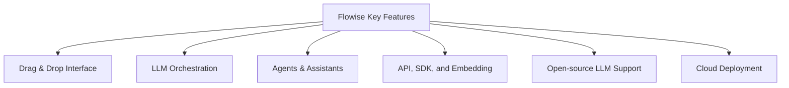

# Flowise: A Powerful Low-Code Platform for Building LLM Applications

Simplify AI Development with User-Friendly Tools and Integrations


## Introduction

### Overview

Welcome to our session on Flowise! Today, we’re diving into Flowise, an open-source platform designed to help both developers and non-developers create sophisticated applications using large language models (LLMs). Think of Flowise as your bridge to AI, offering a low-code/no-code solution with a super user-friendly drag-and-drop interface. This makes it accessible to everyone, regardless of technical expertise.

Flowise integrates seamlessly with popular frameworks like Langchain and LlamaIndex, and it supports over 100 integrations. This means you can easily connect LLMs with memory, data loaders, caches, and moderation tools.

For those of you new to Flowise, here are some helpful resources to get you started:

- [Flowise Official Website](https://flowiseai.com)
- [Flowise AI Review on Restack](https://www.restack.io/docs/flowise-ai-knowledge-flowise-ai-review)
- [Flowise AI Overview Video](https://www.youtube.com/watch?v=Sf0e9kD5NPE)
- [Flowise GitHub Actions](https://github.com/FlowiseAI/Flowise/actions/runs/5878571272)
- [Flowise Getting Started Documentation](https://docs.flowiseai.com/getting-started)
- [Flowise AI Blog on Hybrow Labs](https://hybrowlabs.com/blog/flowise-ai-create-llm-apps-with-ease-and-freedom-using-open-source-langchain-apps)

### Learning Objectives

By the end of this session, you will:
- Understand the core features and benefits of Flowise.
- Learn how to install, configure, and use Flowise.
- Explore practical examples and advanced features.
- Gain insights into integrating and deploying Flowise.

## Why Flowise Matters

### Descriptive Overview

Flowise makes it easy to develop LLM applications by providing a low-code environment. This simplifies the process of building AI-driven systems. You can construct applications visually by adding and connecting components on a canvas. This is great news for both developers and non-developers!

### Key Features

Alright, let's dive into some of the standout features of Flowise that make it such a powerful tool for building LLM applications.



1. **Drag & Drop Interface**: Imagine you’re building with Lego blocks. Flowise’s intuitive visual interface works similarly. You simply drag the components you need onto a canvas and connect them. This makes constructing LLM apps straightforward and accessible, even if you’re not a coding expert.

2. **LLM Orchestration**: Flowise integrates seamlessly with popular frameworks like Langchain and LlamaIndex. It’s like having a master conductor for your orchestra of tools, ensuring everything works in harmony. With over 100 integrations, you can connect LLMs with memory, data loaders, caches, and moderation tools effortlessly.

3. **Agents & Assistants**: Think of agents as your personal assistants within Flowise. You can create autonomous agents capable of performing various tasks using custom tools, the OpenAI Assistant, and the Function Agent. These agents can handle tasks automatically, saving you time and effort.

4. **API, SDK, and Embedding**: Want to extend and integrate your applications? Flowise provides APIs, an embedded widget, and a React SDK. This means you can embed Flowise capabilities directly into your applications, making them even more powerful and versatile.

5. **Open-source LLM Support**: Flowise supports running in air-gapped environments with local LLMs, embeddings, and vector databases. You can use options like HuggingFace, Ollama, LocalAI, and Replicate. This is perfect for situations where internet access is restricted or where you need complete control over your data.

6. **Cloud Deployment**: Flowise can be self-hosted on major cloud platforms like AWS, Azure, and GCP. This means you can scale your applications according to your needs and take advantage of the robust infrastructure these platforms offer.

### Practical Use Cases

Flowise isn’t just a powerful tool—it’s incredibly versatile. Let’s look at some practical, real-world applications where Flowise truly shines.

- **Product Catalog Chatbots**: Imagine having a chatbot that can answer any question about your products. With Flowise, you can create conversational interfaces that handle product-related queries efficiently. This can enhance customer experience and reduce the workload on your support team.

- **Web Scraping QnA**: Need to gather information from websites and integrate it into your system? Flowise can automate the extraction of question-answer pairs from websites and store them in a vector database for LLM reference. This can save countless hours of manual data entry.

- **Webhook Integrations**: Flowise can connect to various applications like Discord, Google Sheets, and Microsoft Excel through webhook POST requests. This allows you to automate workflows and enhance productivity by seamlessly integrating different tools.

- **Third-Party Platform Integration**: By integrating with platforms like Zapier, Flowise can enhance productivity and automate workflows. Imagine setting up a workflow where data from a Google Sheet triggers a series of actions in other applications—Flowise can make this happen smoothly.

These features and use cases show how Flowise can transform the way you build and integrate LLM applications, making complex tasks simpler and more efficient.

Now, let's get hands-on and see these features in action!

## Getting Started with Flowise

Welcome to the exciting world of Flowise! Today, we're going to walk through how to get Flowise up and running on your system. We'll cover two installation methods: using npm and Docker. Let's get started!

### Installation and Setup

#### Step-by-Step Installation

**1. Using npm:**

Let's begin with installing Flowise using npm. This method is straightforward and quick if you're familiar with Node.js.

Open your terminal and run the following command to install Flowise globally on your system:

```bash
npm install -g flowise
```

Once the installation is complete, start Flowise by running:

```bash
npx flowise start
```

Now, open your web browser and go to [http://localhost:3000](http://localhost:3000). This is where you’ll access the Flowise platform. You should see the Flowise dashboard, ready for you to start building your LLM applications!

**2. Using Docker:**

If you prefer using Docker, follow these steps to set up Flowise in a containerized environment. Docker is great for ensuring consistency across different environments.

First, let's build the Docker image. Open your terminal and navigate to the directory where your Dockerfile is located. Then, run:

```bash
docker build --no-cache -t flowise .
```

This command creates a Docker image named `flowise`. The `--no-cache` option ensures that the build is fresh and not using any cached layers.

Once the image is built, let's run it:

```bash
docker run -d --name flowise -p 3000:3000 flowise
```

This command runs the Flowise container in detached mode (`-d`), names the container `flowise`, and maps port 3000 of the container to port 3000 on your host machine.

### Initial Configuration

Now that you have Flowise installed and running, let's make sure everything is set up correctly.

**1. Access the Flowise Dashboard:**

Open your web browser and navigate to [http://localhost:3000](http://localhost:3000). You should see the Flowise dashboard. This is where you'll build and manage your LLM applications.


**2. Verify Setup:**

Take a moment to ensure that all components are properly configured and accessible. Check that you can navigate through the different sections of the dashboard without any issues. If everything looks good, you're ready to start building with Flowise!

By following these steps, you should have Flowise up and running smoothly. Feel free to explore the dashboard and familiarize yourself with the interface. In the next section, we'll dive into creating your first Flowise project. Happy building!


Alright everyone, let's dive into the main dashboard of Flowise! This is the central hub where you'll manage all your low-code LLM applications. We'll go through each part of the screen so you can get comfortable navigating and using Flowise.

### Main Dashboard (Chatflows)

#### Header Section
First, notice the URL at the top: `http://localhost:3000/chatflows`. This tells us we're working on a locally hosted instance of Flowise and we're on the Chatflows page. 

At the top of the screen, you'll see "FlowiseAI" – that's our platform's name.

#### Sidebar Menu (Left Side)
On the left, we have a sidebar menu with various sections:

1. **Chatflows**: This section is highlighted, indicating it's active. Here you can see all your created chatflows.


2. **Agentflows (Beta)**: This is for creating and managing agent flows, still in beta.


3. **Marketplaces**: A place for integrating with various marketplaces.


4. **Tools**: A collection of tools you can use within Flowise.


5. **Assistants**: For creating and managing virtual assistants.


6. **Credentials**: Manage credentials for different integrations.


7. **Variables**: Set and manage variables used in your workflows.


8. **API Keys**: Manage API keys for your integrations.


9.  **Document Stores**: Manage document storage and retrieval.


Feel free to explore these sections to see what each one offers.

#### Main Content Area
In the middle of the screen, we have the main content area titled "Chatflows." Here’s what you'll find:

- **Search Bar**: At the top, there's a search bar to filter your chatflows by name or category.
- **View Toggle Buttons**: These allow you to switch between different views, like list or grid, to organize your chatflows visually.
- **Add New Button**: The blue button on the right is for creating a new chatflow. Click this to start building!

#### Existing Chatflows

Below, you'll see cards for your existing chatflows:

1. **API Retrieval**: This chatflow involves retrieving data from APIs. Notice the icons on the card – they show the types of integrations or tools used.
2. **post-to-database**: This one posts data to a database.
3. **read-vector**: Focuses on reading vector data.

Each card provides a quick overview of what the chatflow does and the integrations involved. If you see "+3 More," that means there are additional integrations or tools used in that chatflow.

### Interface Elements
- **Toggle Switch for Dark Mode**: At the top right, there's a switch to toggle between dark and light modes. Adjust it based on your preference.
- **Settings Icon**: Next to the toggle switch, the gear icon takes you to settings where you can configure various options.

### Summary

The Flowise dashboard is your command center. It's designed to be user-friendly, allowing you to manage existing chatflows, create new ones, and navigate to different sections with ease. Spend some time exploring each section and getting familiar with the layout – this will help you become more efficient as you build and manage your LLM applications.

Now, let’s move on to the practical aspects and see how you can start creating amazing applications with Flowise!


## Practical Example

### Quick Start with Flowise: Using Marketplace Examples

To help you get started quickly with Flowise, let's explore three powerful examples available in the Flowise Marketplace: **Conversational Agent**, **Docs QNA**, and **AutoGPT**. These examples are great starting points and you can extend, edit, add on, or change them as you get more comfortable with Flowise. If you're unfamiliar with any of the tools, you can check out our specific tutorials on those tools, and if they need any API keys, go ahead and create accounts, grab the API key, and set those tools up.

### 1. Conversational Agent

#### What It Is

A Conversational Agent is a chatbot designed to engage in natural language conversations with users. It can handle a variety of queries and provide responses based on the context of the conversation. This is perfect for customer support, FAQ bots, or any application requiring interactive user engagement.

#### Why It’s a Good Starting Point

- **User Interaction**: Get familiar with setting up and configuring chatbots that directly interact with users.
- **Immediate Application**: Great for creating a basic customer support bot or an FAQ assistant.

#### How to Get Started

1. **Add Conversational Agent**: In the Flowise Marketplace, find the **Conversational Agent** template and add it to your workspace.


1. **Configure**: Set up the initial configurations, such as the bot’s name and greeting message.
2. **API Keys**: If this agent requires integrations with APIs (like language processing APIs), make sure to create the necessary accounts and retrieve your API keys. Enter these keys in the configuration settings.
3. **Deploy**: Once configured, deploy the chatbot and test it out by asking various questions to see how it responds.


### 2. Docs QNA

#### What It Is

Docs QNA is a specialized agent that can answer questions based on the content of documents you provide. This is extremely useful for creating knowledge bases, supporting document-heavy customer inquiries, or integrating into a business's internal tools for quick information retrieval.

#### Why It’s a Good Starting Point

- **Document Handling**: Learn how to upload and configure document-based knowledge sources.
- **Enhanced Q&A**: Ideal for applications where users need to find information quickly from large sets of documents.

#### How to Get Started

1. **Add Docs QNA**: In the Flowise Marketplace, find the **Docs QNA** template and add it to your workspace.


1. **Upload Documents**: Use the interface to upload the documents that the QNA bot will reference.
2. **Configure**: Set up the configurations to specify how the bot should search and retrieve answers from the documents.
3. **API Keys**: If needed, make sure to set up any required API keys for enhanced language processing or document handling services.
4. **Deploy**: Deploy the QNA bot and test it by asking questions that should be answered using the content of the uploaded documents.

### 3. AutoGPT

#### What It Is

AutoGPT is an advanced tool that automates the generation of text based on user inputs and predefined prompts. It's useful for creating content, summarizing text, generating reports, and more. This tool leverages powerful language models to provide coherent and contextually relevant text generation.

#### Why It’s a Good Starting Point

- **Text Generation**: Experiment with generating various types of content automatically.
- **Versatile Applications**: Useful for content creation, drafting emails, writing reports, and more.

#### How to Get Started

1. **Add AutoGPT**: In the Flowise Marketplace, find the **AutoGPT** template and add it to your workspace.


1. **Set Prompts**: Configure the initial prompts and templates that AutoGPT will use to generate text.
2. **API Keys**: Ensure you have the necessary API keys for the GPT model service. Create an account if needed and input the API keys in the settings.
3. **Deploy**: Deploy the AutoGPT tool and test it by inputting different prompts to see how it generates text based on your configurations.

### Getting the Necessary API Keys

For each of these tools, you might need API keys to access certain functionalities. Here's a quick guide:

1. **Create Accounts**: Visit the website of the API service you need (like OpenAI for GPT models).
2. **Generate API Keys**: Follow the instructions on their site to create an account and generate your API keys.
3. **Configure in Flowise**: Enter these API keys into the respective configuration settings within Flowise to enable the tool’s full capabilities.


By starting with these marketplace examples, you'll get a hands-on understanding of Flowise's capabilities and be well on your way to building powerful applications. Happy building!

#### Optimization Tips

To ensure your Flowise applications run smoothly and efficiently, here are some optimization tips:

1. **Efficient Data Management**: Ensure that your data loading and processing components are optimized. Use caching where possible to reduce latency.
2. **Modular Design**: Keep your application modular. Break down complex tasks into smaller, manageable components.
3. **Regular Monitoring**: Monitor the performance of your application regularly. Identify and address any bottlenecks.

Sure, let's update those links to point to the specific tools being described:

### LLM Orchestration

Flowise seamlessly integrates with popular frameworks like [Langchain](https://www.langchain.com) and [LlamaIndex](https://www.llamaindex.com). These frameworks provide robust tools for managing large language models, making it easier to orchestrate complex workflows involving multiple LLMs.

### Data Integration

Flowise supports over 100 integrations, allowing you to connect with various data sources and tools. Here are some notable ones:

1. **Memory Integrations**: Integrate with memory storage solutions to keep track of conversations and data across sessions. This is crucial for creating context-aware applications.

2. **Data Loaders**: Use [data loaders](https://www.snowplow.io/data-loaders/) to bring data from different sources into your Flowise applications. This can include databases, APIs, and other external data sources.

3. **Caches**: Integrate with [caching solutions](https://www.redis.io) to speed up your applications by storing frequently accessed data in memory.

4. **Moderation Tools**: Ensure your applications are safe and compliant by integrating with [moderation tools](https://www.openai.com/research/mitigating-bias-in-ai) that can filter out inappropriate content.

### API, SDK, and Embedding

Flowise provides several ways to extend and integrate its capabilities into your applications:

1. **APIs**: Use Flowise’s robust [APIs](https://flowiseai.com/docs/apis) to interact with your LLM applications programmatically. This allows you to automate tasks and integrate Flowise functionality into your existing systems.

2. **Embedded Widget**: Easily embed Flowise functionalities into your web applications using the provided [widget](https://developer.mozilla.org/en-US/docs/Web/API/Web_Widget). This is great for adding LLM-powered features to your site without extensive coding.

3. **React SDK**: For those building applications with React, Flowise offers a [React SDK](https://reactjs.org/docs/create-a-new-react-app.html) that simplifies the integration process. This SDK provides pre-built components and utilities to quickly add Flowise features to your React apps.

### Open-Source LLM Support

Flowise supports running in air-gapped environments with local LLMs, embeddings, and vector databases. Here are some of the options available:

1. **[HuggingFace](https://huggingface.co)**: Integrate with HuggingFace to use a wide range of pre-trained models and datasets. HuggingFace is a leading provider of open-source LLMs.

2. **[Ollama](https://ollama.com)**: Use Ollama for secure, offline LLM deployments, ensuring your data remains private and secure.

3. **[LocalAI](https://localai.org)**: Leverage LocalAI to run AI models locally, providing flexibility and control over your data and models.

4. **[Replicate](https://replicate.com)**: Integrate with Replicate to run models on your infrastructure, offering scalability and customization options.

### Cloud Deployment

Flowise is designed to be flexible and scalable, with support for deployment on major cloud platforms. This allows you to take advantage of cloud infrastructure to scale your applications as needed.

1. **[AWS (Amazon Web Services)](https://aws.amazon.com)**: Deploy Flowise on AWS to utilize their robust cloud services, ensuring high availability and scalability for your applications.

2. **[Azure](https://azure.microsoft.com)**: Use Microsoft Azure for deploying Flowise, benefiting from their extensive suite of cloud tools and services.

3. **[GCP (Google Cloud Platform)](https://cloud.google.com)**: Google Cloud Platform offers a powerful infrastructure for running Flowise applications, with advanced analytics and machine learning capabilities.

### Webhook Integrations

Flowise can connect to various applications through webhook POST requests, enabling real-time data transfer and automation. Here are a few examples:

1. **[Discord](https://discord.com/developers/docs/intro)**: Integrate with Discord to create chatbots that interact with users in real-time, automating responses and managing server activities.

2. **[Google Sheets](https://developers.google.com/sheets/api)**: Use webhooks to connect Flowise with Google Sheets, automating data entry and updates directly from your LLM applications.

3. **[Microsoft Excel](https://docs.microsoft.com/en-us/office/dev/add-ins/excel/excel-add-ins-overview)**: Similar to Google Sheets, integrate with Microsoft Excel to manage and update your data seamlessly.

### Third-Party Platform Integration

Flowise can enhance your workflows by integrating with third-party platforms like [Zapier](https://zapier.com), which connects Flowise with numerous other applications, automating tasks, and streamlining processes.
### Summary

Flowise's extensive integration capabilities make it a versatile platform for building powerful LLM applications. Whether you're connecting with data sources, leveraging APIs, or deploying on the cloud, Flowise provides the tools you need to create sophisticated and scalable solutions. By exploring these integrations, you can unlock the full potential of Flowise and enhance your applications with the latest in LLM technology.


#### Deployment Considerations

1. **Cloud Deployment**: Deploying Flowise on cloud platforms like AWS, Azure, and GCP ensures scalability and reliability. Follow best practices for each platform to optimize performance and security.

2. **Self-Hosting**: If you prefer self-hosting, especially in air-gapped environments, ensure you have the necessary infrastructure and follow security best practices to protect your data.

### Maintenance and Updates

1. **Regular Updates**: Keep your Flowise installation updated with the latest features and improvements. This ensures you benefit from the newest capabilities and security patches.

2. **Community Support**: Engage with the Flowise community on platforms like GitHub. This can be a great way to get support, contribute to the project, and stay informed about updates.

## Actionable Takeaways

### Summary of Key Points

- Flowise provides a robust low-code environment for building LLM applications.
- Key features include a drag-and-drop interface, LLM orchestration, and extensive integrations.
- Practical use cases show Flowise’s versatility in real-world scenarios.

### Practical Advice

- Experiment with Flowise’s drag-and-drop interface to build various applications. This hands-on approach will help you understand how different components interact.
- Explore advanced features like image upload and speech-to-text to enhance the functionality of your applications.

### Next Steps

- Dive deeper into Flowise’s documentation to uncover advanced usage and customization options.
- Join the Flowise community on GitHub to contribute, get support, and stay updated on the latest developments.

By mastering these concepts, you’ll be well on your way to creating powerful, customized LLM applications with Flowise. Happy building!

## Challenge: Real-World Application

### Task Description

Alright, let's dive into a real-world challenge together! Imagine you need to create a chatbot for an e-commerce website to assist with customer queries. This chatbot will act as a virtual assistant for your online store, helping customers find products, check availability, and answer common questions.

### Steps to Complete

Let’s break down the steps to make this happen.

**Step 1: Set Up Components for Data Extraction from the E-commerce Site**

First, we need to configure Flowise to extract data from your e-commerce site.

1. **Add a Data Loader**: In the Flowise dashboard, drag the data loader component onto the canvas. This component will be responsible for pulling product data from your e-commerce database or API.
2. **Configure Data Loader**: Set up the data loader by entering the URL of your e-commerce API endpoint. This will allow the data loader to fetch product details like availability, price, and specifications.

**Step 2: Integrate a Chatbot for Customer Interaction**

Next, we need to set up the chatbot to interact with customers.

1. **Add a Chatbot Component**: Drag the chatbot component onto the canvas and link it to the data loader. This sets up a connection where the chatbot can access product data.
2. **Configure Chatbot Responses**: Define how the chatbot should respond to various customer queries. For example, set up the chatbot to provide product availability, pricing information, and specifications based on the data it retrieves from the data loader.

**Step 3: Set Up Response Logic**

We need to ensure that the chatbot can understand and respond to common customer queries.

1. **Define Response Logic**: Configure the chatbot to recognize and respond to specific types of questions. For instance, set rules for how the chatbot should handle inquiries about product availability, such as checking the data loader for stock levels and then responding accordingly.
2. **Customize Responses**: Tailor the chatbot's responses to be clear and helpful. For example, if a customer asks about a product's price, the chatbot should fetch the price from the data loader and present it in a user-friendly manner.

**Step 4: Test and Deploy**

Before going live, it's important to test your chatbot to ensure it works correctly.

1. **Test the Chatbot**: Use the testing tools within Flowise to simulate customer queries and check if the chatbot provides accurate responses.
2. **Deploy the Chatbot**: Once you're satisfied with the chatbot's performance, deploy it on your e-commerce website. This can be done by embedding the provided widget or API into your site.

### Expected Outcome

By the end of this challenge, you’ll have a fully functional chatbot integrated with your e-commerce website. This chatbot will provide accurate and helpful responses to customer queries, enhancing the shopping experience and reducing the load on your support team.

### Example Projects

To give you some inspiration, let’s look at an example project.

**Case Study**: Implementing a chatbot for a retail store to handle product inquiries and support requests. In this project, the retail store used Flowise to create a chatbot that could answer questions about product availability, provide pricing information, and even assist with order tracking. This not only improved customer satisfaction but also freed up the support team to handle more complex issues.

## Conclusion

### Summary

Flowise represents a significant advancement in the democratization of AI application development. By providing a low-code environment for creating LLM-powered applications, it opens up new possibilities for businesses and developers.

### Continue Learning

Now that you’ve learned the basics, it’s time to apply these concepts. Start building innovative AI-driven solutions using Flowise. The more you experiment, the more you’ll discover its powerful capabilities.

### Additional Resources

To help you continue your journey, here are some additional resources:
- [Flowise Documentation](https://docs.flowiseai.com/getting-started)
- [Flowise GitHub Repository](https://github.com/FlowiseAI/Flowise/actions/runs/5878571272)
- [Flowise Webinars and Tutorials](https://flowiseai.com)

By following this tutorial, you'll be well-equipped to leverage Flowise for building powerful LLM applications. Happy building!